# Selvstudium: Kom i gang med Power BI-tjenesten (app.powerbi.com)
Dette selvstudium hjælper dig med at komme i gang med ***Power BI-tjenesten***. Hvis du vil have et overblik over, hvordan Power BI-tjenesten passer sammen med de andre Power BI-tilbud, anbefaler vi kraftigt, at du starter med at læse [Hvad er Power BI](power-bi-overview.md).

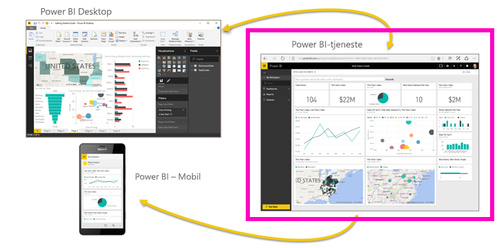

I dette selvstudium kan du udføre følgende trin:

> [!div class="checklist"]
> * Find andet Kom godt i gang-indhold til Power BI-tjenesten
> * Log på din Power BI-onlinekonto, eller opret én, hvis du ikke allerede har en
> * Åbn Power BI-tjenesten
> * Hent nogle data, og åbn dem i rapportvisning
> * Brug dataene til at oprette visualiseringer, og gem som en rapport
> * Opret et dashboard ved at fastgøre felter fra rapporten
> * Tilføj en anden visualisering til dit dashboard ved hjælp af værktøjet Spørgsmål og svar i naturligt sprog
> * Fjern ressourcer ved at slette datasæt, rapport og dashboard

## Tilmeld dig Power BI-tjeneste
Hvis du ikke er tilmeldt [Power BI](https://app.powerbi.com/signupredirect?pbi_source=web), kan du tilmelde dig en gratis prøveversion af Power BI Pro, før du begynder.

Du skal åbne en browser og skrive app.powerbi.com for at åbne Power BI-tjenesten, hvis du allerede har en konto. 

Hvis du ønsker hjælp til Power BI Desktop, kan du se [Kom i gang med Desktop](desktop-getting-started.md). Hvis du ønsker hjælp til Power BI – Mobil, kan du se [Power BI-mobilapps til mobilenheder](consumer/mobile/mobile-apps-for-mobile-devices.md).

> [!TIP]
> Foretrækker du i stedet et gratis kursus i dit eget tempo? [Deltag i vores kursus om analyse og visualisering af data på EdX](http://aka.ms/edxpbi).

Besøg vores [afspilningsliste på YouTube](https://www.youtube.com/playlist?list=PL1N57mwBHtN0JFoKSR0n-tBkUJHeMP2cP). En god video at starte med er Introduktion til Power BI-tjenesten:
> 
> <iframe width="560" height="315" src="https://www.youtube.com/embed/B2vd4MQrz4M" frameborder="0" allowfullscreen></iframe>
> 

## Hvad er Power BI-tjeneste?
Microsoft Power BI-tjenesten kaldes nogle gange også Power BI online eller app.powerbi.com. Med Power BI kan du holde dig ajour med de oplysninger, der er vigtige for dig.  Med Power BI-tjenesten hjælper ***dashboards*** dig med at holde styr på din virksomhed.  Dine dashboards viser ***felter***, som du kan klikke på for at åbne ***rapporter***, der skal udforskes yderligere.  Opret forbindelse til flere ***datasæt*** for at samle alle relevante data på ét sted. Har brug for hjælp til at forstå de komponenter, der udgør Power BI?  Se [Power BI – Grundlæggende begreber](consumer/end-user-basic-concepts.md).

Hvis du har vigtige data i Excel- eller CSV-filer, kan du oprette et Power BI-dashboard for at holde dig opdateret, uanset hvor du er, og dele indsigt med andre.  Har du et abonnement på en SaaS-app som for eksempel Salesforce?  Kom godt i gang ved at oprette forbindelse til Salesforce og automatisk oprette et dashboard ud fra disse data, eller [tjek alle de andre SaaS-apps](service-get-data.md), du kan oprette forbindelse til. Hvis du er en del af en organisation, kan du se, om der er publiceret [apps](consumer/end-user-create-apps.md) til dig.

Læs om alle de andre måder at [hente data til Power BI](service-get-data.md) på.

## Trin 1: Hent data
Her er et eksempel på at hente data fra en CSV-fil. Har du lyst til at deltage i dette selvstudium? [Download denne CSV-eksempelfil](http://go.microsoft.com/fwlink/?LinkID=521962).

1. [Log på Power BI](http://www.powerbi.com/). Har du ikke en konto? Helt i orden, du kan tilmelde dig og få en gratis prøveversion.
2. Power BI åbnes i browseren. Vælg **Hent data** nederst på venstre navigationslinje.
   
   
3. Vælg **Filer**. 
   
   
4. Gå til filen på din computer, og vælg **Åbn**. Hvis filen er gemt i OneDrive for Business, skal du vælge denne mulighed. Hvis du har gemt den lokalt, skal du vælge **Lokal fil**. 
   
   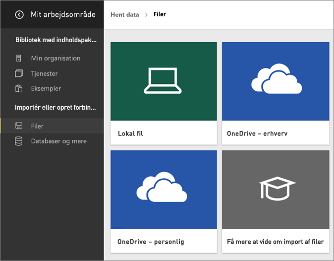
5. Til dette selvstudium vælger vi **Importér** for at tilføje Excel-filen som et datasæt, som vi derefter kan bruge til at oprette rapporter og dashboards. Hvis du vælger **Overfør**, uploades hele Excel-projektmappen til Power BI, hvor du kan åbne og redigere den i Excel online.
   
   
6. Vælg **Vis datasæt**, når dit datasæt er klar, for at åbne det i rapporteditoren. 

    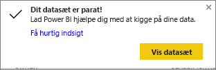

    Da vi endnu ikke har oprettet nogen visualiseringer, er rapportcanvasset tomt.

    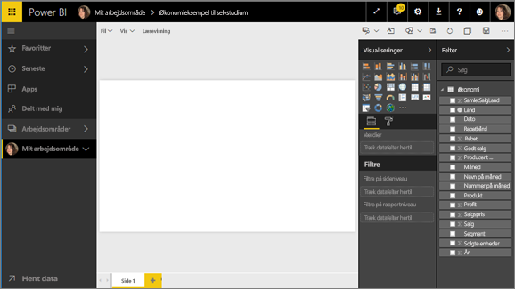

6. Kig nærmere på den øverste menulinje, og læg mærke til, at der er en indstilling for **Læsevisning**. Eftersom du har mulighed for at vælge Læsevisning, betyder det, at du i øjeblikket er i **Redigeringsvisning**. 

    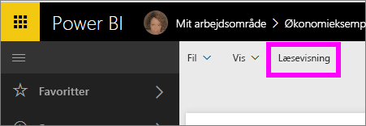

    Når du er Redigeringsvisning, kan du oprette og redigere dine egne rapporter, fordi du er *ejer* af rapporten altså en *opretter*. Når du deler din rapport med kollegaer, kan de kun interagere med rapporten i Læsevisning, da de er *forbrugere*. Få mere at vide om [Læsevisning og Redigeringsvisning](consumer/end-user-reading-view.md).
    
    En glimrende måde at blive fortrolig med rapporteditoren på er at [få en introduktion](service-the-report-editor-take-a-tour.md)
   > 
 

## Trin 2: Begynd at udforske dit datasæt
Nu hvor du har forbindelse til data, kan du begynde at udforske.  Vi har fundet noget spændende, så du kan oprette et dashboard for at overvåge det og se, hvordan det ændres over tid. Lad os se, hvordan det fungerer.
    
1. I rapporteditoren bruger vi ruden **Felter** i højre side for at oprette en visualisering.  Markér afkrydsningsfeltet ud for **Gross Sales** og **Date**.
   
   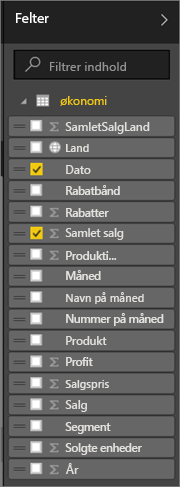

2. Power BI analyserer dataene og opretter en visualisering.  Hvis du har valgt **Date** først, får du vist en tabel.  Hvis du har valgt **Gross Sales** først, får du vist et diagram. Skift til en anden måde at vise dine data på. Lad os se disse data som et kurvediagram. Vælg ikonet for kurvediagram (også kendt som en skabelon) i **ruden Visualiseringer**.
   
   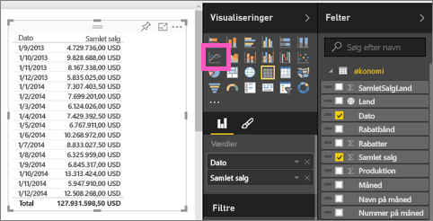

3. Det ser interessant ud, så lad os *fastgøre* det til et dashboard. Peg på visualiseringen med musen, og vælg **ikonet med tegnestiften**.  Når du fastgør denne visualisering, gemmes den på dashboardet og holdes opdateret, så du kan spore den seneste værdi på et øjeblik.
   
   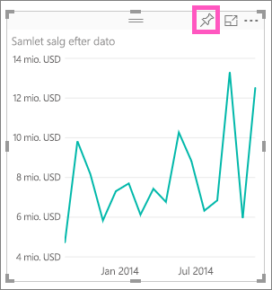

4. Da det er en ny rapport, skal du gemme den, før du kan fastgøre en visualisering på et dashboard. Giv din rapport et navn (f.eks. *Salg over tid*), og vælg **Gem og fortsæt**. 
   
   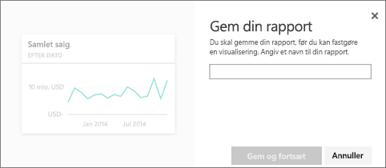
   
5. Lad os fastgøre kurvediagrammet til et nyt dashboard, og give det navnet "Økonomisk eksempel til selvstudium". 
   
   
   
1. Vælg **Fastgør**.
   
    En meddelelse om fuldførelse (næsten helt oppe i højre hjørne) giver dig besked om, at visualiseringen er blevet føjet til dit dashboard som et felt.
   
    

6. Vælg **Gå til dashboard** for at se kurvediagrammet fastgjort som et felt til dit helt nye dashboard. Gør dit dashboard endnu bedre ved at tilføje flere visualiseringsfelter og [omdøbe, ændre størrelsen på, sammenkæde og flytte felter](service-dashboard-edit-tile.md).
   
   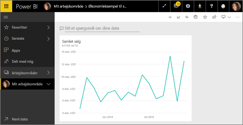
   
   Vælg det nye felt på dashboardet for til enhver tid at vende tilbage til rapporten. Power BI vender tilbage til rapporteditoren i Læsevisning. Hvis du vil skifte tilbage til Redigeringsvisning, skal du vælge **Rediger rapport** på den øverste menulinje. Når du er i Redigeringsvisning, kan du fortsætte med at udforske og fastgøre felter. 

## Trin 3: Fortsæt med at udforske via Spørgsmål og svar (forespørgsel på naturligt sprog)
1. Hvis du vil foretage en hurtig udforskning af dine data, kan du prøve at stille et spørgsmål i feltet Spørgsmål og svar. Feltet Spørgsmål og svar er placeret øverst i dit dashboard (**stil et spørgsmål om dataene**) og i den øverste menulinje i din rapport (**stil et spørgsmål**). Prøv for eksempel at skrive "hvilket segment havde den største omsætning".
   
   

2. Spørgsmål og svar søger efter svar og præsenterer dem i form af en visualisering. Vælg fastgørelsesikonet  for også at vise denne visualisering på dit dashboard.
3. Fastgør visualiseringen på dashboardet "Økonomisk eksempel til selvstudium".
   
    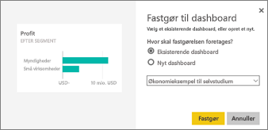

4. Vend tilbage til dit dashboard, hvor du kan se det nye felt.

   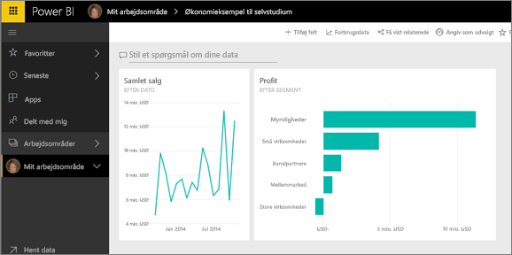

## Fjern ressourcer
Nu, hvor du har gennemført selvstudiet, kan du slette datasættet, rapporten og dashboardet. 

1. Vælg **My Workspace** på navigationslinjen til venstre.
2. Vælg fanen **Datasæt**, og find det datasæt, du har importeret i dette selvstudium.  
3. Vælg ellipserne (...) > **Slet**.

    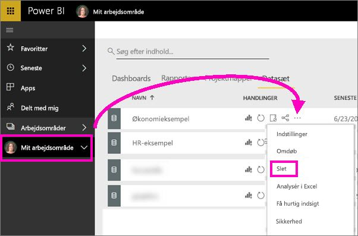

    Når du sletter datasættet, sletter du også rapporten og dashboardet. 

## Næste trin
Er du klar til at prøve mere?  Her er nogle fantastiske måder at udforske Power BI på.

> [!div class="nextstepaction"]
> [Opret forbindelse til de onlinetjenester, du bruger](consumer/end-user-connect-to-services.md)

