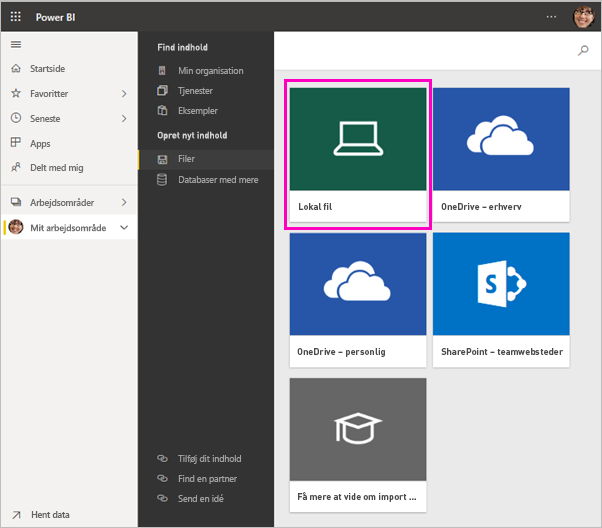
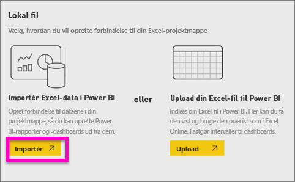
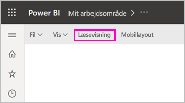
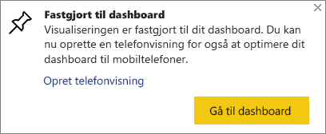
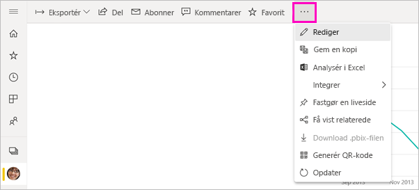
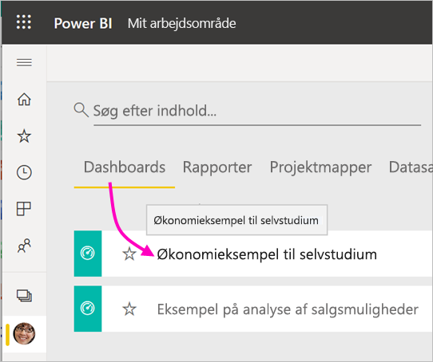
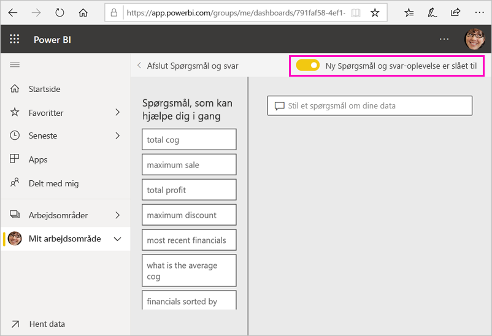
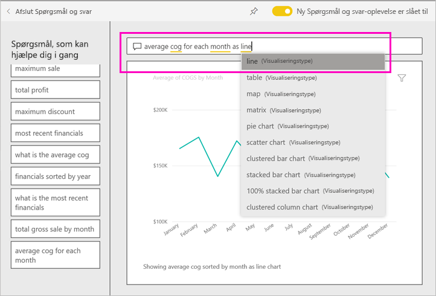
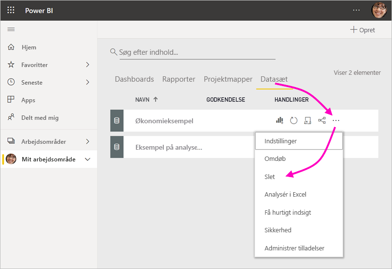

# Selvstudium: Kom i gang med Power BI-tjenesten
Dette selvstudium er en introduktion til nogle af funktionerne i *Power BI-tjenesten.* I selvstudiet lærer du, hvordan du opretter forbindelse til data, opretter en rapport og et dashboard samt stiller spørgsmål til dine data. Du kan udføre mange flere opgaver i Power BI-tjenesten, og dette selvstudium er kun ment som en appetitvækker. Hvis du vil have en forståelse af, hvordan Power BI-tjenesten passer sammen med de andre Power BI-tilbud, anbefaler vi, at du læser artiklen [Hvad er Power BI](fundamentals/power-bi-overview.md).

I dette selvstudium kan du udføre følgende trin:

> [!div class="checklist"]
> * Log på din Power BI-onlinekonto, eller opret en konto, hvis du endnu ikke har en.
> * Åbn Power BI-tjenesten.
> * Hent nogle data, og åbn dem i rapportvisning.
> * Brug disse data til at oprette visualiseringer, og gem dem som en rapport.
> * Opret et dashboard ved at fastgøre felter fra rapporten.
> * Føj andre visualiseringer til dit dashboard ved hjælp af værktøjet Spørgsmål og svar i naturligt sprog.
> * Tilpas størrelsen, flyt rundt på og interager med felterne på dashboardet.
> * Fjern ressourcer ved at slette datasættet, rapporten og dashboardet.

> [!TIP]
> Foretrækker du i stedet et gratis kursus i dit eget tempo? [Deltag i vores kursus om analyse og visualisering af data på EdX](https://aka.ms/edxpbi).

## Tilmeld dig Power BI-tjenesten
Hvis du ikke har en Power BI-konto, [kan du tilmelde dig en gratis prøveversion af Power BI Pro](https://app.powerbi.com/signupredirect?pbi_source=web), før du begynder.

Når du har fået en konto, skal du angive *app.powerbi.com* i din browser for at åbne Power BI-tjenesten. 

## Trin 1: Hent data

Når du vil oprette en Power BI-rapport, starter du ofte i Power BI Desktop. Denne gang går vi i gang med at oprette en rapport fra bunden i Power BI-tjenesten.

I dette selvstudium henter vi data fra en CSV-fil. Vil du følge med? [Download CSV-filen Økonomisk eksempel](https://go.microsoft.com/fwlink/?LinkID=521962).

1. [Log på Power BI](https://www.powerbi.com/). Har du ikke en konto? Helt i orden, du kan tilmelde dig og få en gratis prøveversion.
2. Power BI åbnes i browseren. Vælg **Hent data** nederst i navigationsruden.

    Siden **Hent data** åbnes.   

3. Under sektionen **Opret nyt indhold** skal du vælge **Filer**. 
   
   
4.  Vælg **Lokal fil**.
   
    

5. Gå til filen på din computer, og vælg **Åbn**.

5. Til dette selvstudium vælger vi **Importér** for at tilføje Excel-filen som et datasæt. Derefter kan vi bruge datasættet til at oprette rapporter og dashboards. Hvis du vælger **Upload**, uploades hele Excel-projektmappen til Power BI, hvor du kan åbne og redigere den i Excel online.
   
   
6. Når dit datasæt er klar, skal du vælge **Datasæt** og derefter vælge **Opret rapport** ud for datasættet **Økonomisk eksempel** for at åbne rapporteditoren. 

    

    Rapportlærredet er tomt. Til højre kan du se ruderne **Visualiseringer**, **Filtre** og **Felter**.

    

7. Bemærk, at der er en indstilling for **Læsevisning** i den øverste navigationsrude. Når denne indstilling er aktiv, betyder det, at du i øjeblikket er i Redigeringsvisning. En god måde at blive fortrolig med rapporteditoren på er ved at [få en introduktion](service-the-report-editor-take-a-tour.md).

    

    Når du er Redigeringsvisning, kan du oprette og redigere dine rapporter, fordi du er *ejer* af rapporten. Det vil sige, at du er *forfatteren*. Når du deler din rapport med kolleger, kan de kun interagere med rapporten i Læsevisning, da de er *forbrugere*. Få mere at vide om [Læsevisning og Redigeringsvisning](consumer/end-user-reading-view.md).

## Trin 2: Opret et diagram i en rapport
Nu hvor du har forbindelse til data, kan du begynde at udforske.  Vi har fundet noget spændende, så du kan oprette et dashboard for at overvåge det og se, hvordan det ændres over tid. Lad os se, hvordan det fungerer.
    
1. Vi begynder i ruden **Felter** i højre side i rapporteditoren med at oprette en visualisering. Markér afkrydsningsfelterne for **Bruttoomsætning** og **Dato**.
   
   

    Power BI analyserer dataene og opretter en visualisering. Hvis du valgte **Dato** først, får du vist en tabel. Hvis du valgte **Bruttoomsætning** først, får du vist et søjlediagram. 

2. Skift til en anden måde at vise dine data på. Lad os se disse data som et kurvediagram. Vælg ikonet for kurvediagrammet i ruden **Visualiseringer**.
   
   

3. Dette diagram ser interessant ud, så lad os *fastgøre* det til et dashboard. Hold over visualiseringen, og vælg ikonet med tegnestiften. Når du fastgør denne visualisering, gemmes den på dashboardet og holdes opdateret, så du kan spore den seneste værdi på et øjeblik.
   
   

4. Da denne rapport er ny, bliver du bedt om at gemme den, før du kan fastgøre en visualisering på et dashboard. Navngiv din rapport (f.eks. *Salg over tid*), og vælg derefter **Gem**. 

5. Vælg **Nyt dashboard**, og navngiv det *Økonomisk eksempel til selvstudium*. 
   
   
   
6. Vælg **Fastgør**.
   
    En meddelelse om fuldførelse (i nærheden af øverste højre hjørne) giver dig besked om, at visualiseringen blev føjet til dit dashboard som et felt.
   
    

7. Vælg **Gå til dashboard** for at se det nye dashboard med det kurvediagram, du har fastgjort til det som et felt. 
   
   
   
8. Vælg det nye felt på dashboardet for at vende tilbage til rapporten. Power BI vender tilbage til rapporten i Læsevisning. 

1. Hvis du vil skifte tilbage til Redigeringsvisning, skal du vælge **Flere indstillinger** (...) i den øverste navigationsrude > **Rediger**. Når du er tilbage i Redigeringsvisning, kan du fortsætte med at udforske og fastgøre felter.

    

## Trin 3: Udforsk med Spørgsmål og svar

Hvis du vil foretage en hurtig udforskning af dine data, kan du prøve at stille et spørgsmål i spørgsmålsfeltet Spørgsmål og svar. Spørgsmål og svar opretter forespørgsler på et naturligt sprog om dine data. I et dashboard er feltet Spørgsmål og svar placeret øverst (**Stil et spørgsmål om dine data**). I en rapport er feltet placeret i den øverste navigationsrude (**Stil et spørgsmål**).

1. Hvis du vil vende tilbage til dashboardet, skal du vælge **Mit arbejdsområde** på den sorte **Power BI-linje**.

    

1. Vælg dit dashboard under fanen **Dashboards**.

    

1. Vælg **Stil et spørgsmål om dine data**. Der vises automatisk en række forslag i Spørgsmål og svar.

    

    > [!NOTE]
    > Hvis du ikke kan se forslagene, kan du slå den **nye Spørgsmål og svar-oplevelse** til.

2. Nogle af forslagene returnerer én enkelt værdi. Du kan f.eks. vælge **maksimalt salg**.

    Spørgsmål og svar søger efter svar og præsenterer dem i form af et *kort*.

    

3. Vælg fastgørelsesikonet  for at vise visualiseringen på dashboardet Økonomisk eksempel til selvstudium.

1. Rul ned på listen **Spørgsmål, som kan hjælpe dig i gang**, og vælg **gennemsnitligt vareforbrug for hver måned**. 

    

1. Fastgør også søjlediagrammet til dashboardet **Økonomisk eksempel til selvstudium**.

1. Placer markøren efter *efter måned* i feltet Spørgsmål og svar, og skriv *som kurve*. Vælg **kurve (visualiseringstype)** . 

    

4. Vælg **Afslut spørgsmål og svar** for at vende tilbage til dit dashboard, hvor du kan se det nye felt, du har oprettet. 

   

   Du kan se, at selvom du har ændret diagrammet til et kurvediagram, forbliver feltet et søjlediagram, da det er det, det var, da du fastgjorde det. 

## Trin 4: Flyt felter

Dashboardet er bredt. Vi kan flytte rundt på felterne for at udnytte pladsen i dashboardet bedre.

1. Træk det nederste højre hjørne af kurvediagramfeltet *Bruttosalg* opad, indtil det får den samme højde som feltet Salg, og slip det så.

    

    Nu har de to felter den samme højde.

    

1. Træk søjlediagramfeltet *Gennemsnitligt vareforbrug*, indtil det passer under kurvediagrammet *Bruttosalg*.

    Det ser bedre ud.

    

## Trin 5: Interager med felter

Her er en sidste interaktion at lægge mærke til, før du begynder at oprette dine egne dashboards og rapporter. Markering af de forskellige felter giver forskellige resultater. 

1. Vælg først kurvediagramfeltet *Bruttosalg*, som du har fastgjort fra rapporten. 

    Rapporten åbnes i Læsevisning i Power BI. 

2. Vælg knappen Tilbage i browseren. 

1. Vælg nu søjlediagramfeltet *Gennemsnitligt vareforbrug*, som du oprettede i Spørgsmål og svar. 

    Rapporten åbnes ikke i Power BI. I stedet åbnes Spørgsmål og svar, fordi det var der, du oprettede diagrammet.

## Fjern ressourcer
Nu, hvor du har gennemført selvstudiet, kan du slette datasættet, rapporten og dashboardet. 

1. Sørg for, at du befinder dig i **Mit arbejdsområde** i navigationsruden.
2. Vælg fanen **Datasæt**, og find det datasæt, du har importeret i dette selvstudium.  
3. Vælg **Flere indstillinger** (...) > **Slet**.

    

    Når du sletter datasættet, får du vist en advarsel om, at **alle de rapport- og dashboardfelter, der indeholder data fra datasættet, også vil blive slettet**.

4. Vælg **Slet**.

## Næste trin

Gør dashboards endnu bedre ved at tilføje flere visualiseringsfelter og [omdøbe, ændre størrelsen på, sammenkæde og flytte dem](service-dashboard-edit-tile.md).

