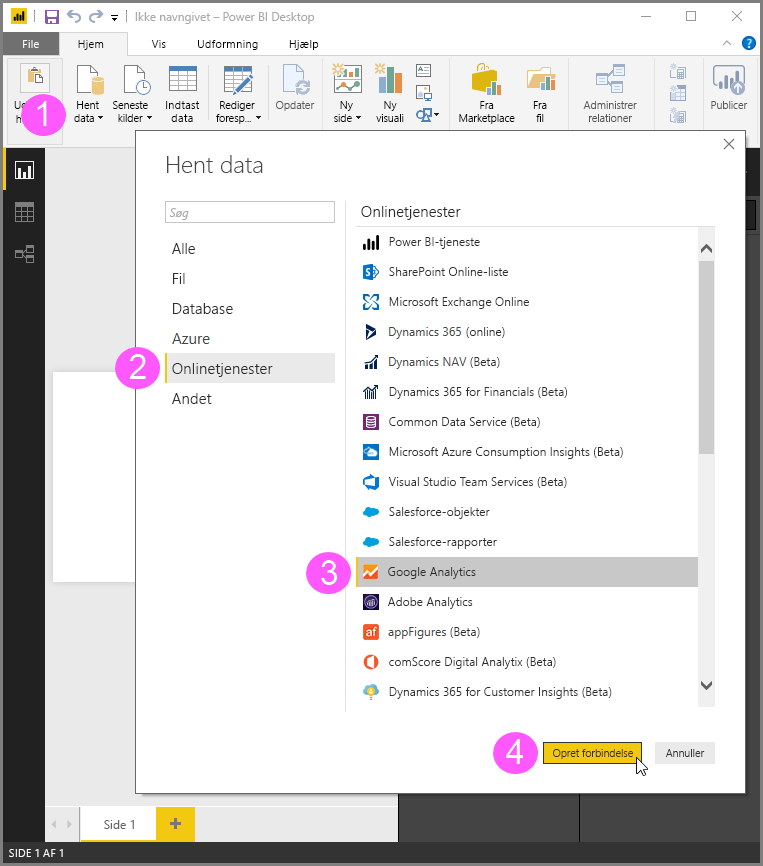
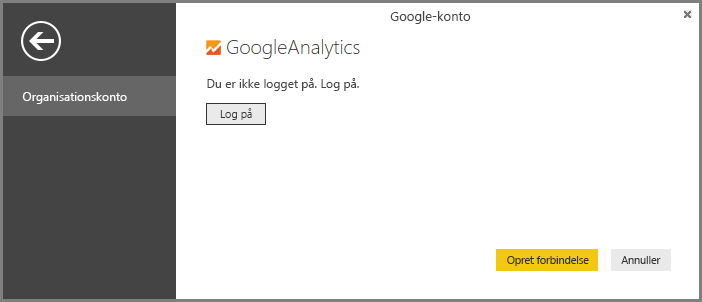

# Google Analytics-connector til Power BI Desktop
> [!NOTE]
> Google Analytics-indholdspakken og -connectoren i Power BI Desktop er afhængige af Google Analytics Core Reporting API. Som sådan kan funktioner og tilgængelighed variere over tid.
> 
> 

Du kan oprette forbindelse til Google Analytics-data ved hjælp af **Google Analytics**-connectoren. Du opretter forbindelse ved at følge disse trin:

1. Vælg **Hent data** på båndet **Hjem** i **Power BI Desktop**.
2. I vinduet **Hent data** skal du vælge **Online Services** blandt kategorierne i ruden til venstre.
3. Vælg **Google Analytics** blandt valgmulighederne i højre rude.
4. Vælg **Opret forbindelse** nederst i vinduet.  
   

Du får vist en dialogboks, der forklarer, at connectoren er en tredjepartstjeneste, og du bliver advaret om, hvordan funktioner og tilgængelighed kan ændres over tid, samt andre afklaringer.  

Når du vælger **Fortsæt**, bliver du bedt om at logge på Google Analytics.  

Når du angiver dine legitimationsoplysninger, bliver du gjort opmærksom på, at Power BI gerne vil have offlineadgang. Sådan bruger du **Power BI Desktop** til at få adgang til dine Google Analytics-data.  

Når du har accepteret, viser **Power BI Desktop**, at du er logget på.  

Vælg **Opret forbindelse**, så oprettes der forbindelse mellem dine Google Analytics-data og **Power BI Desktop**, og dataene indlæses.  

## Ændringer til API'en
Selvom vi forsøger at udgive opdateringer i overenstemmelse med eventuelle ændringer, kan API'en ændres på en måde, som kan påvirke resultaterne af de forespørgsler, vi genererer. I nogle tilfælde vil visse forespørgsler ikke længere være understøttet. På grund af denne afhængighed kan vi ikke garantere resultaterne af dine forespørgsler, når du bruger denne connector.

Du kan få mere at vide om ændringer til Google Analytics-API'en i deres [ændringslog](https://developers.google.com/analytics/devguides/changelog).

