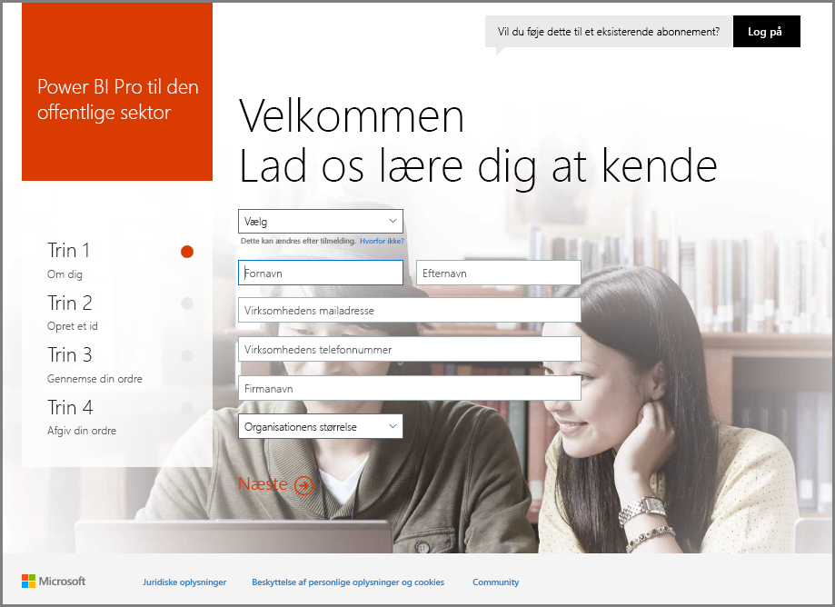
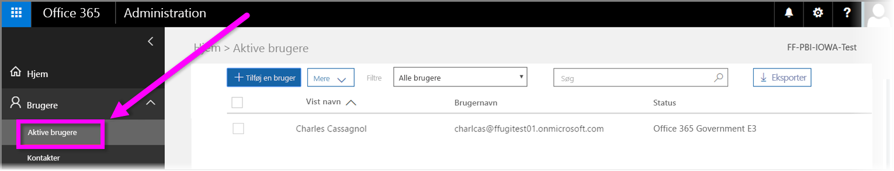

# Tilmeld din US Government-organisation til Power BI-tjenesten
**Power BI-tjenesten** har en version tilgængelig for offentlige myndigheder i USA som en del af abonnementer på **Office 365 US Government Community**. Versionen af **Power BI-tjenesten**, der er beskrevet i denne artikel, er udviklet specielt til offentlige myndigheder i USA og er separat og adskiller sig fra den kommercielle version af **Power BI-tjenesten**.

For at få flere oplysninger om **Power BI-tjenesten** til US Government, herunder funktioner og begrænsninger, skal du se [Power BI til offentlige myndigheder i USA – overblik](service-govus-overview.md).

> [!NOTE]
> Denne artikel er beregnet til administratorer, der har tilladelse til at tilmelde deres US Government-organisation til Power BI. Hvis du er slutbruger, skal du kontakte din administrator for at få et abonnement på Power BI til US Government.
> 
> 

## Vælg den rette tilmeldingsproces for din US Government-organisation
Din US Government-organisation kan være ny i **Office Government Cloud**, eller den har muligvis allerede et abonnement. De følgende afsnit beskriver tilmeldingsproceduren, baseret på hvor du er med Office Government Cloud og Power BI, og den kan variere alt afhængigt af dit eksisterende abonnement.

Når du har tilmeldt dig Power BI US Government, kan du muligvis først bruge visse funktioner, når dine salgs- eller supportrepræsentanter har færdiggjort din onboardingproces. Se [Power BI til offentlige myndigheder i USA - overblik](service-govus-overview.md) for at få mere at vide om disse funktioner. Kontakt dine salgs- eller supportrepræsentanter for at færdiggøre onboardingprocessen, og få aktiveret disse funktioner.

### US Government-organisationer der er nye Office Cloud-kunder
Hvis din organisation er ny **Office Government Cloud**-kunde, skal du følge nedenestående trin:

> [!NOTE]
> Disse trin skal udføres af administratoren af portalen.
>

1. Gå til [https://products.office.com/government/office-365-web-services-for-government](https://products.office.com/government/office-365-web-services-for-government).

>[!NOTE]
>Hvis du ikke vil tilmelde dig Office Government Cloud lige nu, skal du kontakte din salgsrepræsentant.
>

2. Vælg Office G3, og udfyld formularen til en prøveversion af Office
3. Når du er blevet Office Cloud-kunde, skal du gå videre til proceduren nedenfor for "Eksisterende Office Government Cloud-kunder"

### Eksisterende Office Government Cloud-kunder
Hvis din organisation er eksisterende **Office Government Cloud**-kunde, men du ikke har et **Power BI**-abonnement (gratis eller øvrige), skal du følge disse trin:

> [!NOTE]
> Disse trin skal udføres af administratoren af portalen.
> 
> 

1. Log på din eksisterende Office Government Cloud-konto, og gå til administrationsportalen
2. Vælg **Fakturering**.
3. Vælg **Køb tjeneste**.
4. Vælg indstillingen Power BI Pro Government, og vælg mellem **Prøv** og **Køb nu**
5. Fuldfør din ordre
6. Tildel brugere til kontoen.
   
   
7. Log på **Power BI-tjenesten** for offentlige myndigheder i USA på [https://app.powerbigov.us](https://app.powerbigov.us)

## Yderligere tilmeldingsoplysninger
Nedenstående er yderligere oplysninger for tilmelding til **Power BI US Government** i forskellige licensoverflytningssituationer.

### Prøveversion af Direct Power BI til onboarding af Pro-kunde
* Klik på og følg – Fakturering > Køb tjeneste > Power BI Pro Gov, og vælg køb og ikke prøveversion
* Udfyld de nødvendige oplysninger og hent licenserne
* Fjern Power BI Pro-prøveversionen, eller fjern de gamle licenser, og tildel de nye til brugerne
* Log på [https://app.powerbigov.us](https://app.powerbigov.us)

### Prøveversion af Reseller Power BI til onboarding af Pro-kunde
Gå til **Fakturering > Abonnementer**, og vælg **Power BI Pro for Government**-abonnement. Du kan se:

* Tilgængelig
* Tildelt
* Linkene Tildel til brugere
* Hvis du stadig har tildelt prøveversionen:
  * Klik på **Tildelt** under prøveabonnement, og fjern brugerne, der skal føjes til betalt
  * Gå til Betalt abonnement, og tildel disse brugere

### Whitelisting-instruktioner
*Whitelisting* er en proces, som Power BI-teknikere bruger til at flytte kunder fra det kommercielle cloudmiljø til det sikre, Government-cloudmiljø. Dette sikrer, at funktioner, der er tilgængelige i US Government-clouden, fungerer som forventet. Alle eksisterende (eller nye) offentlige myndigheder i USA, der køber US Government **Power BI**-tjenester for første gang, *skal* iværksætte følgende whitelisting-proces. Processen skal udføres inden opsætning eller overflytning til US Government **Power BI**-tjenester. 

Hvis du vil have *whitelistet* din lejer for clouden for den amerikanske regering, skal du kontakte Microsoft-kontoteamet for at få hjælp til whitelisting. Du skal være opmærksom på, at anmodningen kun kan udføres af administratorer. *Whitelisting*-processen tager ca. tre uger, hvor Power BI-teknikere udfører de relevante ændringer for at sikre, at din lejer fungerer korrekt i US Government-clouden.

Kunder, der overflyttes fra Power BI **gratis**-licenser til **Power BI US Government** (og pr. definition, overflyttes til de tilknyttede **Pro**-licensfunktioner beskrevet tidligere i denne artikel), vil opleve problemerne, der er beskrevet i det følgende afsnit i denne artikel, indtil deres lejer er overført via *whitelisting* af Power BI-teknikere.

### Blandede gratis- og Pro-licenser i US Government-lejere
Hvis du har både gratis- og US Government Pro-licenser i din lejer, vil både gratis- og (US Government) Pro-licenser fortsat være til stede, men en af licenstyperne vil ikke fungerer korrekt. Hvis din lejer gennemfører en vellykket *whitelisting*-proces, så sker følgende:

* Brugere af gratislicens kan ikke længere logge på Power BI via **Power BI Desktop**, og de vil opleve funktionalitetshuller, som beskrevet i det følgende afsnit.
* Alle klienter, der er tildelt US Government Pro-licenser, fungerer som forventet, herunder brugen af gateways, Power BI Desktop og Mobile-apps.

Når der bruges en blanding af gratis- og Pro-licenser i en US Government-lejer, og under *whitelisting*-processen, bør følgende forventes:

**Før overførslen via _whitelisting_**:

* Brugere med gratislicenser kører i kommerciel cloud
* Pro US Government-licenser vises i portalen, og administratoren kan tildele disse licenser til brugere. Pro US Government-brugere mister ikke data fra deres gratislicenser, når administratoren tildeler en US Government Pro-licens. De tildelte brugere har adgang til Power BI Pro-funktioner til US Government-kunder, men funktionalitetshullerne i den følgende opstilling med punkttegn vil være til stede, indtil lejeren gennemfører en vellykket *whitelisting*-proces:
  
  * Gateway, Mobile og Power BI Desktop kan ikke godkende
  * Du kan ikke få adgang til kommercielle Azure-datakilder
  * PBIX-filer skal manuelt uploades fra den kommercielle Power BI-tjeneste
  * Power BI-mobilapps er ikke tilgængelige

**Efter overførslen via _whitelisting_**:

* Gratisbrugere, der kører i den kommercielle Power BI-tjeneste, kan fortsætte med at køre, men de holder op med at godkende som forventet.
* Pro-brugere, der kører i US Government-clouden, kan bruge tjenesten **Power BI til regeringskunder i USA** som forventet.

For at identificere brugere i din lejer, der kører den gratis licens af Power BI, kan administratorer køre licensrapporten, hvorefter gratislicensbrugere vises som **Power BI Standard**.

## Næste trin
Du kan gøre mange forskellige ting med Power BI. Yderligere oplysninger og læring, herunder en artikel, der viser, hvordan du tilmelder dig tjenesten, findes i følgende ressourcer:

* [Oversigt over Power BI til US Government](service-govus-overview.md)
* [Automatiseret læring til Power BI](guided-learning/gettingstarted.yml?tutorial-step=1)
* [Kom i gang med Power BI-tjenesten](service-get-started.md)
* [Hvad er Power BI Desktop?](desktop-what-is-desktop.md)

