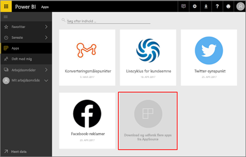
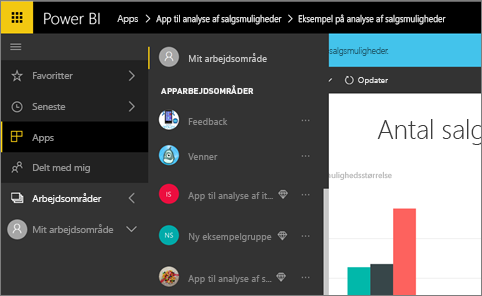
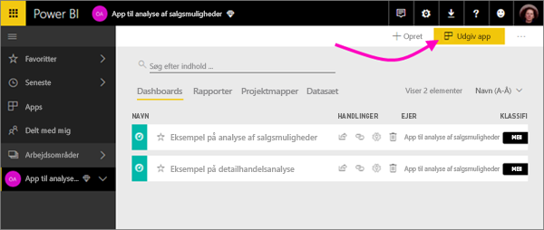
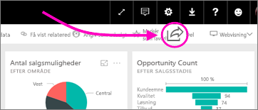
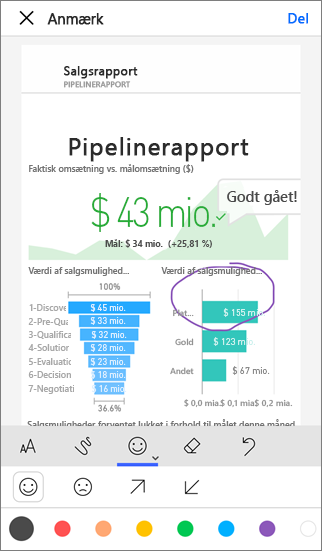

# Hvordan kan jeg samarbejde og dele i Power BI?

Du har oprettet dashboards og rapporter. Måske samarbejder du også med kolleger om dem. Du kan derefter give andre adgang til dem. Hvordan distribueres de på bedste vis?

I denne artikel sammenligner vi disse muligheder for at samarbejde og dele i Power BI: 

* Samarbejde med kolleger om at oprette relevante rapporter og dashboards i *apparbejdsområder*.
* Gruppering af disse dashboards og rapporter i *apps* og publicering af dem til en større gruppe eller hele organisationen.
* Deling af dashboards eller rapporter med nogle få personer, fra tjenesten eller Power BI-mobilapps.
* Publicering på internettet, hvor alle kan se og interagere med dem.
* Udskrivning. 

Uanset hvilken indstilling du vælger, skal du bruge en [Power BI Pro-licens](service-free-vs-pro.md) for at dele, ellers skal indholdet være i [Premium-kapacitet](service-premium.md). Licenskrav varierer alt efter kollegerne, der får vist dine dashboards, afhængigt af din valgte indstilling. De følgende afsnit går længere ned i detaljen. 

*Apps i Power BI-tjenesten*

## Samarbejd med kolleger om at oprette en app
Lad os sige, at du og dine kolleger gerne vil publicere jeres Power BI-kundskaber til organisationen. Det gør I bedst ved at oprette en *app*. En app er en samling af dashboards og rapporter, der er bygget til at levere vigtige metrikker til organisationen. 

Hvis du vil oprette en app, skal du bruge et *apparbejdsområde* med dine kolleger som medlemmer. Apparbejdsområdet kan sammenlignes med et samlerum, hvor du og andre kan samarbejde om Power BI-dashboards og rapporter. I kan alle oprette rapporter i Power BI Desktop og publicere dem til apparbejdsområdet, og I skal alle bruge Power BI Pro-licenser.

**Hvis du kun vil dele et færdigt dashboard med kolleger, så skal du ikke føje dem til apparbejdsområdet.** Du skal i stedet [oprette dashboardet i et apparbejdsområde](service-create-distribute-apps.md) og udgive appen til dem. 

## Publicer din app til en bred målgruppe
Lad os sige, at du gerne vil distribuere dit dashboard til en bred målgruppe. Du og dine kolleger har oprettet et *apparbejdsområde*, derefter har I oprettet og forfinet dashboards, rapporter og datasæt i apparbejdsområdet. Nu vælger du de pågældende dashboards og rapporter og publicerer dem som en app – enten til medlemmer af en sikkerhedsgruppe eller distributionsliste, eller til hele din organisation. 

Det er nemt at finde og installere apps i Power BI-tjenesten ([https://powerbi.com](https://powerbi.com)). Du kan sende virksomhedens brugere et direkte link til appen, eller de kan søge efter den i AppSource. Hvis din Power BI-administrator giver dig tilladelser, kan du automatisk installere en app i dine kollegers Power BI-konti. Læs mere om at [publicere dine apps](service-create-distribute-apps.md#publish-your-app). 

Efter de har installeret en app, kan de få den vist i deres browser eller mobilenhed.

Dine brugere kan få vist din app ved enten også at have Power BI Pro-licens, eller ved at appen er lagret i en Power BI Premium-kapacitet. Læs [Hvad er Power BI Premium?](service-premium.md) for at få flere oplysninger.

## Del dashboards og rapporter
Lad os sige, at du har færdiggjort et dashboard og en rapport i dit eget Mit arbejdsområde eller i et apparbejdsområde, og du gerne vil give andre adgang til indholdet. Du kan vælge at *dele* indholdet. 

Du skal have en Power BI Pro-licens for at dele dit indhold, og det samme skal brugerne, du deler det med, eller også skal indholdet være tilgængeligt i [Premium-kapacitet](service-premium.md). Når du deler et dashboard eller rapport, kan de få det vist og interagere med indholdet, men de kan ikke redigere det. De kan se de samme data, som du kan se i dashboardet og rapporterne, medmindre sikkerhed på rækkeniveau (RLS) anvendes på det underliggende datasæt. Kollegerne, du deler indholdet med, kan dele det med deres kolleger, hvis du giver dem lov til det. 

Du kan også dele med brugere uden for din organisation. De kan også få vist og interagere med dashboardet, men de kan ikke dele det. 

Flere oplysninger om [deling af dashboards og rapporter ](service-share-dashboards.md) fra Power BI-tjenesten. Du kan også føje et filter til et link og [dele en filtreret visning af din rapport](service-share-reports.md).

## Anmærk og del fra Power BI-mobilapps
Du kan i Power BI-mobilapps til iOS- og Android-enheder anmærke et felt, rapport eller visuelt element og derefter dele det med alle pr. mail. 

Du kan dele et snapshot af feltet, rapporten eller dit visual, og modtagerne ser det, præcist som det var, da du sendte mailen. Mailen indeholder også et link til dashboardet eller rapporten. Hvis modtagerne har en Power BI Pro-licens, eller hvis indholdet er i [Premium-kapacitet](service-premium.md), og du allerede har delt objektet med dem, kan de åbne det. Du kan sende snapshots af felter til alle – ikke kun til kolleger på samme maildomæne.

Flere oplysninger om [anmærkning og deling af felter, rapporter og visuelle elementer](mobile-annotate-and-share-a-tile-from-the-mobile-apps.md) fra iOS- og Android-mobilapps.

Du kan også [dele et snapshot af et felt](mobile-share-tile-windows-10-phone-app.md) fra Power BI-appen til Windows 10-enheder.

## Publicer på internettet
Du kan publicere Power BI-rapporter til hele internettet ved at integrere interaktive visualiseringer i blogindlæg, websteder, sociale medier og andre online-meddelelser på enhver enhed. Alle på internettet kan få vist dine rapporter, og du har ingen kontrol over, hvem der kan se, hvad du har publiceret. Modtagerne skal ikke bruge en Power BI-licens. Publicering til internettet er kun tilgængeligt for rapporter, som du kan redigere. Du kan ikke publicere rapporter til internettet, hvis de er delt med dig, eller hvis de er i en app. Mere om [publicering på internettet](service-publish-to-web.md).

## Udskriv eller gem som pdf-fil eller en anden statisk fil
Du kan udskrive eller gemme som pdf-fil (eller andre statiske filformatet), et helt dashboard, dashboardfelt, rapportside eller visualisering fra Power BI-tjenesten. Rapporter kan kun udskrives med én side ad gangen – du kan ikke udskrive hele rapporten på en gang. Mere om at [udskrive eller gemme som en statisk fil](service-print.md).

## Næste trin
* Har du feedback? Indsend dine forslag på [webstedet for Power BI-community'et](https://community.powerbi.com/).
* [Del dashboards med kolleger og andre](service-share-dashboards.md)
* [Opret og publicer en app i Power BI](service-create-distribute-apps.md)
* Har du flere spørgsmål? [Prøv at spørge Power BI-community'et](http://community.powerbi.com/).

