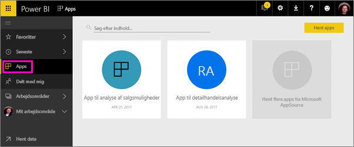
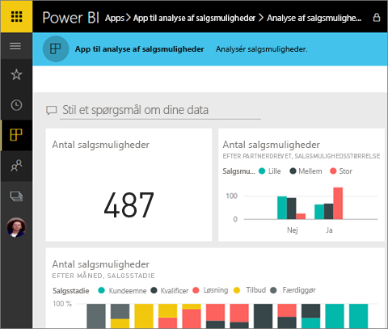
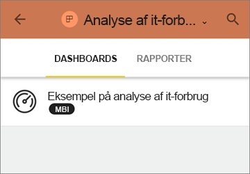
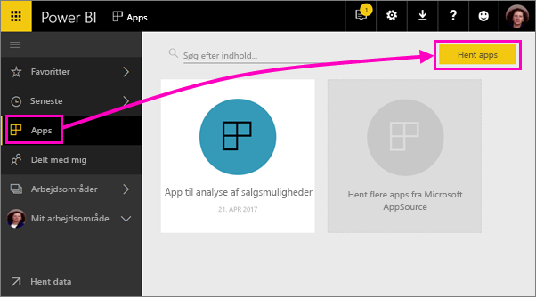
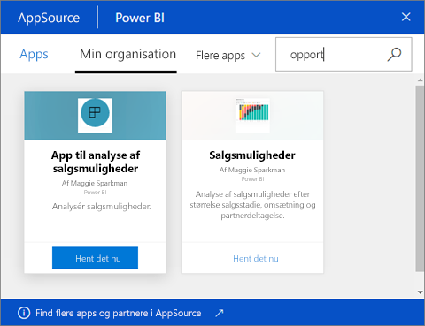
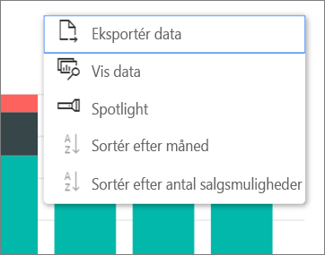

# Installer og brug apps med dashboards og rapporter i Power BI
I Power BI samler *apps* relaterede dashboards og rapporter på ét sted. Personer i din organisation kan oprette og distribuere apps med vigtige forretningsoplysninger. [Eksterne tjenester](service-connect-to-services.md), du muligvis allerede bruger, f.eks. Google Analytics og Microsoft Dynamics CRM, tilbyder også Power BI-apps. 

Apps er lette at finde og installere i Power BI-tjenesten ([https://powerbi.com](https://powerbi.com)) og på din mobilenhed. Når du har installeret en app, behøver du ikke at huske navnene på mange forskellige dashboards, fordi de alle er samlet i appen, i webbrowseren eller på din mobilenhed.

Med apps ser du automatisk ændringerne, hver gang appens forfatteren udgiver opdateringer. Forfatteren styrer også, hvor ofte dataene er planlagt til opdatering, så du ikke skal bekymre dig om at holde dem opdateret. 

Har du planer om at oprette en app? Se [Opret og publicer apps i Power BI](service-create-distribute-apps.md) for at få flere oplysninger.

## Hent en ny app
Du kan hente apps på to forskellige måder. Appforfatteren kan sende dig et direkte link til en app, eller du kan søge efter den i AppSource, hvor du kan se alle de apps, du har adgang til. I Power BI på din mobilenhed kan du kun installere den fra et direkte link, og ikke fra AppSource. 

### Installer en app fra et direkte link
Den nemmeste måde selv at installere en ny app på er at få et direkte link fra appens forfatter. Power BI opretter et installationslink, som forfatteren kan sende til dig.

**På computeren** 

Når du klikker på linket i mailen, åbnes Power BI-tjenesten ([https://powerbi.com](https://powerbi.com)) i en webbrowser. Du bekræfter, at du vil installere appen, og den åbnes på appens landingsside.

**På iOS- eller Android-mobilenhed** 

Når du klikker på linket i mailen på din mobilenhed, installeres appen automatisk og åbner appens indholdsliste. 

### Hent appen fra Microsoft AppSource
Du kan også søge efter og installere apps, du har adgang til fra Microsoft AppSource. 

1. Vælg **Apps**  > **Hent apps**. 
   
     
2. I AppSource under **Min organisation** kan du søge for at begrænse resultatet og finde den app, du leder efter.
   
     
3. Vælg **Hent det nu** for at føje den til siden Apps. 

## Interager med dashboards og rapporter i appen
Nu kan du udforske dataene i dashboardene og rapporterne i appen. Du har adgang til alle almindelige Power BI-interaktioner som filtrering, fremhævning, sortering og analyse. Læs om at [interagere med rapporter i Power BI](service-interact-with-a-report-in-reading-view.md). 

Du kan ikke gemme ændringer, du foretager, men du kan altid [eksportere dataene til Excel ](power-bi-visualization-export-data.md) fra en tabel eller et andet visuelt element i en rapport.

## Næste trin
* [Opret og publicer apps i Power BI](service-create-distribute-apps.md)
* [Power BI-apps til eksterne tjenester](service-connect-to-services.md)
* Har du spørgsmål? [Prøv at spørge Power BI-community'et](http://community.powerbi.com/)

