# Automatiseret Machine Learning i Power BI

Automatiseret maskinel indlæring (AutoML) til dataflow giver forretningsanalytikere mulighed for at oplære, validere og aktivere modeller til maskinel indlæring (ML) direkte i Power BI. Versionen indeholder en enkel funktion til oprettelse af en ny ML-model, hvor analytikere kan bruge deres dataflows til at angive inputdataene til oplæring af modellen. Tjenesten udtrækker automatisk de mest relevante funktioner, vælger en passende algoritme og finjusterer og validerer ML-modellen. Når en model er oplært, genererer Power BI automatisk en rapport, der indeholder resultaterne af valideringen. Modellen kan derefter aktiveres på alle nye eller opdaterede data i dataflowet.

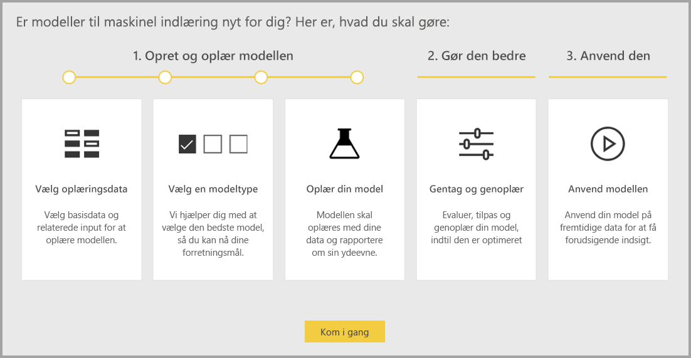

Automatiseret maskinel indlæring er kun tilgængelig for de dataflows, der er hostet i Power BI Premium- og Embedded-kapaciteter.

## Arbejde med AutoML

[Power BI-dataflow](service-dataflows-overview.md) tilbyder selvbetjent dataforberedelse af big data. AutoML er integreret i dataflow og giver dig mulighed for at gøre brug af din indsats i forbindelse med dataforberedelse til at skabe modeller til maskinel indlæring direkte i Power BI.

AutoML i Power BI gør det muligt for dataanalytikere at bruge dataflows til at bygge modeller til maskinel indlæring med en forenklet oplevelse udelukkende ved hjælp af Power BI-færdigheder. Det meste af datavidenskaben bag oprettelsen af ML-modellerne er automatiseret i Power BI. Der er retningslinjer, som sikrer, at den skabte model er af god kvalitet og giver synlighed i den proces, der blev brugt til at skabe ML-modellen.

AutoML understøtter oprettelsen af **modeller til binær forudsigelse**, **klassificering** og **regression** til dataflow. Dette er overvågede tekniktyper til maskinel indlæring, hvilket betyder, at de lærer fra kendte resultater af tidligere observationer for at forudsige resultatet af andre observationer. Inputdatasættet til oplæring af en AutoML-model er et sæt poster, der er **mærket** med de kendte resultater.

AutoML i Power BI integrerer [automatiseret maskinel indlæring](https://docs.microsoft.com/azure/machine-learning/service/concept-automated-ml) fra [Azure Machine Learning](https://docs.microsoft.com/azure/machine-learning/service/overview-what-is-azure-ml) for at oprette dine modeller til maskinel indlæring. Du behøver dog ikke et Azure-abonnement for at bruge AutoML i Power BI. Processen til oplæring og hosting af ML-modeller administreres udelukkende af Power BI-tjenesten.

Når en ML-model er oplært, genererer AutoML automatisk en Power BI-rapport, der forklarer den sandsynlige ydeevne for din ML-model. AutoML lægger vægt på forklaringsdelen ved at fremhæve nøglefaktorer fra det input, der påvirker de forudsigelser, som returneres af modellen. Rapporten indeholder også vigtige målepunkter for modellen.

Andre sider i den genererede rapport viser den statistiske oversigt over modellen og detaljer om oplæringen. Den statistiske oversigt er interessant for de brugere, der gerne vil se de datavidenskabelige standardmålinger for modellens ydeevne. Detaljerne om oplæringen opsummerer alle de gentagelser, der blev kørt for at oprette din model, med de tilknyttede modelparametre. De beskriver også, hvordan hvert enkelt input blev brugt til at oprette ML-modellen.

Du kan derefter anvende din ML-model på dine data for at få et resultat. Når dataflowet opdateres, opdateres dine data med forudsigelser fra ML-modellen. Power BI indeholder også en individuel forklaring til hver specifikke forudsigelse, som ML-modellen frembringer.

## Oprettelse af en model til maskinel indlæring

Dette afsnit indeholder en beskrivelse af, hvordan du opretter en AutoML-model.

### Forberedelse af data til oprettelse af en ML-model

Hvis du vil oprette en model til maskinel indlæring i Power BI, skal du først oprette et dataflow til dataene, som indeholder de historiske resultatoplysninger, der bruges til oplæring af ML-modellen. Du skal også tilføje beregnede kolonner for alle forretningsmålepunkter, der kan være effektive forudsigelser for det resultat, du forsøger at forudsige. Du kan få mere at vide om, hvordan du konfigurerer dit dataflow, i [Selvbetjent dataforberedelse i Power BI](service-dataflows-overview.md).

AutoML har specifikke datakrav til oplæring af en model til maskinel indlæring. Disse krav er beskrevet i nedenstående afsnit ud fra de respektive modeltyper.

### Konfiguration af ML-modelinput

Hvis du vil oprette en AutoML-model, skal du vælge ML-ikonet i kolonnen **Handlinger** på dataflowenheden og vælge **Tilføj en model til maskinel indlæring**.

En forenklet proces igangsættes, der består af en guide, som hjælper dig med at oprette en ML-model. Guiden indeholder følgende enkle trin.

**1. Vælg enheden med de historiske data og det resultatfelt, du vil have en forudsigelse for**

Resultatfeltet identificerer mærkatattributten for oplæring af ML-modellen, som vist på følgende billede.

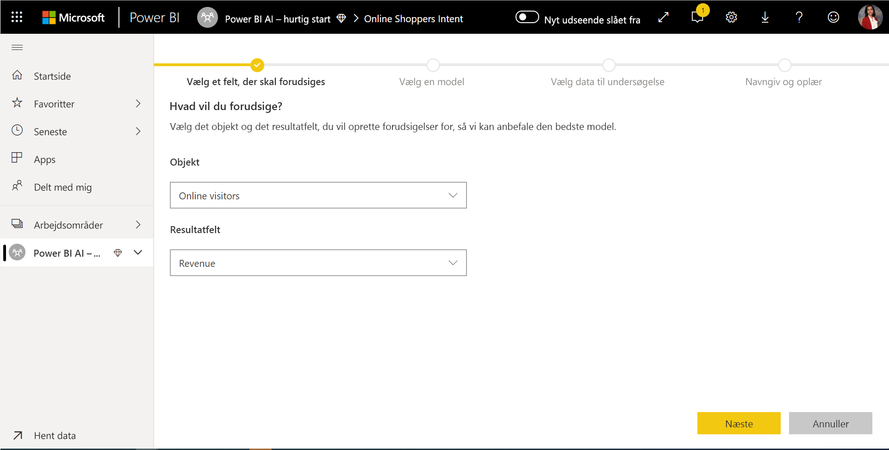

**2. Vælg en modeltype**

Når du angiver resultatfeltet, analyserer AutoML mærkatdataene for at anbefale den mest sandsynlige ML-modeltype, som kan oplæres. Du kan vælge en anden modeltype som vist nedenfor ved at klikke på "Vælg en anden model".

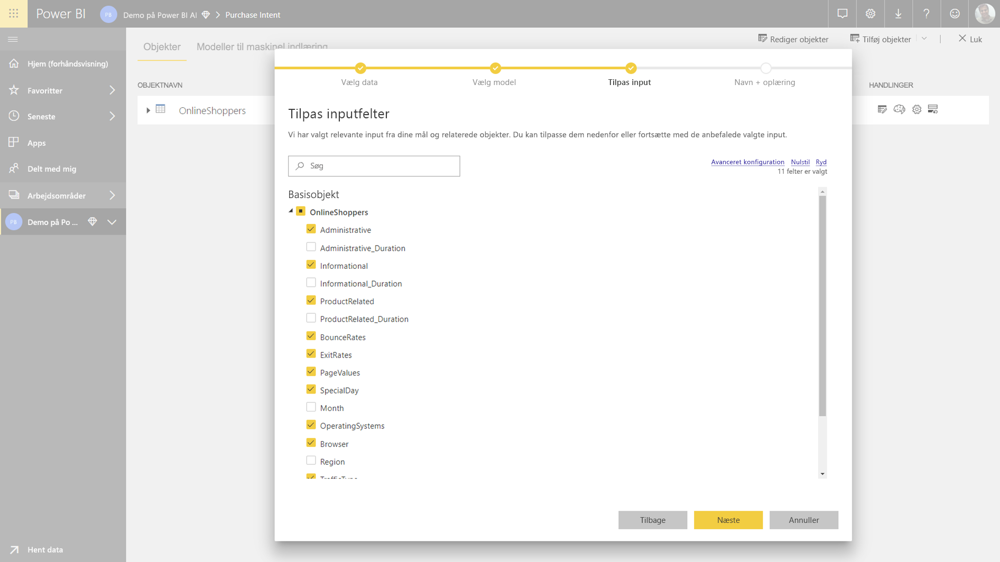

> [!NOTE]
> Visse modeltyper understøttes muligvis ikke for de valgte data og vil derfor være deaktiveret. I ovenstående eksempel er regression deaktiveret, da en tekstkolonne er valgt som resultatfeltet.

**3. Vælg de input, som modellen skal bruge som forudsigende signaler**

AutoML analyserer en stikprøve af den valgte enhed for at komme med forslag til input, der kan bruges til at oplære ML-modellen. Der er forklaringer ved siden af felter, som ikke er markeret. Det anbefales ikke, at et bestemt felt indeholder for mange forskellige værdier eller kun én værdi, eller lav eller høj korrelation med outputfeltet.

Input, der er afhængige af resultatfeltet (eller mærkatfeltet), bør ikke bruges til at oplære ML-modellen, da de påvirker modellens ydeevne. Sådanne felter er markeret med "mistænkelig høj korrelation med outputfelt". Indsættelse af disse felter i oplæringsdataene medfører udslip af mærkater, hvor modellen yder godt i forhold til validerings- eller testdataene, men ikke kan matche denne ydeevne, når den bruges i produktion til angivelse af score. Udslip af mærkater kan være en reel bekymring i AutoML-modeller, når modellens ydeevne er for god til at være sand.

Denne anbefaling til funktioner er baseret på en stikprøve af data, så du bør gennemgå de anvendte input. Du har mulighed for at ændre valgene, så de kun omfatter de felter, du ønsker, at modellen skal undersøge. Du kan også vælge alle felter ved at markere afkrydsningsfeltet ud for navnet på enheden.

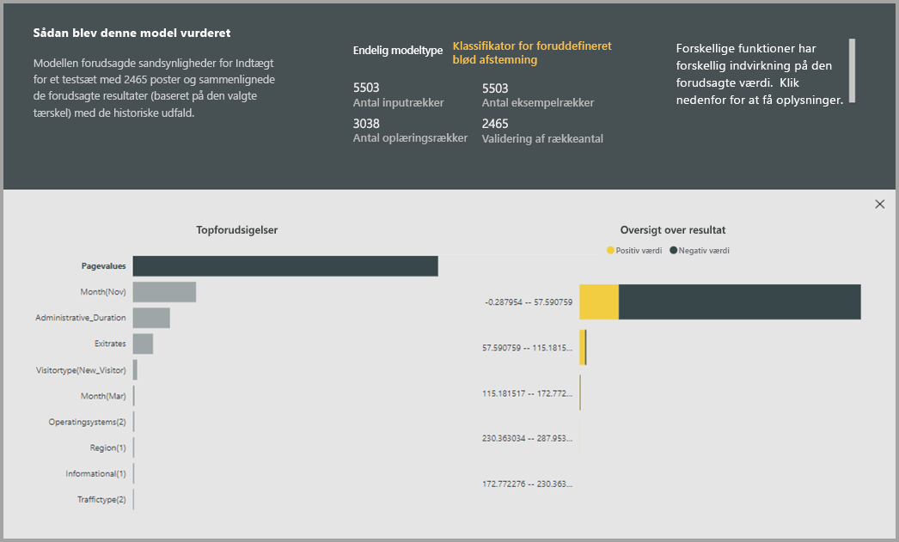

**4. Navngiv din model, og gem konfigurationen**

I det sidste trin kan du navngive modellen og vælge Gem og oplær, hvorved oplæringen af ML-modellen starter. Du kan vælge at reducere oplæringstiden for at få vist resultater hurtigt eller øge den tid, der bruges på oplæringen, så du får den bedste model.

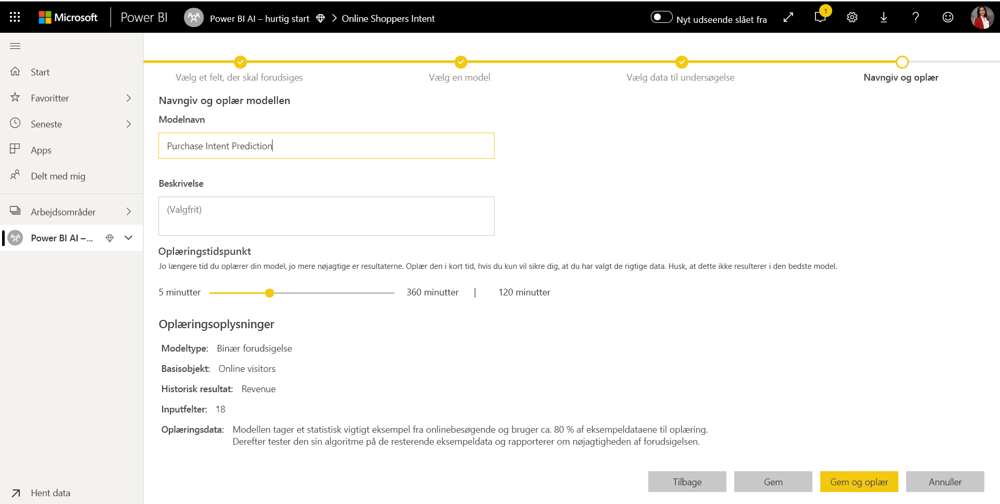

### Oplæring af ML-model

Oplæring af AutoML-modeller er en del af dataflowopdateringen. AutoML klargør først dine data til oplæring.
AutoML opdeler de angivne historiske data i datasæt til oplæring og test. Testdatasættet er et testsæt, der bruges til at validere modellens ydeevne efter oplæringen. Disse vises som enheder til **oplæring og test** i dataflowet. AutoML bruger krydsvalidering til modelvalideringen.

Derefter analyseres hvert inputfelt, og der foretages en sammenligning, hvor manglende værdier erstattes. AutoML benytter et par forskellige metoder til at foretage udledninger. I forbindelse med inputattributter, der behandles som numeriske funktioner, bruges middelværdien i kolonneværdierne til udledning. I forbindelse med inputattributter, der behandles som kategoriske funktioner, bruger AutoML tilstanden for kolonneværdierne til udledning. Middelværdien og tilstanden for værdier, der bruges til udledning, beregnes af AutoML Framework på baggrund af det underdatasæt til oplæring, der er udtaget til stikprøve.

Derefter anvendes stikprøvetagning og normalisering for dataene, som nødvendigt. I forbindelse med klassificeringsmodeller kører AutoML inputdataene gennem lagdelt stikprøvetagning og balancerer klasserne for at sikre, at rækkeantallet er ens for alle.

AutoML anvender flere transformationer på hvert valgte inputfelt på baggrund af feltets datatype og dets statistiske egenskaber. AutoML bruger disse transformationer til at udtrække funktioner, som kan bruges til oplæring af din ML-model.

Oplæringsprocessen for AutoML-modeller består af op til 50 gentagelser med forskellige modelalgoritmer og indstillinger for hyperparametre for at finde modellen med den bedste ydeevne. Oplæringen kan slutte tidligt med færre gentagelser, hvis AutoML bemærker, at der ikke er nogen forbedring af ydeevnen. Ydeevnen for hver af disse modeller vurderes ved hjælp af validering med testdatasættet. I løbet af dette oplæringstrin opretter AutoML flere pipelines til oplæring og validering af disse gentagelser. Processen med at vurdere modellernes ydeevne kan tage alt lige fra adskillige minutter til et par timer op til den oplæringstid, der er konfigureret i guiden, afhængigt af størrelsen af datasættet og de tilgængelige dedikerede kapacitetsressourcer.

I nogle tilfælde kan den endelige model, der genereres, bruge Ensemble Learning, hvor der bruges flere modeller til at levere en bedre forudsigelsesydeevne.

### Forklaringsdelen af AutoML-modellen

Når modellen er blevet oplært, analyserer AutoML relationen mellem inputfunktionerne og modeloutputtet. Størrelsen af ændringen af modeloutputtet for testdatasættet for hver inputfunktion vurderes. Dette kaldes _funktionsprioritet_. Dette sker som en del af opdateringen, når oplæringen er fuldført. Derfor kan opdateringen tage længere tid end den oplæringstid, der er konfigureret i guiden.

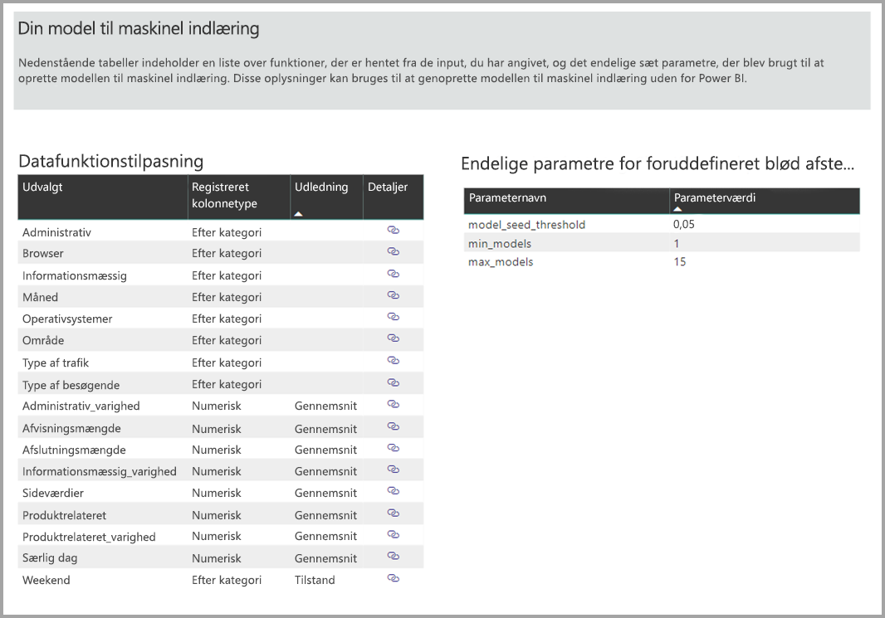

### AutoML-modelrapport

AutoML genererer en Power BI-rapport, der opsummerer modellens ydeevne under validering, sammen med den overordnede funktionsprioritet. Du kan få adgang til denne rapport fra fanen Model til maskinel indlæring efter en vellykket opdatering af dataflowet. Rapporten opsummerer resultaterne i forhold til anvendelse af ML-modellen på testdataene og sammenligner forudsigelserne med de kendte resultatværdier.

Du kan gennemse modelrapporten for at forstå dens ydeevne. Du kan også validere, at nøglefaktorerne for modellen passer til den forretningsmæssige indsigt vedrørende de kendte resultater.

De diagrammer og målinger, der bruges til at beskrive modellens ydeevne i rapporten, afhænger af modeltypen. Disse diagrammer og målinger over ydeevne er beskrevet i følgende afsnit.

Yderligere sider i rapporten kan beskrive statistiske målinger om modellen fra et datavidenskabeligt perspektiv. Rapporten med **binære forudsigelser** indeholder f.eks. et resultatdiagram og ROC-kurven for modellen.

Rapporterne omfatter også siden **Oplæringsoplysninger**, der indeholder en beskrivelse af, hvordan modellen blev oplært, og et diagram, der beskriver modellens ydeevne for hver af de enkelte kørte gentagelser.

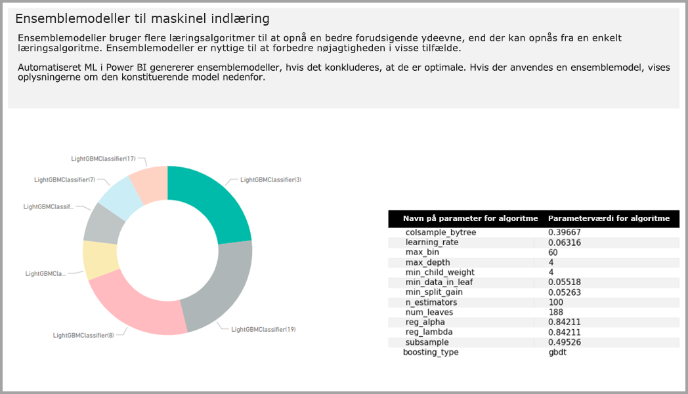

I et andet afsnit på denne side beskrives den registrerede type af inputfelt og den udledningsmetode, der bruges til at udfylde manglende værdier. Det indeholder også de parametre, der bruges af den endelige model.

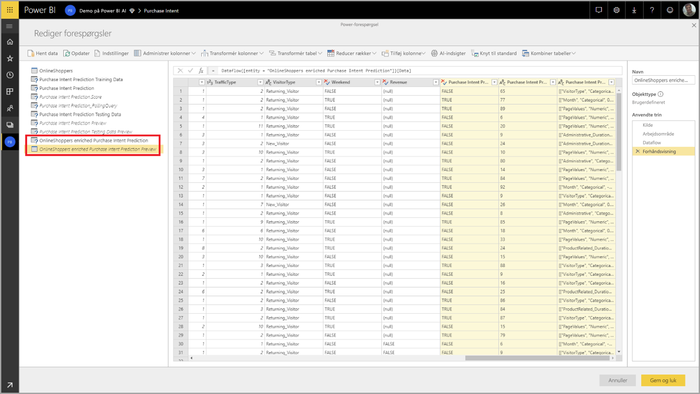

Hvis den skabte model bruger ensembleoplæring, indeholder siden **Oplæringsoplysninger** også et diagram, der beskriver vægtningen af hver komponentmodel i ensemblet samt de tilhørende parametre.

## Anvendelse af AutoML-modellen

Hvis du er tilfreds med ydeevnen i den ML-model, der er blevet oprettet, kan du anvende den på nye eller opdaterede data, når dit dataflow opdateres. Du kan gøre dette fra modelrapporten ved at vælge knappen **Anvend** i øverste højre hjørne eller knappen Anvend ML-model under Handlinger på fanen Model til maskinel indlæring.

Hvis du vil anvende ML-modellen, skal du angive navnet på den enhed, som modellen skal anvendes for, og et præfiks for de kolonner, der føjes til denne enhed for modeloutputtet. Standardpræfikset for kolonnenavnene er modelnavnet. Funktionen _Anvend_ omfatter muligvis yderligere parametre, der er specifikke for modeltypen.

Når du anvender ML-modellen, oprettes der to nye dataflowenheder, som indeholder forudsigelser og individuelle forklaringer for hver række, som den angiver scorer for, i outputenheden. Hvis du f.eks. anvender modellen _PurchaseIntent_ for enheden _OnlineShoppers_, genererer outputtet enhederne **OnlineShoppers enriched PurchaseIntent** og **OnlineShoppers enriched PurchaseIntent explanations**. For hver række i den forbedrede enhed er **forklaringerne** opdelt i flere rækker i de forbedrede forklaringer baseret på inputfunktionen. **ExplanationIndex** hjælper med at knytte rækkerne fra enheden med forbedrede forklaringer til rækken i den forbedrede enhed.

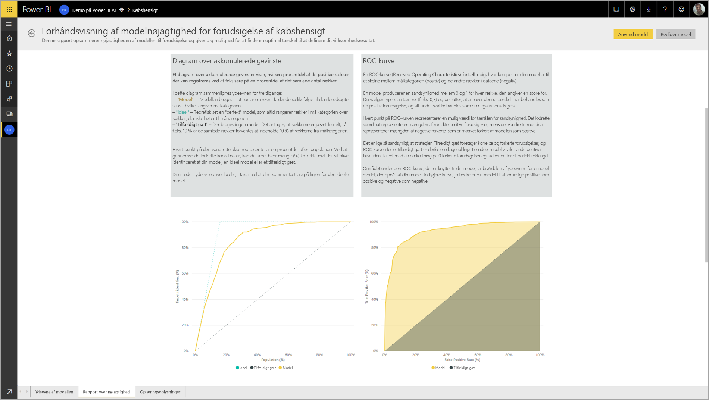

Når du har anvendt modellen, holder AutoML altid dine forudsigelser ajour, når dataflowet opdateres.

Hvis du vil bruge indsigt og forudsigelser fra ML-modellen i en Power BI-rapport, kan du oprette forbindelse til outputenheden fra Power BI Desktop ved hjælp connectoren **dataflows**.

## Binære forudsigelsesmodeller

Binære forudsigelsesmodeller, der mere formelt er kendt som **binære klassifikationsmodeller**, bruges til at klassificere et datasæt i to grupper. De bruges til at forudsige hændelser, der kan have et binært resultat. For eksempel om en salgsmulighed vil blive konverteret, om en kunde falder fra, om en faktura betales til tiden, om en transaktion er falsk osv.

Outputtet af den binære forudsigelsesmode er en sandsynlighedsscore, som identificerer sandsynligheden for, at det ønskede resultat opnås.

### Oplæring af en binær forudsigelsesmodel

Forudsætninger:

- Der kræves mindst 20 rækker historiske data for hver klasse af resultater

Oprettelsesprocessen for en binær forudsigelsesmodel følger de samme trin som andre AutoML-modeller, der er beskrevet i afsnittet **Konfiguration af ML-modelinput** ovenfor. Den eneste forskel er i trinnet "Vælg en model", hvor du kan vælge værdien for det ønskede resultat, som du er mest interesseret i. Du kan også angive brugervenlige mærkater for de resultater, der skal bruges i den rapport, der genereres automatisk, og som opsummerer resultaterne af modelvalideringen.

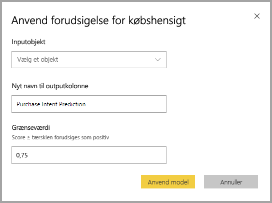

### Rapport over binær forudsigelsesmodel

Den binære forudsigelsesmodel frembringer som et resultat en sandsynlighed for, at en post vil opnå det ønskede resultat. Rapporten indeholder et udsnit for tærsklen for sandsynlighed, der påvirker, hvordan scorerne over og under tærsklen for sandsynlighed fortolkes.

I rapporten beskrives modellens ydeevnen i forhold til _ægte positive, falske positive, ægte negative og falske negative_. Ægte positive og ægte negative er korrekt forudsagte resultater for de to klasser i resultatdataene. Falske positive er poster, hvor det ønskede resultat blev forudsagt, men hvor det rent faktisk ikke forekom. Omvendt er falske negative poster, hvor det ønskede resultat faktisk forekom, men blev forudsagt til ikke at forekomme.

Målinger, f.eks. præcision og genkaldelse, beskriver effekten af tærsklen for sandsynlighed for de forudsagte resultater. Du kan bruge udsnitsværktøjet for tærsklen for sandsynlighed til at vælge en tærskel, der opnår et balanceret kompromis mellem præcision og genkaldelse.

Rapporten indeholder også et værktøj til cost-benefit-analyse, der hjælper med at identificere en delmængde af befolkningen, som man bør være målrettet mod for at få det højeste overskud. Formålet med en cost-benefit-analyse er at maksimere overskuddet ud fra estimerede enhedsomkostninger for målretning og enhedsfordele ved at opnå det ønskede resultat. Du kan bruge dette værktøj til at vælge sandsynlighedstærsklen ud fra maksimumpunktet i grafen for at maksimere overskuddet. Du kan også bruge grafen til at beregne overskuddet eller omkostningerne for dit valg af sandsynlighedstærskel.

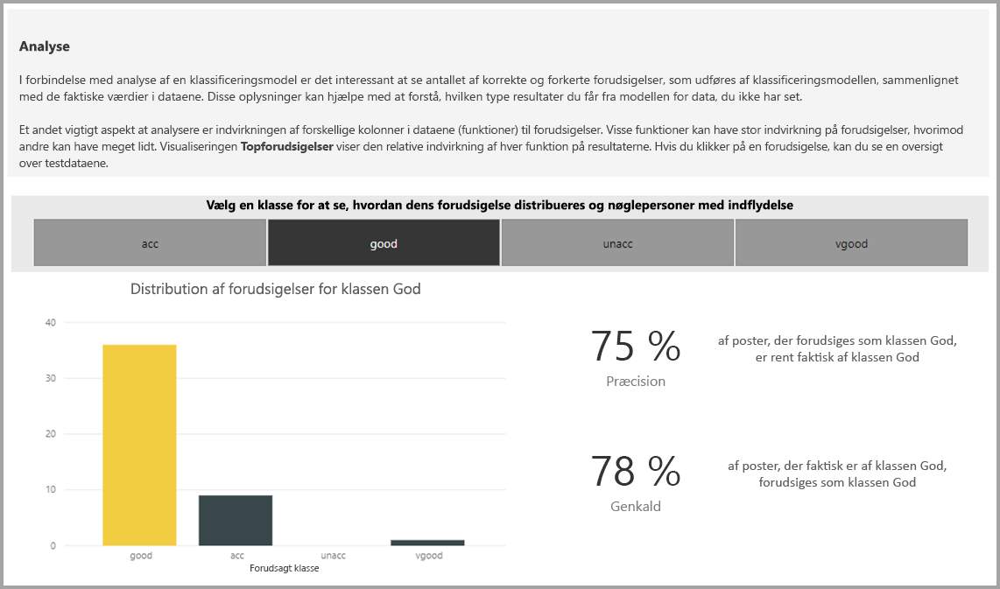

Siden **Nøjagtighedsrapport** i modelrapporten omfatter diagrammet _Akkumulerede gevinster_ og ROC-kurven for modellen. Dette er statistiske målinger af modellens ydeevne. Rapporterne indeholder beskrivelser af de viste diagrammer.

### Anvendelse af en binær forudsigelsesmodel

Hvis du vil anvende en binær forudsigelsesmodel, skal du angive data for den enhed, du vil anvende forudsigelserne fra ML-modellen på. Andre parametre omfatter outputkolonnens navnepræfiks og tærsklen for sandsynlighed til klassificering af det forudsagte udfald.

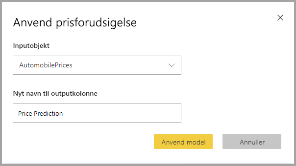

Når der anvendes en binær forudsigelsesmodel, føjes der fire outputkolonner til den forbedrede outputenhed: **Outcome**, **PredictionScore**, **PredictionExplanation** og **ExplanationIndex**. Der angives et præfiks for kolonnenavnene i enheden, når modellen anvendes.

**PredictionScore** er en procentdel, der identificerer sandsynligheden for, at det ønskede resultat opnås.

Kolonnen **Outcome** indeholder mærkaten for det forudsagte resultat. Det forudsiges, at poster, hvor sandsynligheden overskrider tærsklen, sandsynligvis vil opnå det ønskede resultatet, og de er forsynet med mærkaten Sand. Det forudsiges, at poster under tærsklen sandsynligvis ikke vil opnå resultatet, og de er forsynet med mærkaten Falsk.

Kolonnen **PredictionExplanation** indeholder en forklaring af den bestemte indvirkning, som inputfunktionerne havde på **PredictionScore**.

## Klassificeringsmodeller

Klassificeringsmodeller bruges til at klassificere et datasæt i flere grupper eller klasser. De bruges til at forudsige hændelser, der kan have ét af flere mulige resultater. For eksempel om en kunde sandsynligvis har en meget høj, høj, mellem eller lav levetidsværdi, om risikoen for manglende betaling er høj, moderat, lav eller meget lav. osv.

Outputtet af en klassificeringsmodel er en sandsynlighedsscore, der identificerer sandsynligheden for, at en post opfylder kriterierne for en bestemt klasse.

### Oplæring af en klassificeringsmodel

Den inputenhed, der indeholder dine oplæringsdata for en klassificeringsmodel, skal have et felt med en streng eller et heltal som resultatfelt, der identificerer de tidligere kendte resultater.

Forudsætninger:

- Der kræves mindst 20 rækker historiske data for hver klasse af resultater

Oprettelsesprocessen for en klassificeringsmodel følger de samme trin som andre AutoML-modeller, der er beskrevet i afsnittet **Konfiguration af ML-modelinput** ovenfor.

### Rapport over klassificeringsmodel

Klassificeringsmodelrapporten oprettes ved at anvende ML-modellen på testdata og sammenligne den forudsagte klasse for en post med den faktiske kendte klasse.

Modelrapporten indeholder et diagram, der indeholder en opdeling af de korrekt og forkert klassificerede poster for de enkelte kendte klasser.

En yderligere klassespecifik detailudledning gør det muligt at analysere, hvordan forudsigelserne for en kendt klasse distribueres. Dette viser de andre klasser, hvor poster for den kendte klasse sandsynligvis klassificeres forkert.

Modelforklaringen i rapporten indeholder også de vigtigste forudsigelser for hver klasse.

Klassificeringsmodelrapporten omfatter også siden Oplæringsoplysninger, der minder om siderne for andre modeltyper, som beskrevet i afsnittet **AutoML-modelrapport** tidligere i denne artikel.

### Anvendelse af en klassificeringsmodel

Hvis du vil anvende en klassificerings-ML-model, skal du angive inputdata for enheden og præfikset for outputkolonnens navn.

Når der anvendes en klassificeringsmodel, føjes der fem outputkolonner til den forbedrede outputenhed: **ClassificationScore**, **ClassificationResult**, **ClassificationExplanation**, **ClassProbabilities** og **ExplanationIndex**. Der angives et præfiks for kolonnenavnene i enheden, når modellen anvendes.

Kolonnen **ClassProbabilities** indeholder listen over sandsynlighedsscorer for posten for hver af de mulige klasser.

**ClassificationScore** er en procentdel, der identificerer sandsynligheden for, at en post opfylder kriterierne for en bestemt klasse.

Kolonnen **ClassificationResult** indeholder den mest sandsynlige forudsagte klasse for posten.

Kolonnen **ClassificationExplanation** indeholder en forklaring af den bestemte indvirkning, som inputfunktionerne havde på **ClassificationScore**.

## Regressionsmodeller

Regressionsmodeller bruges til at forudsige en numerisk værdi. For eksempel: den omsætning, der sandsynligvis realiseres fra en salgsaftale; en kundes levetidsværdi; beløbet for en faktura, der sandsynligvis bliver betalt; den dato, hvor en faktura muligvis betales osv.

Outputtet for en regressionsmodel er den forudsagte værdi.

### Oplæring af en regressionsmodel

Den inputenhed, der indeholder dine oplæringsdata for en regressionsmodel, skal have et numerisk felt som resultatfelt, der identificerer de tidligere kendte værdier.

Forudsætninger:

- Der kræves mindst 100 rækker historiske data for en regressionsmodel.

Oprettelsesprocessen for en regressionsmodel følger de samme trin som andre AutoML-modeller, der er beskrevet i afsnittet **Konfiguration af ML-modelinput** ovenfor.

### Regressionsmodelrapport

På samme måde som med andre AutoML-modelrapporter er regressionsrapporten baseret på resultaterne fra anvendelsen af modellen på testdata.

Modelrapporten indeholder et diagram, der sammenligner de forudsagte værdier med de faktiske værdier. I dette diagram angiver afstanden fra diagonalen fejlen i forudsigelsen.

Diagrammet over residualfejl viser fordelingen af procentdelen for gennemsnitlige fejl for forskellige værdier i testdatasættet. Den vandrette akse repræsenterer gennemsnittet af den faktiske værdi for gruppen, hvor størrelsen af boblen viser frekvensen eller antallet af værdier inden for det pågældende område. Den lodrette akse er de gennemsnitlige residualfejl.

Regressionsmodelrapporten omfatter også siden Oplæringsdetaljer, der minder om siderne for andre modeltyper, som beskrevet i afsnittet **AutoML-modelrapport** ovenfor.

### Anvendelse af en regressionsmodel

Hvis du vil anvende en regressions-ML-model, skal du angive inputdata for enheden og præfikset for outputkolonnens navn.

Når der anvendes en regressionsmodel, føjes der tre outputkolonner til den forbedrede outputenhed: **RegressionResult**, **RegressionExplanation** og **ExplanationIndex**. Der angives et præfiks for kolonnenavnene i enheden, når modellen anvendes.

Kolonnen **RegressionResult** indeholder den forudsagte værdi for posten baseret på inputfelterne. Kolonnen **RegressionExplanation** indeholder en forklaring af den bestemte indvirkning, som inputfunktionerne havde på **RegressionResult**.

## Næste trin

Denne artikel indeholder en oversigt over automatiseret maskinel indlæring til dataflows i Power BI-tjenesten. Følgende artikler kan også være nyttige.

- [Selvstudium: Skab en model til maskinel indlæring i Power BI ](service-tutorial-build-machine-learning-model.md)
- [Selvstudium: Brug af Cognitive Services i Power BI](service-tutorial-use-cognitive-services.md)
- [Selvstudium: Aktivér en model af typen Machine Learning Studio (klassisk) i Power BI (prøveversion)](service-tutorial-invoke-machine-learning-model.md)
- [Cognitive Services i Power BI](service-cognitive-services.md)
- [Integration af Azure Machine Learning i Power BI](service-machine-learning-integration.md)

Du kan få flere oplysninger om dataflow i disse artikler:

- [Opret og brug dataflow i Power BI](service-dataflows-create-use.md)
- [Brug af beregnede objekter i Power BI Premium](service-dataflows-computed-entities-premium.md)
- [Brug af dataflow med datakilder i det lokale miljø](service-dataflows-on-premises-gateways.md)
- [Udviklerressourcer til Power BI-dataflow](service-dataflows-developer-resources.md)
- [Integration af dataflow og Azure Data Lake (prøveversion)](service-dataflows-azure-data-lake-integration.md)
