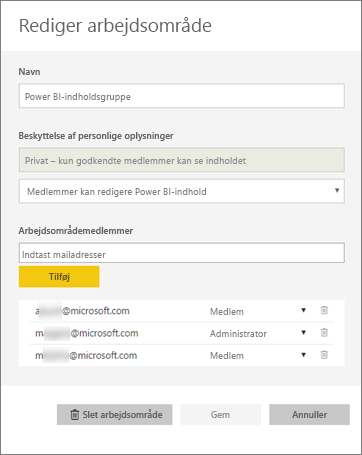
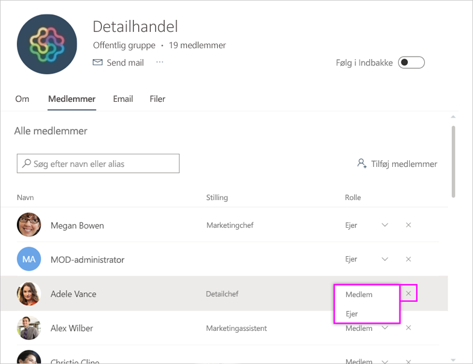
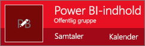
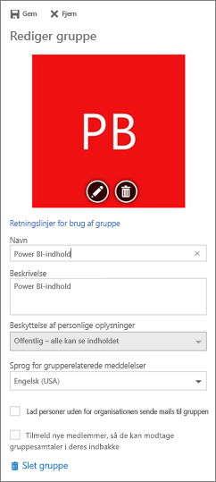

# Administrer dit apparbejdsområde i Power BI og Office 365
Som opretter eller administrator af et [apparbejdsområde i Power BI](service-install-use-apps.md) eller i Office 365 kan du administrere visse aspekter i arbejdsområdet i Power BI. Andre aspekter kan du administrere i Office 365. 

> [!NOTE]
> Prøveversionen af den nye arbejdsområdeoplevelse ændrer relationen mellem Power BI-arbejdsområder og Office 365-grupper. Du opretter ikke automatisk en Office 365-gruppe, hver gang du opretter et af de nye arbejdsområder. Læs om [oprettelse af nye arbejdsområder (prøveversion)](service-create-the-new-workspaces.md)

**I Power BI** kan du:

* Tilføje eller fjerne medlemmer af apparbejdsområdet, herunder udnævnelse af et arbejdsområdemedlem til administrator.
* Redigere navnet på apparbejdsområdet.
* Slette app-arbejdsområdet.

**I Office 365** kan du:

* Tilføje eller fjerne gruppemedlemmer af arbejdsområdet, herunder udnævnelse af et medlem til administrator.
* Redigere gruppenavn, billede, beskrivelse og andre indstillinger.
* Se gruppens mailadresse.
* Slette gruppen.

Du skal bruge en [Power BI Pro](service-free-vs-pro.md)-licens for at være administrator eller medlem af et apparbejdsområde. Dine appbrugere har også brug for en Power BI Pro-licens, medmindre dit apparbejdsområde er i kraft af en Power BI Premium-kapacitet. Læs [Hvad er Power BI Premium?](service-premium.md) for at få flere oplysninger.

## Rediger dit apparbejdsområde i Power BI
1. I Power BI-tjenesten skal du vælge pilen ud for **Arbejdsområder** > vælge ellipsen (**...** ) ud for navnet på dit arbejdsområde > **Rediger arbejdsområde**. 
   
   
   
   > [!NOTE]
   > Du kan kun se **Rediger arbejdsområde**, hvis du er administrator af apparbejdsområdet.
   > 
   > 
2. Her kan du omdøbe, tilføje eller fjerne medlemmer eller slette app-arbejdsområdet. 
   
   
3. Vælg **Gem** eller **Annuller**.

## Rediger egenskaberne for Power BI-apparbejdsområder i Office 365
1. I Power BI-tjenesten skal du vælge pilen ud for **Arbejdsområder** > vælge ellipsen (**...** ) ud for navnet på dit arbejdsområde > **Medlemmer**. 
   
   
   
   Dette åbner gruppevisningen i Outlook for Office 365 af dit apparbejdsområde.
   
   Du skal muligvis logge på din firmakonto.
2. Tryk på ellipsen (**...** ) ud for et medlems navn for at gøre medlemmet til administrator eller for at slette medlemmet fra apparbejdsområdet. 
   
   

## Tilføj et billede, og indstil andre egenskaber for arbejdsområdet i Office 365-gruppen
Når du distribuerer din app fra apparbejdsområdet, bliver det billede, du tilføjer her, billedet for din app. Se afsnittet [Føj et billede til din app](service-create-workspaces.md#add-an-image-to-your-office-365-app-workspace-optional) i artiklen [Opret de nye arbejdsområder](service-create-workspaces.md).

1. Vælg gruppebilledet for at redigere egenskaberne for gruppearbejdsområdet i Outlook for Office 365-visningen af dit apparbejdsområde.
   
   
2. Her kan du redigere navn, beskrivelse og sprog, tilføje et billede og indstille andre egenskaber.
   
   
3. Vælg **Gem** eller **Fjern**.

## Næste trin
* [Hvad er apps i Power BI?](service-install-use-apps.md)
* [Publicer apps med dashboards og rapporter i Power BI](service-create-distribute-apps.md)
* Har du flere spørgsmål? [Prøv at spørge Power BI-community'et](http://community.powerbi.com/)

