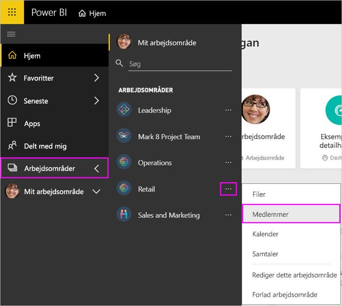

# Administrer dit apparbejdsområde i Power BI og Office 365

Som opretter eller administrator af et [apparbejdsområde i Power BI](service-create-distribute-apps.md) eller i Office 365 kan du administrere visse aspekter i arbejdsområdet i Power BI. Andre aspekter kan du administrere i Office 365.

> [!NOTE]
> Prøveversionen af den nye arbejdsområdeoplevelse ændrer relationen mellem Power BI-arbejdsområder og Office 365-grupper. Du opretter ikke automatisk en Office 365-gruppe, hver gang du opretter et af de nye arbejdsområder. Læs om [oprettelse af nye arbejdsområder](service-create-the-new-workspaces.md).

I **Power BI** kan du:

* Tilføje eller fjerne medlemmer af apparbejdsområdet, herunder udnævnelse af et arbejdsområdemedlem til administrator.
* Redigere navnet på apparbejdsområdet.
* Slette app-arbejdsområdet.

I **Office 365** kan du:

* Tilføje eller fjerne gruppemedlemmer af apparbejdsområdet, herunder udnævnelse af et medlem til ejer.
* Redigere gruppenavn, billede, beskrivelse og andre indstillinger.
* Se gruppens mailadresse.
* Slette gruppen.

Du skal bruge en [Power BI Pro-licens](service-features-license-type.md) for at være administrator eller medlem af et apparbejdsområde. Dine appbrugere har også brug for en Power BI Pro-licens, medmindre dit apparbejdsområde er i kraft af en Power BI Premium-kapacitet. Læs [Hvad er Power BI Premium?](service-premium-what-is.md) for at få flere oplysninger.

## Rediger dit apparbejdsområde i Power BI

1. I Power BI-tjenesten skal du vælge pilen ud for **Arbejdsområder** > vælge ellipsen (...) ud for navnet på dit arbejdsområde > **Rediger dette arbejdsområde**.

   

   > [!NOTE]
   > Du kan kun se **Rediger dette arbejdsområde**, hvis du er administrator af apparbejdsområdet.

1. Her kan du omdøbe arbejdsområdet, tilføje eller fjerne medlemmer eller slette apparbejdsområdet.

   

1. Vælg **Gem** eller **Annuller**.

## Rediger egenskaberne for Power BI-apparbejdsområder i Office 365

Du kan også redigere aspekter af et apparbejdsområde direkte i Outlook til Office 365.

### Rediger medlemmerne af gruppen for apparbejdsområdet

1. I Power BI-tjenesten skal du vælge pilen ud for **Arbejdsområder** > vælge ellipsen (...) ud for navnet på dit arbejdsområde > **Medlemmer**.

   

   Dette åbner gruppevisningen i Outlook for Office 365 af dit apparbejdsområde. Du skal muligvis logge på din firmakonto.

1. Vælg rollen ud for teammedlemmets navn for at udnævne personen til **Medlem** eller **Ejer**. Vælg **X** for at fjerne personen fra gruppen.

   

### Tilføj et billede, og angiv andre egenskaber for arbejdsområdet

Når du distribuerer din app fra apparbejdsområdet, bliver det billede, du tilføjer her, billedet for din app. Se afsnittet [Føj et billede til dit Office 365-apparbejdsområde](service-create-workspaces.md#add-an-image-to-your-office-365-workspace-optional) i artiklen **Opret de nye arbejdsområder**.

1. I visningen Outlook til Office 365 i dit apparbejdsområde skal du gå til fanen **Om** og vælge **Rediger**.

    
1. Du kan redigere navnet, beskrivelsen og sproget for grupperelaterede meddelelser. Du kan også tilføje et billede og angive andre egenskaber her.

   

1. Vælg **Gem** eller **Fjern**.

## Næste trin

* [Publicer en app i Power BI](service-create-distribute-apps.md)

* Har du flere spørgsmål? [Prøv at spørge Power BI-community'et](http://community.powerbi.com/)
