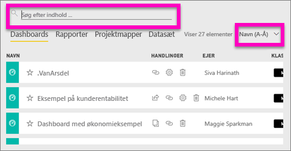
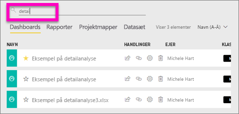
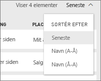
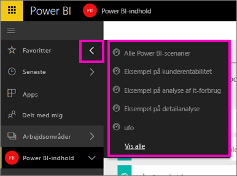

# Navigation: Søg i, find og sortér dit indhold i Power BI-tjenesten
Der er mange forskellige måder at navigere rundt i dit indhold i Power BI-tjenesten på. Indholdet organiseres i fire arbejdsområder efter type: dashboards, rapporter, projektmapper og datasæt.  Indholdet er også sorteret efter forbrug: Favoritter, seneste, apps, delt med mig og udvalgt. Med disse forskellige stier til dit indhold kan du hurtigt finde det, du søger, i Power BI-tjenesten.  

>[!NOTE] 
>Denne artikel gælder for Power BI-tjenesten (app.powerbi.com) og ikke Power BI Desktop.

## Navigation i arbejdsområder

Power BI-tjenesten opdeler indholdet i dit arbejdsområde efter type: dashboards, rapporter, projektmapper og datasæt. Når du vælger et arbejdsområde, får du vist denne opdeling. I dette eksempel har apparbejdsområdet navnet "Sales and marketing app sample" og indeholder to dashboards, seks rapporter, en projektmappe og fem datasæt.

________________________________________

## Søgning og sortering i arbejdsområder
Der er fire indholdsfaner i et arbejdsområde: Dashboards, Rapporter, Projektmapper og Datasæt.  Hver af disse faner indeholder et søgefelt og en sorteringsknap.  Når du starter med Power BI-tjenesten, er det måske ikke en stor hjælp, da du kun har et eller to elementer pr. fane.  Men med tiden kan dine lister med indhold blive lange.  Brug søgning og sortering til at nemt kan finde det, du har brug for.

* Angiv et søgeord for at finde et match på det aktuelle skærmbillede
  
   
* Vælg sorteringsknappen for at få vist indstillinger for den aktuelle side. Indstillingerne bruges til at sortere efter navn eller ejer.
  
   

## Navigation ved hjælp af den venstre navigationslinje
I den venstre navigationsrude klassificeres dit indhold, så det bliver endnu nemmere at finde det ønskede hurtigt.  

Indhold, som du opretter til eget brug, er tilgængeligt i **Mit arbejdsområde**, indhold, du opretter og deler med en gruppe, er tilgængeligt i et **apparbejdsområde**, indhold, som deles med dig, er tilgængeligt i **Delt med mig**, og det indhold, du sidst har set, findes i **Seneste**.

Derudover kan du mærke indhold som [foretrukket](service-dashboard-favorite.md) og [udvalgt](service-dashboard-featured.md). Vælg det dashboard, du forventer at se oftest, og angiv det som dit *foretrukne* dashboard. Hver gang du åbner Power BI-tjenesten, bliver dette dashboard vist først. Har du en række dashboards og apps, som du ofte besøger? Når du angiver dem som favoritter, er de altid tilgængelige i den venstre navigationslinje.

.

## Overvejelser og fejlfinding
* For datasæt er **Sortér efter** ikke tilgængelig efter ejer.

## Næste trin
[Power BI – Grundlæggende begreber](service-basic-concepts.md)

Har du flere spørgsmål? [Prøv at spørge Power BI-community'et](http://community.powerbi.com/)