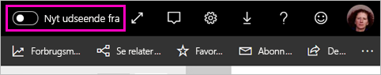
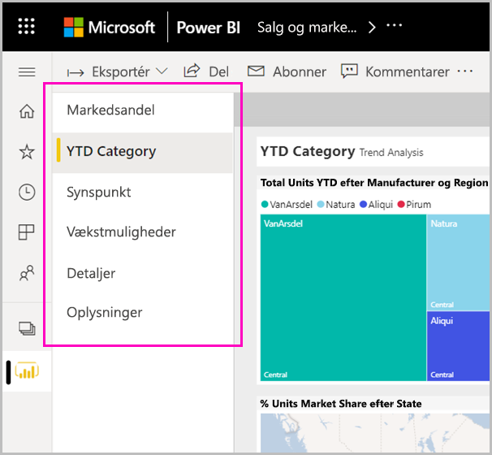

# Gå til Power BI-tjenestens nye udseende

Power BI-tjenesten har fået et nyt udseende. Vi har gjort det nemmere for dig at få vist rapporter. Det nye udseende er en moderne oplevelse, der er mere enkel, og som bygger på dit kendskab til andre Microsoft-produkter. På tværs af Power BI-tjenesten har vi sat rapportindhold i fokus ved at skifte til et lysere farvetema og opdatere ikoner. Her er en oversigt over, hvad der er ændret i det nye udseende. Du kan finde flere oplysninger i de nummererede afsnit:

## Hurtig rundvisning af ændringerne

Denne animation viser ændringerne af den måde, rapporterne ser ud på, i praksis.

## 1. Tilmeld dig det nye udseende

Alle brugere af Power BI-tjenesten kan vælge det nye udseende. Du skal blot skubbe **Nyt udseende fra** til **Nyt udseende til**.

Hvis du har brug for at gå tilbage til det gamle udseende, skal du vælge ellipsemenuen i øverste højre hjørne.

## 2. Vis rapportdetaljer 

Du kan hurtigt få vist f.eks. seneste opdateringsdato og kontaktoplysninger direkte i det øverste banner.  Åbn menuen for at få vist flere detaljer om rapporten. Du kan også sende en mail til rapportejeren.

## 3. Lodret liste over sider 
Rapportsidenavne vises nu på en liste i en lodret rude. De er fremtrædende, svære at overse og ligner navigation i Word og PowerPoint. Du kan øge eller mindske resten af rapportområdet ved at ændre størrelsen på den lodrette rude.

## 4. Forenklet handlingslinje 

Den opdaterede handlingslinje langs toppen indeholder de mest relevante kommandoer, foran og centreret, for forbrugerne af rapporten. Det er lettere at eksportere, abonnere, samarbejde med andre og dykke dybere ned gennem filtre og bogmærker.

## 5. Hvor er rapportkommandoerne?

Vi har ikke fjernet nogen funktioner fra det gamle udseende. Du kan finde de ekstra kommandoer, f. eks. redigering, lagring af en kopi osv. ved at udvide ellipsen (menuen ...) på handlingslinjen. Du kan også få adgang til forbrugsdata fra indholdslisten.

### Hvor er handlingerne i menuen Filer?

Søger du handlingerne i menuen **Filer**? De handlinger, der plejede at være i menuen **Filer**, er nu også i ellipsemenuen (...). 

## 6. Ny filteroplevelse

De seneste opdateringer, f. eks. visning af anvendte filtre og den nye rude med filtre, er som standard tilgængelige i det nye udseende. Selvom rapportdesignerne ikke har opgraderet til den nye filtervisning, får du vist den nye filterrude.

## Dashboardets nye udseende 

Dashboards har også en forenklet handlingslinje på samme måde som rapporter og apps, så du får en ensartet oplevelse, samtidig med at de funktionsmæssige forskelle bevares. Her er en gennemgang af handlinger i et dashboard.
 

## Ingen ændringer af redigeringstilstand 

Vi har bibeholdt den samme oprettelsesoplevelse som den i Desktop. Ændringerne i det nye udseende gælder kun læsevisningen.

## Næste trin

[Power BI for forbrugere](consumer/end-user-consumer.md)
