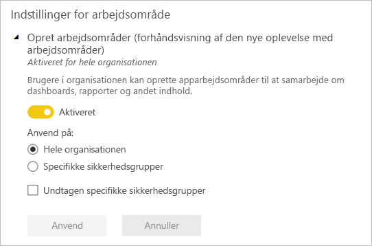

# Organiser arbejde i nye arbejdsområder i Power BI

 *Arbejdsområder* er steder, hvor du kan samarbejde med kolleger om at oprette samlinger af dashboards, rapporter og sideinddelte rapporter. Den nye arbejdsområdeoplevelse hjælper dig med bedre at administrere adgang til indhold. I denne artikel beskrives de nye arbejdsområder, og hvordan de adskiller sig fra de klassiske arbejdsområder.  På samme måde som med klassiske arbejdsområder bruges arbejdsområder stadig til at oprette og distribuere apps. Læs om, hvordan du [opretter en ny arbejdsområdeoplevelse](service-create-the-new-workspaces.md).

Den nye arbejdsområdeoplevelse er nu generelt tilgængelig og er nu standardarbejdsområdet. Du kan stadig fortsætte med at oprette og bruge [klassiske arbejdsområder](service-create-workspaces.md), der er baseret på Office 365 Grupper. 

> [!NOTE]
> Hvis du vil gennemtvinge sikkerhed på rækkeniveau (RLS) for brugere, der gennemser indhold i et arbejdsområde, kan du bruge rollen Fremviser. Hvis du vil gennemtvinge RLS uden at give adgang til arbejdsområdet, kan du publicere en Power BI-app til disse brugere eller bruge deling til at distribuere indhold.

Med de nye arbejdsområder kan du:

- Tildele arbejdsområderoller til brugergrupper: sikkerhedsgrupper, distributionslister, Office 365-grupper og enkeltpersoner.
- Oprette et arbejdsområde i Power BI uden at oprette en Office 365-gruppe.
- Bruge mere detaljerede arbejdsområderoller til administration af mere fleksible tilladelser i et arbejdsområde.
- Power BI-administratoren kan styre, hvem der kan oprette arbejdsområder i Power BI.

Når du opretter et af de nye arbejdsområder, opretter du ikke en underliggende tilknyttet Office 365-gruppe. Al administration af arbejdsområder sker i Power BI, ikke i Office 365. I den nye arbejdsområdeoplevelse kan du nu tilføje en Office 365-gruppe på adgangslisten til arbejdsområdet, hvis du fortsat vil administrere brugeradgang til indhold via Office 365-grupper.

## Administration af arbejdsområder i den nye arbejdsområdeoplevelse
Da administration af arbejdsområder i den nye arbejdsområdeoplevelse nu foregår i Power BI, beslutter Power BI-administratorer, hvem i en organisation der kan oprette arbejdsområder. De kan også administrere og genoprette arbejdsområder ved hjælp af enten Power BI Administration eller PowerShell-cmdletter. I forbindelse med klassiske arbejdsområder, der er baseret på Office 365 Grupper, finder administrationen fortsat sted i Office 365-administrationsportalen og Azure Active Directory.

I **Indstillinger for arbejdsområde** i administrationsportalen kan administratorer bruge indstillingen Opret arbejdsområder (ny arbejdsområdeoplevelse) til at gøre det muligt for alle eller ingen i en organisation at oprette arbejdsområder i den nye arbejdsområdeoplevelse. De kan også begrænse oprettelse til medlemmer af bestemte sikkerhedsgrupper.

> [!NOTE]
> Indstillingen Opret arbejdsområder (i den nye arbejdsområdeoplevelse) er som standard angivet til kun at give de brugere, der kan oprette Office 365-grupper, tilladelse til at oprette nye arbejdsområder i Power BI. Sørg for at angive en værdi i Power BI-administrationsportalen for at sikre, at relevante brugere kan oprette arbejdsområder i den nye arbejdsområdeoplevelse.

[Listen med arbejdsområder er tilgængelig](service-admin-portal.md#workspaces) i Power BI-administrationsportalen. 

## Nye arbejdsområder side om side med klassiske arbejdsområder

Nye opgraderede arbejdsområder og eksisterende klassiske arbejdsområder eksisterer side om side, og du kan oprette begge dele. Den nye arbejdsområdeoplevelse er standardtypen for arbejdsområder. Power BI viser fortsat alle de Office 365-grupper, som brugeren er medlem af i Power BI, for at undgå at ændre eksisterende arbejdsprocesser. Du kan få mere at vide om, hvordan du opretter et nyt arbejdsområde, i [Opret nye arbejdsområder](service-create-the-new-workspaces.md). Du kan få mere at vide om, hvordan du opretter et klassisk arbejdsområde, i [Opret klassiske arbejdsområder](service-create-workspaces.md).

## Roller i de nye arbejdsområder

Hvis du vil give adgang til et nyt arbejdsområde, skal du føje brugergrupper eller enkeltpersoner til en af arbejdsområderollerne: fremvisere, medlemmer, bidragydere eller administratorer. Alle i en brugergruppe får den rolle, du har defineret. Hvis en person er i flere brugergrupper, får personen det højeste tilladelsesniveau, der er angivet af den rolle, personen er blevet tildelt.

Du kan bruge roller til at administrere, hvem der kan gøre hvad i et arbejdsområde, så teams kan samarbejde. Nye arbejdsområder gør det muligt at tildele roller til enkeltpersoner og til brugergrupper: sikkerhedsgrupper, Office 365-grupper og distributionslister. 

Når du tildeler roller til en brugergruppe, har enkeltpersoner i gruppen adgang til indhold. Hvis du indlejrer brugergrupper, har alle brugere i grupperne tilladelse.

Her er egenskaberne for de fire roller: administratorer, medlemmer, bidragydere og fremvisere. Alle disse funktioner, undtagen den sidste, kræver en Power BI Pro-licens.

|Egenskab   | Administrator  | Medlem  | Bidragsyder  | Fremviser |
|---|---|---|---|---|
| Opdatere og slette arbejdsområdet.  | X  |   |   |   | 
| Tilføje/fjerne personer, herunder andre administratorer.  | X  |   |   |   |
| Tilføje medlemmer eller andre med lavere tilladelser.  |  X | X  |   |   |
| Publicer og opdater en app. |  X | X  |   |   |
| Del et element, eller del en app. |  X | X  |   |   |
| Give andre tilladelse til at dele elementer igen. |  X | X  |   |   |
| Oprette, redigere og slette indhold i arbejdsområdet.  |  X | X  | X  |   |
| Publicere rapporter til arbejdsområdet, slette indhold.  |  X | X  | X  |   |
| Oprette en rapport i et andet arbejdsområde, der er baseret på et datasæt i dette arbejdsområde. |  X | X  | X  |   |
| Kopiere en rapport. | X | X | X |  |
| Få vist og interager med et element. |  X | X  | X  | X  |

> [!NOTE]
>Hvis du vil kopiere en rapport og oprette en rapport i et andet arbejdsområde, der er baseret på et datasæt i dette arbejdsområde, skal følgende kriterier være opfyldt:
>- Du skal bruge en licens til Power BI Pro. Du kan finde flere oplysninger i det næste afsnit om [Licensering](#licensing).
>- Du skal have Build-tilladelse til datasættet. Personer med rolle som administrator, medlem og bidragyder har Build-tilladelse til datasæt for dette arbejdsområde gennem deres rolle i arbejdsområdet.
 
## Licensering
Alle de brugere, du føjer til et arbejdsområde i den delte kapacitet, skal have en Power BI Pro-licens. I arbejdsområdet kan disse brugere samarbejde om dashboards og rapporter, som du vil publicere til en større målgruppe eller måske til hele organisationen. 

Hvis du vil distribuere indhold til andre i din organisation, kan du tildele Power BI Pro-licenser til disse brugere eller anbringe arbejdsområdet i en Power BI Premium-kapacitet.

Når arbejdsområdet er i en Power BI Premium-kapacitet, kan brugere med rollen som Fremviser få adgang til arbejdsområdet, også selvom de ikke har en Power BI Pro-licens. Men hvis du tildeler disse brugere en rolle på et højere niveau som f.eks. administrator, medlem eller bidragyder, vil de blive bedt om at starte en Pro-prøveversion, når de forsøger at få adgang til arbejdsområdet. Hvis du vil udnytte Fremviser-funktionerne for brugere uden en Pro-licens, skal du sikre, at brugerne med rollen Fremviser ikke har andre roller i arbejdsområdet enten individuelt eller via en brugergruppe. 

> [!NOTE]
> Publicering af rapporter til den nye arbejdsområdeoplevelse har strengere håndhævelse af eksisterende licensregler. Brugere, der forsøger at udgive fra Power BI Desktop eller andre klientværktøjer uden en Pro-licens, får vist fejlmeddelelsen "Kun brugere med Power BI Pro-licenser kan publicere til dette arbejdsområde".

## Sådan adskiller de nye arbejdsområder sig

Vi har givet nogle af funktionerne i de nye arbejdsområder et nyt design. Her er de ændringer, du kan forvente bliver permanente. 

* Oprettelse af disse arbejdsområder opretter ikke Office 365-grupper på samme måde som klassiske arbejdsområder. Du kan dog benytte en Office 365-gruppe til at give brugere adgang til dit arbejdsområde ved at tildele området en rolle. 
* I de klassiske arbejdsområder kan du kun føje enkeltpersoner til medlems- og administratorlisterne. I de nye arbejdsområder kan du føje flere Active Directory-sikkerhedsgrupper, distributionslister eller Office 365-grupper til disse lister for at lette administrationen af brugere. 
- Du kan oprette en organisationsindholdspakke ud fra et klassisk arbejdsområde. Du kan ikke oprette en ud fra de nye arbejdsområder.
- Du kan forbruge en organisationsindholdspakke ud fra et klassisk arbejdsområde. Du kan ikke forbruge en fra nye arbejdsområder.

## Liste over arbejdsområdekontakter
Den nye **kontaktlistefunktion** gør det muligt at angive, hvilke brugere der modtager en meddelelse om de problemer, der opstår i arbejdsområdet. Som standard får alle brugere eller grupper, der er angivet som arbejdsområdeadministrator besked, men du kan tilpasse listen. Brugere eller grupper, der er angivet på listen over kontakter, vises i brugergrænsefladen for at hjælpe brugerne med at få hjælp i forbindelse med arbejdsområdet. 

Læs mere om [angivelse af listen over kontakter i arbejdsområdet](service-create-the-new-workspaces.md#workspace-contact-list).

## Arbejdsområde for OneDrive
Funktionen Arbejdsområde for OneDrive giver dig mulighed for at konfigurere en Office 365-gruppe, hvis SharePoint-dokumentbiblioteks fillagring er tilgængelig for arbejdsområdebrugere. Gruppen skal være oprettet uden for Power BI. 

Power BI synkroniserer ikke tilladelser for brugere eller grupper, der er konfigureret til at have adgang til arbejdsområdet med medlemskabet af Office 365-gruppen. Den bedste fremgangsmåde er at administrere arbejdsområdeadgang via den samme Office 365-gruppe, hvis fillagring du konfigurerer i denne indstilling. 

Læs mere om, hvordan du [angiver og får adgang til Arbejdsområde for OneDrive](service-create-the-new-workspaces.md#workspace-onedrive).  
   
## Overvågning
Følgende aktiviteter overvåges af Power BI for arbejdsområder i den nye arbejdsområdeoplevelse.

| Brugervenligt navn |   Handlingsnavn |
|---|---|
| Power BI-mappe er oprettet | CreateFolder |
| Power BI-mappe er slettet | DeleteFolder |
| Power BI-mappe er opdateret | UpdateFolder |
| Adgang til Power BI-mappe er opdateret| UpdateFolderAccess |

Læs mere om [overvågning i Power BI](service-admin-auditing.md#activities-audited-by-power-bi).

## Begrænsninger og overvejelser

Begrænsninger, du skal være opmærksom på:

- Arbejdsområder kan indeholde op til 1.000 datasæt eller 1.000 rapporter pr. datasæt. 
- En person med en Power BI Pro-licens kan være medlem af maks. 1.000 arbejdsområder.
- Power BI Publisher til Excel understøttes ikke.

## Funktioner for arbejdsområder, som fungerer anderledes

Nogle funktioner fungerer anderledes i forhold til aktuelle arbejdsområder i de nye arbejdsområder. Disse forskelle er tilsigtede baseret på feedback, vi har modtaget fra kunder, og de giver en mere fleksibel tilgang til samarbejdet via arbejdsområder:

- Håndhævelse af licenser: Publicering af rapporter til den nye arbejdsområdeoplevelse gennemtvinger eksisterende licensregler, der kræver en Power BI Pro-licens til de brugere, der samarbejder i arbejdsområder eller deler indhold med andre i Power BI-tjenesten. Brugere uden en Pro-licens får vist fejlmeddelelsen "Kun brugere med Power BI Pro-licenser kan publicere til dette arbejdsområde".
- Medlemmer kan eller kan ikke dele igen: erstattet af rollen som bidragyder
- Skrivebeskyttede arbejdsområder: I stedet for at tildele brugere skrivebeskyttet adgang til et arbejdsområde skal du tildele brugere Fremviser-rollen, hvilket gør det muligt for lignende skrivebeskyttet adgang til indholdet i et arbejdsområde.
- Brugere med en Pro-licens kan få adgang til arbejdsområdet, hvis det er i en Power BI Premium-kapacitet, også selvom brugerne kun har Fremviser-rollen.
- Hvis du vil tillade brugere med rollen som Fremviser at eksportere data, skal du sikre, at de har tilladelse til at oprette for datasættene i arbejdsområdet. Læs mere om [tilladelsen Opret for datasæt](service-datasets-build-permissions.md).
- Knappen **Forlad arbejdsområde** findes ikke.

## Ofte stillede spørgsmål

**Påvirkes links til eksisterende indhold af den offentligt tilgængelige version af den nye arbejdsområdeoplevelse?**

Nej. Links til eksisterende elementer i de klassiske arbejdsområder påvirkes ikke af den nye arbejdsområdeoplevelse. Den generelle tilgængelighed af den nye arbejdsområdeoplevelse ændrer det standardarbejdsområde, som du opretter, men ikke eksisterende arbejdsområder. 

**Opgraderes eksisterende arbejdsområder til den nye arbejdsområdeoplevelse i forbindelse med, at den bliver generelt tilgængelig?**

Nej. Den nye generelt tilgængelige arbejdsområdeoplevelse ændrer kun standardtypen for arbejdsområder til den nye arbejdsområdeoplevelse. Eksisterende klassiske arbejdsområder, der er baseret på Office 365 Grupper, forbliver uændrede.

**Oprettes arbejdsområder stadig automatisk for Office 365 Grupper**

Ja. Da vi understøtter begge typer arbejdsområder samtidig, fortsætter vi med at opstille alle de Office 365-grupper, som brugeren har adgang til, på listen over arbejdsområder.

## Næste trin
* [Opret nye arbejdsområder i Power BI](service-create-the-new-workspaces.md)
* [Opret klassiske arbejdsområder](service-create-workspaces.md)
* [Installér og brug apps i Power BI](service-create-distribute-apps.md)
* Har du spørgsmål? [Prøv at spørge Power BI-community'et](http://community.powerbi.com/)
