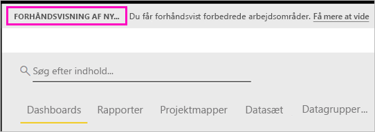

# Organiser arbejde i nye arbejdsområder (prøveversion) i Power BI

Arbejdsområder er steder, hvor du kan samarbejde med kolleger om at oprette og tilpasse samlinger af dashboards og rapporter. Derefter kan du gruppere disse samlinger i *apps*, som du kan distribuere til hele organisationen eller til bestemte personer eller grupper. Power BI introducerer en ny arbejdsområdeoplevelse som en prøveversion. 

Med prøveversionen af de nye arbejdsområder kan du nu:

- Tildele arbejdsområderoller til brugergrupper: sikkerhedsgrupper, distributionslister, Office 365-grupper og enkeltpersoner.
- Oprette et arbejdsområde i Power BI uden at oprette en Office 365-gruppe.
- Bruge mere detaljerede arbejdsområderoller til administration af mere fleksible tilladelser i et arbejdsområde.

Læs om, hvordan du [opretter et af de nye arbejdsområder](service-create-the-new-workspaces.md).
 
Når du opretter et af de nye arbejdsområder, opretter du ikke en underliggende tilknyttet Office 365-gruppe. Al administration af arbejdsområder sker i Power BI, ikke i Office 365. Du kan stadig føje en Office 365-gruppe til arbejdsområdet, hvis du fortsat vil administrere brugeradgang til indhold via Office 365-grupper. Men du kan derudover bruge sikkerhedsgrupper, distributionslister og tilføje enkeltpersoner direkte i Power BI, hvilket giver dig større fleksibilitet, når du administrerer adgang til arbejdsområder. Da administration af arbejdsområder nu foregår i Power BI, beslutter Power BI-administratorer, hvem i en organisation kan oprette arbejdsområder. I **Indstillinger for arbejdsområde** i administrationsportalen kan administratorer give alle eller ingen i en organisation tilladelse til at oprette arbejdsområder. De kan også begrænse oprettelse til medlemmer af bestemte sikkerhedsgrupper.

Læs mere om [Power BI-administrationsportalen](service-admin-portal.md).

## Udrul nye arbejdsområder

I prøveperioden kan gamle og nye arbejdsområder fungere side om side, og du kan enten oprette den ene eller den anden. Når prøveperioden for nye arbejdsområder er slut, og de er offentligt tilgængelige, kan du stadig have gamle arbejdsområder i et stykke tid. Du kan ikke oprette dem, og du skal forberede en overførsel af dine arbejdsområder til infrastrukturen for de nye arbejdsområder. Men bare rolig, du har flere måneder til at gennemføre overførslen.

## Roller i de nye arbejdsområder

Du kan føje brugergrupper eller enkeltpersoner til de nye arbejdsområder som medlemmer, bidragydere eller administratorer. Alle i en brugergruppe får den rolle, du har defineret. Hvis en person er i flere brugergrupper, får personen det højeste tilladelsesniveau, der er angivet af rollen.

Alle de brugere, du føjer til et arbejdsområde, skal have en Power BI Pro-licens. I arbejdsområdet kan disse brugere samarbejde om dashboards og rapporter, som du vil publicere til en større målgruppe eller måske til hele organisationen. Hvis du vil distribuere indhold til andre i din organisation, kan du tildele Power BI Pro-licenser til disse brugere eller anbringe arbejdsområdet i en Power BI Premium-kapacitet.

Du kan bruge roller til at administrere, hvem der kan gøre hvad i et arbejdsområde, så teams kan samarbejde. Nye arbejdsområder gør det muligt at tildele roller til enkeltpersoner og til brugergrupper: sikkerhedsgrupper, Office 365-grupper og distributionslister. 

Når du tildeler roller til en brugergruppe, har enkeltpersoner i gruppen adgang til indhold. Hvis du indlejrer brugergrupper, har alle brugere i grupperne tilladelse. En bruger, der er medlem af flere brugergrupper med forskellige roller, får tildelt det højeste tilladelsesniveau. 

De nye arbejdsområder tilbyder tre roller: administratorer, medlemmer og bidragydere.

**Administratorer kan:**

- Opdatere og slette arbejdsområdet. 
- Tilføje/fjerne personer, herunder andre administratorer.
- Gøre alt det, medlemmer kan gøre.

**Medlemmer kan:** 

- Tilføje medlemmer eller andre med lavere tilladelser.
- Publicer og opdater en app.
- Del et element, eller del en app.
- Give andre tilladelse til at dele elementer igen.
- Gøre alt det, bidragydere kan gøre.

**Bidragsydere kan:** 

- Oprette, redigere og slette indhold i arbejdsområdet. 
- Publicere rapporter til arbejdsområdet, slette indhold.
- Kan ikke give nye personer adgang til indhold. De kan ikke dele nyt indhold, men kan dele med en person, som arbejdsområdet, elementet eller appen allerede er delt med. 
- Kan ikke ændre medlemmerne af gruppen.
 
Vi udvikler arbejdsprocesser til anmodning om adgang i hele tjenesten, så brugere, der ikke har adgang, kan anmode om det. Der findes i øjeblikket arbejdsprocesser til anmodning om adgang til dashboards, rapporter og apps.

## Konvertér gamle arbejdsområder til nye arbejdsområder

I prøveperioden kan du ikke automatisk konvertere dine gamle arbejdsområder til nye. Du kan dog oprette et nyt arbejdsområde og publicere dit indhold på den nye placering. 

Når de nye arbejdsområder er offentligt tilgængelige, kan du vælge at overføre de gamle automatisk. På et tidspunkt efter den offentlige tilgængelighed er du nødt til at overføre dem.

## Hvordan adskiller de nye arbejdsområder sig fra de aktuelle arbejdsområder?

Med de nye arbejdsområder giver vi nogle af funktionerne et nyt design. Her er de ændringer, du kan forvente bliver permanente sammen med prøveversionen. 

* Hvis du opretter arbejdsområder, oprettes der ikke tilsvarende objekter i Office 365, som det er tilfældet med aktuelle arbejdsområder. Du kan stadig føje en Office 365-gruppe til dit arbejdsområde ved at tildele den en rolle. 
* I de aktuelle arbejdsområder kan du kun føje enkeltpersoner til medlems- og administratorlisterne. I de nye arbejdsområder kan du føje flere Active Directory-sikkerhedsgrupper, distributionslister eller Office 365-grupper til disse lister for at lette administrationen af brugere. 
- Du kan oprette en organisationsindholdspakke ud fra et aktuelt arbejdsområde. Du kan ikke oprette en ud fra de nye arbejdsområder.
- Du kan forbruge en organisationsindholdspakke ud fra et aktuelt arbejdsområde. Du kan ikke forbruge en fra nye arbejdsområder.
- I prøveperioden er nogle af funktionerne ikke aktiveret endnu for nye arbejdsområder. I næste afsnit, [Planlagte funktioner for nye arbejdsområder](service-new-workspaces.md#planned-new-workspace-preview-features), kan du finde flere oplysninger.

## Begrænsninger og overvejelser

Begrænsninger, du skal være opmærksom på:

- Arbejdsområder kan indeholde op til 1.000 datasæt eller 1.000 rapporter pr. datasæt. 
- En person med en Power BI Pro-licens kan være medlem af maks. 250 arbejdsområder.

## Planlagte funktioner for nye arbejdsområder

Når vi lancerer prøveversionen, udvikles der stadig flere funktioner i prøveversionen for nye arbejdsområder, men de er ikke tilgængelige endnu:

- Knappen **Forlad arbejdsområde** findes ikke.
- Forbrugsdata understøttes ikke endnu.
- Sådan fungerer Premium: Du kan tildele og oprette arbejdsområder i en Premium-kapacitet, men hvis du vil flytte et arbejdsområde mellem kapaciteter, skal du gå til indstillingerne for arbejdsområdet.
- Integration af SharePoint-webdelen understøttes ikke endnu.
- Knappen **OneDrive** til Office 365-grupper under Hent data/filer findes ikke.

## Funktioner for arbejdsområder, som fungerer anderledes

Nogle funktioner fungerer anderledes i forhold til aktuelle arbejdsområder i de nye arbejdsområder. Disse forskelle er tilsigtede baseret på feedback, vi har modtaget fra kunder, og de giver en mere fleksibel tilgang til samarbejdet via arbejdsområder:

- Medlemmer kan eller kan ikke dele igen: erstattet af rollen som bidragyder
- Skrivebeskyttede arbejdsområder: I stedet for at tildele brugere skrivebeskyttet adgang til et arbejdsområde skal du tildele brugere en kommende Fremviser-rolle, hvilket gør det muligt for lignende skrivebeskyttet adgang til indholdet i et arbejdsområde.

## Kendte problemer

Da dette er en funktion i prøveversion, er der nogle begrænsninger, som du skal være opmærksom på. Følgende problemer er kendte, og vi arbejder på en løsning:

- Gratisbrugere eller -brugergrupper, der er tilføjet som modtagere af abonnementer i mails, modtager muligvis ikke mails, selvom de skulle. Problemet opstår, når et af de nye arbejdsområder er i en Premium-kapacitet, men Mit arbejdsområde for den bruger, der opretter abonnementet, ikke findes i en Premium-kapacitet. Hvis Mit arbejdsområde er i en Premium-kapacitet, kan gratisbrugere og -brugergrupper modtage mails.
- Når et arbejdsområde er flyttet fra en Premium-kapacitet til en delt kapacitet, modtager gratisbrugere og -brugergrupper i nogle tilfælde fortsat mails, selvom de ikke skulle. Problemet opstår, når Mit arbejdsområde for den bruger, der opretter abonnementet, er i en Premium-kapacitet.

## Næste trin
* [Opret nye arbejdsområder (prøveversion) i Power BI](service-create-the-new-workspaces.md)
* [Opret de aktuelle arbejdsområder](service-create-workspaces.md)
* [Installér og brug apps i Power BI](service-create-distribute-apps.md)
* Har du spørgsmål? [Prøv at spørge Power BI-community'et](http://community.powerbi.com/)
