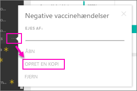

# Organisationsindholdspakker: Kopiér, opdater og få adgang

Når en organisationsindholdspakke er publiceret, kan alle modtagere se det samme dashboard og de samme rapporter, Excel-projektmapper, datasæt og data (medmindre datakilden er SQL Server Analysis Services (SSAS)).  [Det er kun forfatteren af indholdspakken, der kan redigere og igen publicere](service-organizational-content-pack-manage-update-delete.md) indholdspakken.  Alle modtagere kan dog gemme en kopi af indholdspakken, som de kan have samtidig med originalen.

Oprettelse af indholdspakker adskiller sig fra deling af dashboards eller samarbejde på dem i en gruppe. Læs [Hvordan kan jeg samarbejde på og dele dashboards og rapporter?](service-how-to-collaborate-distribute-dashboards-reports.md) for at finde det bedste valg til din situation.

> [!NOTE]
> Du kan ikke oprette eller installere organisationsindholdspakker i de nye arbejdsområdeoplevelser. Nu er det et godt tidspunkt at opgradere dine indholdspakker til apps, hvis du ikke er startet endnu. Få [mere at vide om den nye arbejdsområdeoplevelse](service-create-the-new-workspaces.md).
>

## Opret en kopi af en organisationsindholdspakke
Opret din egen kopi af indholdspakken, som ikke kan ses af andre.

1. Vælg **Flere indstillinger** (...) ud for dashboardet med indholdspakken > Opret en kopi.

    
2. Vælg **Gem**.  

Nu har du en kopi, du kan foretage ændringer i. Ingen andre kan se de ændringer, du foretager.

> [!NOTE]
> Tidligere blev der vist et nyt datasæt på listen over indhold i arbejdsområdet, hver gang du installerede en indholdspakke eller oprettede en kopieret pakke. I forbindelse med en nylig opdatering blev oplevelsen forenklet, så der kun vises ét element ved hjælp det nye ikon for refereret datasæt:
>
> 
>

## Hjælp!  Jeg har ikke længere adgang til indholdspakken
Der kan være flere årsager til dette:

* **Ændringer af medlemskab**:  Indholdspakker publiceres til maildistributionsgrupper, sikkerhedsgrupper og [Power BI-grupper, der er baseret på Office 365](https://support.office.com/article/Create-a-group-in-Office-365-7124dc4c-1de9-40d4-b096-e8add19209e9).  Hvis du er fjernet fra gruppen, har du ikke længere adgang til indholdspakken.
* **Distributionsændringer**: Forfatteren til indholdspakken ændrer distributionen. Hvis indholdspakken f.eks. oprindeligt blev publiceret til hele organisationen, men forfatteren har publiceret den igen til en mindre målgruppe, er du muligvis ikke længere inkluderet.
* **Ændringer af sikkerhedsindstillinger**: Hvis dashboardet og rapporter opretter forbindelse til SSAS-datakilder i det lokale miljø, og der foretages ændringer af sikkerhedsindstillingerne, kan dine tilladelser til denne server blive tilbagekaldt.

## Hvordan opdateres organisationsindholdspakker?
Når indholdspakken oprettes, nedarves opdateringsindstillingerne med datasættet.  Når du opretter en kopi af indholdspakken, bevarer den nye version linket til det oprindelige datasæt og dets tidsplan for opdatering.

Se [Administrer, opdater og slet organisationsindholdspakker](service-organizational-content-pack-manage-update-delete.md).

## Næste trin
* [Introduktion til organisationsindholdspakker](service-organizational-content-pack-introduction.md)
* [Opret en gruppe i Power BI](service-create-distribute-apps.md)
* Har du flere spørgsmål? [Prøv at spørge Power BI-community'et](https://community.powerbi.com/)
