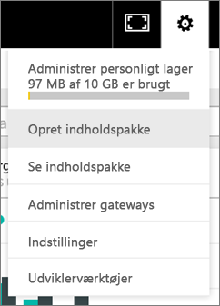
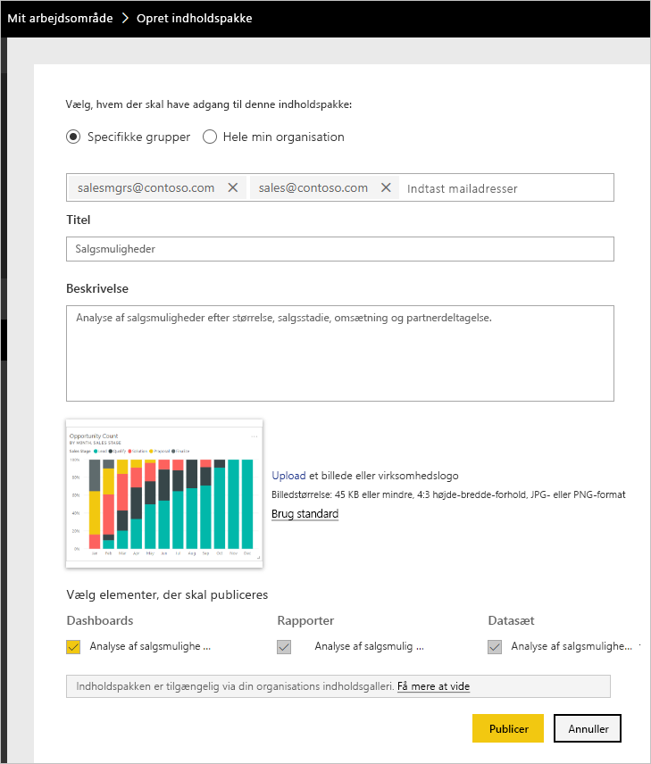
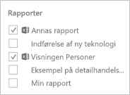
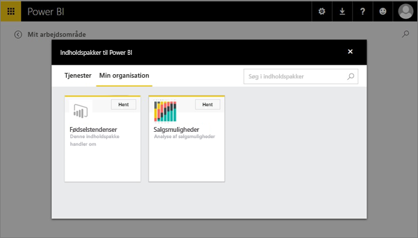

# Opret og publicer en organisationsindholdspakke til Power BI (selvstudium)

I dette selvstudium opretter du en organisationsindholdspakke, giver adgang til en bestemt gruppe og publicerer den i biblioteket til din organisationsindholdspakke på Power BI.

Oprettelse af indholdspakker adskiller sig fra deling af dashboards eller samarbejde på dem i en gruppe. Læs [Hvordan kan jeg samarbejde på og dele dashboards og rapporter?](service-how-to-collaborate-distribute-dashboards-reports.md) for at finde det bedste valg til din situation.

Oprettelse af en organisationsindholdspakke kræver en [Power BI Pro-konto](https://powerbi.microsoft.com/pricing) til dig og dine kollegaer. 

> [!NOTE]
> Du kan ikke oprette eller installere organisationsindholdspakker i prøveversionen af nye arbejdsområdeoplevelser. Nu er det et godt tidspunkt at opgradere dine indholdspakker til apps, hvis du ikke er startet endnu. Få [mere at vide om den nye arbejdsområdeoplevelse](service-create-the-new-workspaces.md).
> 

Antag, at du er Release Manager hos Contoso, og at du er ved at gøre klar til lancering af et nyt produkt.  Du har oprettet et dashboard med rapporter, som du vil dele med de andre medarbejdere, der administrerer lanceringen. Du vil gerne samle dashboardet og rapporterne som en løsning, som dine kollegaer kan bruge. 

Vil du følge med? I [Power BI-tjenesten](https://powerbi.com) skal du gå til **Hent data > Eksempler > Eksempel på analyse af salgsmuligheder** > **Opret forbindelse** for at få din egen kopi. 

1. Vælg dashboardet **Eksempel på analyse af salgsmuligheder** i venstre navigationsrude.
2. Vælg tandhjulsikonet  > **Opret indholdspakke** på den øverste navigationslinje.    
   
3. I vinduet **Opret indholdspakke** skal du angive følgende oplysninger.  
   
   Husk på, at organisationens bibliotek med indholdspakker kan ende med at have hundredvis af indholdspakker publiceret for organisationen eller for grupperne. Brug lidt tid på at give indholdspakken et navn, der giver mening, at tilføje en god beskrivelse og vælge den rette målgruppe.  Brug ord, der vil gøre det nemt at finde din indholdspakke i søgninger.
   
   1. Vælg **Bestemte grupper**, og angiv komplette mailadresser til enkeltpersoner, [Office 365-grupper](https://support.office.com/article/Create-a-group-in-Office-365-7124dc4c-1de9-40d4-b096-e8add19209e9), distributionsgrupper eller sikkerhedsgrupper. Eksempel:
      
        salesmgrs@contoso.com; sales@contoso.com
      
      Til dette selvstudium kan du prøve at bruge din egen eller din gruppes mailadresse.
   
   2. Navngiv indholdspakken **Salgsmuligheder**.
   
      > [!TIP]
      > Overvej at lade navnet på dashboardet indgå i navnet på indholdspakken. På den måde finder dine kollegaer nemmere dashboardet, når der oprettes forbindelse til din indholdspakke.
      > 
      > 
   
   3. Anbefalet: Tilføj en **beskrivelse**. På den måde kan kolleger nemmere finde de indholdspakker, de skal bruge. Ud over en beskrivelse kan du tilføje nøgleord, som dine kolleger kan bruge til at søge efter denne indholdspakke. Medtag kontaktoplysninger, hvis dine kolleger har spørgsmål eller brug for hjælp.
   
   4. **Upload et billede eller logo** for at gøre det nemmere for gruppemedlemmer at finde indholdspakken &#151; det er hurtigere at scanne efter et billede, end det er at finde tekst. I skærmbilledet nedenfor har vi brugt et billede af søjlediagramfeltet Opportunity Count 100% (Optælling af salgsmulighed 100%).
   
   5. Vælg dashboardet **Eksempel på analyse af salgsmuligheder** for at føje det til indholdspakken.  Power BI tilføjer automatisk den tilknyttede rapport og det tilknyttede datasæt. Du kan tilføje andre, hvis du vil.
   
      > [!NOTE]
      >  Det er kun de dashboards, rapporter, datasæt og projektmapper, som du kan redigere, der vises. Hvis der er nogen, der er delt med dig, er de derfor ikke vist på listen.
      > 
      > 
   
       
   
   6. Hvis du har Excel-projektmapper, kan du se dem under Rapporter med et Excel-ikon. Du kan også føje dem til indholdspakken.
   
      
   
      > [!NOTE]
      > Hvis medlemmer af gruppen ikke kan se Excel-projektmappen, må du eventuelt [dele projektmappen med dem i OneDrive for Business](https://support.office.com/en-us/article/Share-documents-or-folders-in-Office-365-1fe37332-0f9a-4719-970e-d2578da4941c).
      > 
      > 
4. Vælg **Publicer** for at føje indholdspakken til gruppens bibliotek med organisationsindholdspakker.  
   
   Der vises en meddelelse, når den publiceres korrekt. 
5. Når medlemmer af gruppen går til **Hent Data > Min organisation**, klikker de i søgefeltet og skriver "Salgsmuligheder".
   
    
6. De får vist din indholdspakke.  
    
   
   > [!TIP]
   > Den URL-adresse, der vises i din browser, er en entydig adresse til denne indholdspakke.  Vil du fortælle dine kolleger om denne nye indholdspakke?  Indsæt URL-adressen i en mail.
   > 
   > 
7. De vælger **Opret forbindelse**, og nu kan de [se og arbejde med din indholdspakke](service-organizational-content-pack-copy-refresh-access.md). 

### Næste trin
* [Introduktion til organisationsindholdspakker](service-organizational-content-pack-introduction.md)  
* [Administrer, opdater og slet organisationsindholdspakker](service-organizational-content-pack-manage-update-delete.md)  
* [Opret en gruppe i Power BI](consumer/end-user-create-apps.md)  
* [Hvad er OneDrive for Business?](https://support.office.com/en-us/article/What-is-OneDrive-for-Business-187f90af-056f-47c0-9656-cc0ddca7fdc2)
* Har du flere spørgsmål? [Prøv at spørge Power BI-community'et](http://community.powerbi.com/)

