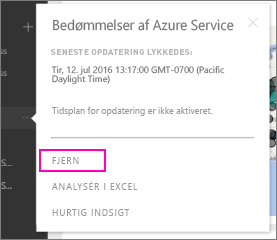

# Fjern din forbindelse til en Power BI-organisationsindholdspakke
En kollega har oprettet en indholdspakke. Du har fundet den i AppSource og føjet den til dit Power BI-arbejdsområde. Nu har du ikke længere brug for den.  Hvordan fjerner du den?

Hvis du vil fjerne en indholdspakke, skal du fjerne dens datasæt.  

* Vælg ellipsen til højre for datasættet i venstre navigationsrude, og vælg **Fjern \> Ja**.  
  
  

Hvis du fjerner datasættet, fjernes også alle tilknyttede rapporter og dashboards. Når du fjerner forbindelsen til indholdspakken, slettes indholdspakken imidlertid ikke fra din organisations AppSource.  Du kan altid vende tilbage til AppSource og føje indholdspakken til dit arbejdsområde igen. Du kan kun [slette en indholdspakke fra AppSource](service-organizational-content-pack-manage-update-delete.md), hvis du har oprettet den.

## Næste trin
* [Introduktion til organisationsindholdspakker](service-organizational-content-pack-introduction.md) 
* [Opret og distribuer en app i Power BI](service-create-distribute-apps.md) 
* [Grundlæggende begreber i Power BI](service-basic-concepts.md)  
* Har du flere spørgsmål? [Prøv at spørge Power BI-community'et](http://community.powerbi.com/)

