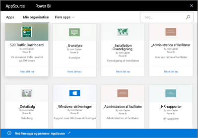

# Introduktion til organisationsindholdspakker i Power BI
> [!NOTE]
> Har du hørt om de nye *apps*? Apps er den nye måde at sende indhold til store målgrupper på i Power BI. Vi planlægger snart at fraråde organisationsindholdspakker, og vi anbefaler, at der bruges apps i stedet. Få [mere at vide om apps](service-install-use-apps.md).
> 
> 

Distribuerer du jævnligt rapporter via mail til dit team? Prøv dette i stedet: Lav en pakke med dine dashboards, rapporter, Excel-projektmapper og datasæt, og publicer dem for dit team som en *organisationsindholdspakke*. Indholdspakker, du opretter, er nemme for dit team at finde &#151; de findes alle sammen i AppSource. Da de er en del af Power BI, udnytter de alle funktionerne i Power BI, herunder interaktiv udforskning af data, nye visuals, spørgsmål og svar, integration med andre datakilder, opdatering af data med mere.

Oprettelse af indholdspakker adskiller sig fra deling af dashboards eller samarbejde om dem i et apparbejdsområde. Læs [Hvordan kan jeg samarbejde på og dele dashboards og rapporter?](service-how-to-collaborate-distribute-dashboards-reports.md) for at finde det bedste valg til din situation. 

I AppSource kan du gennemse eller søge efter indholdspakker, der er publiceret til hele organisationen, til distribution eller sikkerhedsgrupper og til [Office 365-grupper, du er medlem af](https://support.office.com/article/Create-a-group-in-Office-365-7124dc4c-1de9-40d4-b096-e8add19209e9). Hvis du ikke er medlem af en bestemt gruppe, kan du ikke se indholdspakker, som er delt med denne gruppe. Alle medlemmer af gruppen har samme skrivebeskyttede adgang til indholdspakkens data, rapporter, projektmapper og dashboards (medmindre det er en SSAS-datakilde (SQL Server Analysis Services), hvorved dine rettigheder nedarves sammen med datakilden).

Disse dashboards, rapporter og Excel-projektmapper er skrivebeskyttede, men du kan kopiere og bruge de dashboards og rapporter som udgangspunkt for at oprette din egen personligt tilpassede version af indholdspakken.

> [!NOTE]
> Organisationsindholdspakker er kun tilgængelige, når du og dine kollegaer har [Power BI Pro](service-free-vs-pro.md).
> 
> 

## Hvad er *AppSource*?
Publicering af en organisationsindholdspakke føjer den til AppSource.  Dette centraliserede lager gør det nemt for medlemmer at gennemse og fremsøge dashboards, rapporter og datasæt, der er publiceret til dem.  

* Hvis du vil have vist AppSource, skal du vælge **Hent data** > **Min organisation** > **Hent**.

Læs mere om at [finde og åbne organisationsindholdspakker](service-organizational-content-pack-find-and-open.md).

## Livscyklus for en organisationsindholdspakke
Alle Power BI Pro-brugere kan oprette, publicere og få adgang til organisationsindholdspakkerne. Kun vedkommende, der har oprettet indholdspakken, kan redigere projektmappen og datasættet, planlægge opdatering og slette den.

Livscyklus ser noget nær således ud:

1. I Power BI Pro opretter Nate en indholdspakke og publicerer den til distributionsgruppen Marketing. Indstillingerne for opdatering nedarves i datasættet og kan kun ændres af Nate.
   
   > [!NOTE]
   > Hvis Nate opretter indholdspakken inde fra et [apparbejdsområde i Power BI](service-create-distribute-apps.md), som han tilhører, så kan andre i Power BI-arbejdsområdet overtage ejerskabet, selvom han forlader arbejdsområdet.
   > 
   > 
2. Nate sender mails til distributionsgruppen, hvor han fortæller dem om den nye indholdspakke.
3. I Power BI Pro søger Jane, som er medlem af distributionsgruppen Marketing, efter og opretter forbindelse til denne indholdspakke i AppSource. Hun har nu en skrivebeskyttet kopi.  Hun ved, at den er skrivebeskyttet, da der i venstre navigationsrude er et delingsikon til venstre for navnet på dashboardet og rapporten. Og når hun vælger dashboardet, viser et låseikon Jane, at hun ser på et indholdspakkedashboard. 
4. Måske ønsker hun at tilpasse det. Nu har hun sin egen kopi af dashboardet og rapporterne. Hendes arbejde påvirker ikke datakilden, den oprindelige indholdspakke eller andre medlemmer af distributionsgruppen. Nu arbejder hun på sin egen kopi af dashboardet og rapporten.
5. Nate opdaterer dashboardet, og når det er klar, publicerer han en ny version af indholdspakken.
   
   * Julio, som også er medlem af distributionsgruppen, har ikke tilpasset den oprindelige indholdspakke. De nye ændringer anvendes automatisk på hans version af indholdspakken.  
   * Jane tilpassede indholdspakken. Hun modtager en meddelelse om, at der er en ny version.  Hun kan gå til AppSource og hente den opdaterede indholdspakke uden at miste sin personligt tilpassede version. Hun har nu to versioner: sin egen personligt tilpassede version og den opdaterede indholdspakke.
6. Nu ændrer Nate sikkerhedsindstillingerne. Julio og Jane har ikke længere adgang til indholdet. Det kan også være, at de bliver fjernet fra distributionsgruppen Marketing.
   
   * Julio tilpassede ikke den oprindelige indholdspakke, så indholdet fjernes automatisk. 
   * Jane tilpassede indholdspakken. Næste gang, hun åbner dashboardet, er alle felterne fra den oprindelige indholdspakke forsvundet, men de felter, hun fastgjorde fra andre rapporter (som hun stadig har tilladelse til at bruge), vises stadig. De tilknyttede rapporter og datasættet er ikke længere tilgængelige (og vises ikke i hendes venstre navigationsrude).
7. Eller Nate sletter indholdspakken.
   
   * Julio tilpassede ikke den oprindelige indholdspakke, så indholdet fjernes automatisk. 
   * Jane tilpassede indholdspakken. Næste gang, hun åbner dashboardet, er alle felterne fra den oprindelige indholdspakke forsvundet, men de felter, hun fastgjorde fra andre rapporter, vises stadig. De tilknyttede rapporter og datasættet er ikke længere tilgængelige (og vises ikke i hendes venstre navigationsrude).

## Datasikkerhed
Alle medlemmer af distributionsgruppen har de samme tilladelser til dataene som vedkommende, der har oprettet indholdspakken. Den eneste undtagelse er tabellariske SSAS-datasæt (SQL Server Analysis Services) i det lokale miljø. Fordi rapporter og dashboards opretter liveforbindelse til SSAS-modellen i det lokale miljø bruges legitimationsoplysningerne for hvert enkelte medlem af distributionsgruppen til at bestemme, hvilke data han eller hun har adgang til.

## Næste trin
* [Opret og publicer en organisationsindholdspakke](service-organizational-content-pack-create-and-publish.md)
* [Opret og distribuer en app i Power BI](service-create-distribute-apps.md) 
* [Power BI – Grundlæggende begreber](service-basic-concepts.md)
* Har du flere spørgsmål? [Prøv at spørge Power BI-community'et](http://community.powerbi.com/)

