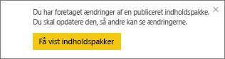

# Administrer, opdater og slet organisationsindholdspakker
> [!NOTE]
> Har du hørt om de nye *apps*? Apps er den nye måde at sende indhold til store målgrupper på i Power BI. Vi anbefaler at bruge apps i stedet for organisationsindholdspakker eller skrivebeskyttede arbejdsområder. Få [mere at vide om apps](service-install-use-apps.md).
> 
> 

Du kan pakke og dele dine dashboards, rapporter, Excel-projektmapper og datasæt med dine kollegaer som [organisationsindholdspakker](service-organizational-content-pack-introduction.md). Dine kollegaer kan bruge dem, som de er, eller de kan oprette deres egne kopier.

Oprettelse af indholdspakker adskiller sig fra deling af dashboards eller samarbejde om dem i en gruppe. Læs [Hvordan kan jeg samarbejde på og dele dashboards og rapporter?](service-how-to-collaborate-distribute-dashboards-reports.md) for at finde det bedste valg til din situation.

Du kan kun udføre visse organisationsindholdspakkeopgaver, hvis du har oprettet indholdspakken:

* Udgiv igen.
* Begræns eller udvid adgangen til indholdspakken.
* Angiv og rediger den planlagte opdatering.
* Slet indholdspakken.

## Opret og udgiv en organisationsindholdspakke igen
Hvis du foretager ændringer af indholdspakkens oprindelige dashboard, rapport eller Excel-projektmappe, beder Power BI dig om at publicere den igen. Derudover kan du som opretter af indholdspakken opdatere alle de indstillinger, du har valgt i vinduet Opret indholdspakke, når du opretter den oprindelige indholdspakke. 

## Publicer igen med nyt indhold
Når du foretager og gemmer en ændring af det dashboard, som du inkluderede i en indholdspakke, minder Power BI dig om at opdatere det, så andre kan se ændringerne. Dette er tilfældet, hvis du f.eks. fastgør et nyt felt eller blot ændrer navnet på dashboardet.

1. Vælg **Se indholdspakker** i meddelelsen.
   
   
2. Eller vælg tandhjulsikonet i øverste højre hjørne , og vælg **Se indholdspakke**.
   
   
   
   Bemærk advarselsikonet .  Dette ikon fortæller dig, at du har ændret indholdspakken på en eller anden måde, og den svarer ikke længere til det, du har udgivet.
3. Vælg **Rediger**.  
4. Foretag de nødvendige ændringer i vinduet **Opdater indholdspakke**, og vælg **Opdater**. Meddelelsen **Udført** vises.
   
   * Opdateringen anvendes automatisk for gruppemedlemmer, som ikke har tilpasset indholdspakken.
   * Gruppemedlemmer, som har tilpasset indholdspakken, modtager en meddelelse om, at der er en ny version.  De kan gå til AppSource og hente den opdaterede indholdspakke uden at miste deres personligt tilpassede version.  De har nu to versioner: den personligt tilpassede version og den opdaterede indholdspakke.  I den personligt tilpassede version er alle fliser fra den oprindelige indholdspakke væk.  Men fliser, der er fastgjort fra andre rapporter, vises stadig.    

## Opdater målgruppen: Udvid eller begræns adgangen
En anden ændring, der er tilgængelig for oprettere af indholdspakker, er at udvide og begrænse adgang til indholdspakken.  Du har måske publiceret en indholdspakke til en bred målgruppe, og du har besluttet dig for at begrænse adgangen til en mindre gruppe.  

1. Vælg tandhjulsikonet , og vælg **Se Indholdspakker**.
2. Vælg **Rediger**. 
3. Foretag de nødvendige ændringer i vinduet **Opdater indholdspakke**, og vælg **Opdater**. Du kan f.eks. slette den oprindelige distributionsgruppe i feltet **Bestemte grupper** og erstatte den med en anden distributionsgruppe (der har færre medlemmer).
   
   Meddelelsen Udført vises.
   
   Til alle medarbejdere, der ikke er en del af det nye alias:
   
   * For gruppemedlemmer, der ikke har tilpasset indholdspakken, er de dashboards og rapporter, der er tilknyttet den indholdspakke, ikke længere tilgængelige, og indholdspakken vises ikke i navigationsruden.
   * For gruppemedlemmer, som har tilpasset indholdspakken, er alle felter fra den oprindelige indholdspakke væk, næste gang de åbner det tilpassede dashboard.  Men fliser, der er fastgjort fra andre rapporter, vises stadig. De oprindelige indholdspakkerapporter og -datasæt er ikke længere tilgængelige, og indholdspakken vises ikke i navigationsruden.   

## Opdater en organisationsindholdspakke
Da du har oprettet indholdspakken, kan du [planlægge en opdatering af datasættene](refresh-data.md).  Når du opretter og uploader indholdspakken, uploades denne tidsplan for opdatering sammen med datasættet. Hvis du ændrer tidsplanen for opdatering, skal du publicere indholdspakken igen (se ovenfor).

## Slet en organisationsindholdspakke fra AppSource
Du kan kun slette en indholdspakke fra AppSource, hvis du har oprettet den. 

> [!TIP]
> Du kan [slette din forbindelse til en indholdspakke](service-organizational-content-pack-disconnect.md), du ikke har oprettet. Det sletter ikke indholdspakken fra AppSource.
> 
> 

1. Hvis du vil slette en indholdspakke fra AppSource, skal du gå til apparbejdsområdet, hvor du oprettede indholdspakken, vælge tandhjulsikonet  og vælge **Se indholdspakker**.
2. Vælg **Slet \> Slet**. 
   
   * For gruppemedlemmer, som ikke har tilpasset indholdspakken, fjernes de dashboards og rapporter, der er knyttet til denne indholdspakke, automatisk. De er ikke længere tilgængelige, og indholdspakken vises ikke i navigationsruden.
   * For gruppemedlemmer, som har tilpasset indholdspakken, er alle felter fra den oprindelige indholdspakke væk, næste gang de åbner det tilpassede dashboard.  Men fliser, der er fastgjort fra andre rapporter, vises stadig. De oprindelige indholdspakkerapporter og -datasæt er ikke længere tilgængelige, og indholdspakken vises ikke i navigationsruden.   

## Næste trin
* [Introduktion til organisationsindholdspakker](service-organizational-content-pack-introduction.md)
* [Opret og distribuer en app i Power BI](service-create-distribute-apps.md) 
* Har du flere spørgsmål? [Prøv at spørge Power BI-community'et](http://community.powerbi.com/)

