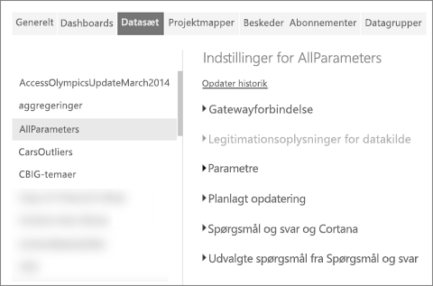
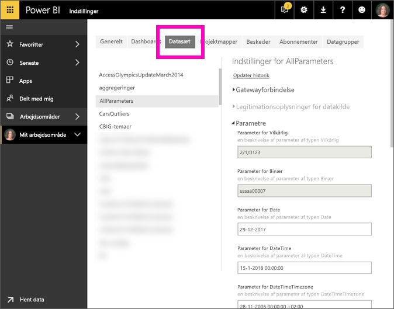

# Rediger parameterindstillinger i Power BI-tjenesten
Rapportoprettere føjer forespørgselsparametre til rapporter i Power BI Desktop. Parametre gør det muligt for dem at oprette dele af rapporter, der afhænger af en eller flere parameter*værdier*. En rapportopretter kan f.eks. oprette en parameter, der begrænser dataene til et enkelt land/område, eller en parameter, der definerer acceptable formater for felter, såsom datoer, klokkeslæt og tekst.

## Gennemse og rediger parametre i Power BI-tjenesten

Som rapportopretter definerer du parametre i Desktop. Når du [udgiver rapporten i Power BI-tjenesten](desktop-upload-desktop-files.md), følger parameterindstillingerne og markeringerne med. Du kan gennemse og redigere nogle parameterindstillinger i Power BI-tjenesten – ikke de parametre, der begrænser de tilgængelige data, men de parametre, der definerer og beskriver acceptable værdier.

1. Vælg tandhjulsikonet  i Power BI-tjenesten for at åbne **Indstillinger**.

2. Vælg fanen for **Datasæt**, og fremhæv et datasæt på listen. 
    
    

3. Udvid **Parametre**.  Hvis det valgte datasæt ikke indeholder parametre, får du vist en meddelelse med et link til Få mere at vide om forespørgselsparametre. Men hvis datasættet ikke har parametre, vil udvidelse af overskriften **Parametre** vise disse parametre. 

    

    Gennemse parameterindstillingerne, og foretag de nødvendige ændringer. Nedtonede felter kan ikke redigeres. 

## Næste trin
En ad hoc-metode til at tilføje enkle parametre er at [ændre URL-adressen](service-url-filters.md).