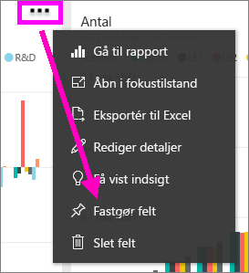
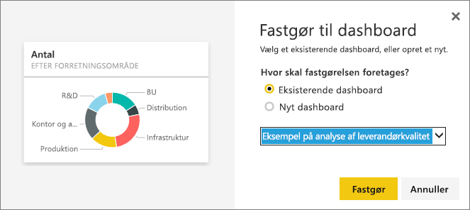
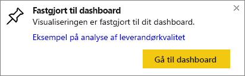

# Fastgør et felt fra ét dashboard til et andet dashboard
Én måde at tilføje et nyt [dashboardfelt](service-dashboard-tiles.md) er ved at kopiere det fra et andet dashboard. Et klik på hvert af disse felter fungerer som et link tilbage til der, hvor det blev oprettet – enten i Spørgsmål og svar eller i en rapport. 

> [!NOTE]
> Du kan ikke fastgøre felter fra delte dashboards.

## Fastgør et felt til et andet dashboard
1. [Hent data](service-get-data.md). Dette eksempel bruger [Eksemplet på analyse af it-forbrug](sample-it-spend.md).
2. Åbn et [dashboard](service-dashboards.md).
3. Hold musen over det felt, du vil fastgøre. Vælg ellipserne (...) og **Fastgør felt**.  
   
   
4. Fastgør feltet til et eksisterende dashboard eller et nyt dashboard. 
   
   * **Eksisterende dashboard**: Vælg navnet på dashboard'et på rullelisten.
   * **Nyt dashboard**: Angiv navnet på det nye dashboard.
   
   
5. Vælg **Fastgør**.
   En meddelelse om fuldførelse (næsten helt oppe i højre hjørne) giver dig besked om, at visualiseringen er blevet føjet til det valgte dashboard som et felt.
   
   
6. Vælg **Gå til dashboard** for at se det fastgjorte felt. Der kan du [omdøbe, sammenkæde, flytte og tilpasse størrelsen af](service-dashboard-edit-tile.md) den fastgjorte visualisering.

## Næste trin
[Felter i Power BI](service-dashboard-tiles.md)  
[Dashboards i Power BI](service-dashboards.md)  
Har du flere spørgsmål? [Prøv at spørge Power BI-community'et](http://community.powerbi.com/)

