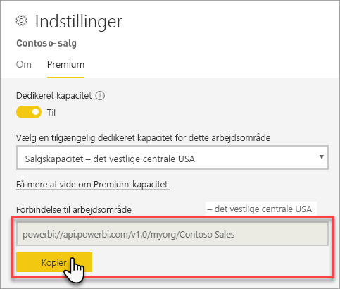
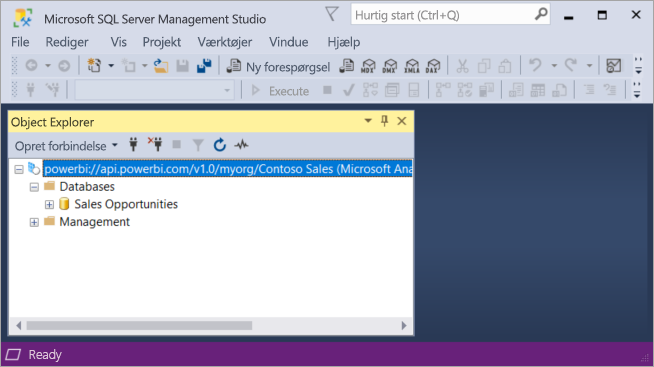

# Opret forbindelse til datasæt med klientprogrammer og værktøjer (prøveversion)

Power BI Premium-arbejdsområder og -datasæt understøtter *skrivebeskyttede* forbindelser fra klientprogrammer og værktøjer fra Microsoft og tredjeparter. Forbindelser er som standard aktiveret

> [!NOTE]
> I denne artikel introduceres kun skrivebeskyttede forbindelser til Power BI Premium-arbejdsområder og -datasæt. Den indeholder *ikke* detaljerede oplysninger om programmering, bestemte værktøjer og programmer, arkitektur og administration af arbejdsområder og datasæt. Emner, der er beskrevet her, kræver en grundig forståelse af databasearkitektur og administration af Analysis Services-tabelmodeller.

## Protokol

I Power BI Premium bruges [XMLA](https://docs.microsoft.com/bi-reference/xmla/xml-for-analysis-xmla-reference)-protokollen (XML for Analysis) til kommunikation mellem klientprogrammer og det program, som administrerer dine arbejdsområder og datasæt. Denne kommunikation sker via det, der ofte kaldes XMLA-slutpunkter. XMLA er den samme kommunikationsprotokol, der bruges af Microsoft Analysis Services-programmet, som under overfladen udfører semantisk modellering, styring, livscyklus og dataadministration i Power BI. 

Langt størstedelen af klientprogrammer og værktøjer kommunikerer ikke eksplicit med programmet ved hjælp af XMLA-slutpunkter. I stedet bruger de klientbiblioteker, f.eks. MSOLAP, ADOMD og AMO, som mellemled mellem klientprogrammet og det program, som udelukkende kommunikerer ved hjælp af XMLA.

## Understøttede værktøjer

Disse værktøjer understøtter skrivebeskyttet adgang til Power BI Premium-arbejdsområder og -datasæt:

**SQL Server Management Studio (SSMS)** – understøtter DAX-, MDX-, XMLA- og TraceEvent-forespørgsler. Kræver version 18.0. Download [her](https://docs.microsoft.com/sql/ssms/download-sql-server-management-studio-ssms). 

**SQL Server Profiler** – Dette værktøj er inkluderet i SSMS 18.0 (prøveversion) og gør det muligt at spore og foretage fejlfinding af serverhændelser. Du kan hente og gemme data om de enkelte hændelser i en fil eller tabel og analysere dem senere. Profiler frarådes officielt til SQL Server, men er fortsat inkluderet i SSMS, og det understøttes stadig af Analysis Services og nu også af Power BI Premium. Du kan få mere at vide under[SQL Server Profiler](https://docs.microsoft.com/sql/tools/sql-server-profiler/sql-server-profiler).

**DAX Studio** – communityværktøj med åben kildekode til udførelse og analyse af DAX-forespørgsler i forhold til Analysis Services. Kræver version 2.8.2 eller nyere. Du kan få mere at vide under [daxstudio.org](https://daxstudio.org/).

**Excel-pivottabeller** – Klik og kør-version af Office 16.0.11326.10000 eller nyere kræves.

**Tredjepart** – omfatter programmer og værktøjer til visualisering af klientdata, der kan oprette forbindelse til, forespørge om og forbruge datasæt i Power BI Premium. De fleste værktøjer kræver de nyeste versioner af MSOLAP-klientbiblioteker, men nogle bruger muligvis ADOMD.

## Klientbiblioteker

Klientbiblioteker er nødvendige, for at klientprogrammer og værktøjer kan oprette forbindelse til Power BI Premium-arbejdsområder. De samme klientbiblioteker, der bruges til at oprette forbindelse til Analysis Services, understøttes også i Power BI Premium. Microsoft-klientprogrammer, f.eks. Excel, SSMS (SQL Server Management Studio) og SSDT (SQL Server Data Tools), installerer alle tre klientbiblioteker og opdaterer dem sammen med regelmæssige programopdateringer. I nogle tilfælde og især i forbindelse med tredjepartsprogrammer og -værktøjer kan det være nødvendigt at installere nyere versioner af klientbibliotekerne. Klientbiblioteker opdateres hver måned. Du kan få mere at vide under [Klientbiblioteker for oprettelse af forbindelse til Analysis Services](https://docs.microsoft.com/azure/analysis-services/analysis-services-data-providers).

## Opret forbindelse til et Premium-arbejdsområde

Du kan oprette forbindelse til arbejdsområder, der er tildelt til dedikerede Premium-kapaciteter. Arbejdsområder, der er tildelt til en dedikeret kapacitet, har en forbindelsesstreng i URL-format. 

Hvis du vil hente forbindelsesstrengen for arbejdsområdet, skal du klikke på **Kopiér** i **Arbejdsområdeforbindelse** under fanen **Premium** i **Indstillinger for arbejdsområde** i Power BI.

Arbejdsområdeforbindelser bruger følgende URL-format til at føje en adresse til et arbejdsområde, som om det var navnet på en Analysis Services-server:   
`powerbi://api.powerbi.com/v1.0/[tenant name]/[workspace name]` 

Det kan for eksempel være `powerbi://api.powerbi.com/v1.0/contoso.com/Sales Workspace`

### Sådan opretter du forbindelse i SSMS

Vælg **Analysis Services** i **Opret forbindelse til server** > **Servertype**. Angiv URL-adressen i **Servernavn**. Under **Godkendelse** skal du vælge **Active Directory - Universal with MFA Support** og derefter angive dit organisationsbruger-id i **Brugernavn**. 

Når forbindelsen er oprettet, vises arbejdsområdet som en Analysis Services-server, og datasæt i arbejdsområdet vises som databaser.  

### Oprindeligt katalog

For nogle funktioner, f.eks. SQL Server Profiler, skal du muligvis angive et *oprindeligt katalog*. Angiv et datasæt (en database) i dit arbejdsområde. Klik på **Indstillinger** i **Opret forbindelse til server**. Angiv datasættets navn i **Opret forbindelse til database** under fanen **Forbindelsesegenskaber** i dialogboksen **Opret forbindelse til server**.

### Duplikeret navn på arbejdsområde

Når du opretter forbindelse til et arbejdsområde med det samme navn som et andet arbejdsområde, kan du få følgende fejl: **Der kan ikke oprettes forbindelse til powerbi://api.powerbi.com/v1.0/ [lejernavn]/[navn på arbejdsområde].**

Hvis du vil undgå denne fejl, skal du ud over navnet på arbejdsområdet angive ObjectIDGuid, som kan kopieres fra arbejdsområdets objectID til URL-adressen. Føj objectID til URL-adressen til forbindelsen. Det kan f.eks. være 'powerbi://api.powerbi.com/v1.0/myorg/Contoso Sales - 9d83d204-82a9-4b36-98f2-a40099093830'

### Duplikeret navn på datasæt

Når du opretter forbindelse til et datasæt med samme navn som et andet datasæt i det samme arbejdsområde, kan du føje datasættets GUID til datasættets navn. Du kan hente både datasættets navn *og* GUID, når du har forbindelse til arbejdsområdet i SSMS. 

### Forsinkelse i visning af datasæt

Når du opretter forbindelse til et arbejdsområde, kan der gå op til fem minutter, inden ændringer i nye, slettede og omdøbte datasæt vises. 

### Ikke-understøttede datasæt

Følgende datasæt er ikke tilgængelige ved hjælp af XMLA-slutpunkter. Disse datasæt vises *ikke* under arbejdsområdet i SSMS eller i andre værktøjer: 

- Datasæt med en direkte forbindelse til Analysis Services-modeller. 
- Datasæt med pushdata ved hjælp af REST-API'en.
- Datasæt for Excel-projektmapper. 

Følgende datasæt understøttes ikke i Power BI-tjenesten:   

- Datasæt med en direkte forbindelse til et Power BI-datasæt.

### Roller og rollemedlemskaber

I øjeblikket kan du ikke finde eller få vist modelroller og rollemedlemskaber ved hjælp af XMLA-slutpunkter.

## Deaktiver netværksmuligheder

Netværksmuligheder for XMLA-slutpunkter er som standard aktiveret for arbejdsbelastningerne for datasæt. Du kan deaktivere netværksmulighederne under [indstillingerne for arbejdsbelastning](service-admin-premium-workloads.md#workload-settings).

## Overvågningslogge 

Når klientprogrammer og værktøjer opretter forbindelse til et arbejdsområde, logføres adgang via XMLA-slutpunkter i Power BI-overvågningslogge under handlingen **GetWorkspaces**. Du kan få mere at vide under [Overvågning af Power BI](service-admin-auditing.md).

## Se også

[Analysis Services-referencer](https://docs.microsoft.com/bi-reference/#pivot=home&panel=home-all)   
[SQL Server Management Studio](https://docs.microsoft.com/sql/ssms/sql-server-management-studio-ssms)   
[SQL Server Analysis Services-tabelprotokol](https://docs.microsoft.com/openspecs/sql_server_protocols/ms-ssas-t/b98ed40e-c27a-4988-ab2d-c9c904fe13cf)   
[Dynamic Management-visninger (DMV'er)](https://docs.microsoft.com/sql/analysis-services/instances/use-dynamic-management-views-dmvs-to-monitor-analysis-services)   

Har du flere spørgsmål? [Prøv at spørge Power BI-community'et](https://community.powerbi.com/)
