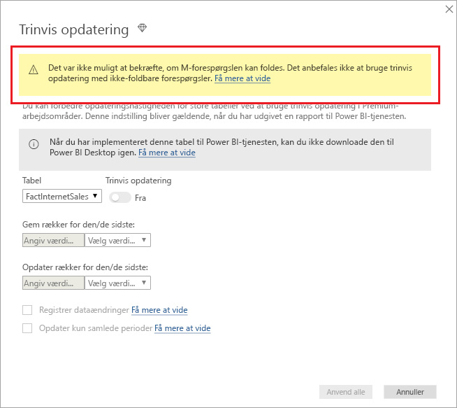
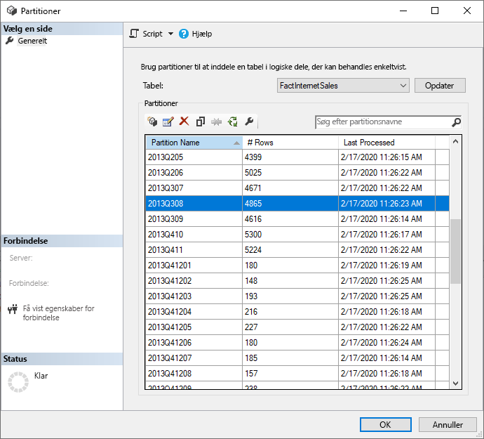
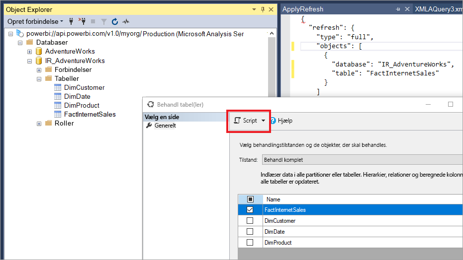
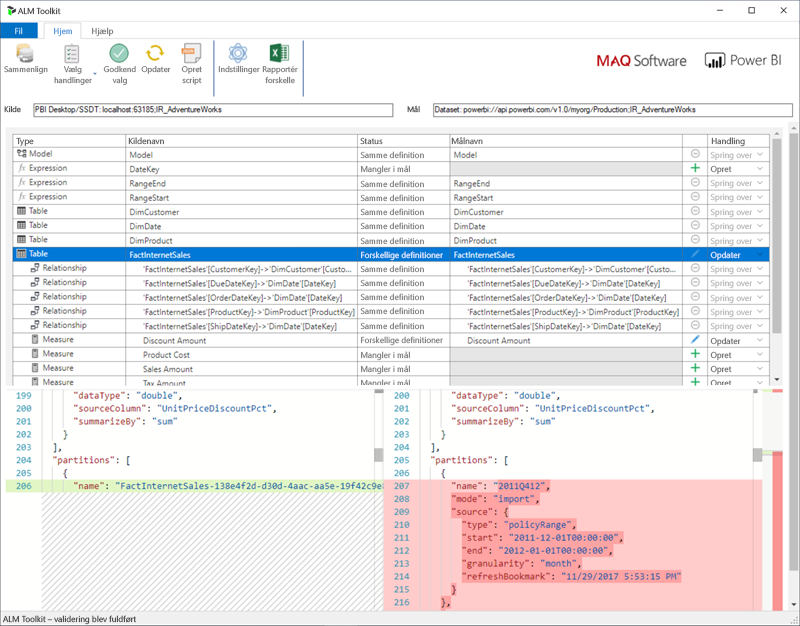

# <a name="incremental-refresh-in-power-bi"></a>Trinvis opdatering i Power BI

En trinvis opdatering gør det muligt at have meget store datasæt i Power BI med følgende fordele:

> [!div class="checklist"]
> * **Opdateringer sker hurtigere** – Det er kun ændrede data, der skal opdateres. Opdater f.eks. kun de sidste 5 dage i et datasæt på 10 år.
> * **Opdateringer er mere pålidelig** – Det er ikke længere nødvendigt at vedligeholde langtidskørende forbindelser til ustabile kildesystemer.
> * **Forbrug af ressourcer reduceres** – Hvis der skal opdateres færre data, reduceres det overordnede forbrug af hukommelsen og andre ressourcer.

> [!NOTE]
> Trinvis opdatering er nu tilgængelig for Power BI Pro, Premium og delte abonnementer og datasæt. 

## <a name="configure-incremental-refresh"></a>Konfigurer trinvis opdatering

Politikker om trinvis opdatering er defineret i Power BI Desktop og anvendes, når de er publiceret i Power BI-tjenesten.


### <a name="filter-large-datasets-in-power-bi-desktop"></a>Filtrer store datasæt i Power BI Desktop

Store datasæt, der kan indeholde milliarder af rækker, kan måske ikke være i en Power BI Desktop-model, fordi PBIX-filen er begrænset af de hukommelsesressourcer, der er tilgængelige på den stationære computer. Disse datasæt filtreres derfor ofte, efter at de er importeret. Denne type filtrering gælder, uanset om du bruger trinvis opdatering eller ej. I forbindelse med trinvis opdatering kan du filtrere ved hjælp af parametrene for dato/klokkeslæt i Power-forespørgsel.

#### <a name="rangestart-and-rangeend-parameters"></a>Parametrene RangeStart og RangeEnd

I forbindelse med trinvis opdatering filtreres datasæt ved hjælp af parametrene for dato/klokkeslæt i Power-forespørgsel med de reserverede navne **RangeStart** og **RangeEnd**, hvor der skelnes mellem store og små bogstaver. Disse parametre bruges til at filtrere de data, der importeres til Power BI Desktop, og desuden til dynamisk partitionering af dataene i intervaller, når de er publiceret til Power BI-tjenesten. Parameterværdierne er erstattet af tjenesten til filtrering efter hver partition. Det er ikke nødvendigt at angive dem under indstillinger for datasæt i tjenesten. Når de er publiceret, overskrives parameterværdierne automatisk af Power BI-tjenesten.

Vælg **Administrer parametre** for at definere parametrene med standardværdier i redigeringsfunktionen til Power-forespørgsel.


Når parametrene er defineret, kan du anvende filteret ved at vælge menupunktet **Brugerdefineret filter** for en kolonne.


Du skal sikre, at rækker filtreres, hvor kolonneværdien *er efter eller lig med* **RangeStart** og *før* **RangeEnd**. Andre filterkombinationer kan resultere i dobbelt optælling af rækker.


> [!IMPORTANT]
> Kontrollér, at forespørgsler har et lighedstegn (=) ved enten **RangeStart** eller **RangeEnd**, men ikke begge. Hvis lighedstegnet (=) er ved begge parametre, kan en række opfylde betingelserne for to partitioner, hvilket kan medføre, at data i modellen duplikeres. F.eks.  
> \#"Filtrerede rækker" = Table.SelectRows(dbo_Fact, hver [OrderDate] **>= RangeStart** og [OrderDate] **<= RangeEnd**) kan medføre duplikerede data.

> [!TIP]
> Da datatypen for parametrene skal være dato/klokkeslæt, er det muligt at konvertere dem, så de overholder kravene til datakilden. Følgende funktion i Power-forespørgsel konverterer f.eks. en dato/klokkeslæt-værdi, så den ligner en heltalssurrogatnøgle i formatet *yyyymmdd*, hvilket er almindeligt for data warehouse-lagre. Funktionen kan kaldes af filtreringstrinnet.
>
> `(x as datetime) => Date.Year(x)*10000 + Date.Month(x)*100 + Date.Day(x)`

Vælg **Luk og anvend** fra redigeringsfunktionen til Power-forespørgsel. Du får et undersæt af datasættet i Power BI Desktop.

#### <a name="filter-date-column-updates"></a>Filtrer opdateringer af datokolonner

Filteret i datokolonnen bruges til dynamisk partitionering af dataene i intervaller i Power BI-tjenesten. Trinvis opdatering er ikke beregnet til at understøtte tilfælde, hvor den filtrerede datokolonne opdateres i kildesystemet. En opdatering fortolkes som en indsætning og en sletning, ikke en egentlig opdatering. Hvis sletningen sker i historikintervallet og ikke i det trinvis interval, registreres den ikke. Dette kan medføre fejl under dataopdatering på grund af konflikter i forbindelse med partitionsnøglen.

#### <a name="query-folding"></a>Forespørgselsfoldning

Det er vigtigt, at partitionsfiltre pushes til kildesystemet, når der sendes forespørgsler til opdatering. For at kunne pushe filtrering ned skal datakilden understøtte forespørgselsfoldning. De fleste datakilder, der understøtter SQL-forespørgsler, understøtter forespørgselsfoldning. Det gør datakilder, som flade filer, BLOBs, web og OData-feeds, imidlertid ikke. I de tilfælde, hvor filteret ikke understøttes af datakildens backend, kan det ikke pushes ned. I sådanne tilfælde kompenserer miksprogrammet og anvender filteret lokalt, hvilket kan kræve, at hele datasættet skal hentes fra datakilden. Dette kan medføre, at trinvis opdatering er meget langsom, og processen kan løbe tør for ressourcer enten i Power BI-tjenesten eller i datagatewayen i det lokale miljø, hvis de bruges.

På grund af de forskellige supportniveauer af forespørgselsfoldning for de enkelte datakilder anbefales det, at det kontrolleres, at filterlogikken er inkluderet i kildeforespørgslerne. For at gøre det nemmere forsøger Power BI Desktop til at udføre denne kontrol for dig. Hvis det var ikke muligt at bekræfte, vises der en advarsel i dialogboksen til trinvis opdatering, når du definerer politikken for trinvis opdatering. SQL-baserede datakilder, som SQL, Oracle og Teradata, kan bruge denne advarsel. Andre datakilder kan muligvis ikke bekræfte uden at spore forespørgsler. Hvis Power BI Desktop ikke kan bekræfte, vises følgende advarsel. Hvis du får vist denne advarsel og gerne vil kontrollere, at den nødvendige forespørgselsdelegering finder sted, kan du bruge funktionen Forespørgselsdiagnosticering eller spore de forespørgsler, du har modtaget fra kildedatabasen.

 

### <a name="define-the-refresh-policy"></a>Definer opdateringspolitikken

Trinvis opdatering er tilgængelig via genvejsmenuen for tabeller, undtagen for modeller med direkte forbindelse.


#### <a name="incremental-refresh-dialog"></a>Dialogboksen Trinvis opdatering

Dialogboksen Trinvis opdatering vises. Brug til/fra-tasten til at aktivere dialogboksen.


> [!NOTE]
> Hvis udtrykket fra Power-forespørgsel for tabellen ikke henviser til parametrene med reserverede navne, er til/fra-tasten slået fra.

Teksten i sidehovedet forklarer følgende:

- Opdateringspolitikker defineres i Power BI Desktop, og de anvendes af opdateringshandlinger i tjenesten.

- Hvis du ikke kan hente den PBIX-fil, der indeholder en politik for trinvis opdatering, fra Power BI-tjenesten, kan den ikke åbnes i Power BI Desktop. Dette understøttes muligvis i fremtiden, men vær opmærksom på, at disse datasæt kan vokse sig så store, at det er upraktisk at downloade og åbne dem på en normal stationær computer.

#### <a name="refresh-ranges"></a>Opdateringsintervaller

I følgende eksempel defineres en opdateringspolitik, hvor data for 5 hele kalenderår samt data for det aktuelle år op til den aktuelle dato gemmes, og hvor data for 10 dage gradvist opdateres. Under den første opdateringshandling indlæses der historiske data. De efterfølgende opdateringer er trinvise, og følgende handlinger udføres (hvis de er planlagt til at køre dagligt):

- Tilføj en ny dags data.

- Opdater 10 dage op til dags dato.

- Fjern kalenderår, der er ældre end fem år fra den aktuelle dato. Hvis den aktuelle dato f.eks. er 1. januar 2019, fjernes år 2013.

Under den første opdatering i Power BI-tjenesten kan det tage længere tid at importere alle fem hele kalenderår. Efterfølgende opdateringer kan udføres på meget kortere tid.


#### <a name="current-date"></a>Aktuel dato

Den *aktuelle dato* er baseret på systemdatoen for opdateringstidspunktet. Hvis en planlagt opdatering er aktiveret for datasættet i Power BI-tjenesten, tages der hensyn til den pågældende tidszone, når den aktuelle dato fastsættes. Der tages hensyn til tidszonen for både manuelt udløste og planlagte opdateringer, hvis tidszonen er tilgængelig. En opdatering, der finder sted kl. 20.00 Pacific Time (USA og Canada) og har en angiven tidszone, fastsætter den aktuelle dato ud fra Pacific Time og ikke GMT (hvilket i så fald ville være den efterfølgende dag).


> [!NOTE]
> En definition af disse intervaller kan være det eneste, du skal bruge, og i dette tilfælde kan du gå direkte til trinnet for publicering nedenfor. De ekstra rullemenuer bruges til avancerede funktioner.

### <a name="advanced-policy-options"></a>Avancerede politikindstillinger

#### <a name="detect-data-changes"></a>Registrer dataændringer

En trinvis opdatering på 10 dage er selvfølgelig meget mere effektiv end en komplet opdatering på 5 år. Det er imidlertid muligt at gøre det på en endnu bedre måde. Hvis du markerer afkrydsningsfeltet**Registrer dataændringer**, kan du vælge en dato/klokkeslæt-kolonne, der bruges til at identificere og kun opdatere de dage, hvor dataene er blevet ændret. Det er en forudsætning, at der findes en sådan kolonne i kildesystemet, der typisk bruges til overvågning. **Det må ikke være den samme kolonne, der bruges til at partitionere dataene med parametrene RangeStart/RangeEnd.** Maksimumværdien for denne kolonne evalueres for hver af perioderne i det trinvise interval. Hvis den ikke er ændret siden den seneste opdatering, er det ikke nødvendigt at opdatere perioden. I eksemplet kan dette yderligere reducere antallet af dage for den trinvise opdatering fra 10 til ca. 2 dage.


> [!TIP]
> Det aktuelle design kræver, at kolonnen til registrering af dataændringer bevares og cachelagres i hukommelsen. Du kan evt. overveje en af følgende metoder for at reducere kardinalitet og hukommelsesforbrug.
>
> Bevar kun den maksimale værdi for denne kolonne på tidspunktet for opdateringen, måske ved hjælp af en funktion i Power-forespørgsel.
>
> Reducer præcisionen til et niveau, der er acceptabelt i forhold til dine krav om opdateringshyppighed.
>
> Definer en brugerdefineret forespørgsel om registrering af dataændringer ved hjælp af XMLA-slutpunktet, og undgå helt at bevare kolonneværdien. Du kan finde flere oplysninger i brugerdefinerede forespørgsler om registrering af dataændringer nedenfor.

#### <a name="only-refresh-complete-periods"></a>Opdater kun samlede perioder

Lad os antage, at din opdatering er planlagt til at køre kl. 4:00 hver morgen. Hvis der vises data i kildesystemet i løbet af disse 4 timer, ønsker du måske ikke at gøre rede for dem. Nogle målepunkter for virksomheder – f.eks. tønder pr. dag i olie- og gasbranchen – giver ingen mening, hvis dagene er delvise.

Et andet eksempel er opdatering af data fra et økonomisystem, hvor data for den foregående måned godkendes den 12. kalenderdag i måneden. Du kan indstille det trinvise interval til 1 måned og planlægge, at opdateringen skal køre den 12. dag i måneden. Når denne indstilling er markeret, opdateres dataene fra januar f.eks. den 12. februar.


> [!NOTE]
> Opdateringshandlinger i tjenesten kører i UTC-tid. Dette kan være afgørende for ikrafttrædelsesdatoen og have indflydelse på samlede perioder. Vi har planer om at gøre det muligt at tilsidesætte ikrafttrædelsesdatoen for en opdateringshandling.

## <a name="publish-to-the-service"></a>Publicer i tjenesten

Du kan nu opdatere modellen. Den første opdatering kan tage længere tid, da oversigtsdataene skal importeres. Efterfølgende opdateringer kan være meget hurtigere, fordi der bruges en trinvis opdatering.

## <a name="query-timeouts"></a>Timeout for forespørgsel

I artiklen [Fejlfinding i forbindelse med opdatering](refresh-troubleshooting-refresh-scenarios.md) forklares det, at der kan opstå timeout for opdateringshandlinger i Power BI-tjenesten. Forespørgsler kan også være begrænset af standardtimeout for datakilden. De fleste relationskilder tillader tilsidesættelse af timeout i M-udtryk. I udtrykket nedenfor bruges [funktionen SQL Server-dataadgang ](https://docs.microsoft.com/powerquery-m/sql-database) f.eks. til at angive det til to timer. Hver periode, der er defineret af politikintervallerne, sender en forespørgsel, der overholder indstillingen for timeout for kommandoer.

```powerquery-m
let
    Source = Sql.Database("myserver.database.windows.net", "AdventureWorks", [CommandTimeout=#duration(0, 2, 0, 0)]),
    dbo_Fact = Source{[Schema="dbo",Item="FactInternetSales"]}[Data],
    #"Filtered Rows" = Table.SelectRows(dbo_Fact, each [OrderDate] >= RangeStart and [OrderDate] < RangeEnd)
in
    #"Filtered Rows"
```

## <a name="xmla-endpoint-benefits-for-incremental-refresh"></a>Fordele ved XMLA-slutpunktet for trinvis opdatering

[XMLA-slutpunktet](service-premium-connect-tools.md) for datasæt i en Premium-kapacitet kan aktiveres til læse-/skrivehandlinger, hvilket kan give store fordele for trinvis opdatering. Opdateringshandlinger via XMLA-slutpunktet er ikke begrænset til [48 opdateringer pr. dag](refresh-data.md#data-refresh), og timeout for [den planlagte opdatering](refresh-troubleshooting-refresh-scenarios.md#scheduled-refresh-timeout) er ikke pålagt, hvilket kan være nyttigt i scenarier med trinvis opdatering.

### <a name="refresh-management-with-sql-server-management-studio-ssms"></a>Administration af opdatering med SQL Server Management Studio (SSMS)

Med XMLA-slutpunktet kan læse-/skriveaktiveret SSMS bruges til at få vist og administrere partitioner, der er oprettet ved anvendelse af politikker for trinvis opdatering.



#### <a name="refresh-historical-partitions"></a>Opdater historiske partitioner

Dette gør det muligt f.eks. at opdatere en bestemt historisk partition, der ikke er i det trinvise interval, for at udføre en tilbagedateret opdatering uden at skulle opdatere alle historiske data.

#### <a name="override-incremental-refresh-behavior"></a>Tilsidesæt funktionsmåde for trinvis opdatering

Med SSMS får du også mere kontrol over, hvordan du aktiverer trinvise opdateringer ved hjælp af [TMSL (Tabular Model Scripting Language)](https://docs.microsoft.com/analysis-services/tmsl/tabular-model-scripting-language-tmsl-reference?view=power-bi-premium-current) og [TOM (Tabular Object Model)](https://docs.microsoft.com/analysis-services/tom/introduction-to-the-tabular-object-model-tom-in-analysis-services-amo?view=power-bi-premium-current). I SSMS kan du f. eks. højreklikke på en tabel i Object Explorer og derefter vælge menupunktet **Behandl tabel**. Klik derefter på knappen **Script** for at generere en TMSL-opdateringskommando.



Følgende parametre kan indsættes i TMSL-opdateringskommandoen for at tilsidesætte standardfunktionsmåden for trinvis opdatering.

- **applyRefreshPolicy** – Hvis en tabel har defineret en trinvis opdateringspolitik, bestemmer applyRefreshPolicy, om politikken anvendes eller ej. Hvis politikken ikke anvendes, efterlader en Behandl komplet-handling partitionsdefinitionerne uændrede, og der udføres en fuld opdatering af alle partitioner i tabellen. Standardværdien er True.

- **effectiveDate** – Hvis der anvendes en politik for trinvis opdatering, skal den kende den aktuelle dato for at bestemme det rullende vindues intervaller for det historiske interval og det trinvise interval. Parameteren effectiveDate gør det muligt for dig at tilsidesætte den aktuelle dato. Dette er nyttigt i forbindelse med test, demoer og forretningsscenarier, hvor data opdateres trinvist til en dato i fortiden eller fremtiden (f. eks. budgetter i fremtiden). Standardværdien er den [aktuelle dato](#current-date).

```json
{ 
  "refresh": {
    "type": "full",

    "applyRefreshPolicy": true,
    "effectiveDate": "12/31/2013",

    "objects": [
      {
        "database": "IR_AdventureWorks", 
        "table": "FactInternetSales" 
      }
    ]
  }
}
```

### <a name="custom-queries-for-detect-data-changes"></a>Brugerdefinerede forespørgsler om registrering af dataændringer

Du kan bruge TMSL og/eller TOM til at tilsidesætte funktionsmåden for de registrerede dataændringer. Det kan ikke kun bruges til at undgå, at kolonnen med den seneste opdatering i cachen i hukommelsen bevares, men det kan gøre det muligt at aktivere scenarier, hvor en konfigurations-/instruktionstabel klargøres af ETL-processer, med det formål kun at markere de partitioner, der skal opdateres. Det kan skabe en mere effektiv trinvis opdateringsproces, hvor kun de påkrævede perioder opdateres, uanset hvor længe det er, siden dataopdateringerne fandt sted.

pollingExpression er beregnet til at være et M-letvægtsudtryk eller et navn på en anden M-forespørgsel. Det skal returnere en skalaværdi og udføres for hver partition. Hvis den returnerede værdi er forskellig fra den værdi, der blev returneret, sidste gang en trinvis opdatering forekom, er partitionen markeret med henblik på fuld behandling.

Følgende eksempel dækker alle 120 måneder i det historiske område for tilbagedaterede ændringer. Hvis du angiver 120 måneder i stedet for 10 år, er datakomprimering muligvis ikke helt lige så effektiv, men du undgår at skulle opdatere et helt historisk år, hvilket ville være dyrere, og en måned ville være tilstrækkelig til en tilbagedateret ændring.

```json
"refreshPolicy": {
    "policyType": "basic",
    "rollingWindowGranularity": "month",
    "rollingWindowPeriods": 120,
    "incrementalGranularity": "month",
    "incrementalPeriods": 120,
    "pollingExpression": "<M expression or name of custom polling query>",
    "sourceExpression": [
    "let ..."
    ]
}
```

## <a name="metadata-only-deployment"></a>Udrulning udelukkende af metadata

Når du publicerer en ny version af en PBIX-fil fra Power BI Desktop til et arbejdsområde i Power BI-tjenesten, bliver du bedt om at erstatte det eksisterende datasæt, hvis der allerede findes et datasæt med det samme navn.


I nogle tilfælde vil du muligvis ikke erstatte datasættet, især i tilfælde af trinvis opdatering. Datasættet i Power BI Desktop kan være meget mindre end det, der er i tjenesten. Hvis der er anvendt en politik for trinvis opdatering på datasættet i tjenesten, kan det indeholde flere års historiske data, der går tabt, hvis datasættet erstattes. Opdatering af alle historiske data kan tage flere timer og resultere i systemnedetid for brugerne.

Det er bedre at udføre en udrulning udelukkende af metadata. Dette gør det muligt at installere nye objekter uden at miste de historiske data. Hvis du f. eks. har tilføjet et par målinger, kan du nøjes med at udrulle de nye målinger uden at skulle opdatere dataene, hvilket sparer meget tid.

Når XMLA-slutpunktet er konfigureret til læsning/skrivning, sørger det for kompatibilitet med de værktøjer, der får dette til at ske. ALM Toolkit er f. eks. et skemasammenligningsværktøj til Power BI-datasæt og kan kun bruges til udrulning af metadata.

Hent og installér den nyeste version af ALM Toolkit fra [git-lageret til Analysis Services](https://github.com/microsoft/Analysis-Services/releases). Dokumentationslinks og oplysninger om support er tilgængelige via Hjælp-båndet. Hvis du vil udføre en udrulning udelukkende af metadata, skal du udføre en sammenligning og vælge den kørende Power BI Desktop-instans som kilde og det eksisterende datasæt i tjenesten som destination. Overvej de forskelle, der vises, og spring over opdateringerne af tabellen med partitionerne med trinvise opdatering, eller brug dialogboksen Indstillinger til at angive, at du vil beholde partitioner til tabelopdateringer. Valider valget for at sikre destinationsmodellens integritet, og opdater derefter.



## <a name="see-also"></a>Se også

[Netværksmulighed for datasæt med XMLA-slutpunktet](service-premium-connect-tools.md)   
[Fejlfinding i forbindelse med opdatering af scenarier](refresh-troubleshooting-refresh-scenarios.md)   
