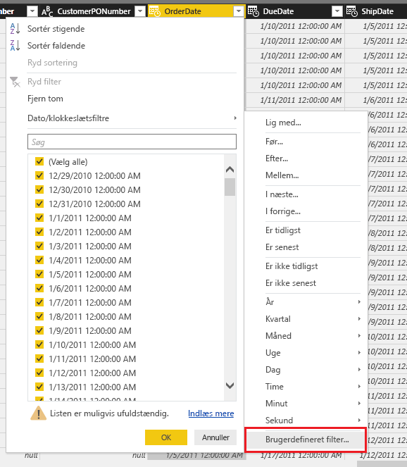
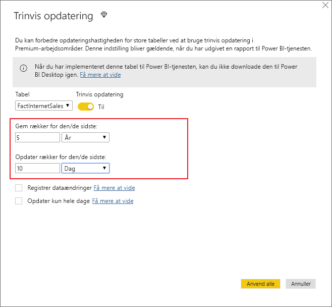
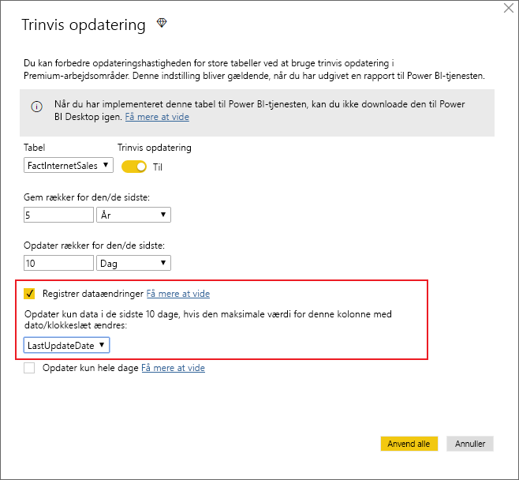
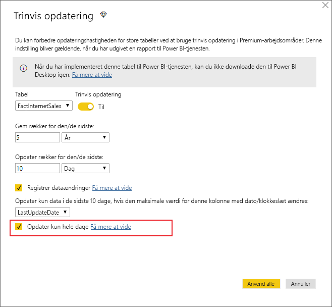
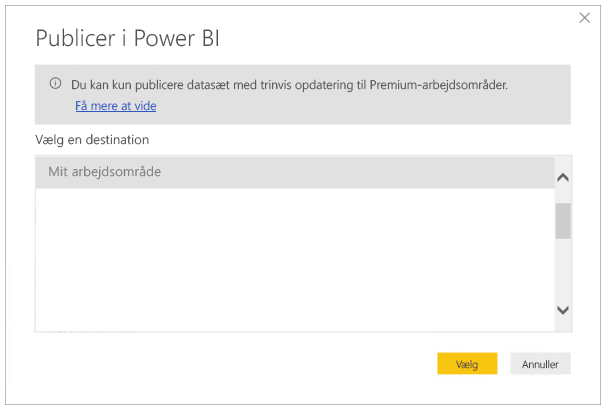

# <a name="incremental-refresh-in-power-bi-premium"></a>Trinvis opdatering i Power BI Premium

En trinvis opdatering gør det muligt at have meget store datasæt i Power BI Premium-tjenesten med følgende fordele:

- **Opdateringer udføres hurtigere.** Det er kun data, der er blevet ændret, som skal opdateres. Opdater f.eks. kun de sidste 5 dage i et datasæt på 10 år.

- **Opdateringer er mere pålidelige.** Det er f.eks. ikke nødvendigt at vedligeholde forbindelser, der kører i lang tid, til ustabile kildesystemer.

- **Ressourceforbruget reduceres.** Hvis der skal opdateres færre data, reduceres det overordnede forbrug af hukommelsen og andre ressourcer.

## <a name="how-to-use-incremental-refresh"></a>Sådan bruger du trinvis opdatering

Politikker om trinvis opdatering er defineret i Power BI Desktop og anvendes, når de er publiceret i Power BI-tjenesten.

Start ved at aktivere trinvis opdatering i funktioner til eksempelvisning.


### <a name="filter-large-datasets-in-power-bi-desktop"></a>Filtrer store datasæt i Power BI Desktop

Store datasæt, der kan indeholde milliarder af rækker, kan måske ikke være i Power BI Desktop, da tjenesten normalt er begrænset af de ressourcer, der er tilgængelige på brugerens stationære computer. Disse datasæt filtreres derfor ofte, efter de er importeret, så der er plads til dem i Power BI Desktop. Dette er tilfældet, uanset om der bruges trinvis opdatering eller ej.

#### <a name="rangestart-and-rangeend-parameters"></a>Parametrene RangeStart og RangeEnd

Hvis du vil bruge trinvis opdatering i Power BI-tjenesten, skal du udføre filtrering ved hjælp af parametrene for dato/klokkeslæt i Power-forespørgsel med de reserverede navne **RangeStart** og **RangeEnd**, hvor der skelnes mellem store og små bogstaver.

Når de er publiceret, overskrives parameterværdierne automatisk af Power BI-tjenesten. Det er ikke nødvendigt at angive dem under indstillinger for datasæt i tjenesten.

Det er vigtigt, at filteret pushes til kildesystemet, når der sendes forespørgsler til opdatering. For at kunne pushe filtrering ned skal datakilden understøtte "forespørgselsfoldning". De fleste datakilder, der understøtter SQL-forespørgsler, understøtter forespørgselsfoldning. Det gør datakilder som flade filer, BLOBs, web og OData-feeds typisk ikke. På grund af de forskellige supportniveauer af forespørgselsfoldning for de enkelte datakilder anbefales det, at du kontrollerer, at filterlogikken er inkluderet i kildeforespørgslerne. I de tilfælde, hvor filteret ikke understøttes af datakildens backend, kan det ikke pushes ned. I sådanne tilfælde kompenserer miksprogrammet og anvender filteret lokalt, hvilket kan kræve, at hele datasættet skal hentes fra datakilden. Dette kan medføre, at trinvis opdatering er meget langsom, og processen kan løbe tør for ressourcer enten i Power BI-tjenesten eller i datagatewayen i det lokale miljø, hvis de bruges.

Filteret bruges til at partitionere dataene i intervaller i Power BI-tjenesten. Det er ikke designet til at understøtte opdatering af den filtrerede datokolonne. En opdatering fortolkes som en indsætning og sletning (ikke en opdatering). Hvis sletningen sker i historikintervallet og ikke i det trinvis interval, registreres den ikke. Dette kan medføre fejl under dataopdatering på grund af konflikter i forbindelse med partitionsnøglen.

I redigeringsfunktionen til Power-forespørgsel skal du vælge **Administrer parametre** for at definere parametrene med standardværdier.


Når parametrene er defineret, kan du anvende filteret ved at vælge menupunktet **Brugerdefineret filter** for en kolonne.



Du skal sikre, at rækker filtreres, hvor kolonneværdien *er efter eller lig med* **RangeStart** og *før* **RangeEnd**.


> [!TIP]
> Da datatypen for parametrene skal være dato/klokkeslæt, er det muligt at konvertere dem, så de overholder kravene til datakilden. Følgende funktion i Power-forespørgsel konverterer f.eks. en dato/klokkeslæt-værdi, så den ligner en heltalssurrogatnøgle i formatet *yyyymmdd*, hvilket er almindeligt for data warehouse-lagre. Funktionen kan kaldes af filtreringstrinnet.
>
> `(x as datetime) => Date.Year(x)*10000 + Date.Month(x)*100 + Date.Day(x)`

Vælg **Luk og anvend** fra redigeringsfunktionen til Power-forespørgsel. Du får et undersæt af datasættet i Power BI Desktop.

### <a name="define-the-refresh-policy"></a>Definer opdateringspolitikken

Trinvis opdatering er tilgængelig via genvejsmenuen for tabeller, undtagen for modeller med direkte forbindelse.


#### <a name="incremental-refresh-dialog"></a>Dialogboksen Trinvis opdatering

Dialogboksen Trinvis opdatering vises. Brug til/fra-tasten til at aktivere dialogboksen.


> [!NOTE]
> Hvis udtrykket fra Power-forespørgsel for tabellen ikke henviser til parametrene med reserverede navne, er til/fra-tasten slået fra.

Teksten i sidehovedet forklarer følgende:

- Trinvis opdatering understøttes kun for arbejdsområder med Premium-kapacitet. Opdateringspolitikker defineres i Power BI Desktop. De anvendes af opdateringshandlinger i tjenesten.

- Hvis du ikke kan hente den PBIX-fil, der indeholder en politik om trinvis opdatering, fra Power BI-tjenesten, åbnes den ikke i Power BI Desktop. Det vil snart ikke være muligt at downloade den overhovedet. Dette understøttes måske i fremtiden, men vær opmærksom på, at disse datasæt kan vokse sig så store, at det er upraktisk at downloade og åbne dem på en typisk stationær computer.

#### <a name="refresh-ranges"></a>Opdateringsintervaller

I følgende eksempel defineres en opdateringspolitik, hvor data for 5 hele kalenderår samt data for det aktuelle år op til den aktuelle dato gemmes, og hvor data for 10 dage gradvist opdateres. Under den første opdateringshandling indlæses historiske data. De efterfølgende opdateringer er trinvise, hvor følgende handlinger udføres (hvis de er planlagt til at køre dagligt).

- Tilføj en ny dags data.

- Opdater ti dage op til dags dato.

- Fjern kalenderår, der er ældre end fem år fra den aktuelle dato. Hvis den aktuelle dato f.eks. er 1. januar 2019, fjernes år 2013.

Under den første opdatering i Power BI-tjenesten kan det tage længere tid at importere alle fem hele kalenderår. Efterfølgende opdateringer kan udføres på meget kortere tid.



**En definition af disse intervaller kan være det eneste, du skal bruge, og i dette tilfælde kan du gå direkte til trinnet for publicering nedenfor. De ekstra rullemenuer bruges til avancerede funktioner.**

### <a name="advanced-policy-options"></a>Avancerede politikindstillinger

#### <a name="detect-data-changes"></a>Registrer dataændringer

En trinvis opdatering på 10 dage er selvfølgelig meget mere effektiv end en komplet opdatering på 5 år. Men vi kan muligvis gøre det endnu bedre. Hvis du markerer afkrydsningsfeltet**Registrer dataændringer**, kan du vælge en dato/klokkeslæt-kolonne, der bruges til at identificere og kun opdatere de dage, hvor dataene er blevet ændret. Det er en forudsætning, at der findes en sådan kolonne i kildesystemet, der typisk bruges til overvågning. **Det må ikke være den samme kolonne, der bruges til at partitionere dataene med parametrene RangeStart/RangeEnd.** Maksimumværdien for denne kolonne evalueres for hver af perioderne i det trinvise interval. Hvis den ikke er ændret siden den seneste opdatering, er det ikke nødvendigt at opdatere perioden. I eksemplet kan det betyde en yderligere reduktion af den trinvise opdatering fra 10 til måske 2 dage.



> [!TIP]
> Det aktuelle design kræver, at kolonnen til registrering af dataændringer bevares og cachelagres i hukommelsen. Du kan evt. overveje en af følgende metoder for at reducere kardinalitet og hukommelsesforbrug.
>
> Bevar kun den maksimale værdi for denne kolonne på tidspunktet for opdateringen, måske ved hjælp af en funktion i Power-forespørgsel.
>
> Reducer præcisionen til et niveau, der er acceptabelt i forhold til dine krav om opdateringshyppighed.
>
> Vi har planer om at gøre det muligt at definere brugerdefinerede forespørgsler til registrering af ændrede data på et senere tidspunkt. Dette kan bruges til helt at undgå at skulle bevare kolonneværdien.

#### <a name="only-refresh-complete-periods"></a>Opdater kun samlede perioder

Lad os antage, at din opdatering er planlagt til at køre kl. 4:00 hver morgen. Hvis der vises data i kildesystemet i løbet af disse 4 timer, ønsker du måske ikke at gøre rede for dem. Nogle målepunkter for virksomheder – f.eks. tønder pr. dag i olie- og gasbranchen – giver ingen mening, hvis dagene er delvise.

Et andet eksempel er opdatering af data fra et økonomisystem, hvor data for den foregående måned godkendes den 12. kalenderdag i måneden. Du kan indstille det trinvise interval til 1 måned og planlægge, at opdateringen skal køre den 12. dag i måneden. Når denne indstilling er markeret, opdateres dataene fra januar f.eks. den 12. februar.



> [!NOTE]
> Opdateringshandlinger i tjenesten kører i UTC-tid. Dette kan være afgørende for ikrafttrædelsesdatoen og have indflydelse på samlede perioder. Vi har planer om at gøre det muligt at tilsidesætte ikrafttrædelsesdatoen for en opdateringshandling.

## <a name="publish-to-the-service"></a>Publicer i tjenesten

Da trinvis opdatering kun er en Premium-funktion, kan der i dialogboksen Publicer kun vælges et arbejdsområde med Premium-kapacitet.



Du kan nu opdatere modellen. Den første opdatering kan tage længere tid, da oversigtsdataene skal importeres. Efterfølgende opdateringer kan være meget hurtigere, fordi der bruges en trinvis opdatering.

## <a name="query-timeouts"></a>Timeout for forespørgsel

I artiklen [Fejlfinding i forbindelse med opdatering](https://docs.microsoft.com/power-bi/refresh-troubleshooting-refresh-scenarios) forklares det, at der kan opstå timeout for opdateringshandlinger i Power BI-tjenesten. Forespørgsler kan også være begrænset af standardtimeout for datakilden. De fleste relationskilder tillader tilsidesættelse af timeout i M-udtryk. I udtrykket nedenfor bruges [funktionen SQL Server-dataadgang ](https://msdn.microsoft.com/query-bi/m/sql-database) f.eks. til at angive det til to timer. Hver periode, der er defineret af politikintervallerne, sender en forespørgsel, der overholder indstillingen for timeout for kommandoer.

```
let
    Source = Sql.Database("myserver.database.windows.net", "AdventureWorks", [CommandTimeout=#duration(0, 2, 0, 0)]),
    dbo_Fact = Source{[Schema="dbo",Item="FactInternetSales"]}[Data],
    #"Filtered Rows" = Table.SelectRows(dbo_Fact, each [OrderDate] >= RangeStart and [OrderDate] < RangeEnd)
in
    #"Filtered Rows"
```
