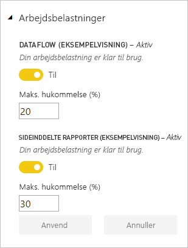
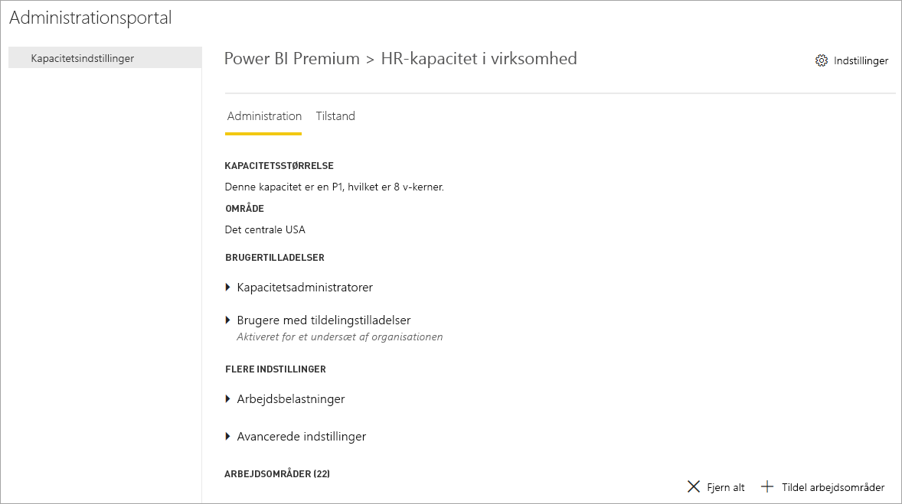
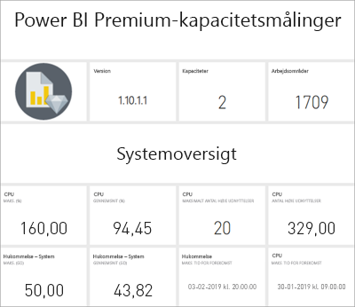
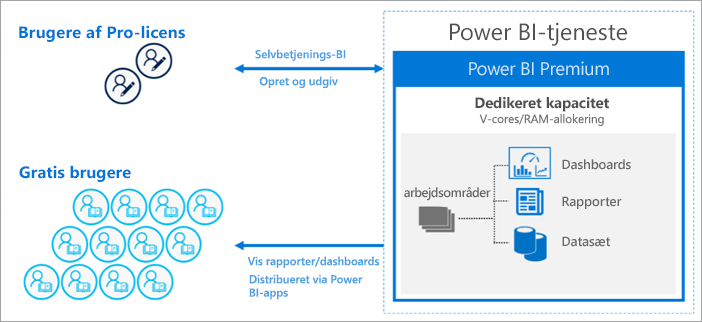
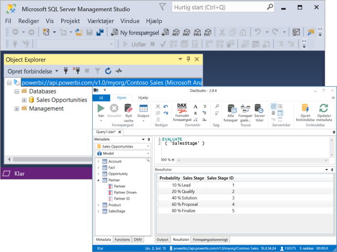

# Hvad er Power BI Premium?

Power BI Premium indeholder dedikerede og forbedrede ressourcer til at køre Power BI-tjenesten for din organisation. Eksempel:

> [!div class="checklist"]
> * Større skalering og ydeevne
> * Fleksibilitet til at licensere efter kapacitet
> * Foren selvbetjenings-BI og virksomhedsmæssig BI
> * Udvid BI i det lokale miljø med Power BI-rapportserver
> * Understøttelse af dataopbevaring efter område (Multi-Geo)
> * Del data med alle uden at købe en licens pr. bruger

I denne artikel introduceres vigtige funktioner i Power BI Premium. Hvor det er nødvendigt, leveres der links til flere artikler med mere detaljerede oplysninger.

## Abonnementer og licenser

Power BI Premium er et Office 365-abonnement på lejerniveau, der er tilgængeligt i to SKU-serier (lagerenheder):

- **EM**-SKU'er (EM1-EM3) til integrering kræver en årlig forpligtelse og faktureres månedsvis. EM1- og EM2-SKU'er er kun tilgængelige via volumenlicensplaner. Du kan ikke købe dem direkte.
- **P**-SKU'er (P1-P3) til integrering og virksomhedsfunktioner kræver en månedlig eller årlig forpligtelse, faktureres månedsvis og indeholder en licens til at installere Power BI-rapportserveren i det lokale miljø.

Der er en alternativ metode til at købe et **Azure Power BI Embedded**-abonnement, som har en enkelt **A** (A1-A6) SKU-serie kun til integrerings- og kapacitetstestformål. Alle SKU'er leverer v-kerner for at oprette kapaciteter, men EM-SKU'erne er begrænset til integrering i mindre størrelsesorden. EM1-, EM2-, A1- og A2-SKU'er med mindre end fire v-kerner kører ikke på dedikeret infrastruktur.

Selvom denne artikel fokuserer på P-SKU'er, er meget af det, der beskrives, også relevant for A-SKU'er. I modsætning til SKU'erne for Premium-abonnementet kræver Azure-SKU'er ingen tidsmæssig binding og faktureres på timebasis. De leverer fuld elasticitet, hvilket gør det muligt at skalere op og ned, afbryde midlertidigt, genoptage og slette. 

Azure Power BI Embedded ligger ganske vist uden for denne artikels rammer, men er beskrevet i afsnittet [Testmetoder](service-premium-capacity-optimize.md#testing-approaches) i artiklen Optimering af Premium-kapaciteter som en praktisk og økonomisk mulighed for at teste og måle arbejdsbelastninger. Du kan få mere at vide om Azure-SKU'er i [dokumentationen til Azure Power BI Embedded](https://azure.microsoft.com/services/power-bi-embedded/).

### Indkøb

Power BI Premium-abonnementer købes af administratorer i Microsoft 365 Administration. Kun globale Office 365-administratorer eller faktureringsadministratorer kan købe SKU'er. Når de er blevet købt, modtager lejeren et tilsvarende antal v-kerner, som kan tildeles til kapaciteter, der kaldes *gruppering af v-kerner*. Køb af en P3-SKU giver f.eks. lejeren 32 v-kerner. Du kan finde flere oplysninger under [Sådan køber du Power BI Premium](service-admin-premium-purchase.md).

## Dedikerede kapaciteter

Med Power BI Premium får du *dedikerede kapaciteter*. I modsætning til en delt kapacitet, hvor arbejdsbelastninger kører på databehandlingsressourcer, der deles med andre kunder, er en dedikeret kapacitet udelukkende til brug af en organisation. Den isoleres med dedikerede databehandlingsressourcer, som sikrer en pålidelig og konsekvent ydeevne for det indhold, der hostes. 

Der er placeret arbejdsområder i kapaciteter. Hver bruger af Power BI har et personligt arbejdsområde, der er kendt som **Mit arbejdsområde**. Der kan oprettes flere arbejdsområder – kendt som **arbejdsområder** – for at muliggøre samarbejde. Arbejdsområder, herunder personlige arbejdsområder, oprettes som standard i den delte kapacitet. Når du har Premium-kapaciteter, kan både Mine arbejdsområder og arbejdsområder tildeles til Premium-kapaciteter.

### Kapacitetsnoder

Som beskrevet i afsnittet [Abonnementer og licenser](#subscriptions-and-licensing) er der to Power BI Premium SKU-serier: **EM** og **P**. Alle Power BI Premium-SKU'er er tilgængelige som *kapacitetsnoder*, som hver især repræsenterer en bestemt mængde ressourcer, der består af processor, hukommelse og lager. Ud over ressourcer har hver SKU en driftsmæssig begrænsning for antallet af DirectQuery-forbindelser og direkte forbindelser pr. sekund samt antallet af parallelle modelopdateringer.

Behandling opnås ved et angivet antal v-kerner, der er ligeligt fordelt mellem backend og frontend.

**Backend-v-kernerne** er ansvarlige for det tunge arbejde i Power BI, herunder behandling af forespørgsler, cachestyring, kørsel af R-servere, modelopdatering, behandling på naturligt sprog (Spørgsmål og svar) og gengivelse af rapporter og billeder på serversiden. Backend-v-kerner tildeles en fast mængde hukommelse, der primært bruges til at hoste modeller, som også kaldes aktive datasæt.

**Frontend-v-kerner** er ansvarlige for webtjenesten, dashboardet og dokumentstyringen af rapporter, administration af adgangsrettigheder, planlægning, API'er, uploads og downloads og generelt alt, hvad der er relateret til brugeroplevelsen.

Lagerpladsen er angivet til **100 TB pr. kapacitetsnode**.

Ressourcerne og grænserne for hver Premium-SKU (og A-SKU'er i en tilsvarende størrelse) er beskrevet i følgende tabel:

| Kapacitetsnoder | V-kerner i alt | Backend-v-kerner | RAM (GB) | Frontend-v-kerner | DirectQuery/direkte forbindelser (pr. sek.) | Parallel opdatering af modeller |
| --- | --- | --- | --- | --- | --- | --- |
| EM1/A1 | 1 | 0,5 | 3 | 0,5 | 3,75 | 1 |
| EM2/A2 | 2 | 1 | 5 | 1 | 7,5 | 2 |
| EM3/A3 | 4 | 2 | 10 | 2 | 15 | 3 |
| P1/A4 | 8 | 4 | 25 | 4 | 30 | 6 |
| P2/A5 | 16 | 8 | 50 | 8 | 60 | 12 |
| P3/A6 | 32 | 16 | 100 | 16 | 120 | 24 |
| | | | | | | |

### Kapacitetsarbejdsbelastninger

Kapacitetarbejdsbelastninger er tjenester, som gøres tilgængelige for brugere. Som standard understøtter Premium- og Azure-kapaciteter kun den datasætarbejdsbelastning, der er knyttet til kørende Power BI-forespørgsler. Arbejdsbelastningen for datasæt kan ikke deaktiveres. Yderligere arbejdsbelastninger kan aktiveres for [AI (Cognitive Services)](https://powerbi.microsoft.com/blog/easy-access-to-ai-in-power-bi-preview/), [Dataflows](service-dataflows-overview.md#dataflow-capabilities-on-power-bi-premium) og [Sideinddelte rapporter](paginated-reports-save-to-power-bi-service.md). Disse arbejdsbelastninger understøttes kun i Premium-abonnementer. 

Hver ekstra arbejdsbelastning gør det muligt at konfigurere den maksimale hukommelse (som en procentdel af den samlede tilgængelige hukommelse), der kan bruges af arbejdsbelastningen. Standardværdier for maksimumhukommelse bestemmes af SKU. Du kan maksimere din kapacitets tilgængelige ressourcer ved at aktivere disse yderligere arbejdsbelastninger, når de bruges. Og du kan kun ændre hukommelsesindstillinger, når du har bestemt, at standardindstillingerne ikke opfylder dine krav til kapacitetsressourcer. Arbejdsbelastninger kan aktiveres og konfigureres for en kapacitet af kapacitetsadministratorer ved hjælp af **Kapacitetsindstillinger** på [administrationsportalen](service-admin-portal.md) eller ved hjælp af [REST-API'er for kapaciteter](https://docs.microsoft.com/rest/api/power-bi/capacities).  

Du kan få mere at vide under [Konfigurer arbejdsbelastninger i en Premium-kapacitet](service-admin-premium-workloads.md). 

### Sådan fungerer kapaciteter

Power BI-tjenesten udnytter hele tiden kapacitetsressourcerne bedst muligt uden at overskride de grænser, der er pålagt kapaciteten.

Kapacitetshandlinger er klassificeret som enten *interaktive* eller *baggrundshandlinger*. Interaktive handlinger omfatter gengivelse af anmodninger og svare på Brugerinteraktioner (filtrering, spørgsmål og svar-forespørgsel, osv.). Som hovedregel er importmodelforespørgsler meget krævende for hukommelsesressourcerne, mens modelforespørgsler om DirectQuery og direkte forbindelser er krævende for CPU'en. Handlinger i baggrunden omfatter opdateringer af dataflows og importmodeller samt cachelagring af dashboardforespørgsler.

Det er vigtigt at forstå, at interaktive handlinger altid går forud for handlinger i baggrunden for at sikre den bedst mulige brugeroplevelse. Hvis der ikke er tilstrækkelige ressourcer, føjes handlinger i baggrunden til en kø for at blive behandlet, når ressourcerne frigøres. Handlinger i baggrunden, f.eks. datasætopdateringer, kan stoppes midt i processen af Power BI-tjenesten og føjes til en kø.

Importmodeller skal være fuldt indlæst i hukommelsen, så de kan forespørges eller opdateres. Power BI-tjenesten administrerer hukommelsesforbrug ved hjælp af avancerede algoritmer for at sikre maksimal anvendelse af den tilgængelige hukommelse, og det kan medføre overallokering af kapaciteten: Selvom det er muligt for en kapacitet at lagre mange importmodeller (op til 100 TB pr. Premium-kapacitet), når deres kombinerede disklager overskrider den understøttede hukommelse (og ekstra hukommelse kræves til forespørgsler og opdateringer), kan de ikke alle indlæses i hukommelsen på samme tid.

Importmodeller indlæses derfor i og fjernes fra hukommelsen i henhold til forbrug. En importmodel indlæses, når den forespørges (interaktiv handling) og endnu ikke er i hukommelsen, eller når den skal opdateres (handling i baggrunden).

Sletning af en model fra hukommelsen kaldes *fjernelse*. Det er en handling, som Power BI kan udføre hurtigt afhængigt af størrelsen på modellerne. Hvis kapaciteten ikke oplever noget pres på hukommelsen, indlæses modellerne i hukommelsen og forbliver der. Men hvis der ikke er tilstrækkelig hukommelse til at indlæse en model, skal Power BI-tjenesten først frigøre hukommelse. Den frigør hukommelse ved at registrere modeller, der er blevet inaktive, ved at søge efter modeller, som ikke har været anvendt i de sidste tre minutter \[[1](#endnote-1)\], og fjerner dem derefter. Hvis der ikke er nogen inaktive modeller at fjerne, forsøger Power BI-tjenesten at fjerne modeller, der er indlæst til handlinger i baggrunden. En sidste udvej efter 30 sekunder med mislykkede forsøg \[[1](#endnote-1)\] er at afbryde den interaktive handling. I dette tilfælde får rapportbrugeren besked om fejlen med et forslag om at prøve igen om et øjeblik. I nogle tilfælde fjernes modeller fra hukommelsen pga. servicehandlinger.

Det er vigtigt at understrege, at fjernelse af datasæt er en normal og forventet funktionsmåde. Den har til formål at maksimere forbruget af hukommelse ved at indlæse og fjerne modeller, hvis størrelse tilsammen kan overskride den tilgængelige hukommelse. Dette er tilsigtet og åbenlyst for rapportbrugerne. Høje fjernelsesrater betyder ikke nødvendigvis, at kapaciteten har fået tildelt utilstrækkelige ressourcer. De kan dog blive et problem, hvis svartiden for forespørgsler eller opdateringer bliver påvirket af de høje fjernelsesrater.

Opdateringer af importmodeller er altid hukommelseskrævende, da modeller skal indlæses i hukommelsen. Der kræves ekstra hukommelse til behandling. En fuld opdatering kan bruge ca. dobbelt så meget hukommelse, der kræves af modellen. Dette sikrer, at modellen kan forespørges, selv når den behandles, da forespørgsler sendes til den eksisterende model, indtil opdateringen er fuldført, og de nye modeldata er tilgængelige. En trinvis opdatering kræver mindre hukommelse og kan fuldføres hurtigere og kan derfor i høj grad reducere belastningen af kapacitetsressourcer. Opdateringer kan også være CPU-krævende for modeller, især dem med komplekse Power-transformationer eller beregnede tabeller/kolonner, som er komplekse eller baseret på store tabeller.

Opdateringer af f.eks. forespørgsler kræver, at modellen indlæses i hukommelsen. Hvis der ikke er tilstrækkelig hukommelse, vil Power BI-tjenesten forsøge at udsætte inaktive modeller, og hvis det ikke er muligt (da alle modeller er aktive), sættes opdateringsjobbet i kø. Opdateringer er typisk CPU-krævende, endda endnu mere krævende end forespørgsler. Der er derfor kapacitetsbegrænsninger for antallet af samtidige opdateringer, der er angivet til 1,5 gange antallet af backend-v-kerner, rundet op. Hvis der er for mange samtidige opdateringer, sættes en planlagt opdatering i kø. Når disse situationer opstår, tager det længere tid at fuldføre opdateringen. Opdateringer efter behov, f.eks. dem, der udløses af en brugeranmodning eller et API-kald, forsøger igen tre gange \[[1](#endnote-1)\]. Hvis der stadig ikke er tilstrækkelige ressourcer, mislykkes opdateringen.

Afsnitsnoter:   
\[1\] Kan ændres.

### Områdesupport

Når du opretter en ny kapacitet, kan globale Office 365-administratorer og administratorer af Power BI-tjenesten angive et område, hvor arbejdsområder, der er tildelt til kapaciteten, er placeret. Dette kaldes **Multi-Geo**. Med Multi-Geo kan organisationer opfylde krav til dataplacering ved at implementere indhold i datacentre i et bestemt område, også selvom det er forskelligt fra det område, som Office 365-abonnementet gælder for. Du kan få mere at vide under [Multi-Geo-understøttelse i Power BI Premium](service-admin-premium-multi-geo.md).

### Kapacitetsadministration

Administration af Premium-kapaciteter omfatter oprettelse eller sletning af kapaciteter, tildeling af administratorer, tildeling af arbejdsområder, konfiguration af arbejdsbelastninger, overvågning og udførelse af justeringer til optimering af kapacitetsydeevnen. 

Globale Office 365-administratorer eller administratorer af Power BI-tjenesten kan oprette Premium-kapaciteter fra tilgængelige v-kerner eller redigere eksisterende Premium-kapaciteter. Når der oprettes en kapacitet, angives kapacitetens størrelse og det geografiske område, og der tildeles mindst én kapacitetsadministrator. 

Når der oprettes kapaciteter, udføres de fleste administrative opgaver på [administrationsportalen](service-admin-portal.md).

Kapacitetsadministratorer kan tildele arbejdsområder til kapaciteten, administrere brugertilladelser og tildele andre administratorer. Kapacitetsadministratorer kan også konfigurere arbejdsbelastninger, justere hukommelsesallokeringer og om nødvendigt genstarte en kapacitet, hvilket medfører nulstilling af handlinger, hvis en kapacitet overbelastes.

Kapacitetsadministratorer kan også sikre, at en kapacitet kører, som den skal. De kan overvåge kapacitetens tilstand direkte via administrationsportalen eller ved hjælp af programmet Premium Capacity Metrics.

Du kan få mere at vide om oprettelse af kapaciteter, tildeling af administratorer og tildeling af arbejdsområder under [Administration af Premium-kapaciteter](service-premium-capacity-manage.md). Du kan få mere at vide om roller under [Administratorroller, der er relateret til Power BI](service-admin-administering-power-bi-in-your-organization.md#administrator-roles-related-to-power-bi).

### Overvågning

Overvågning af Premium-kapaciteter giver administratorer en forståelse af, hvordan kapaciteter kører. Kapaciteter kan overvåges ved hjælp af administrationsportalen og [appen Power BI Premium Capacity Metrics](https://app.powerbi.com/groups/me/getapps/services/capacitymetrics).

Overvågning på portalen giver et hurtigt overordnet overblik over målepunkter og angiver belastninger, der er placeret, og de ressourcer, der er brugt af din kapacitet. Det vises som et gennemsnit for de seneste syv dage. 

Programmet **Power BI Premium Capacity Metrics** giver de mest detaljerede oplysninger om ydeevnen af dine kapaciteter. Programmet indeholder et overordnet dashboard og mere detaljerede rapporter.

I programmets dashboard kan du klikke på en celle med målepunkter for at åbne en detaljeret rapport. Rapporter indeholder detaljerede målepunkter og en filterfunktion til detailudledning af de vigtigste oplysninger, du skal bruge for at sikre, at dine kapaciteter kører, som de skal.

Du kan få mere at vide om overvågning af kapaciteter under [Overvågning på Power BI-administrationsportalen](service-admin-premium-monitor-portal.md) og [Overvågning med programmet Power BI Premium Capacity Metrics](service-admin-premium-monitor-capacity.md).

### Optimering af kapaciteter

Det er vigtigt, at du udnytter dine kapaciteter bedst muligt, for at sikre, at brugerne får den bedste ydeevne, og at du får mest muligt ud af din investering i Premium. Ved at overvåge vigtige målepunkter kan administratorer afgøre, hvordan de bedst foretager fejlfinding i forbindelse med flaskehalse og foretager de nødvendige handlinger. Du kan få mere at vide under [Optimering af Premium-kapaciteter](service-premium-capacity-optimize.md) og [Premium-kapacitetsscenarier](service-premium-capacity-scenarios.md).

### REST-API'er for kapaciteter

Power BI REST-API'er indeholder en samling [kapacitets-API'er](https://docs.microsoft.com/rest/api/power-bi/capacities). Administratorer kan bruge disse API'er til at administrere mange aspekter af dine Premium-kapaciteter via programmering, herunder aktivering og deaktivering af arbejdsbelastninger, tildeling af arbejdsområder til en kapacitet og meget mere.

## Store datasæt

Afhængigt af SKU'en understøtter Power BI Premium upload af Power BI Desktop-modelfiler (.pbix) med en størrelse på højst **10 GB**. Når modellen er indlæst, kan den publiceres til et arbejdsområde, der er tildelt til en Premium-kapacitet. Datasættet kan derefter opdateres til en størrelse på op til **12 GB**.

### Overvejelser i forbindelse med størrelse

Store modeller kan være ressourcekrævende. Du skal have mindst en P1-SKU for modeller, der er større end 1 GB. Selvom publicering af store modeller til arbejdsområder, som understøttes af A-SKU'er op til A3, kan fungere, vil en opdatering af dem ikke fungere.

I nedenstående tabel beskrives de anbefalede SKU'er til forskellige .pbix-størrelser:

   |SKU  |.pbix-størrelse   |
   |---------|---------|
   |P1    | < 3 GB        |
   |P2    | < 6 GB        |
   |P3, P4, P5    | op til 10 GB   |

Power BI Embedded A4-SKU'en er lig med P1-SKU'en, A5-SKU'en = P2 og A6-SKU'en = P3. Hvis du udgiver store modeller til A- og EM-SKU'er, kan det returnere fejl, der ikke er specifikke for størrelsesbegrænsningen af modellen i den delte kapacitet. Opdateringsfejl for store modeller i A- og EM-SKU'er skyldes sandsynligvis timeout. 

Dine .pbix-filer repræsenterer data i en *stærkt komprimeret tilstand*. Data udvides sandsynligvis flere gange, når de indlæses i hukommelsen, og herfra vil de sikkert blive udvidet gentagne gange under dataopdatering.

Planlagt opdatering af store datasæt kan tage lang tid og være ressourcekrævende. Det er vigtigt, at du ikke planlægger for mange overlappende opdateringer. Vi anbefaler, at du konfigurerer en [trinvis opdatering](service-premium-incremental-refresh.md), fordi det er hurtigere og mere pålideligt og forbruger færre ressourcer.

Den første rapportindlæsning af store datasæt kan tage lang tid, hvis det er et stykke tid siden, det sidste datasæt blev brugt. En linje for længere rapportindlæsninger viser indlæsningens status.

Selvom hukommelses- og tidsbegrænsninger pr. forespørgsel er meget større i Premium-kapacitet, så anbefales det, at du bruger filtre og udsnitsværktøj til at begrænse visuelle elementer, så der kun vises det mest nødvendige.

## Trinvis opdatering

En trinvis opdatering gør det nemmere at opbevare og vedligeholde store datasæt i Power BI Premium. En trinvis opdatering har mange fordele, f.eks. er opdateringer hurtigere, fordi det kun er data, der er ændret, som skal opdateres. Opdateringer er mere pålidelige, fordi det ikke længere er nødvendigt at vedligeholde langtidskørende forbindelser til ustabile datakilder. Forbrug af ressourcer reduceres, fordi der skal opdateres færre data, hvilket betyder et mindre overordnet forbrug af hukommelsen og andre ressourcer. Politikker om trinvis opdatering er defineret i **Power BI Desktop** og anvendes, når de er publiceret på et arbejdsområde i en Premium-kapacitet. 

Du kan få mere at vide under [Trinvis opdatering i Power BI Premium](service-premium-incremental-refresh.md).

## Sideinddelte rapporter

Sideinddelte rapporter, der understøttes på P1-P3- og A4-A6-SKU'er, er baseret på RDL-teknologi (Report Definition Language) i SQL Server Reporting Services. De er baseret på RDL-teknologien, men er ikke det samme som Power BI-rapportserveren, som er en rapporteringsplatform, der kan downloades, og som du kan installere i det lokale miljø. Også inkluderet i Power BI Premium. Sideinddelte rapporter formateres, så de passer til en side, der kan udskrives eller deles. Data vises i en tabel, også selvom tabellen strækker sig over flere sider. Ved hjælp af det gratis Windows-skrivebordsprogram [**Power BI Report Builder**](https://go.microsoft.com/fwlink/?linkid=2086513) kan brugere oprette sideinddelte rapporter og publicere dem til tjenesten.

I Power BI Premium er sideinddelte rapporter en arbejdsbelastning, der skal aktiveres for en kapacitet ved hjælp af administrationsportalen. Kapacitetsadministratorer kan aktivere og derefter angive mængden af hukommelse som en procentdel af kapacitetens overordnede hukommelsesressourcer. I modsætning til andre typer arbejdsbelastninger kører Power BI Premium sideinddelte rapporter i et afgrænset område i kapaciteten. Den maksimale hukommelse, der angives for dette område, bruges, uanset om arbejdsbelastningen er aktiv eller ej. Standarden er 20 %. 

Du kan få mere at vide under [Sideinddelte rapporter i Power BI Premium](paginated-reports-report-builder-power-bi.md). Du kan få mere at vide om aktivering af arbejdsbelastningen for sideinddelte rapporter under [Konfigurer arbejdsbelastninger](service-admin-premium-workloads.md).

## Power BI-rapportserver
 
Power BI-rapportserveren er inkluderet i Power BI Premium og er en rapportserver med en webportal i *det lokale miljø*. Du kan opbygge dit BI-miljø lokalt og distribuere rapporter bag din virksomheds firewall. Med rapportserveren får brugere adgang til omfattende, interaktive funktioner til virksomhedsrapportering i SQL Server Reporting Services. Brugere kan udforske data og hurtigt finde mønstre, så de kan træffe bedre og hurtigere beslutninger. Rapportserveren giver dig styring på dine egne betingelser. Hvis og når tiden er inde, gør Power BI-rapportserveren det nemt at overføre til cloudmiljøet, hvor din organisation kan drage fordel af alle funktioner i Power BI Premium.

Du kan få mere at vide under [Power BI-rapportserver](report-server/get-started.md).

## Ubegrænset indholdsdeling

Med Premium kan alle – uanset om de befinder sig i eller uden for organisationen – få vist dit Power BI-indhold, herunder sideinddelte og interaktive rapporter, uden at købe individuelle licenser. 

Premium muliggør omfattende distribution af indhold for Pro-brugere uden at kræve Pro-licenser for modtagere, der får vist indholdet. Pro-licenser kræves for oprettere af indhold. Oprettere opretter forbindelse til datakilder og modeldata og opretter rapporter og dashboards, der er pakket som arbejdsområdeapps. 

Du kan få mere at vide under [Power BI-licenser](service-admin-licensing-organization.md).

## Værktøjsforbindelse (prøveversion)

Under overfladen styres Power BI-datasæt af det gennemtestede Microsoft-program **Analysis Services Vertipaq**. Analysis Services understøtter programmerings- og klientprogrammer og -værktøjer via klientbiblioteker og API'er, der understøtter XMLA-protokollen med åbne standarder. Power BI Premium-datasæt understøtter i øjeblikket *skrivebeskyttede* forbindelser fra klientprogrammer og værktøjer fra Microsoft og tredjeparter via **XMLA-slutpunkter**. 

Microsoft-værktøjer, f.eks. SQL Server Management Studio og SQL Server Profiler, og tredjepartsapps, f.eks. DAX Studio og programmer til datavisualisering, kan oprette forbindelse til og forespørge om Premium-datasæt ved hjælp af XMLA, DAX, MDX, DMV'er og sporingshændelser. 

Du kan få mere at vide under [Opret forbindelse til datasæt med klientprogrammer og -værktøjer](service-premium-connect-tools.md).

## Næste trin

> [!div class="nextstepaction"]
> [Administration af Premium-kapaciteter](service-premium-capacity-manage.md)

Har du flere spørgsmål? [Prøv at spørge Power BI-community'et](https://community.powerbi.com/)

||||||
