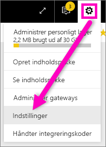
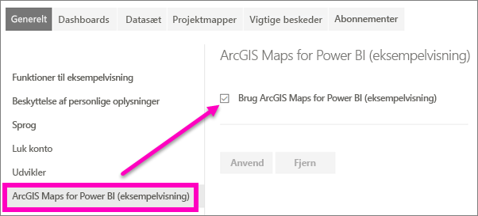

# Tilmeld dig Power BI-prøveversionsfunktioner
## Hvad er *prøveversionsfunktioner*?
I takt med at vi foretager forbedringer af Power BI, frigiver vi nogle nye funktioner som *prøveversionsfunktioner*. Prøveversionsfunktioner kan slås til og fra, hvilket giver dig mulighed for at prøve dem.

> [!TIP]
> Har du spørgsmål eller feedback? [Besøg Power BI-communityforummet](http://community.powerbi.com/t5/Navigation-Preview-Forum/bd-p/NavigationPreview).
> 
> 

## Aktuelle tilgængelige prøveversioner
**ArcGIS Maps til Power BI-prøveversion** Kombinationen af ArcGIS Maps og Power BI tager kort til et helt nyt niveau, som involverer mere end præsentation af punkter på et kort.
[Få en præsentation af ArcGIS Maps af esri i Power BI-tjenesten og Power BI Desktop](power-bi-visualization-arcgis.md).

## Slå ArcGIS-prøveversionsfunktionen til og fra
1. Åbn menuen Indstillinger ved at vælge tandhjulsikonet i øverste højre hjørne af Power BI-skærmen, og vælg **Indstillinger**.
   
   .
2. Vælg fanen **Generelt**, og vælg **Prøveversionsfunktioner**.
   
   
3. Vælg alternativknappen **Til** for at prøve det nye oplevelse. Klik på **Anvend**.
4. Du slår prøveversionsfunktionerne fra ved at følge trin 1-2 ovenfor og vælge **Fra** > **Anvend** i trin 3.

## Næste trin
[Ny navigationsoplevelse med Power BI](service-the-new-power-bi-experience.md)

Har du spørgsmål eller feedback? [Besøg Power BI-communityforummet](http://community.powerbi.com/t5/Navigation-Preview-Forum/bd-p/NavigationPreview).

