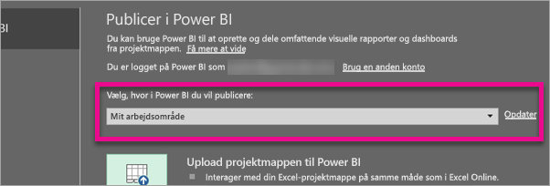
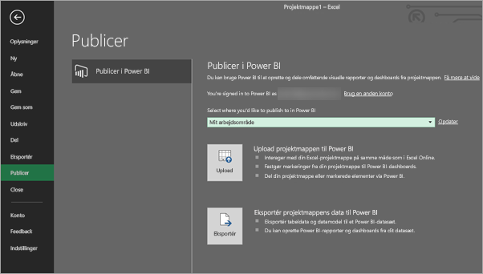
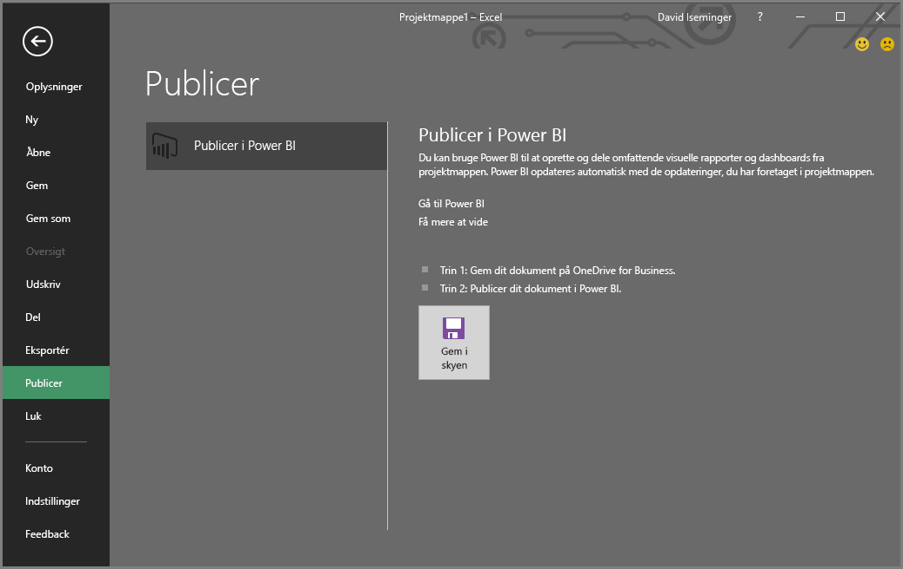
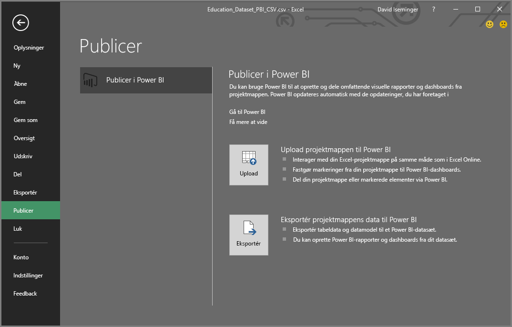
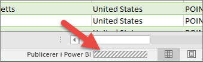

# Publicer på Power BI fra Excel 2016
Med Excel 2016 kan du publicere dine Excel-projektmapper på dit [Power BI](https://powerbi.microsoft.com)-websted, hvor du kan oprette meget interaktive rapporter og dashboards, der er baseret på data i din projektmappe. Derefter kan du dele din indsigt med andre i organisationen.

Før vi fortsætter, er der nogle ting, du skal være opmærksom på:

* Før du kan publicere på Power BI, skal projektmappen gemmes i OneDrive for Business.
* Den konto, du bruger til at logge på Office, OneDrive for Business og Power BI, skal være den samme konto.
* Du kan ikke publicere en tom projektmappe eller en projektmappe, som ikke har noget indhold, der understøttes af Power BI.
* Du kan ikke publicere krypterede eller adgangskodebeskyttede projektmapper eller projektmapper med Information Protection Management.
* Publicering på Power BI kræver, at moderne godkendelse er aktiveret (standard). Hvis den er deaktiveret, er indstillingen Publicer ikke tilgængelig i menuen Filer.

## Sådan publicerer du din Excel-projektmappe
Vælg **Filer** > **Publicer** i Excel.

### Publicering af lokale filer
Fra opdateringen i februar 2017 understøtter Excel 2016 publicering af lokale Excel-filer. De behøver ikke at blive gemt på OneDrive for Business eller SharePoint Online.

> [!IMPORTANT]
> Kun Excel 2016 med et Office 365-abonnement vil kunne publicere med lokale filer. Enkeltstående installation af Excel 2016 vil stadig kun have "Publicer"-funktionalitet, som kræver, at Excel-projektmappen gemmes på OneDrive for Business eller SharePoint Online.
> 
> 

Når du vælger **Publicer**, kan du vælge det arbejdsområde, du vil publicere til. Det kan være dit personlige arbejdsområde eller et gruppearbejdsområde, du har adgang til.

Du har to muligheder for at få din projektmappe ind i Power BI.

Når den er publiceret, gemmes den som en kopi i Power BI, der er adskilt fra den lokale fil. Hvis du vil opdatere filen i Power BI, skal du publicere den opdaterede version igen. Du kan opdatere dataene og angive planlagt opdatering af projektmappen eller datasættet i Power BI.

### Publicering fra Excel Enkeltstående
Hvis din projektmappe ikke allerede er gemt på OneDrive, skal du gemme den der først. Vælg Gem i skyen, og vælg en placering i OneDrive for Business.

Når projektmappen er gemt på OneDrive, har du muligheder for at få din projektmappe ind i Power BI, når du vælger **Publicer**.

#### Upload projektmappen til Power BI
Når du vælger denne indstilling, vises din projektmappe i Power BI på samme måde, som den ville blive vist i Excel Online. Men i modsætning til Excel Online får du nogle fantastiske funktioner, så du kan fastgøre elementer fra dine regneark i dine dashboards.

Du kan ikke redigere projektmappen, når den er åben i Power BI, men hvis du har brug for at foretage ændringer, kan du vælge **Rediger** og derefter redigere projektmappen i Excel Online eller åbne den i Excel på din computer. Alle ændringer, du foretager, gemmes i projektmappen på OneDrive.

Der oprettes ingen datasæt i Power BI, når du uploader. Din projektmappe vises i Rapporter i arbejdsområdets navigationsrude. Projektmapper, der er uploadet til Power BI, har et særligt Excel-ikon, der identificerer dem som Excel-projektmapper, som er blevet uploadet.

Vælg denne indstilling, hvis du kun har data i regneark, eller hvis du har pivottabeller og diagrammer, du vil se i Power BI.
At bruge Upload fra Publicer i Power BI i Excel er stort set det samme som at bruge Hent data > Filer > OneDrive for Business > Opret forbindelse til, administrer og se Excel-data i Power BI fra Power BI i din browser.

#### Eksportér projektmappens data til Power BI
Når du vælger denne indstilling, eksporteres alle understøttede data i tabeller og/eller en datamodel til et nyt datasæt i Power BI. Hvis du har Power View-ark, genskabes disse i Power BI som rapporter.

Du kan fortsætte med at redigere din projektmappe. Når dine ændringer er gemt, bliver de synkroniseret med datasættet i Power BI, som regel inden for cirka en time. Hvis du har brug for, at dette sker hurtigere, kan du blot vælge Publicer igen, så eksporteres dine ændringer med det samme. Eventuelle visuelle effekter, du har i rapporter og dashboards, opdateres også.

Vælg denne indstilling, hvis du har brugt Hent og transformér data eller Power Pivot til at indlæse data i en datamodel, eller hvis din projektmappe indeholder Power View-ark med visualiseringer, som du vil have vist i Power BI.

At bruge Eksportér fra Publicer i Power BI i Excel er stort set det samme som at bruge Hent data > Filer > OneDrive for Business > Eksportér Excel-data til Power BI fra Power BI i din browser.

## Publicering
Når du vælger en af indstillingerne, vil Excel logge på Power BI med din nuværende konto og derefter publicere din projektmappe på dit Power BI-websted. Hold øje med statuslinjen i Excel. Den viser, hvordan det går.

Når du er færdig, kan du gå til Power BI direkte fra Excel.

## Næste trin
[Excel-data i Power BI](service-excel-workbook-files.md)  
Har du flere spørgsmål? [Prøv at spørge Power BI-community'et](http://community.powerbi.com/)

