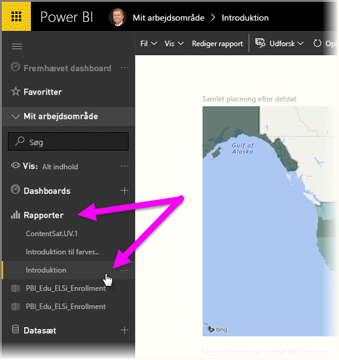
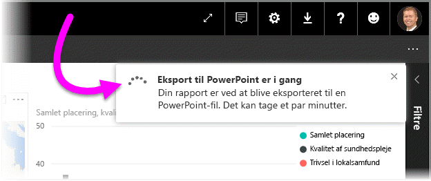
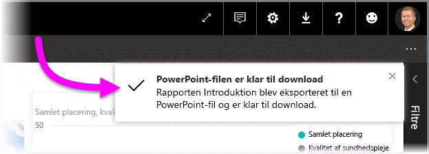
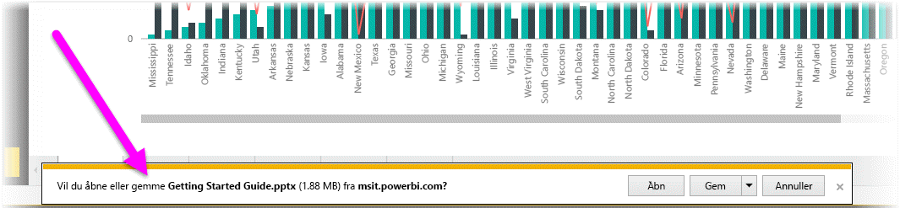
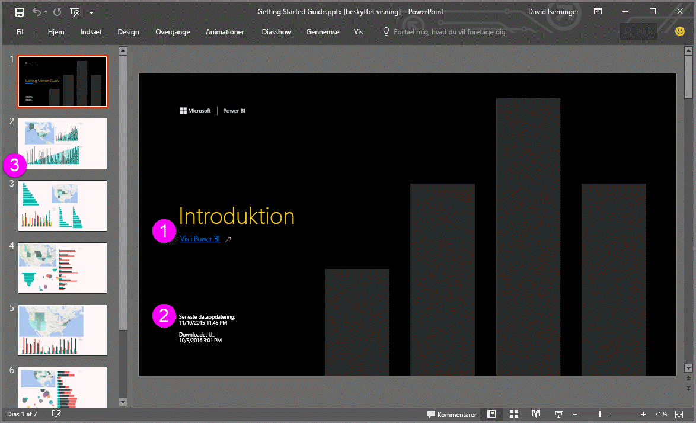
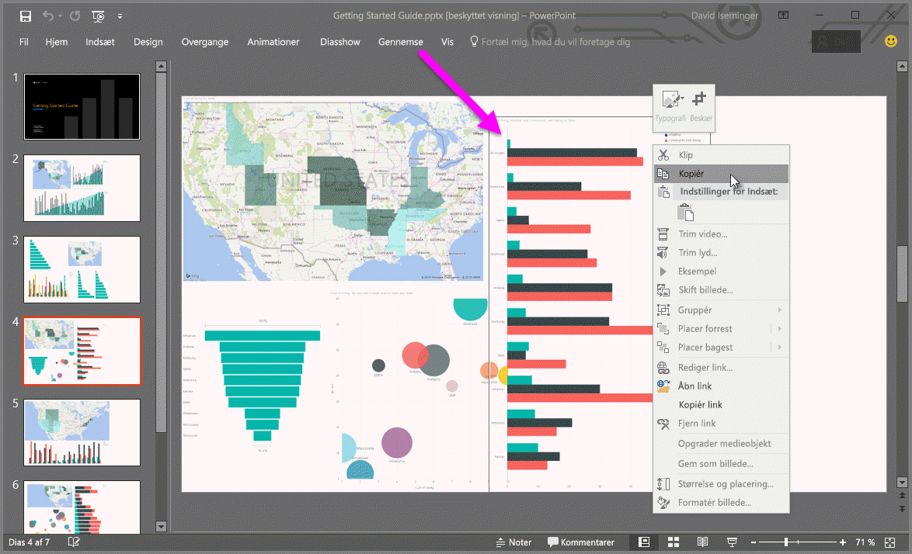

# Eksportér rapporter fra Power BI til PowerPoint (preview)
Med Power BI kan du nu publicere din rapport i **Microsoft PowerPoint** og nemt oprette et slidesæt ud fra din Power BI-rapport. Når du **eksporterer til PowerPoint**, sker der følgende:

* Hver side i Power BI-rapporten bliver til et enkeltslide i PowerPoint
* Hver side i Power BI-rapporten eksporteres som et enkelt billede med høj opløsning i PowerPoint
* Tekstfelter i Power BI-rapporten bliver til redigerbare tekstfelter i PowerPoint
* Der oprettes et link i PowerPoint, som er en kæde til Power BI-rapporten

Det er nemt at få din **Power BI-rapport** eksporteret til **PowerPoint**. Du skal blot følge de trin, der er beskrevet i det næste afsnit.

## Sådan eksporterer du en Power BI-rapport til PowerPoint
I Power BI-tjenesten skal du vælge sektionen **Rapporter** i venstre navigationsrude for at udvide denne sektion, og derefter skal du vælge din rapport for at vise den på lærredet. Du kan også vælge en rapport fra sektionen **Mit arbejdsområde** eller dine **Favoritter**, hvis rapporten findes på en af disse placeringer.

Når den rapport, du vil eksportere til PowerPoint, vises på lærredet, skal du vælge **Filer > Eksportér til PowerPoint (preview)** på menulinjen i Power BI-tjenesten, sådan som det er vist på følgende billede.

Du får vist et meddelelsesbanner i øverste højre hjørne af Power BI-tjenestens browservindue, hvor der står, at rapporten eksporteres til PowerPoint. Dette kan tage nogle minutter, og du kan fortsætte med at arbejde i Power BI, mens rapporten eksporteres.

Når dette er fuldført, ændres meddelelsesbanneret for at give dig besked om, at Power BI-tjenesten er færdig med eksporten.

Derefter finder du din fil der, hvor din browser viser downloadede filer. På det følgende billede vises det som et downloadbanner i bunden af browservinduet.

Så nemt er det. Du kan downloade filen, åbne den med PowerPoint og derefter ændre eller forbedre den yderligere, lige som du ville gøre med et hvilket som helst andet PowerPoint-slidesæt.

## Udtjekning af din eksporterede PowerPoint-fil
Når du åbner den PowerPoint-fil, som Power BI har eksporteret, kan du finde nogle smarte og nyttige elementer. Se følgende billede, og se derefter de nummererede elementer nedenfor, som beskriver nogle af disse smarte funktioner.

1. Den første side i slidesættet indeholder navnet på din rapport og et link, så du kan få den rapport, som slidesættet er baseret på, **vist i Power BI**.
2. Du får også vist nogle nyttige oplysninger om rapporten, herunder den *seneste dataopdatering*, som rapporten er baseret på, og *dato og klokkeslæt for download*, som er det klokkeslæt og den dato, hvor Power BI-rapporten blev eksporteret til en PowerPoint-fil.
3. Hver rapportside er en separat slide, sådan som det er vist i venstre navigationsrude.
4. Din publicerede rapport er gengivet på det sprog, der er angivet under dine Power BI-indstillinger, og ellers i henhold til indstillingen for landestandard i din browser. Hvis du vil se eller indstille dine sprogindstillinger, skal du vælge tandhjulsikonet  **> Indstillinger > Generelt > Sprog**. Du kan finde oplysninger om landestandard i [Understøttede sprog og lande/områder til Power BI](supported-languages-countries-regions.md).
5. PowerPoint-præsentationen indeholder en forsideslide med tidspunktet for eksporten i den korrekte tidszone.

Når du skifter til en bestemt slide, kan du se, at hver rapportside er et uafhængigt billede.

>[!NOTE]
> Det er en ny funktionsmåde at have en visual for hver rapportside. Den tidligere funktionsmåde, som viste et uafhængigt billede for hver visual, implementeres ikke længere. 
 

Hvad du herefter gør med dit PowerPoint-slidesæt eller nogen af billederne i høj opløsning, er op til dig!

## Begrænsninger
Der er nogle få overvejelser og begrænsninger, du skal huske på, når du arbejder med funktionen **Eksportér til PowerPoint**.

* **R-visuals** understøttes ikke i øjeblikket. Sådanne visuals eksporteres som et tomt billede til PowerPoint med en fejlmeddelelse, hvor der står, at den pågældende visual ikke understøttes.
* **Brugerdefinerede visuals**, der er blevet **certificeret**, understøttes. Hvis du vil have flere oplysninger om certificerede brugerdefinerede visuals, herunder hvordan du får en brugerdefineret visual certificeret, skal du se [Sådan får du en brugerdefineret visual certificeret](power-bi-custom-visuals-certified.md). Brugerdefinerede visuals, som ikke er certificeret, understøttes ikke og eksporteres som tomme billeder til PowerPoint med en fejlmeddelelse om, at den pågældende visual ikke understøttes.
* **Certificerede brugerdefinerede visuals** understøttes. En certificeret visual er blevet godkendt til brug med Power BI, opfylder visse kodekrav og har bestået meget strenge sikkerhedstests. Du kan [få mere at vide om **certificerede brugerdefinerede visuals**](power-bi-custom-visuals-certified.md).
* Rapporter med mere end 15 rapportsider kan ikke eksporteres i øjeblikket.
* Processen med at eksportere rapporten til PowerPoint kan tage nogle minutter at fuldføre, så vær tålmodig. Faktorer, som kan påvirke den tid, det kræver, omfatter rapportens struktur og den aktuelle belastning på Power BI-tjenesten.
* Hvis menuelementet **Eksportér til PowerPoint (preview)** ikke er tilgængeligt i Power BI-tjenesten, er det sandsynligvis fordi, din lejeradministrator har deaktiveret funktionen. Kontakt din lejeradministrator for at få flere oplysninger.
* Baggrundsbilleder beskæres med diagrammets omgivende område. Det anbefales, at du fjerner baggrundsbilleder, før du eksporterer til PowerPoint.
* **Interaktivitet i sessionen** såsom fremhævning og filtrering, detailudledning osv. understøttes endnu ikke ved eksport til PowerPoint. Den eksporterede PowerPoint-præsentation viser de oprindelige visuals, sådan som de blev gemt i rapporten.
* Sider i PowerPoint oprettes altid i 9:16-standardstørrelsen, uanset de oprindelige sidestørrelser eller dimensioner i Power BI-rapporten.
* Rapporter, der ejes af en bruger uden for dit Power BI-lejerdomæne (f.eks. en rapport, der ejes af nogen uden for din organisation og er delt med dig), kan ikke publiceres til PowerPoint.
* Hvis du deler et dashboard med en person uden for din organisation (og dermed en bruger, der ikke er i din Power BI-lejer), kan denne bruger ikke eksportere det delte dashboards tilknyttede rapporter til PowerPoint. Hvis du f.eks. er aaron@contoso.com, kan du dele med david@cohowinery.com. Men david@cohowinery.com kan ikke eksportere de tilknyttede rapporter til PowerPoint.
* Hver rapportside eksporteres som tidligere nævnt som et enkelt billede i PowerPoint-filen.
* I Power BI-tjenesten anvendes din Power BI-sprogindstilling for PowerPoint-eksporten. Hvis du vil se eller indstille dine sprogindstillinger, skal du vælge tandhjulsikonet  **> Indstillinger > Generelt > Sprog**.
* **Downloadtidspunktet** på det forreste slide af den eksporterede PowerPoint-fil svarer til eksporttidspunktet iht. den tidszone, der er angivet på din computer.

## Næste trin
[Analysér i Excel](service-analyze-in-excel.md)

[Excel-data i Power BI](service-excel-workbook-files.md)

[Sådan får du en brugerdefineret visual certificeret](power-bi-custom-visuals-certified.md)

