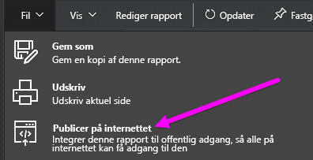
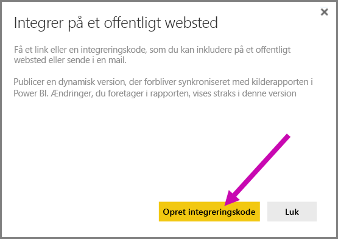
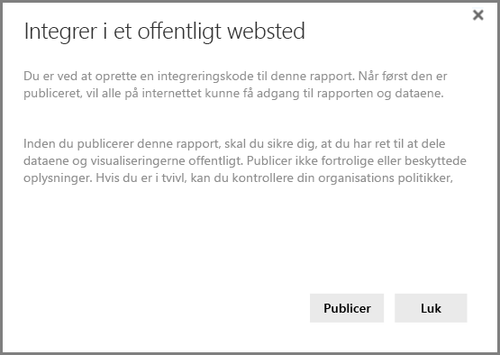
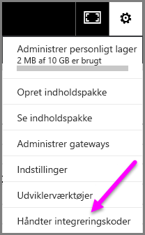
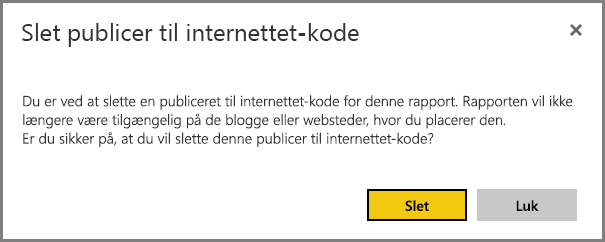

# Publicer på internettet fra Power BI

Med Power BI **Publicer på internettet** kan du nemt integrere interaktive Power BI-visualiseringer online, f.eks. i blogindlæg, på websteder, via mails eller sociale medier på enhver enhed.

Du kan også nemt redigere, opdatere eller fjerne deling af dine publicerede visuelle elementer.

> [!WARNING]
> Når du bruger **Publicer på internettet**, kan den rapport eller det visuelle element, som du publicerer, ses af alle på internettet. Der bruges ingen godkendelse, når disse rapporter vises. Brug kun Publicer på internettet med rapporter og data, som alle på internettet (ikke-godkendte medlemmer af offentligheden) skal kunne se. Dette omfatter data på detaljeniveau, der er aggregeret i dine rapporter. Inden du publicerer denne rapport, skal du sikre, at du har ret til at dele dataene og visualiseringerne offentligt. Publicer ikke fortrolige eller beskyttede oplysninger. Hvis du er i tvivl, kan du kontrollere din organisations politikker inden publiceringen.

## Sådan bruger du Publicer på internettet

**Publicer på internettet** er tilgængelig i rapporter i personlige arbejdsområder eller gruppearbejdsområder, du kan redigere.  Du kan ikke bruge Publicer på internettet med rapporter, der blev delt med dig, eller rapporter, der afhænger af sikkerhed på rækkeniveau for at beskytte dataene. Se afsnittet **Begrænsninger** herunder for at få vist en fuldstændig liste over situationer, hvor Publicer på internettet ikke understøttes. Gennemgå **advarslen** tidligere i denne artikel, før du bruger Publicer til internettet.

Du kan se, hvordan denne funktion virker, i den følgende *korte video*. Følg derefter nedenstående fremgangsmåde for at prøve det selv.

<iframe width="560" height="315" src="https://www.youtube.com/embed/UF9QtqE7s4Y" frameborder="0" allowfullscreen></iframe>

I fremgangsmåden nedenfor beskrives det, hvordan du bruger **Publicer på internettet**.

1. Vælg **Filer > Publicer på internettet** i en rapport i arbejdsområdet, som du kan redigere .
   
   

2. Gennemgå indholdet i dialogboksen, og vælg **Opret integreringskode** som vist i følgende dialogboks.
   
   

3. Gennemgå advarslen i følgende dialogboks, og bekræft, at det er i orden at integrere dataene på et offentligt websted. Vælg **Publicer**, hvis det er tilfældet.
   
   

4. Der åbnes en dialogboks med et link, der kan sendes i en mail, som er integreret i kode (f.eks. en iFrame), eller som du kan indsætte direkte i din webside eller blog.
   
   

5. Hvis du tidligere har oprettet en integreringskode til rapporten, vises koden hurtigt. Du kan kun oprette én integreringskode til hver enkelt rapport.
   
   

## Tip og råd til visningstilstande

Når du integrerer indhold i et blogindlæg, skal det typisk passe inden for en bestemt størrelse på skærmen.  Du kan også tilpasse højden og bredden i iFrame-koden efter behov, men det kan også være nødvendigt at sikre, at din rapport passer inden for det angivne område for iFrame, og du skal derfor også angive en passende visningstilstand, når du redigerer rapporten.

Følgende tabel indeholder vejledning om visningstilstanden, og hvordan den vises, når den er integreret.

| Visningstilstand | Sådan ser den ud, når den er integreret |
| --- | --- |
|  |**Tilpas til siden** anvender rapportens sidehøjde og -bredde. Hvis du indstiller siden til 'dynamiske' forhold som f.eks. 16:9 eller 4:3, skaleres dit indhold til at passe inden for den iFrame, du har angivet. Ved integration i en iFrame kan brug af **Tilpas til siden** resultere i **letterboxing**, hvor en grå baggrund vises i områder af iFrame, efter at indholdet er skaleret til at passe inden for iFrame. Angiv din iFrames højde/bredde hensigtsmæssigt for at minimere letterboxing. |
|  |**Faktisk størrelse** sikrer, at rapporten bevarer sin størrelse som indstillet på rapportsiden. Dette kan medføre, at der er rullepaneler i din iFrame. Angiv højden og bredden på iFrame for at undgå rullepanelerne. |
|  |**Tilpas til bredden** sikrer, at indholdet passer inden for det vandrette område til din iFrame. Der vises stadig en kant, men indholdet skaleres til at bruge al tilgængelig vandret plads. |

## Tip og tricks til højde og bredde på iFrame

Integreringskoden, som du modtager, når du publicerer på internettet, ser ud som følgende:

Du kan redigere bredden og højden manuelt for at sikre, at den er præcis, som du vil have den til at passe på den side, som du integrerer den i.

Hvis du vil have den til at passe mere perfekt , kan du prøve at føje 56 pixel til højdedimensionen for iFrame. Det tager højde for den aktuelle størrelse af den nederste linje. Hvis rapportsiden bruger den dynamiske størrelse, indeholder tabellen herunder nogle størrelser, du kan bruge til at opnå en tilpasning uden letterboxing.

| Forhold | Størrelse | Dimension (bredde x højde) |
| --- | --- | --- |
| 16:9 |Lille |640 x 416 px |
| 16:9 |Mellem |800 x 506 px |
| 16:9 |Stor |960 x 596 px |
| 4:3 |Lille |640 x 536 px |
| 4:3 |Mellem |800 x 656 px |
| 4:3 |Stor |960 x 776 px |

## Administrer integreringskoder

Når du har oprettet en integreringskode for **Publicer på internettet**, kan du administrere de oprettede koder fra menuen **Indstillinger** i Power BI-tjenesten. Administration af integreringskoder giver mulighed for at fjerne destinationens visuelle element eller rapport for en kode (hvilket gør integreringskoden ubrugelig) eller hente integreringskoden igen.

1. Du administrerer dine integreringskoder for **Publicer på internettet** ved at åbne tandhjulet **Indstillinger** og vælge **Håndter indlejringskoder**.
   
   

2. Listen over integreringskoder, du har oprettet, vises som på det følgende billede.
   
   

3. For hver integreringskode for **Publicer på internettet** på listen kan du enten hente koden eller slette koden og dermed få ethvert link til rapporten eller det visuelle element til ikke længere at fungere.
   
   

4. Hvis du vælger **Slet**, bliver du spurgt, om du er sikker på, at du vil slette integreringskoden.
   
   

## Opdateringer af rapporter og data

Når du har oprettet din integreringskode for **Publicer på internettet** og deler den, opdateres rapporten med de ændringer, du foretager. Det er dog vigtigt at vide, at det kan tage et stykke tid, før opdatering kan ses af dine brugere. Det tager ca. én time, før opdateringer af en rapport eller et visuelt element afspejles i integreringskoder for Publicer på internettet.

Når du til at begynde med bruger **Publicer på internettet** for at få en integreringskode, er linket til koden aktivt med det samme og kan ses af alle, der åbner linket.  Efter den indledende handling med publicering på internettet kan det vare ca. én time, før efterfølgende opdateringer af rapporter eller visuelle elementer, som et Publicer på internettet-link peger på, kan ses af dine brugere.

Se afsnittet **Sådan fungerer det** senere i denne artikel, hvis du vil vide mere. Hvis dine opdateringer skal være tilgængelige med det samme, kan du slette integreringskoden og oprette en ny.

## Opdatering af data

Dataopdateringer afspejles automatisk i din integrerede rapport eller det visuelle element. Det kan tage ca. 1 time, før opdaterede data kan ses fra integreringskoder. Du kan deaktivere automatisk opdatering ved at vælge **Opdater ikke** i tidsplanen for det datasæt, der bruges af rapporten.  

## Brugerdefinerede visuelle elementer

Brugerdefinerede visuelle elementer, der understøttes i **Publicer på internettet**. Når du bruger Publiver på internettet, behøver brugere, som du deler dit publicerede visuelle element med, ikke at aktivere brugerdefinerede visuelle elementer for at få vist rapporten.

## Begrænsninger

**Publicer på internettet** understøttes for langt de fleste datakilder og rapporter i Power BI-tjenesten, men følgende **understøttes i øjeblikket ikke eller er ikke tilgængelige** med Publicer på internettet:

1. Rapporter med sikkerhed på rækkeniveau.
2. Rapporter, der bruger en vilkårlig Live Connection-datakilde, herunder Analysis Services Tabular, der hostes i det lokale miljø, Analysis Service Multidimensional og Azure Analysis Services.
3. Rapporter, der er delt med dig direkte eller via en organisationsindholdspakke.
4. Rapporter i en gruppe, hvor du ikke er redigeringsmedlem.
5. Visuelle "R"-elementer understøttes ikke i øjeblikket i Publicer på internettet-rapporter.
6. Eksport af data fra visualiseringer i en rapport, som er publiceret på internettet
7. ArcGIS Maps til Power BI-visualiseringer
8. [Fortrolige eller beskyttede oplysninger](#publish-to-web-from-power-bi)

## Lejerindstillinger

Power BI-administratorer kan aktivere eller deaktivere funktionen Publicer på internettet. De kan desuden begrænse adgang til bestemte grupper. Din mulighed for at oprette en integreringskode ændres baseret på denne indstilling.

|Udvalgt |Aktiveret for hele organisationen |Deaktiveret for hele organisationen |Specifikke sikkerhedsgrupper   |
|---------|---------|---------|---------|
|**Publicer på internettet** under rapportens menu **Filer**.|Aktiveret for alle|Ikke synligt for alle|Kun synligt for godkendte brugere eller grupper.|
|**Håndter integreringskoder** under **Indstillinger**|Aktiveret for alle|Aktiveret for alle|Aktiveret for alle  Indstillingen * **Slet** er kun synlig for godkendte brugere eller grupper. * **Hent koder** er aktiveret for alle.|
|**Integrer koder** i administrationsportalen|Status afspejler et af følgende: * Aktiv * Ikke understøttet * Blokeret|Status vises som **Deaktiveret**|Status afspejler et af følgende: * Aktiv * Ikke understøttet * Blokeret  Hvis en bruger ikke er godkendt baseret på lejeren indstilling, vises status som **krænket**.|
|Eksisterende publicerede rapporter|Alle aktiveret|Alle deaktiveret|Rapporter fortsætter med at gengive for alle.|

## Om kolonnen med status for integreringskoder

Når du får vist siden **Håndter indlejringskoder** til integreringskoder for **Publicer på internettet**, vises en statuskolonne. Integreringskoder er som standard aktive, men du kan støde på en af de tilstande, der er anført nedenfor.

| Status | Beskrivelse |
| --- | --- |
| **Aktiv** |Rapporten er tilgængelig, og internetbrugere kan få vist og interagere med den. |
| **Blokeret** |Indholdet af rapporten er i strid med [Power BI Servicebetingelser](https://powerbi.microsoft.com/terms-of-service). Det er blokeret af Microsoft. Hvis du mener, at indholdet blev blokeret ved en fejl, kan du kontakte support. |
| **Understøttes ikke** |Rapportens datasæt bruger sikkerhed på rækkeniveau, eller en anden konfiguration, der ikke understøttes. Se afsnittet **Begrænsninger** for at få vist en fuldstændig liste. |
| **Krænket** |Integreringskoden er uden for den definerede lejerpolitik. Dette sker typisk, når en integreringskode blev oprettet, og lejerindstillingen Publicer på internettet blev ændret for at udelade den bruger, der ejer integreringskoden. Hvis lejerindstillingen er deaktiveret, eller brugeren ikke længere har tilladelse til at oprette integreringskoder, vises status for eksisterende integreringskoder som **Krænket**. |

## Sådan rapporterer du et problem med indhold via Publicer på internettet

Hvis du vil rapportere et problem, der er relateret til indhold via **Publicer på internettet**, som er integreret på et websted eller en blog, skal du bruge **flagikonet** på den nederste linje, der vises på følgende billede. Du bliver bedt om at sende en mail til Microsoft, der beskriver problemet. Microsoft evaluerer indholdet baseret på Power BI Servicebetingelser og træffer de nødvendige foranstaltninger.

Hvis du vil rapportere et problem, skal du vælge **flagikonet** på den nederste linje i den Publicer på internettet-rapport, som vises.

## Licenser og priser

Du skal være Microsoft Power BI-bruger for at anvende **Publicer på internettet**. Brugerne af din rapport (læsere, seere) behøver ikke at være Power BI-brugere.

## Sådan fungerer det (tekniske detaljer)

Når du opretter en integreringskode ved hjælp af **Publicer på internettet**, gøres rapporten synlig for brugere på internettet. Den er offentligt tilgængelig, så du kan forvente, at brugerne nemt kan dele rapporten via sociale medier på et senere tidspunkt. Når brugere får vist rapporten, enten ved at åbne den direkte offentlige URL-adresse eller se den integreret på en webside eller blog, cachelagrer Power BI rapportdefinitionen og resultaterne af de forespørgsler, der kræves for at få vist rapporten. Denne metode sikrer, at rapporten kan ses af tusindvis af samtidige brugere uden nogen indflydelse på ydeevnen.

Cachelageret er langvarigt, så hvis du opdaterer rapportdefinitionen (f.eks. hvis du ændrer dens visningstilstand) eller opdaterer rapportdataene, kan det tage cirka en time, før ændringerne afspejles i den version af rapporten, der ses af brugerne. Det anbefales derfor, at du planlægger dit arbejde på forhånd og først opretter integreringskoden for **Publicer på internettet**, når du er tilfreds med indstillingerne.

Har du flere spørgsmål? [Prøv at spørge Power BI-community'et](http://community.powerbi.com/)
