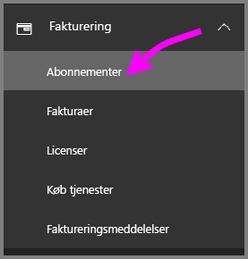
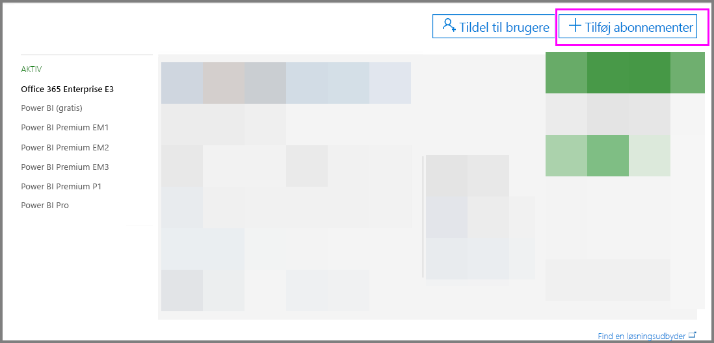
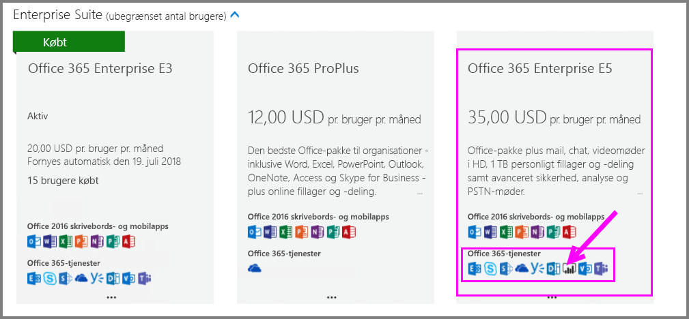
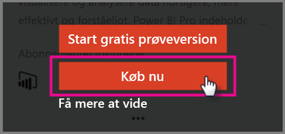
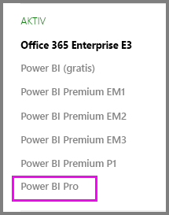

# Køb Power BI Pro

Med Power BI Pro kan du publicere rapporter, dele dashboards, samarbejde med kolleger i arbejdsområder og foretage andre relaterede aktiviteter. Du kan finde flere oplysninger om, hvordan din organisation kan få fordel af Power BI Pro, under [Power BI Pro i din organisation](service-power-bi-pro-in-your-organization.md).

## Køb af Power BI Pro gennem Office 365 Administration

It-administratorer af Office kan købe Power BI Pro enten som en del af et Office 365 Enterprise E5-abonnement eller som et separat Power BI Pro-abonnement. Du kan derefter tildele Power BI Pro-licenser til de relevante brugere. Du kan finde flere oplysninger om, hvordan du tildeler licenser, under [Tildel licenser til brugere i Office 365](https://support.office.com/en-us/article/assign-licenses-to-users-in-office-365-for-business-997596b5-4173-4627-b915-36abac6786dc?ui=en-US&rs=en-US&ad=US).

Hvis du er it-administrator af Office kan du købe Power BI Pro ved at benytte følgende fremgangsmåde:

1. Naviger til [Office 365 Administration](https://portal.office.com/adminportal/home#/homepage).
2. Vælg Fakturering i navigationsruden til venstre, og klik derefter på Abonnementer.

    

3. Klik på Tilføj abonnementer øverst til højre på siden Abonnementer.

    

4. Find det ønskede abonnement:

    Vælg Office 365 Enterprise E5 under Enterprise Suite

    

    Vælg Power BI Pro under Andre planer

    

5. Peg på ellipserne (…) for det ønskede abonnement, og vælg Køb nu.

    

6. Vælg, om du vil betale pr. måned eller for et helt år ad gangen.
7. Angiv det ønskede antal licenser under Hvor mange brugere ønsker du?, og klik for at gå til kassen eller føje til indkøbskurven, og fuldfør transaktionen.
8. Kontrollér, at abonnementet nu er vist på siden Abonnementer.

   

> [!NOTE]
> Du kan tilføje flere licenser efter det første køb. Vælg Power BI Pro-abonnementet på siden Abonnementer, og klik på Tilføj/fjern licenser.
>

## Priser

Du kan finde de nyeste priser under [Priser på Power BI](https://powerbi.microsoft.com/en-us/pricing/).

## Næste trin
[Tilmelding via selvbetjening til Power BI](service-admin-signing-up-for-power-bi-with-a-new-office-365-trial.md)
 
[Power BI (gratis) i din organisation](service-admin-service-free-in-your-organization.md)
 
[Power BI Pro i din organisation](service-power-bi-pro-in-your-organization.md)
 
[Aktivering af den udvidede Pro-prøveversion](service-extended-pro-trial.md)
 
[Tildeling af Power BI Pro-licenser](service-assigning-power-bi-pro-licenses.md)
 
[Power BI Premium – hvad er det?](service-admin-premium-manage.md)
 
[Sådan køber du Power BI Premium](service-admin-premium-purchase.md)
 
[Whitepaper om Power BI Premium](https://aka.ms/pbipremiumwhitepaper)

Flere spørgsmål? [Prøv at spørge Power BI-community'et](https://community.powerbi.com/)