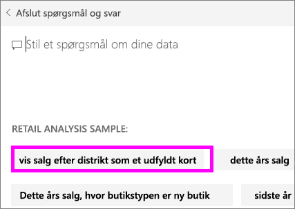
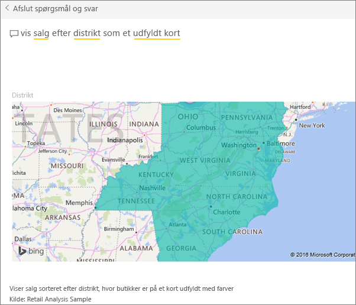

# Opret udvalgte spørgsmål til Spørgsmål og svar i Power BI
Hvis du ejer et datasæt, kan du tilføje dine egne udvalgte spørgsmål i det pågældende datasæt.  Og Spørgsmål og svar i Power BI viser disse spørgsmål til kollegaer, der bruger dit datasæt.  De udvalgte spørgsmål giver dine kollegaer en ide om, hvilke typer af spørgsmål, de kan stille om datasættet. Det er op til dig, hvilke udvalgte spørgsmål, du tilføjer – tilføj populære spørgsmål, spørgsmål, der viser interessante resultater, eller spørgsmål, der kan være svære at sætte ord på.

Se Will tilføje nogle udvalgte spørgsmål i Spørgsmål og svar i Power BI, og derefter bruge disse udvalgte spørgsmål til at udforske sit datasæt. Følg derefter den trinvise vejledning under videoen for at prøve det selv.

<iframe width="560" height="315" src="https://www.youtube.com/embed/E1mIAyEXuF4" frameborder="0" allowfullscreen></iframe>

> [!NOTE]
> Udvalgte spørgsmål i Spørgsmål og svar er også tilgængelige i [Microsoft Power BI-appen til iOS på iPads, iPhones og iPod Touch-enheder](mobile-apps-ios-qna.md) samt i prøveversionen af Spørgsmål og svar til Power BI Desktop. Men oprettelse af spørgsmålene er kun tilgængelig i Power BI-tjenesten (app.powerbi.com).
> 
> 

I denne artikel anvendes [Retail Analysis Sales-eksemplet](sample-datasets.md).

1. Markér feltet Spørgsmål og svar øverst i dashboardet.   Bemærk, at Spørgsmål og svar allerede hjælper ved at vise en liste over udtryk, der findes i datasættet.
2. Hvis du vil føje noget til listen, skal du vælge tandhjulsikonet i øverste højre hjørne af Power BI.  
   
3. Vælg **Indstillinger** &gt; **Datasæt** &gt; **Retail Analysis Sample** &gt; **Udvalgte spørgsmål i Spørgsmål og svar**.  
4. Vælg **Tilføj et spørgsmål**.
   
   
5. Skriv dit spørgsmål i tekstfeltet, og vælg **Anvend**.   Du kan også tilføje et andet spørgsmål ved at vælge **Tilføj et spørgsmål**.  
   
6. Gå tilbage til Power BI-dashboardet for Retail Analysis Sample, og anbring markøren i spørgsmålsfeltet.   
   
7. Det nye udvalgte spørgsmål, **Sales by territory as a map**, er det første på listen. Vælg det.  
8. Svaret vises som en visualisering i form af et udfyldt kort.  
   

### Næste trin
[Spørgsmål og svar i Power BI](service-q-and-a.md)  
[Selvstudium: Introduktion til Spørgsmål og svar i Power BI](power-bi-visualization-introduction-to-q-and-a.md)  
[Power BI – Grundlæggende begreber](service-basic-concepts.md)  
Har du flere spørgsmål? [Prøv at spørge Power BI-community'et](http://community.powerbi.com/)

