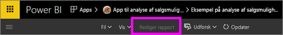
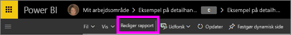
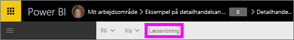

# Læsevisning og Redigeringsvisning i rapporter i Power BI-tjenesten
Der er to forskellige tilstande til at få vist og interagere med rapporter i Power BI-tjenesten (ikke Power BI Desktop): Læsevisning og Redigeringsvisning.  

Læsevisning er tilgængelig for alle brugere, mens Redigeringsvisning kun er tilgængelig for oprettere af rapporten og ejere. Læsevisning er udviklet til *rapportforbrugerne* – de kolleger, der åbner rapporter fra Apps, eller som har rapporter, der deles med dem. Læsevisning sikrer, at hvert enkelt forbruger af en bestemt rapport ser den samme rapport, de samme visualiseringer, hvor de samme filtre anvendes.  Forbrugerne kan interagere med rapporten, men ikke gemme ændringerne.

>**Bemærk**! I nogle tilfælde kan rapportforbrugeren se forskellige data på grund af sikkerhed på rækkeniveau og datatilladelser. 

Redigeringsvisning er kun tilgængelig for den person, der oprettede rapporten, eller for de kolleger, der er medejere af rapporten som et medlem eller en administrator af et apparbejdsområde.

## Læsevisning

Læsevisning er en sjov og sikker måde at både lege med og lære dataene at kende. Læsevisning er ikke så interaktiv som [Redigeringsvisning](service-interact-with-a-report-in-editing-view.md), men tilstanden giver dig stadigvæk mange indstillinger til udforskning af dine data. Dette kan f.eks. være praktisk ved visning af rapporter, der er [delt med dig](service-share-dashboards.md), som kun kan åbnes i Læsevisning.

Hvis du vil vide mere, kan du se [Læsevisning for Power BI-rapporter](service-interact-with-a-report-in-reading-view.md).

## Redigeringsvisning
I Redigeringsvisning i Power BI (sammenlignet med [Læsevisning](service-interact-with-a-report-in-reading-view.md)) kan du gå endnu mere i dybden med dine data ved at tilføje og fjerne felter, ændre visualiseringstype, oprette nye visualiseringer og tilføje og slette visuelle effekter og sider fra rapporten.

Hvis du vil vide mere, kan du se [Redigeringsvisning for Power BI-rapporter](service-interact-with-a-report-in-editing-view.md).

## Navigering mellem Redigeringsvisning og Læsevisning
Husk, at kun rapportoprettere og -ejere kan åbne en rapport i Redigeringsvisning.

1. Rapporten åbnes som standard i Læsevisning. Du kan se, du er i Læsevisning, hvis du får vist en indstillingen **Rediger rapport**. Hvis **Rediger rapport** er nedtonet, har du ikke rettigheder til at åbne rapporten i Redigeringsvisning.

   

2. Hvis **Rediger rapport** ikke er nedtonet, skal du vælge den for at åbne rapporten i Redigeringsvisning. 
   
   
   
   Rapporten er nu i Redigeringsvisning og bruger de samme [visningsindstillinger](power-bi-report-display-settings.md), som du sidst brugte i Læsevisning.

2. Du vender tilbage til Læsevisning ved at vælge **Læsevisning** på den øverste navigationslinje.
   
    

Der er mange forskellige måder at interagere med en rapport i Læsevisning, foretage udsnit og opdele dataene for at få indsigt og svar på dine spørgsmål.  I det næste emne, [Interager med en rapport i Redigeringsvisning](service-interact-with-a-report-in-editing-view.md), angives og beskrives disse udførligt.

### Næste trin
[Interager med en rapport i Læsevisning](service-interact-with-a-report-in-editing-view.md)    
Tilbage til [rapporter i Power BI](service-reports.md)    
Har du flere spørgsmål? [Prøv at spørge Power BI-community'et](http://community.powerbi.com/) 

