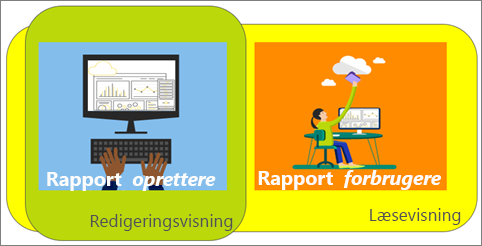

# Læsevisning og Redigeringsvisning i rapporter i Power BI-tjenesten
Der er to forskellige tilstande til at få vist og interagere med rapporter i Power BI-tjenesten (ikke Power BI Desktop): Læsevisning og Redigeringsvisning. Læsevisning er tilgængelig for alle brugere og er især designet til *forbrugere* af data, mens Redigeringsvisning kun er tilgængelig for *oprettere* og ejere af rapporter.

## Rapport i Læsevisning

 Læsevisning hjælper dig med at udforske og interagere med rapporten – det er en god og sikker måde at lege med og at lære dine data at kende. Læsevisning er udviklet til *forbrugere* af rapporter – de personer, der åbner rapporter fra Apps, eller som har rapporter, der [deles med dem](service-share-dashboards.md). Læsevisning sikrer, at hver forbruger af en bestemt rapport ser den samme rapport og de samme visualiseringer og eventuelt med anvendelse af de samme filtre.  Forbrugere kan interagere med rapporterne og udskifte de eksisterende filtre (og gemme ændringerne sammen med rapporten), men de kan ikke tilføje nye filtre.

>**Bemærk**! I nogle tilfælde kan rapportforbrugeren se forskellige data på grund af sikkerhed på rækkeniveau og datatilladelser.

## Rapport i Redigeringsvisning

Redigeringsvisning er kun tilgængelig for de personer, der oprettede rapporten, eller som er [medejere af en rapport som medlem eller administrator af et apparbejdsområde](service-create-distribute-apps.md).

Redigeringsvisning er udviklet til *oprettere* af rapporter. Dette er stedet, hvor oprettere importerer og opretter forbindelse til datasæt, udforsker dataene og opretter rapporter og dashboards. I Redigeringsvisning kan *oprettere* gå endnu mere i dybden med deres data ved at tilføje og fjerne felter, ændre visualiseringstype, oprette nye visualiseringer og tilføje og slette visualiseringer og sider fra rapporten. De kan derefter dele de rapporter, de opretter, med kolleger.

## Læsevisning i forhold til Redigeringsvisning
Alle rapportfunktionerne i Power BI-tjenesten er ikke er angivet i dette diagram! Det viser kun de rapportopgaver, der ikke er tilgængelige i **både** Læsevisning og Redigeringsvisning.

|Opgave  | Læsevisning  | Redigeringsvisning |
|-------------------------|-------|-------|
|**Rapporter som helhed**  |
| [Opret eller rediger en rapport](service-report-create-new.md) | Nej  | Ja |
| [Del en rapport](service-share-reports.md)| Ja | Ja, og du kan også administrere tilladelser, herunder give andre *ejertilladelser*. |
| [Opret vedvarende (permanente) filtre for visuelt niveau, detaljeadgangsfiltre, filtre for sideniveau og rapportniveau fra ruden Filtre](power-bi-report-add-filter.md) | Nej  | Ja |
| [Brug ruden Rapportfiltre](power-bi-how-to-report-filter.md) | Ja, du kan bruge de eksisterende filtre og gemme ændringerne sammen med rapporten, men du kan ikke tilføje nye filtre. | Ja |
| [Brug ruden Rapportanalyse](service-analytics-pane.md) | Nej | Ja |
| [Rapport **Visning** Indstillinger](power-bi-report-display-settings.md) | Ja, med visse undtagelser. | Ja, alle, herunder gitterlinjer, fastgørelse og låsning. |
| [Opret tidsplan for opdatering](refresh-data.md) | Nej  | Ja |
| [Abonner på en rapport](service-report-subscribe.md) | Ja | Nej |
| [Spørgsmål og svar – stil spørgsmål i rapporter](power-bi-q-and-a.md) | Nej  | Ja |
| [Få vist forbrugsdata ](service-usage-metrics.md) | Ja, på rapportcanvassen. | Ja, på rapportlisten (indholdsvisning) |
| [Få vist relaterede](service-related-content.md) | Ja, på rapportcanvassen. | Ja, på rapportlisten (indholdsvisning) |
| [Gem en rapport](service-report-save.md) | Ja, men kun ved hjælp af **Gem som**. | Ja |
| [Slet en rapport](service-delete.md) | Nej  | Ja |
|**Rapportsider** |
| [Tilføj eller omdøb en rapportside](power-bi-report-add-page.md)  | Nej  | Ja  |
| [Dupliker en rapportside](power-bi-report-copy-paste-page.md) | Nej  | Ja |
| [Slet rapportside](service-delete.md) | nej | ja |
|**Arbejd med rapportvisualiseringer**|
| [Føj visualiseringer til en rapport](power-bi-report-add-visualizations-i.md) | Nej  | Ja |
| [Føj tekstfelter og figurer til en rapport](power-bi-reports-add-text-and-shapes.md) | Nej  | Ja |
| [Brug ruden rapportformatering](service-the-report-editor-take-a-tour.md) | Nej | Ja |
| [Angiv visuelle interaktioner](service-reports-visual-interactions.md) | Nej  | Ja |
| [Vis data, der bruges til at oprette visualiseringen](service-reports-show-data.md) | Nej  | Ja |
| [Konfigurer udledning](power-bi-visualization-drill-down.md) | Nej  | Ja |
| [Skift den anvendte visualiseringstype](power-bi-report-change-visualization-type.md) | Nej | Ja|
| [Slet en visualisering, et tekstfelt eller en figur](service-delete.md)| Nej | Ja |

## Navigering mellem Redigeringsvisning og Læsevisning
Husk, at kun rapportopretteren og -ejeren(erne) kan åbne en rapport i Redigeringsvisning.

1. Rapporten åbnes som standard i Læsevisning. Du kan se, du er i Læsevisning, hvis du får vist en indstillingen **Rediger rapport**. Hvis **Rediger rapport** er nedtonet, har du ikke rettigheder til at åbne rapporten i Redigeringsvisning.

   

2. Hvis **Rediger rapport** ikke er nedtonet, skal du vælge den for at åbne rapporten i Redigeringsvisning.

   

   Rapporten er nu i Redigeringsvisning og bruger de samme [visningsindstillinger](power-bi-report-display-settings.md), som du sidst brugte i Læsevisning.

2. Du vender tilbage til Læsevisning ved at vælge **Læsevisning** på den øverste navigationslinje.

    

### Næste trin
Der er mange forskellige måder at interagere med en rapport i Læsevisning, foretage udsnit og opdele dataene for at få indsigt og svar på dine spørgsmål.  I det næste emne, [Interager med en rapport i Læsevisning](service-interact-with-a-report-in-editing-view.md), beskrives nogle af disse udførligt.    
Tilbage til [rapporter i Power BI](service-reports.md)    
Har du flere spørgsmål? [Prøv at spørge Power BI-community'et](http://community.powerbi.com/)
