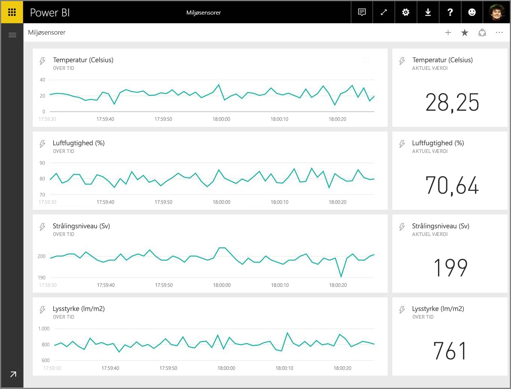
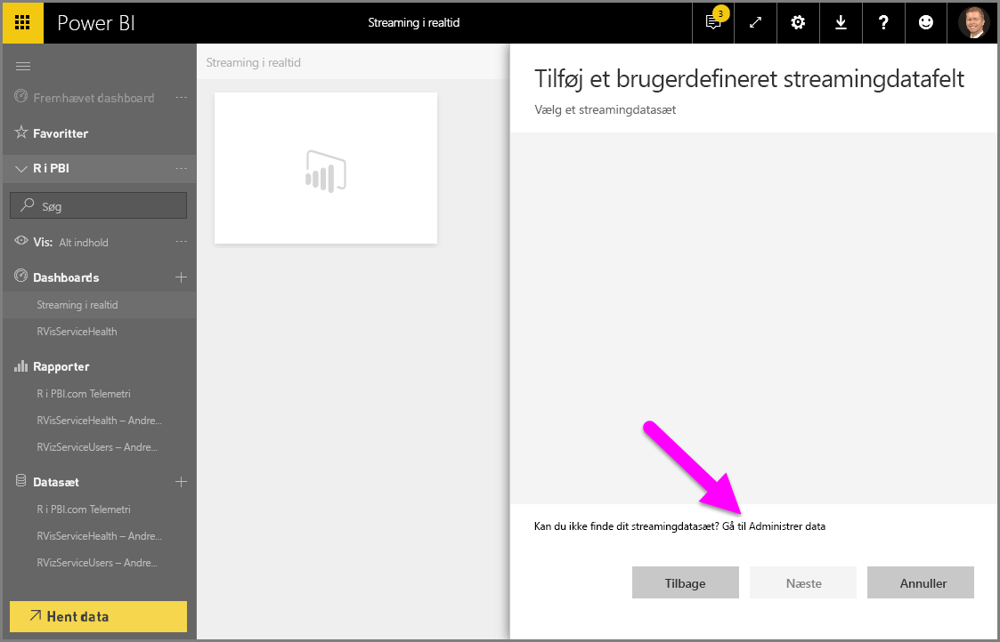
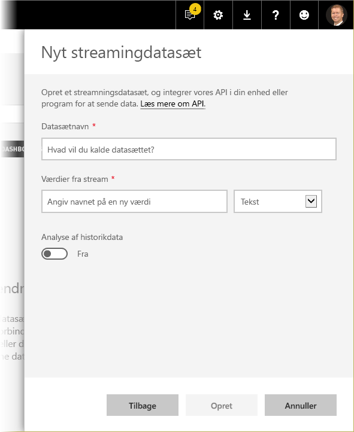
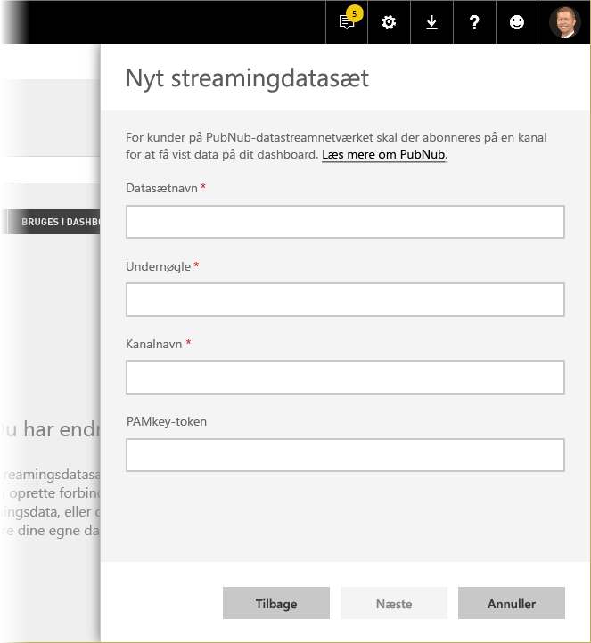

# Streaming i realtid i Power BI
Med streaming i realtid med Power BI kan du streame data og opdatere dashboards i realtid. Alle visuelle elementer eller dashboards, der kan oprettes i Power BI, kan også oprettes til at vise og opdatere data og visuelle elementer i realtid. Enhederne og kilderne til streamingdata kan være sensorer på fabrikker, sociale medier, forbrugsdata for tjenester og alt andet, hvorfra tidsfølsomme data kan indsamles eller overføres.

Denne artikel viser dig, hvordan du konfigurerer streamingdatasæt i realtid i Power BI. Men før vi kommer dertil, er det vigtigt at forstå, hvilke typer datasæt i realtid der er udformet til at blive vist i felter (og dashboards), og hvordan de datasæt adskiller sig.

## Typer af datasæt i realtid
Der er tre typer datasæt i realtid, som er beregnet til visning af dashboards i realtid:

* Pushhdatasæt
* Streamingdatasæt
* PubNub-streamingdatasæt

Først skal vi forstå, hvordan disse datasæt adskiller sig fra hinanden (dette afsnit), derefter drøfter vi, hvordan data kan pushoverføres til disse hvert af disse datasæt.

### Pushhdatasæt
Med et **pushdatasæt** sendes der data til Power BI-tjenesten. Når datasættet oprettes, opretter Power BI-tjenesten automatisk en ny database i tjenesten til at lagre dataene i. Da der er en underliggende database, som fortsætter med at lagre dataene, når de kommer ind, kan der oprettes rapporter med dataene. Disse rapporter og deres visuelle elementer er ligesom andre visuelle elementer i rapporter, hvilket betyder, at du kan bruge alle Power BIs funktioner til oprettelse af visuelle elementer, herunder brugerdefinerede visuelle elementer, databeskeder, fastgjorte dashboardfelter og meget mere.

Når en rapport oprettes ved hjælp af pushdatasættet, kan alle dens visuelle elementer fastgøres til et dashboard. På dette dashboard opdateres visuelle elementer i realtid, når dataene opdateres. Dashboardet udløser en opdatering af feltet i tjenesten, hver gang der modtages nye data.

Der er to ting, du skal være opmærksom på vedrørende fastgjorte felter fra et pushdatasæt:

* Fastgørelse af en hel rapport ved hjælp af indstillingen *Fastgør dynamisk side* medfører **ikke**, at dataene automatisk opdateres.
* Når et visuelt element fastgøres til et dashboard, kan du bruge **Spørgsmål og svar** til at stille spørgsmål til pushdatasættet på et naturligt sprog. Når du har foretaget en **Spørgsmål og svar**-forespørgsel, kan du fastgøre det resulterende visuelle element tilbage på dashboardet, og dette dashboard opdateres *også* i realtid.

### Streamingdatasæt
Med et **streamingdatasæt** overføres data også til Power BI-tjenesten med én vigtig forskel: Power BI gemmer kun dataene i en midlertidig cache, som hurtigt udløber. Den midlertidige cache bruges kun til at vise visuelle elementer, som har en midlertidig historik, f.eks. et kurvediagram, der har et tidsvindue på en time.

Med et **streamingdatasæt** er der *ingen* underliggende database, så du *kan ikke* oprette visuelle elementer i rapporter, der bruger de data, der kommer ind fra streamen. Som sådan kan du ikke bruge rapportens funktionalitet, f.eks. filtrering, brugerdefinerede visuelle elementer og andre rapportfunktioner.

Den eneste måde at visualisere et streamingdatasæt er at tilføje et felt og bruge streamingdatasættet som en datakilde for **brugerdefinerede streamingdata**. De brugerdefinerede streamingfelter, der er baseret på et **streamingdatasæt**, er optimeret til hurtigt at vise data i realtid. Der er meget lidt ventetid mellem det tidspunkt, hvor data pushoverføres til Power BI-tjenesten, og hvor det visuelle element opdateres, da det ikke er nødvendigt for data at blive angivet i eller læst fra en database.

I praksis bruges streamingdatasæt og deres tilhørende streamingvisualiseringer bedst i situationer, hvor det er vigtigt at minimere ventetiden mellem det tidspunkt, hvor data pushoverføres, og hvor de visualiseres. Det er desuden bedste praksis, at dataene pushoverføres i et format, der kan visualiseres, som det er, uden nogen yderligere akkumuleringer. Eksempler på data, der er klar, som de er, omfatter temperaturer og forudberegnede gennemsnit.

### PubNub-streamingdatasæt
Med et **PubNub**-streamingdatasæt bruger Power BI-webklienten PubNub SDK til at læse en eksisterende PubNub-datastream, og der lagres ingen data af Power BI-tjenesten.

Som med **streamingdatasæt** er der med **PubNub-streamingdatasættet** ingen underliggende database i Power BI, så du ikke kan oprette rapportens visualiseringer i forhold til de data, der kommer ind, og kan ikke drage fordel af rapportfunktioner som filtrering, brugerdefinerede visuelle elementer osv. **PubNub-streamingdatasættet** kan også kun visualiseres ved at føje et felt til dashboardet og konfigurere en PubNub-datastream som kilden.

Felter, der er baseret på et **PubNub-streamingdatasæt**, er optimeret til hurtigt at vise data i realtid. Da Power Bi er direkte forbundet til PubNub-datastreamen, er der meget lidt ventetid mellem det tidspunkt, hvor data pushoverføres til Power BI-tjenesten, og hvor det visuelle element opdateres.

### Streaming af matrixdatasæt
I følgende tabel (eller matrix, om du vil) beskrives de tre typer datasæt til streaming i realtid, og hvert datasæts funktioner og begrænsninger angives.

> [!NOTE]
> Se [denne artikel](https://docs.microsoft.com/power-bi/developer/api-rest-api-limitations) for at få oplysninger om **Push**-grænser for, hvor mange data der kan modtages via pushoverførsel.
> 
> 

## Pushoverfør data til datasæt
I det forrige afsnit blev de tre primære typer realtidsdatasæt beskrevet, som du kan bruge i realtidsstreaming, og hvordan de adskiller sig fra hinanden. I dette afsnit beskrives, hvordan du kan oprette og pushoverføre data til disse datasæt.

Der er tre primære måder, du kan pushoverføre data til et datasæt:

* Ved hjælp af Power BI REST API'er
* Ved hjælp af Streamingdatasæt-UI
* Ved hjælp af Azure Stream Analytics

Lad os se på hver af disse metoder.

### Brug af Power BI REST API'er til at pushoverføre data
**Power BI REST API'er** kan bruges til at oprette og overføre data til **pushdatasæt** og til **streamingdatasæt**. Når du opretter et datasæt ved hjælp af Power BI REST API'er angiver flaget *Standardtilstand*, om datasættet er push eller streaming. Hvis flaget *Sandardtilstand* ikke er angivet, er datasættet som standard et **pushdatasæt**.

Hvis værdien *Standardtilstand* er indstillet til *pushStreaming*, er datasættet både et **push**- *og et* **streaming**datasæt, hvilket giver fordelene ved begge datasættyper. 

> [!NOTE]
> Når du bruger datasæt med flaget *Standardtilstand* angivet til *pushStreaming*, vil en anmodning lykkes, og dataene opdateres i pushdatasættet, hvis anmodningen overskrider størrelsesgrænsen på 15 kB for et **streamingdatasæt**, men er mindre end begrænsningen på 16 MB for et **pushdatasæt**. Alle streamingfelter vil dog mislykkes midlertidigt.

Når et datasæt er oprettet, kan du bruge REST-API'er til at pushoverføre data ved hjælp af API'en [**PostRows**](https://docs.microsoft.com/rest/api/power-bi/pushdatasets/datasets_postrows).

Alle anmodninger til REST API'er er sikret med **Azure AD OAuth**.

### Brug Streamingdatasæt-UI til at pushoverføre data
Du kan oprette et datasæt i Power BI-tjenesten ved at vælge **API**-tilgangen som vist i følgende billede.

Når du opretter det nye streamingdatasæt, kan du vælge at aktivere **Analyse af historikdata** som vist nedenfor, hvilket har en væsentlig indvirkning.

Når **Analyse af historikdata** er deaktiveret (den er som standard deaktiveret), opretter du et **streamingdatasæt** som beskrevet tidligere i denne artikel. Når **Analyse af historikdata** er *aktiveret*, bliver det oprettede datasæt både et **streamingdatasæt** og et **pushdatasæt**. Dette er det samme som at bruge Power BI REST API'er til at oprette et datasæt med dens *Standardtilstand* indstillet til *pushStreaming*, som beskrevet tidligere i denne artikel.

> [!NOTE]
> For streamingdatasæt, der er oprettet ved hjælp af Power BI-tjenestens UI, som beskrevet i det foregående afsnit, er Azure AD-godkendelse ikke påkrævet. I sådanne datasæt modtager datasættets ejer en URL-adresse med en rowkey, som giver anmoderen tilladedelse til at pushoverføre data til datasættet uden brug af et Azure AD OAuth-ihændehavertoken. Azure AD (AAD)-tilgangen virker dog stadig til at pushoverføre data til datasættet.
> 
> 

### Brug Azure Stream Analytics til at pushoverføre data
Du kan tilføje Power BI som et output i **Azure Stream Analytics** (ASA) og derefter visualisere de datastreams i Power BI-tjenesten i realtid. I dette afsnit beskrives de tekniske detaljer om, hvordan denne proces sker.

Azure Stream Analytics bruger Power BI REST API'er til at oprette dens outputdatastream til Power BI med *Standardtilstand* indstillet til *pushStreaming* (se tidligere afsnit i denne artikel for at få oplysninger om *Standardtilstand*), hvilket resulterer i et datasæt, der kan drage fordel af både **push** og **streaming**. Under oprettelsen af datasættet indstiller Azure Stream Analytics også flaget **retentionPolicy* til *basicFIFO*. Med denne indstilling lagrer den database, der understøtter sine pushdatasæt, 200.000 rækker, og når denne grænse er nået, fjernes rækkerne på en "først ind, først ud"-metode (FIFO).

> [!CAUTION]
> Hvis din Azure Stream Analytics-anmodning resulterer i meget hurtig output til Power BI (f.eks. et eller to pr. sekund), starter Azure Stream Analytics batching af disse output til en enkelt anmodning. Dette kan medføre, at anmodningsstørrelsen overskrider grænsen for streamingfeltet. I det tilfælde kan streamingfelter ikke gengives, som nævnt i tidligere afsnit. I de tilfælde er den bedste fremgangsmåde at reducere hastigheden for dataoutput til Power BI. I stedet for en maksimumværdi pr. sekund kan du f.eks. indstille den til et maksimum over ti sekunder.
> 
> 

## Konfigurer dit realtidsstreamingdatasæt i Power BI
Nu, hvor vi har dækket de tre primære typer datasæt til streaming i realtid, og de tre primære måder, du kan pushoverføre data til et datasæt, så lad os få dit realtidsstreamingdatasæt til at arbejde i Power BI.

For at komme i gang med streaming i realtid skal du vælge en af de to måder, streamingdata kan bruges i Power BI:

* **felter** med visuelle elementer fra streamingdata
* **datasæt**, der er oprettet fra streamingdata, som forbliver i Power BI

Med begge indstillinger skal du konfigurere **Streamingdata** i Power BI. For at gøre dette skal du i dit dashboard (enten et eksisterende dashboard eller et nyt) vælge **Tilføj et felt** og derefter vælge **Brugerdefinerede streamingdata**.

Hvis du endnu ikke har konfigureret streamingdatasæt, så bare rolig: Du kan vælge **Administrer data** for at komme i gang.

På denne side kan du angive slutpunktet for dit streamingdatasæt, hvis du allerede har oprettet et (i tekstfeltet). Hvis du endnu ikke har et streamingdatasæt, skal du vælge plus-ikonet ( **+** ) i øverste højre hjørne for at se de tilgængelige indstillinger til oprettelse af et streamingdatasæt.

Når du klikker på ikonet **+** , vises to indstillinger:

Det næste afsnit beskriver disse indstillinger og går mere i dybden med, hvordan du opretter et **streamingfelt**, eller hvordan du opretter et **datasæt** fra streamingdatakilden, som du kan bruge senere til at oprette rapporter.

## Opret dit streamingdatasæt med den ønskede indstilling
Der er to måder at oprette et realtidsstreamingdatafeed, der kan bruges og visualiseres af Power BI:

* **Power BI REST API** ved hjælp af et slutpunkt for realtidsstreaming
* **PubNub**

I de næste afsnit ser vi skiftevis på begge muligheder.

### Brug af POWER BI REST API
**Power BI REST API** – De seneste forbedringer af Power BI REST API er designet til at gøre realtidsstreaming nemmere for udviklere. Når du vælger **API** i vinduet **Nyt streamingdatasæt**, vises poster, som gør det muligt for Power BI at oprette forbindelse til og bruge dit slutpunkt:

Hvis du ønsker, at Power BI skal lagre dataene, der sendes via denne datastream, skal du aktivere *Analyse af historikdata*, så vil du kunne udføre rapportering og analyse på den indsamlede datastream. Du kan også [få mere at vide om API'en](https://docs.microsoft.com/rest/api/power-bi/).

Når du har oprettet dit datastream, får du et URL-slutpunkt til REST-API'en, som programmet kan kalde ved hjælp af *POST*-anmodninger om at pushoverføre dataene til det Power BI-**streamingdatasæt**, du har oprettet.

Når du foretager *POST*-anmodninger, skal du kontrollere, at anmodningens indhold matcher eksemplet på JSON, der er leveret af Power BI-brugergrænsefladen. Du kan f.eks. ombryde dine JSON-objekter i en matrix.

### Brug PubNub
Med integration af **PubNub**-streaming med Power BI kan du bruge dine **PubNub**-datastrømme med lav ventetid (eller oprette nye) og bruge dem i Power BI. Når du vælger **PubNub** og derefter vælger **Næste**, ser du følgende vindue:

> [!WARNING]
> PubNub-kanaler kan sikres ved hjælp af en PubNub Access Manager (PAM)-godkendelsesnøgle. Denne nøgle deles med alle brugere, som har adgang til dashboardet. Du kan [få mere at vide om PubNub-adgangskontrol](https://www.pubnub.com/docs/web-javascript/pam-security).
> 
> 

**PubNub**-datastreams har ofte høj aktivitet og er ikke altid egnede i deres oprindelige form til lagring og historikanalyser. Hvis du vil bruge Power BI til analyse af PubNub-historikdata, skal du samle den rå PubNub-stream og sende den til Power BI. Én måde at gøre det på er med [Azure Stream Analytics](https://azure.microsoft.com/services/stream-analytics/).

## Et eksempel på brug af streaming i realtid i Power BI
Her er et hurtigt eksempel på, hvordan streaming i realtid i Power BI fungerer. Du kan følge med i dette eksempel for selv at se værdien af streaming i realtid.

I dette eksempel bruger vi en offentligt tilgængelig stream fra **PubNub**. Her er trinnene:

1. I **Power BI-tjenesten** skal du vælge et dashboard (eller oprette et nyt) og vælge **Tilføj felt** > **Brugerdefineret streamingdata** og derefter vælge knappen  **Næste**.
   
   
2. Hvis du endnu ikke har nogen streamingdatakilder, kan du vælge linket **Administrer data** (lige over knappen **Næste**) og derefter vælge **+ Tilføj streaming data** fra linket øverst til højre i vinduet. Vælg **PubNub**, og vælg derefter **Næste**.
3. Opret et navn til dit datasæt, indsæt følgende værdier i vinduet, der vises, og vælg derefter **Næste**:
   
   *Abonnementsnøgle:*
   
       sub-c-5f1b7c8e-fbee-11e3-aa40-02ee2ddab7fe
   *Kanal:*
   
       pubnub-sensor-network
   
   
4. I følgende vindue skal du blot vælge standardværdierne (som udfyldes automatisk) og derefter vælge **Opret**.
   
   
5. Tilbage i dit Power BI-arbejdsområde skal du oprette et nyt dashboard og derefter tilføje et felt (se ovenstående trin, hvis det er nødvendigt). Denne gang har du et streamingdatasæt at arbejde med, når du opretter et felt og vælger **Brugerdefinerede streamingdata**. Prøv at lege lidt med det. Hvis du føjer *talfelter* til kurvediagrammer og derefter tilføjer andre felter, kan du få et dashboard i realtid, der ligner følgende:
   
   

Prøv det, og leg lidt med eksempeldatasættet. Opret derefter dit eget datasæt, og stream livedata til Power BI.

## Spørgsmål og svar
Her er nogle ofte stillede spørgsmål og svar om streaming i realtid i Power BI.

#### Kan jeg bruge filtre på pushdatasæt? Hvad med streamingdatasæt?
Desværre understøtter streamingdatasæt ikke filtrering. Til pushdatasæt kan du oprette en rapport, filtrere rapporten og derefter fastgøre de filtrerede visuelle elementer til et dashboard. Det er desværre ikke muligt at ændre filteret i det visuelle element, når det er på dashboardet.

Du kan fastgøre det dynamiske rapportfelt til dashboardet, hvilket betyder, at du kan ændre filtrene. Dynamiske rapportfelter opdateres dog ikke i realtid, når data pushoverføres – du skal manuelt opdatere det visuelle element ved hjælp af indstillingen *Opdater dashboardfelter* i menuen **Flere**.

Når du anvender filtre til pushdatasæt med *DateTime*-felter med et millisekunds præcision, understøttes *ækvivalensoperatorer* ikke. Operatorer som f.eks. større end (>) eller mindre end (<) virker dog korrekt.

#### Hvordan kan jeg se den sidste værdi på et pushdatasæt? Hvad med streamingdatasæt?
Streamingdatasæt er udviklet til at vise de nyeste data. Du kan bruge streamingvisualiseringen **Kort** til let at se de seneste numeriske værdier. Kortet understøtter desværre ikke data af typen *DateTime* eller *Tekst*.
Til pushdatasæt kan du prøve at oprette en rapportvisualisering med det sidste N-filter, forudsat at du har et tidsstempel i skemaet.

#### Kan jeg oprette forbindelse til push- eller streamingdatasæt i Power BI Desktop?
Dette er desværre ikke muligt på nuværende tidspunkt.

#### I lyset af det forrige spørgsmål, hvordan udfører jeg så nogen udformning af realtidsdatasæt?
Udformning er ikke muligt på et streamingdatasæt, da dataene ikke er gemt permanent. Til pushdatasæt kan du bruge Opdater datasættet/tabel REST API'er for at tilføje målinger og relationer. 

#### Hvordan kan jeg rydde alle værdierne på et pushdatasæt? Hvad med streamingdatasæt?
Du kan bruge slet rækker REST API-kaldet på et pushdatasæt. Det er i øjeblikket ikke muligt at rydde data fra et streamingdatasæt, selvom dataene sletter sig selv efter en time.

#### Jeg har konfigureret et Azure Stream Analytics-output til Power BI, men jeg kan ikke se det i Power BI – hvad er der galt?
Her er en tjekliste, som du kan bruge til at udføre fejlfinding af problemet:

1. Genstart Azure Stream Analytics-jobbet (jobs, der er oprettet før streaming GA-versionen, kræver en genstart)
2. Prøv at godkende din Power BI-forbindelse i Azure Stream Analytics igen
3. Hvilket arbejdsområde angav du i Azure Stream Analytics-outputtet? Kontrollerer du i dette (samme) arbejdsområde i Power BI-tjenesten?
4. Udlæses Azure Stream Analytics-forespørgsler udtrykkeligt til Power BI-output? (ved brug af nøgleordet INTO)
5. Er der dataflow igennem Azure Stream Analytics-jobbet? Datasættet bliver kun oprettet, når der er data, der sendes.
6. Kan man se i Azure Stream Analytics-loggene, om der er fejl eller advarsler?

## Automatisk sideopdatering

Automatisk sideopdatering fungerer på rapportsideniveau og giver rapportforfattere mulighed for at angive et opdateringsinterval for visuelle elementer på en side, der kun er aktiv, når siden forbruges. Automatisk sideopdatering er kun tilgængelig for DirectQuery-datakilder. Minimumsintervallet for opdateringen afhænger af, hvilken type arbejdsområde rapporten er publiceret i, samt kapacitetsadministratorens indstillinger for Premium-arbejdsområder.

Få mere at vide om automatisk sideopdatering i artiklen [Automatisk sideopdatering](desktop-automatic-page-refresh.md).

## Næste trin
Her er nogle links, som du kan finde nyttige, når du arbejder med streaming i realtid i Power BI:

* [Oversigt over Power BI REST API med data i realtid](https://docs.microsoft.com/rest/api/power-bi/)
* [Azure Stream Analytics](https://azure.microsoft.com/services/stream-analytics/)

