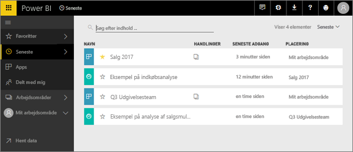
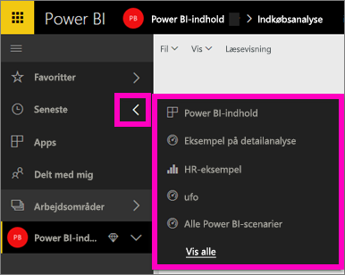

# **Nyligt** indhold i Power BI-tjeneste

## Hvad er nyligt indhold
Seneste indhold er de seneste elementer, du har læst, op til maksimalt 20 elementer.  Det omfatter: dashboards, rapporter, apps og projektmapper på tværs af alle dine arbejdsområder.

Se Amanda demonstrere, hvordan indholdslisterne **Seneste** udfyldes, og følg derefter den trinvise vejledning under videoen for at prøve det selv.

<iframe width="560" height="315" src="https://www.youtube.com/embed/G26dr2PsEpk" frameborder="0" allowfullscreen></iframe>

## Vis nyligt indhold
Hvis du vil se de fem elementer, du senest har besøgt, skal du på den venstre navigationslinje vælge pilen til højre for **Seneste**.  Herfra kan du vælge nyligt indhold for at åbne. Kun de fem seneste elementer vises på listen.

Hvis du har mere end fem elementer, du har besøgt for nylig, skal du vælge **Se alle** for at åbne skærmen Seneste (se nedenfor). Du kan også vælge **Seneste**, eller ikonet Seneste  på venstre navigationslinje.

Herfra kan du interagere med indholdet, som du kan med de særskilte faner med [**Dashboards**](service-dashboards.md), [**Rapporter**](service-reports.md) og **Projektmapper**, og på skærmen [**Apps**](service-install-use-apps.md).

## Næste trin
[Power BI-tjenestens Apps](service-install-use-apps.md)

Har du flere spørgsmål? [Prøv at spørge Power BI-community'et](http://community.powerbi.com/)

