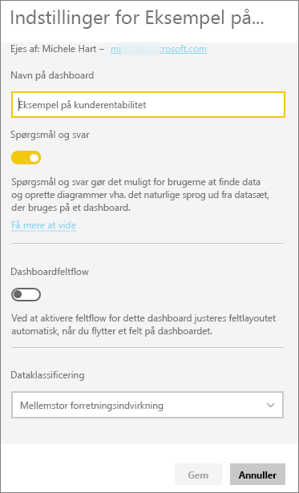
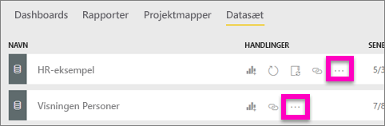
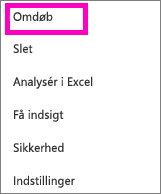
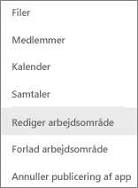
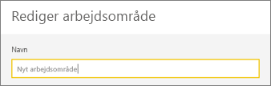
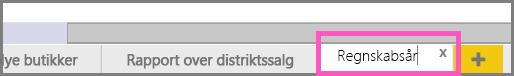

# Omdøb næsten alt i Power BI-tjenesten
I denne artikel kan du lære at omdøbe et dashboard, en rapport, en rapportside, en projektmappe, et datasæt, en app og et arbejdsområde i Power BI-tjenesten.

**Kan jeg ændre navnet?**

| Indholdstype | Jeg er forfatter eller ophavsmand | Delt med mig |
| --- | --- | --- |
| Dashboard i et arbejdsområde |Ja |Nej |
| Rapport i et arbejdsområde |Ja |Nej |
| Projektmappe i et arbejdsområde |Ja |Nej |
| Datasæt i et arbejdsområde |Ja |Nej |
| Apparbejdsområde |Ja, hvis du ejer eller har administratortilladelser |Nej |
| Publicerede apps |Ikke fra appskærmbilledet, men appens navn kan ændres fra apparbejdsområdet og publiceres igen med et nyt navn, hvis du har administratortilladelser |Nej |
| Appindhold (dashboard, rapport, projektmappe, datasæt) |Ikke fra appskærmbilledet, men appens indhold kan omdøbes fra apparbejdsområdet og publiceres igen med et nyt navn, hvis du har administratortilladelser |Nej |
| Indhold i **Delt med mig** |Nej |Nej |

## Omdøb et dashboard, en rapport eller en projektmappe
1. Start i et arbejdsområde, og vælg fanen **Dashboards**, **Rapporter** eller **Projektmapper**. Hold markøren over elementet for at omdøbe, og vælg . Hvis der ikke er noget tandhjulsikon, har du ikke tilladelse til at omdøbe.
   
   
2. Skriv det nye navn på siden Indstillinger, og vælg **Gem**.
   
   

## Omdøb et datasæt
1. Start i et arbejdsområde, og vælg fanen **Datasæt**.
   
   
2. Hold markøren over elementet for at omdøbe, vælg ellipsen (...), og vælg **Omdøb**.  
   
      
   
   > [!NOTE]
   > Indstillingerne på rullelisten varierer.
   > 
   > 
3. Skriv et nyt navn på siden Indstillinger, og vælg **Gem**.
   
     

## Omdøb et apparbejdsområde
Alle med administratortilladelser kan omdøbe et apparbejdsområde.

1. Start i det arbejdsområde, du vil omdøbe.
2. I øverste højre hjørne skal du vælge ellipsen (...) og vælge **Rediger arbejdsområde**. Hvis du ikke får vist denne indstilling, har du ikke tilladelser til at omdøbe dette arbejdsområde. 
   
    
3. Skriv et nyt navn til arbejdsområdet, og vælg **Gem**.
   
   

## Omdøb en side i en rapport
Kan du ikke lide navnet på en side i din Power BI-rapport?  Et nyt navn er kun et klik væk. Sider kan omdøbes i [rapportens redigeringsvisning](service-interact-with-a-report-in-editing-view.md).

1. Åbn rapporten i [Redigeringsvisning](service-reading-view-and-editing-view.md).
2. Find rapportens sidefaner nederst i Power BI-vinduet.
   
    
3. Åbn den rapportside, du vil omdøbe, ved at vælge fanen.
4. Dobbeltklik på navnet på fanen for at fremhæve det.  
   
    
5. Skriv et nyt navn til rapportsiden, og vælg Enter.
   
    

## Overvejelser og fejlfinding
* Hvis det element, der skal omdøbes, er blevet delt med dig eller er en del af en indholdspakke, kan du ikke se tandhjulsikonet, og du kan ikke få adgang til Indstillinger.
* Hvis du ikke kan se ellipsen (...) på fanen **Datasæt**, skal du udvide dit browservindue.

Har du flere spørgsmål? [Prøv at spørge Power BI-community'et](http://community.powerbi.com/)

