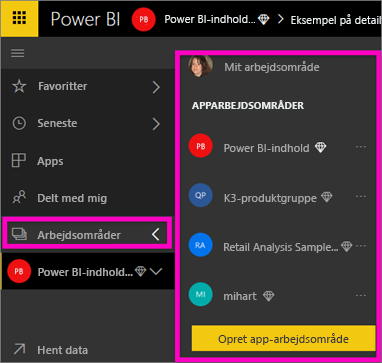
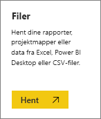
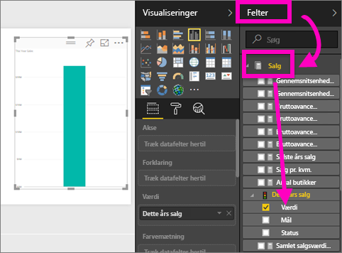
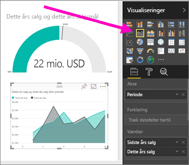
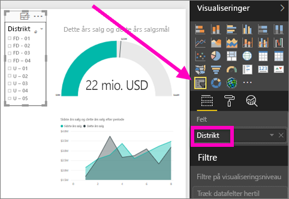

# Opret en ny Power BI-rapport ved at importere et datasæt
Du har læst [Rapporter i Power BI](service-reports.md), og nu vil du oprette din egen. Der er mange forskellige måder at oprette en rapport på, og i denne artikel starter vi med at oprette en meget grundlæggende rapport ud fra et Excel-datasæt. Når du har forstået de grundlæggende ting i forbindelse med at oprette en rapport, vejleder de **Næste trin** for neden dig gennem de mere avancerede rapportemner.  

> **TIP!** Hvis du vil oprette en rapport ved at kopiere en eksisterende rapport, skal du se [Kopiér en rapport](power-bi-report-copy.md)
> 
> 

## Importér datasættet
Denne metode til oprettelse af en rapport starter med et datasæt og et tomt rapportlærred. For at kunne følge med skal du [downloade Excel-datasættet Retail Analysis Sample](http://go.microsoft.com/fwlink/?LinkId=529778) og gemme det på OneDrive for Business (anbefales) eller lokalt.

1. Vi opretter rapporten i et arbejdsområde i Power BI-tjenesten, så vælg et eksisterende arbejdsområde eller opret et nyt.
   
   
2. Vælg **Hent data** nederst i venstre navigationsrude.
   
   
3. Vælg **Filer**, og naviger til den placering, hvor du har gemt Retail Analysis-eksemplet.
   
    
4. Til denne øvelse skal du vælge **Importér**.
   
   
5. Når datasættet er importeret, skal du vælge **Vis datasæt**.
   
   
6. Når du får vist et datasæt, åbnes rapporteditoren faktisk.  Du får vist et tomt lærred og værktøjerne til redigering af rapporten.
   
   

> **TIP!** Hvis du ikke kender til lærredet til redigering af rapporten, eller hvis du har brug for at få det genopfrisket, kan du [få en introduktion til rapporteditoren ](service-the-report-editor-take-a-tour.md), før du fortsætter.
> 
> 

## Føj en radial måler til rapporten
Nu hvor vores datasæt er blevet importeret, så lad os komme i gang med at besvare nogle spørgsmål.  Vores marketingchef (CMO) vil vide, hvor tæt vi er på at nå dette års salgsmål. En måler er et [godt visualiseringsvalg](power-bi-report-visualizations.md) til at vise denne type oplysninger.

1. I ruden Fields skal du vælge **Sales** > **This Year Sales** > **Værdi**.
   
    
2. Konvertér dit visuelle element til en måler ved at vælge skabelonen Gauge  fra ruden **Visualizations**.
   
    
3. Træk **Sales** > **This Year Sales** > **Goal** til feltet **Target value**. Det ser ud til, at vi er meget tæt på vores mål.
   
    
4. Nu ville det være en god ide at [gemme rapportén](service-report-save.md).
   
   

## Tilføj et områdediagram og et udsnit i rapporten
Vores marketingchef har nogle yderligere spørgsmål, vi skal besvare. Hun vil gerne vide, hvordan salget i år er i sammenligning med sidste år. Og hun vil gerne have vist resultaterne efter område.

1. Vi starter med at lave plads på vores lærred. Markér måleren, og flyt den til øverste højre hjørne. Træk derefter i hjørnerne for at gøre den mindre.
2. Fjern markeringen af måleren. I ruden Felter skal du vælge **Sales** > **This Year Sales** > **Value**og vælge **Sales** > **Last Year Sales**.
   
    
3. Konvertér dit visuelle element til et områdediagram ved at vælge skabelonen Area chart  i ruden **Visualizations**.
4. Vælg **Time** > **Period** for at føje den til feltet **Axis**.
   
    
5. For at sortere visualiseringen skal du vælge ellipsen og vælge **Sort by Period**.
6. Nu vil vi tilføje udsnittet. Markér et tomt område på lærredet, og vælg skabelonen Slicer . Så tilføjes der et tomt udsnitsværktøj på lærredet.
   
        
7. Vælg **District** > **District** i ruden Fields. Flyt og tilpas størrelsen af udsnitsværktøjet.
   
      
8. Brug udsnitsværktøjet til at søge efter mønstre og indsigt efter område (District).
   
     
9. Du kan eventuelt fortsætte med at tilføje visuelle elementer.

## Næste trin
* [Opret en kopi af en rapport](power-bi-report-copy.md)
* [Gem rapporten](service-report-save.md)    
* [Tilføj en ny side i rapporten](power-bi-report-add-page.md)  
* Se, hvordan du kan [fastgøre visuelle elementer til et dashboard](service-dashboard-pin-tile-from-report.md)    
* Har du flere spørgsmål? [Prøv Power BI-community'et](http://community.powerbi.com/)

