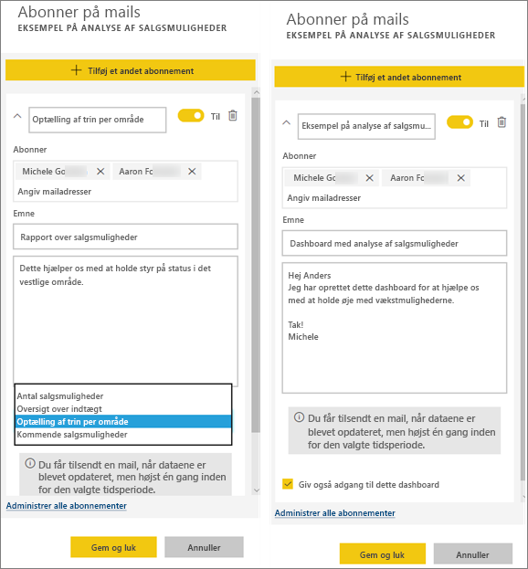

# Abonner på en rapport eller et dashboard i Power BI-tjenesten
Det har aldrig været nemmere at holde dig opdateret om dine vigtigste dashboards og rapporter. Abonner på de rapportsider og dashboards, der betyder mest for dig og dine kolleger, og Power BI sender et snapshot til din indbakke. Fortæl Power BI, hvor ofte du gerne vil modtage mails: fra en gang om dagen til en gang om ugen. 

Det sprog, der er angivet under Power BI-indstillingerne, bruges til mail og snapshot (se [Understøttede sprog og lande/regioner til Power BI](supported-languages-countries-regions.md)). Hvis der ikke er angivet et sprog, bruger Power BI det sprog, der stemmer overens med indstillingen for landestandard i din aktuelle browser. Hvis du vil se eller indstille dine sprogindstillinger, skal du vælge  > **Indstillinger > Generelt > Sprog**. 

Abonnementer kan kun oprettes i Power BI-tjenesten. Når du modtager mailen, indeholder den et link til "gå til rapport eller dashboard". På mobile enheder med Power BI-apps installeret, startes appen (i modsætning til standardhandlingen med at åbne rapporten eller dashboardet på Power BI-webstedet), hvis du vælger dette link.

## Krav
- **Oprettelse** af et abonnement er en Power BI Pro-funktion, og du skal have redigeringstilladelser til indholdet (dashboard eller rapport) for at kunne oprette abonnementet. 
- Da abonnementsmails kun sendes, når et underliggende datasæt opdateres, kan du ikke abonnere på de datasæt, der ikke opdateres.

## Abonner på et dashboard eller en rapportside
Uanset om du abonnerer på et dashboard eller en rapport, er processen stort set den samme. Du bruger den samme knap til at abonnere på dashboards og rapporter i Power BI-tjenesten.
 
.

1. Åbn dashboardet eller rapporten.
2. Vælg **Abonner** på den øverste menulinje, eller vælg konvolutikonet .
   
   

3. Brug den gule skyder til at slå abonnementet til og fra.  Abonnementet slettes ikke, når skyderen sættes til Fra. Hvis du vil slette abonnementet, skal du vælge ikonet for papirkurven.

4. Udfyld mailoplysningerne. Din mailadresse er allerede angivet, men du kan også føje andre til abonnementet. Det er kun mailadresser i det samme domæne, der kan tilføjes (se **Overvejelser og fejlfinding** nedenfor for at få flere oplysninger). Hvis rapporten eller dashboardet er hostet i [Premium-kapacitet](service-premium.md), kan du oprette abonnement for andre ved hjælp af deres mailadresser og gruppealiasser. Hvis rapporten eller dashboardet ikke er hostet i Premium-kapacitet, kan du stadig oprette abonnement for andre ved hjælp af deres mailadresser, men de skal også have Power BI Pro-licenser.

    I skærmbilledet nedenfor kan du se, at når du abonnerer på en rapport, abonnerer du rent faktisk på en *rapportside*.  Hvis du vil abonnere på mere end én side i en rapport, skal du vælge **Tilføj et andet abonnement** og vælge en anden side. 
      
     

5. Vælg **Gem og luk** for at gemme abonnementet. Abonnenterne vil modtage en mail og et snapshot af dashboardet eller rapportsiden, hver gang nogen af de underliggende datasæt ændres. Hvis dashboardet eller rapporten opdateres mere end en gang om dagen, sendes mailen kun efter den første opdatering.  
   
    
   
   > [!TIP]
   > Vil du se mailen med det samme? Udløs en mail ved at opdatere et af de datasæt, der er tilknyttet dashboardet, eller det datasæt, der er tilknyttet rapporten. (Hvis du ikke har redigeringstilladelser til datasættet, skal du få en anden, der har disse tilladelser, til at gøre det for dig). Hvis du vil finde ud af, hvilke datasæt der bruges, skal du vælge ikonet **Få vist relaterede**  for at åbne **Relateret indhold** og derefter vælge opdateringsikonet . 
   > 
   > 
   
   

## Sådan bestemmes mailtidsplanen
I nedenstående tabel beskrives, hvor ofte du modtager en mail. Det afhænger alt sammen af forbindelsesmetoden for det datasæt, som dashboardet eller rapporten er baseret på (DirectQuery, Direkte forbindelse, importeret til Power BI eller Excel-fil i OneDrive eller SharePoint Online), og af de tilgængelige og valgte abonnementsindstillinger (dagligt, ugentligt eller ingen).

|  | **DirectQuery** | **Live Connect** | **Planlagt opdatering (import)** | **Excel-fil i OneDrive/SharePoint Online** |
| --- | --- | --- | --- | --- |
| **Hvor ofte bliver rapporten/dashboardet opdateret?** |Hvert 15. min. |Power BI undersøger hvert 15. minut, og hvis datasættet er ændret, opdateres rapporten. |Brugeren vælger ingen, dagligt eller ugentligt. Dagligt kan være op til 8 gange om dagen. Ugentlig er faktisk en ugentlig tidsplan, som brugeren opretter og indstiller til opdatering så lidt som en gang om ugen og så ofte som dagligt. |Én gang i timen |
| **Hvor stor kontrol har brugeren over tidsplanen for mail ifm. abonnementet?** |Indstillinger er: dagligt eller ugentligt |Ingen indstillinger: Brugerne får tilsendt en mail, hvis rapporten opdateres, men ikke mere end én gang om dagen. |Hvis tidsplanen for opdatering er dagligt, kan der vælges dagligt og ugentligt.  Hvis tidsplanen for opdatering er ugentligt, kan der kun vælges ugentligt. |Ingen indstillinger: Brugeren får tilsendt en mail, når datasættet opdateres, men ikke mere end én gang om dagen. |

## Administrer dine abonnementer
Det er kun den person, der har oprettet abonnementet, der kan administrere det.  Der er 2 veje til skærmen, hvor du kan administrere dine abonnementer.  Den første er at vælge **Administrer alle abonnementer** i dialogboksen **Abonner på mails** (se skærmbilledet under trin 4 herover). Den anden er at vælge tandhjulsikonet  i Power BI på den øverste menulinje og at vælge **Indstillinger**.

De abonnementer, der vises, afhænger af, hvilket arbejdsområde der er aktivt i øjeblikket.  Hvis du vil se alle dine abonnementer på én gang for alle arbejdsområder, skal du sørge for, at **Mit arbejdsområde** er aktivt. Du kan få hjælp til arbejdsområder i [Arbejdsområder i Power BI](service-create-distribute-apps.md).

Et abonnement slutter, hvis Pro-licensen udløber, dashboardet eller rapporten slettes af ejeren, eller hvis den brugerkonto, der blev brugt til oprettelse af abonnementet, slettes.

## Overvejelser og fejlfinding
* Hvis der er anvendt sikkerhed på rækkeniveau på nogen af felterne, bliver disse felter ikke vist for e-mailabonnementer på dashboard.  Hvis datasættet bruger RLS, vil du ikke kunne oprette et abonnement for mailabonnementer på rapporter.
* Rapportsideabonnementer er bundet til navnet på siden i rapporten. Hvis du abonnerer på en rapportside og omdøber den, skal du genoprette dit abonnement
* Din organisation kan konfigurere bestemte indstillinger i Azure Active Directory, som begrænser muligheden for at bruge mailabonnementer i Power BI.  Dette omfatter, men er ikke begrænset til, multifaktorgodkendelse eller IP-intervalbegrænsning, når ressourcer tilgås.
* Mailabonnementer for rapporter/dashboards, der bruger datasæt med direkte forbindelser, understøttes i øjeblikket ikke, når du abonnerer på brugere ud over dig selv.
* For mailabonnementer på datasæt med direkte forbindelse får du kun mails, når dataene ændres. Så hvis der finder en opdatering sted, men ingen dataændringer, sender Power BI dig ikke en mail.
* Mailabonnementer understøtter ikke de fleste [brugerdefinerede visuelle elementer](power-bi-custom-visuals.md).  Den eneste undtagelse er de brugerdefinerede visuelle elementer, der er blevet [certificeret](power-bi-custom-visuals-certified.md).  
* Mailabonnementer understøtter ikke R-drevne brugerdefinerede visuals på nuværende tidspunkt.  
* Hvis der er anvendt sikkerhed på rækkeniveau på nogen af dashboardfelterne, bliver disse felter ikke vist.
* Du kan ikke abonnere for andre brugere til en rapport, der har sikkerhed på rækkeniveau (RLS).
* Mailabonnementer sendes med rapportens tilstande for standardfilter og -udsnit. Hvis du ændrer standardværdierne, efter at du har oprettet abonnementet, vises de ikke i mailen.    
* Mailabonnementer understøttes endnu ikke på rapportsider, der er oprettet med funktionen Power BI Desktop Live Connect til tjenesten.    
* For dashboardabonnementer specifikt understøttes visse typer felter endnu ikke.  Det omfatter: streamingfelter, videofelter, felter med brugerdefineret webindhold.     
* Hvis du deler et dashboard med en kollega uden for din lejer, vil du ikke kunne oprette et abonnement for den kollega. Så hvis du er aaron@xyz.com, kan du dele med anyone@ABC.com, men du kan endnu ikke oprette abonnement for anyone@ABC.com, og vedkommende kan ikke abonnere på delt indhold.      
* Abonnementer mislykkes muligvis på dashboards og rapporter med meget store billeder på grund af størrelsesbegrænsninger for mails.    
* Power BI afbryder automatisk opdatering på datasæt, der er knyttet til dashboards og rapporter, som ikke er blevet besøgt i mere end to måneder.  Men hvis du føjer et abonnement til et dashboard eller en rapport, standses det ikke midlertidigt, selvom det ikke besøges.    
* Hvis du ikke modtager abonnementsmailene, skal du kontrollere, at din brugers hovednavn (UPN) kan modtage mails. [Power BI-teamet arbejder på at slække på dette krav](https://community.powerbi.com/t5/Issues/No-Mail-from-Cloud-Service/idc-p/205918#M10163), så hold dig opdateret. 
* Hvis dit dashboard eller din rapport er i Premium-kapacitet, kan du bruge mailaliasser for grupper til abonnementer i stedet for at oprette abonnementer for kollegaer én mailadresse ad gangen. Aliasserne er baseret på det aktuelle Active Directory. 

## Næste trin
* Har du flere spørgsmål? [Prøv at spørge Power BI-community'et](http://community.powerbi.com/)    
* [Læs blogindlægget](https://powerbi.microsoft.com/blog/introducing-dashboard-email-subscriptions-a-360-degree-view-of-your-business-in-your-inbox-every-day/)

