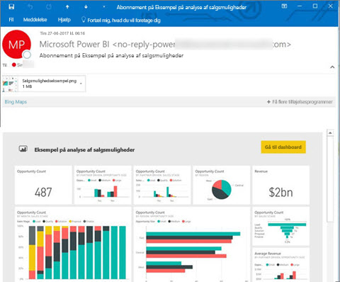
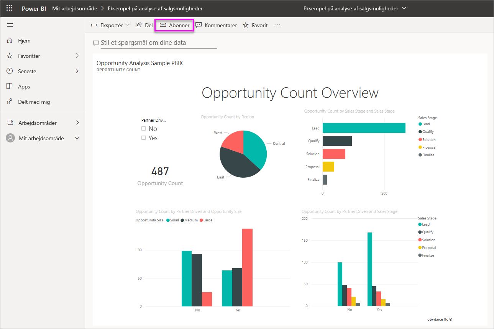
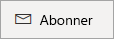
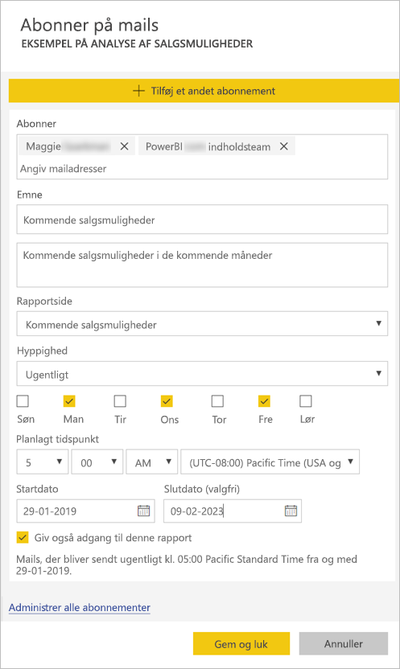
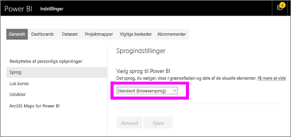
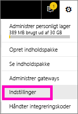
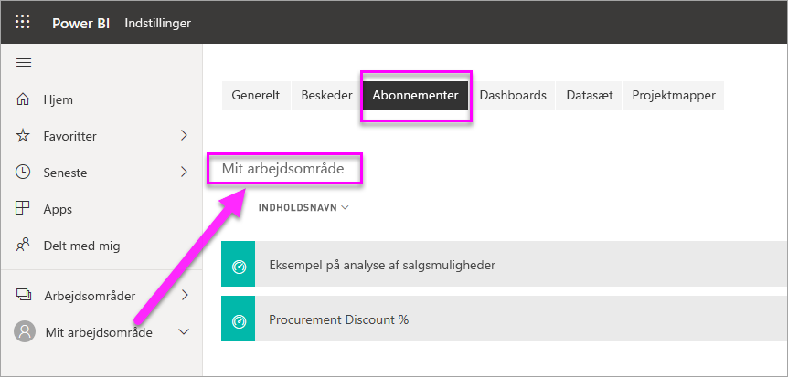

# Meld dig selv og andre til abonnementer på rapporter og dashboards i Power BI-tjenesten

Du kan melde dig selv og dine kolleger til abonnementer på de rapportsider, dashboards og sideinddelte rapporter, der betyder mest for jer. Så sender Power BI et snapshot via mail til jeres indbakke. Fortæl Power BI, hvor ofte du vil modtage mails: Dagligt, ugentligt, hver time, månedligt eller én gang om dagen efter den første dataopdatering.  Hvis du vælger dagligt, ugentligt, hver time eller månedligt, kan du vælge, hvilket tidspunkt abonnementet skal køres på.  Du kan i alt konfigurere op til 24 forskellige abonnementer pr. rapport eller dashboard.

 

Du kan kun oprette abonnementer i Power BI-tjenesten. Du modtager en mail med et snapshot af rapportsiden eller dashboardet med et link til at åbne rapporten eller dashboardet. På mobilenheder med Power BI-apps installeret startes Power BI-appen i stedet for at åbne rapporten eller dashboardet på Power BI-webstedet, når dette link vælges.

## Krav

**Oprettelse** af et abonnement kan udføres af:

- Brugere med en Power BI Pro-licens
- Brugere, der ser indhold i et Premium-arbejdsområde eller i en Premium-app, kan også abonnere på indhold, der findes der, selv uden en Power BI Pro-licens.

Du behøver ikke at have redigeringstilladelser til indholdet (dashboard eller rapport) for at oprette et abonnement til dig selv, men du skal have redigeringstilladerlser for at oprette et for andre. 

## Abonner på et dashboard, en rapportside eller en sideinddelt rapport

Uanset om du abonnerer på et dashboard, en rapport eller en sideinddelt rapport, er processen den samme. Du bruger den samme knap til at abonnere på dashboards og rapporter i Power BI-tjenesten.

Det er lidt anderledes at abonnere på sideinddelte rapporter. Du kan finde flere oplysninger i [Meld dig selv og andre til et abonnement på en sideinddelt rapport i Power BI-tjenesten](consumer/paginated-reports-subscriptions.md).
 
.

1. Åbn dashboardet eller rapporten.
2. Vælg **Abonner** på menulinjen øverst, eller vælg konvolutikonet .
   
   

3. Brug den gule skyder til at slå abonnementet til og fra.  Abonnementet slettes ikke, når skyderen sættes til **Fra**. Hvis du vil slette abonnementet, skal du vælge ikonet for papirkurven.

4. Din mailadresse er allerede angivet i feltet **Abonner**. Du kan også føje andre mailadresser til abonnementet, men kun på det samme domæne. Hvis rapporten eller dashboardet hostes i [Premium-kapacitet](service-premium-what-is.md), kan du oprette abonnement for andre mailadresser og gruppealiasser. Hvis rapporten eller dashboardet ikke hostes i Premium-kapacitet, kan du oprette abonnement for andre, men de skal også have Power BI Pro-licenser. Se flere oplysninger under [Overvejelser og fejlfinding](#considerations-and-troubleshooting) herunder. 

5. Udfyld mailoplysningerne **Emne** og **Meddelelse**. 

5. Vælg en **Hyppighed** for dit abonnement: **Dagligt**, **Hver time**, **Ugentligt**, **Månedligt** eller **Efter dataopdatering (dagligt)** .  Hvis du kun vil modtage abonnementsmailen på bestemte dage, skal du vælge **Timevist** eller **Ugentligt** og vælge, hvilke dage du vil modtage den.  Hvis du f.eks. kun vil modtage abonnementsmailen på hverdage, skal du vælge **Ugentligt** og fjerne markeringen af felterne for **lørdag** og **søndag**.  Hvis du vælger **Månedligt**, skal du angive den eller de dage på måneden, hvor du vil modtage abonnementsmailen.  

6. Hvis du vælger **Dagligt**, **Hver time**, **Månedligt** eller **Ugentligt**, kan du også vælge et **Planlagt tidspunkt** for abonnementet.  Du kører den hver hele time eller 15, 30 eller 45 minutter over.  Vælg morgen (AM) eller eftermiddag/aften (PM). Du kan også angive tidszonen.  Hvis du vælger **Hver time**, skal du vælge det **planlagte tidspunkt**, hvor abonnementet skal starte, så kommer det hver time derefter.

7. Startdatoen for dit abonnement er som standard den dato, du har oprettet det. Du har mulighed for at vælge en slutdato. Hvis du ikke angiver en slutdato, er den automatisk ét år efter startdatoen. Du kan ændre den til en hvilken som helst dato i fremtiden (op til år 9999) når som helst, før abonnementet slutter. Når et abonnement når en slutdato, ophører det, indtil du aktiveret det igen. Du modtager en meddelelse, før den planlagte slutdato, hvor du bliver spurgt, om du vil forlænge det.    

    På skærmbilledet nedenfor kan du se, at du rent faktisk abonnerer på en *rapportside*, når du abonnerer på en rapport.  Hvis du vil abonnere på mere end én side i en rapport, skal du vælge **Tilføj et andet abonnement** og vælge en anden side. 
      
     

7. Vælg **Gem og luk**. Dem, der abonnerer, modtager en mail og et snapshot af dashboardet eller rapportsiden med den hyppighed og det tidspunkt, du har valgt. Du kan i alt oprette op til 24 abonnementer pr. rapport eller dashboard, og du kan angive entydige modtagere, tidspunkter og hyppigheder for hvert abonnement.  For alle abonnementer, der er angivet til **Efter dataopdatering** for dashboardet eller rapporten, sendes der stadig kun en mail efter den første planlagte opdatering.   
      
   > [!TIP]
   > Vil du sende mailen fra et abonnement med det samme eller on-demand når som helst? Vælg **Kør nu** for abonnementerne for det dashboard eller den rapport, du vil sende. Du får vist en meddelelse om, at en mail er på vej til alle med det pågældende abonnement.  Denne handling tæller ikke i forhold til grænsen på 24 planlagte abonnementskørsler pr. dag pr. rapport eller dashboard. Dette udløser IKKE en opdatering af data i det underliggende datasæt. 
   > 
   > 
   
## Mailsprog

Det sprog, der er angivet under Power BI-indstillingerne, bruges til mail og snapshot (se [Understøttede sprog og lande/områder for Power BI](supported-languages-countries-regions.md)). Hvis der ikke er angivet et sprog, bruger Power BI det sprog, der stemmer overens med indstillingen for landestandard i din aktuelle browser. Hvis du vil se eller indstille dine sprogindstillinger, skal du vælge  > **Indstillinger > Generelt > Sprog**. 

## Administrer dine abonnementer
Det er kun den person, der har oprettet abonnementet, der kan administrere det.  Der er to stier til skærmen, hvor du kan administrere dine abonnementer.  Den første er at vælge **Administrer alle abonnementer** i dialogboksen **Abonner på mails** (se skærmbilledet under trin 4 herover). Den anden er at vælge tandhjulsikonet  i Power BI på den øverste menulinje og at vælge **Indstillinger**.

De abonnementer, der vises, afhænger af, hvilket arbejdsområde der er aktivt i øjeblikket.  Hvis du vil se alle dine abonnementer på én gang for alle arbejdsområder, skal du sørge for, at **Mit arbejdsområde** er aktivt. Du kan få hjælp til arbejdsområder i [Arbejdsområder i Power BI](service-create-workspaces.md).

Et abonnement slutter, hvis Pro-licensen udløber, hvis ejeren sletter dashboardet eller rapporten, eller hvis den brugerkonto, der blev brugt til at oprette abonnementet, slettes.

## Overvejelser og fejlfinding

* Dashboards med mere end 25 fastgjorte felter eller 4 fastgjorte liverapportsider gengives muligvis ikke fuldstændigt i abonnementsmails, der sendes til brugerne.  Abonnementer på dashboards over dette antal felter blokeres ikke. De anses dog for ikke at være understøttet, hvis du oplever problemer. Overvej at ændre dem i henhold dertil, så de ligger inden for det understøttede antal.
* I sjældne tilfælde kan det tage længere tid end 15 minutter at levere mailabonnementer til deres modtagere. Hvis det sker, anbefaler vi, at du kører en opdatering af dine data og dit mailabonnement på forskellige tidspunkter for at sikre rettidig levering. Hvis problemet fortsætter, skal du kontakte Power BI-support.
* For mailabonnementer på dashboards vises nogle felter ikke, hvis der er anvendt sikkerhed på rækkeniveau for dem.  
* For mailabonnementer på rapporter kan du ikke oprette et abonnement til dig selv, hvis datasættet anvender sikkerhed på rækkeniveau. Du kan ikke tilmelde andre et abonnement på en rapport med sikkerhed på rækkeniveau, medmindre du bruger en sideinddelt rapport, som giver dig mulighed for at sende abonnementet til andre, der bruger din sikkerhedskontekst. 
* Rapportsideabonnementer er bundet til navnet på siden i rapporten. Hvis du abonnerer på en rapportside og omdøber den, skal du genoprette dit abonnement.
* Din organisation kan konfigurere bestemte indstillinger i Azure Active Directory, som begrænser muligheden for at bruge mailabonnementer i Power BI.  Disse begrænsninger omfatter, men er ikke begrænset til, multifaktorgodkendelse eller IP-intervalbegrænsning, når ressourcer tilgås.
* Mailabonnementer på rapporter/dashboards, der bruger direkte forbindelser, understøttes i øjeblikket ikke, når andre end dig selv tilmeldes et abonnement, medmindre du bruger en sideinddelt rapport, som giver dig mulighed for at sende abonnementet til andre, som bruger din sikkerhedskontekst. 
* Mailabonnementer understøtter ikke de fleste [brugerdefinerede visualiseringer](developer/power-bi-custom-visuals.md).  Den eneste undtagelse er de brugerdefinerede visuelle elementer, der er blevet [certificeret](developer/power-bi-custom-visuals-certified.md).  
* Mailabonnementer understøtter ikke R-drevne brugerdefinerede visualiseringer på nuværende tidspunkt.  
* Mailabonnementer sendes med rapportens tilstande for standardfilter og -udsnit. Hvis du ændrer standardværdierne, efter du har oprettet abonnementet, vises de ikke i mailen.  Sideinddelte rapporter understøtter denne egenskab og giver dig mulighed for at angive de specifikke parameterværdier pr. abonnement.   
* For dashboardabonnementer specifikt understøttes visse typer felter endnu ikke.  Det omfatter: streamingfelter, videofelter, felter med brugerdefineret webindhold.     
* Hvis du deler et dashboard med en kollega uden for din lejer, kan du ikke også oprette et abonnement for den pågældende kollega. Så hvis du er aaron@xyz.com, kan du dele med anyone@ABC.com, men du kan endnu ikke oprette abonnement for anyone@ABC.com, og vedkommende kan ikke abonnere på delt indhold.      
* Power BI afbryder automatisk midlertidigt opdatering af datasæt, der er knyttet til dashboards og rapporter, som ikke er blevet besøgt i mere end to måneder.  Men hvis du føjer et abonnement til et dashboard eller en rapport, afbrydes det ikke midlertidigt, selvom det ikke besøges.    
* Hvis du ikke modtager abonnementsmailene, skal du kontrollere, at din brugers hovednavn (UPN) kan modtage mails. 
* Hvis dit dashboard eller din rapport er i Premium-kapacitet, kan du bruge mailaliasser for grupper til abonnementer i stedet for at oprette abonnementer for kollegaer én mailadresse ad gangen. Aliasserne er baseret på det aktuelle Active Directory. 

## Næste trin

- [Meld dig selv og andre til et abonnement på en sideinddelt rapport i Power BI-tjenesten](consumer/paginated-reports-subscriptions.md)
- Har du flere spørgsmål? [Prøv at spørge Power BI-community'et](https://community.powerbi.com/)    
- [Læs blogindlægget](https://powerbi.microsoft.com/blog/introducing-dashboard-email-subscriptions-a-360-degree-view-of-your-business-in-your-inbox-every-day/)
