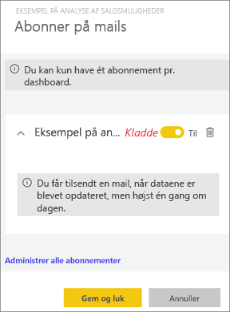
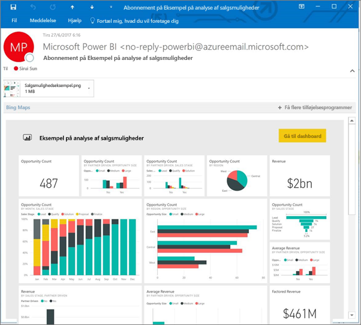
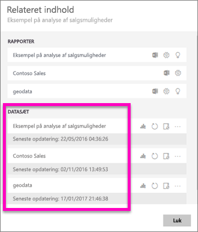
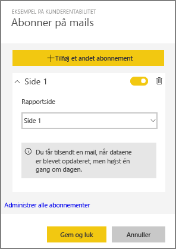
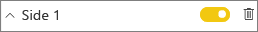
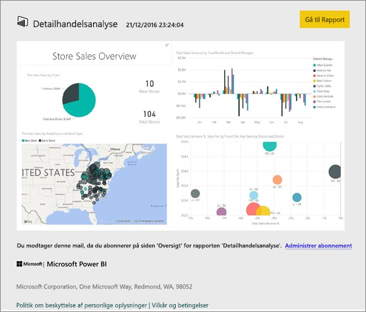
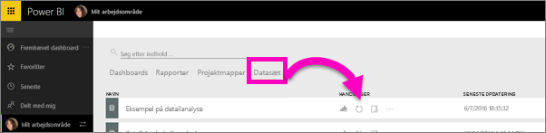

# Abonner på en rapport eller et dashboard i Power BI
Det har aldrig været nemmere at holde dig opdateret om dine vigtigste dashboards og rapporter. Abonner på rapportsider og dashboards, der betyder mest for dig, og Power BI sender et snapshot til din indbakke. Fortæl Power BI, hvor ofte du gerne vil modtage mails: fra en gang om dagen til en gang om ugen. 

Det sprog, der er angivet under Power BI-indstillingerne, bruges til mail og snapshot (se [Understøttede sprog og lande/regioner til Power BI](supported-languages-countries-regions.md)). Hvis der ikke er angivet et sprog, bruger Power BI det sprog, der stemmer overens med indstillingen for landestandard i din aktuelle browser. Hvis du vil se eller indstille dine sprogindstillinger, skal du vælge  **> Indstillinger > Generelt > Sprog**. 

> [!NOTE]
> Abonnementer kan kun oprettes i Power BI-tjenesten. Når du modtager mailen, indeholder den et link til "gå til rapport/dashboard". På mobile enheder med Power BI-apps installeret, startes appen (i modsætning til standardhandlingen med at åbne rapporten eller dashboardet på Power BI-webstedet), hvis du vælger dette link.
> 
> 

Se Sirui konfigurere et mailabonnement for en rapport. Følg derefter den trinvise vejledning under videoen for at prøve det selv.

<iframe width="560" height="315" src="https://www.youtube.com/embed/saQx7G0pxhc" frameborder="0" allowfullscreen></iframe>

## Krav
**Oprettelse** af et abonnement er en Power BI Pro-funktion, og du skal have visnings- eller redigeringstilladelser til indholdet (dashboard eller rapport).

## Abonner på et dashboard

1. Åbn dashboardet.
2. Vælg **Abonner** på den øverste menulinje, eller vælg konvolutikonet .
   
   
3. Brug den gule skyder til at slå abonnementet til og fra.  Abonnementet slettes ikke, når skyderen sættes til Fra. Hvis du vil slette abonnementet, skal du vælge ikonet for papirkurven.
   
   
4. Vælg **Gem og luk** for at gemme abonnementet. Du modtager et mailsnapshot af dashboardet, hver gang nogen af de underliggende datasæt ændres. Hvis dashboardet opdateres mere end en gang om dagen, modtager du kun mailsnapshottet efter den første opdatering.
   
   
   
   > [!TIP]
   > Vil du se mailen med det samme? Udløs en mail ved at opdatere et af de datasæt, der er knyttet til dashboardet. (Hvis du ikke har redigeringstilladelser til datasættet, skal du få en anden, der har disse tilladelser, til at gøre det for dig). Hvis du vil finde ud af, hvilke datasæt der bruges til at oprette dashboardet, skal du vælge ikonet **Få vist relaterede**  på dashboardet for at åbne **Relateret indhold** og derefter vælge opdateringsikonet . 
   > 
   > 
   
   

## Abonner på en rapportside
1. Åbn rapporten i [Læsevisning](service-reading-view-and-editing-view.md).
2. Vælg **Abonner** på den øverste menulinje.
   
   
3. Du kan abonnere på én rapportside ad gangen. Vælg den specifikke rapportside på rullelisten.
   
   
   
   Fortsæt med at tilføje rapportsider.
4. Brug den gule skyder til at slå abonnementet for hver side til og fra.  Abonnementet slettes ikke, når skyderen sættes til Fra. Hvis du vil slette abonnementet, skal du vælge ikonet for papirkurven.
   
   
5. Vælg **Gem og luk** for at gemme abonnementet. Du modtager et mailsnapshot af hver rapportside, når rapporten opdateres. Hvis rapporten ikke opdateres, modtager du ikke et mailsnapshot den pågældende dag.  Hvis rapporten opdateres mere end en gang om dagen, modtager du kun mailsnapshottet efter den første opdatering.
   
   
   
   > [!TIP]
   > Vil du se mailen med det samme? Udløs en mail ved at åbne dit datasæt og vælge **Opdater nu**. Hvis du ikke har redigeringstilladelser til datasættet, skal du få en anden, der har disse tilladelser, til at gøre det for dig.
   > 
   > 
   > 
   > 

## Sådan bestemmes mailtidsplanen for rapporter
I nedenstående tabel beskrives, hvor ofte du modtager en mail. Det afhænger alt sammen af forbindelsesmetoden for det datasæt, som dashboardet eller rapporten er baseret på (DirectQuery, Direkte forbindelse, importeret til Power BI eller Excel-fil i OneDrive eller SharePoint Online), og af de tilgængelige og valgte abonnementsindstillinger (dagligt, ugentligt eller ingen).

|  | **DirectQuery** | **Live Connect** | **Planlagt opdatering (import)** | **Excel-fil i OneDrive/SharePoint Online** |
| --- | --- | --- | --- | --- |
| **Hvor ofte bliver rapporten/dashboardet opdateret?** |Hvert 15. min. |Power BI undersøger hvert 15. minut, og hvis datasættet er ændret, opdateres rapporten. |Brugeren vælger ingen, dagligt eller ugentligt. Dagligt kan være op til 8 gange om dagen. Ugentlig er faktisk en ugentlig tidsplan, som brugeren opretter og indstiller til opdatering så lidt som en gang om ugen og så ofte som dagligt. |Én gang i timen |
| **Hvor stor kontrol har brugeren over tidsplanen for mail ifm. abonnementet?** |Indstillinger er: dagligt eller ugentligt |Ingen indstillinger: Brugerne får tilsendt en mail, hvis rapporten opdateres, men ikke mere end én gang om dag. |Hvis tidsplanen for opdatering er dagligt, er indstillinger dagligt og ugentligt.  Hvis tidsplanen for opdatering er ugentligt, kan der kun vælges ugentligt. |Ingen indstillinger: Brugeren får tilsendt en mail, når datasættet opdateres, men ikke mere end én gang om dagen. |

## Administrer dine abonnementer
Der er 2 veje til skærmen, hvor du kan administrere dine abonnementer.  Den første er at vælge **Administrer alle abonnementer** i dialogboksen **Abonner på mails** (se trin 3 herover). Den anden er at vælge tandhjulsikonet  i Power BI på den øverste menulinje og at vælge **Indstillinger**.

De abonnementer, der vises, afhænger af, hvilket arbejdsområde der er aktivt i øjeblikket.  Hvis du vil se alle dine abonnementer på én gang for alle arbejdsområder, skal du sørge for, at **Mit arbejdsområde** er aktivt. Du kan få hjælp til arbejdsområder i [Arbejdsområder i Power BI](service-create-distribute-apps.md).

Et abonnement slutter, hvis Pro-licensen udløber, dashboardet eller rapporten slettes af ejeren, den brugerkonto, der blev brugt til oprettelse af abonnementet, slettes.

## Overvejelser og fejlfinding
* Abonnement er på nuværende tidspunkt ikke tilgængeligt for dashboards eller rapporter, der stammer fra indholdspakker eller Power BI-apps. Men der er en alternativ løsning... opret en kopi af rapporten/dashboardet, og føj abonnementer til denne version i stedet.
* Rapportsideabonnementer er bundet til navnet på siden i rapporten. Hvis du abonnerer på en rapportside og omdøber den, skal du genoprette dit abonnement
* For mailabonnementer på datasæt med direkte forbindelse får du kun mails, når dataene ændres. Så hvis der finder en opdatering sted, men ingen dataændringer, sender Power BI dig ikke en mail.
* Mailabonnementer understøtter ikke de fleste [brugerdefinerede visuelle elementer](power-bi-custom-visuals.md).  Den eneste undtagelse er de brugerdefinerede visuelle elementer, der er blevet [certificeret](power-bi-custom-visuals-certified.md).  
* Mailabonnementer sendes med rapportens tilstande for standardfilter og -udsnit. De ændringer af standarderne, du foretager, inden du abonnerer, vises ikke i mailen.    
* Mailabonnementer understøttes endnu ikke på rapportsider, der er oprettet med funktionen Power BI Desktop Live Connect til tjenesten.    
* For dashboardabonnementer specifikt understøttes visse typer felter endnu ikke.  Det omfatter: streamingfelter, videofelter, felter med brugerdefineret webindhold.     
* Hvis du deler et dashboard med en kollega uden for din lejer, kan vedkommende ikke abonnere på dashboardet eller de tilknyttede rapportsider. Så hvis du er aaron@xyz.com, kan du dele med anyone@ABC.com.  Men anyone@ABC.com kan ikke abonnere på det delte indhold.    
* Abonnementer mislykkes muligvis på dashboards og rapporter med meget store billeder på grund af størrelsesbegrænsninger for mails.    
* Power BI afbryder automatisk opdatering på datasæt, der er knyttet til dashboards og rapporter, som ikke er blevet besøgt i mere end to måneder.  Men hvis du føjer et abonnement til et dashboard eller en rapport, standses det ikke midlertidigt, selvom det ikke besøges.    
* Hvis du ikke modtager abonnementsmailene, skal du kontrollere, at din brugers hovednavn (UPN) kan modtage mails. [Power BI-teamet arbejder på at slække på dette krav](https://community.powerbi.com/t5/Issues/No-Mail-from-Cloud-Service/idc-p/205918#M10163), så hold dig opdateret. 
* Din Power BI-sprogindstilling bruges i sendte rapporter og på dine dashboards. Standardsproget er engelsk. Hvis du vil se eller indstille dine sprogindstillinger, skal du vælge  **> Indstillinger > Generelt > Sprog**.

## Næste trin
* Har du flere spørgsmål? [Prøv at spørge Power BI-community'et](http://community.powerbi.com/)    
* [Læs blogindlægget](https://powerbi.microsoft.com/blog/introducing-dashboard-email-subscriptions-a-360-degree-view-of-your-business-in-your-inbox-every-day/)

