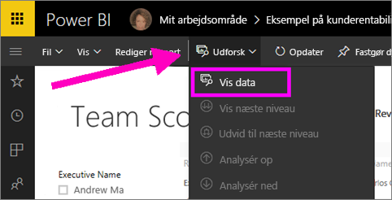
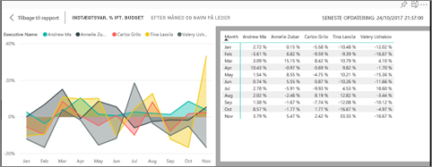
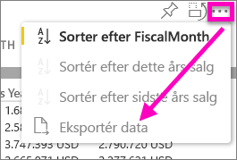

# Vis de data, der blev brugt til at oprette visualiseringen
## Vis data
En Power BI-visualisering er oprettet vha. data fra dine datasæt. Hvis du vil se bag kulisserne, kan du i Power BI *få vist* de data, der bruges til at oprette visualiseringen. Når du vælger **Vis data**, vises dataene under (eller ud for) visualiseringen i Power BI.

Du kan også eksportere de data, der bruges til at oprette visualiseringen som en .xlsx- eller .csv-fil og få den vist i Excel. Du kan finde flere oplysninger under [Eksportér data fra Power BI-visualiseringer](power-bi-visualization-export-data.md).

> [!NOTE]
> Både *Vis data* og *Eksportér data* er tilgængelige i Power BI-tjenesten og Power BI Desktop. Power BI Desktop indeholder dog et ekstra lag detaljer, og [*Vis poster* viser de faktiske rækker fra datasættet](desktop-see-data-see-records.md).
> 
> 

## Brug af *Vis data* i Power BI-tjenesten
1. I Power BI-tjenesten skal du åbne en rapport i [Læsevisning eller Redigeringsvisning](service-reading-view-and-editing-view.md) og vælge en visualisering.  Åbn Rapportvisning i Power BI Desktop.
2. Hvis du vil have vist de underliggende data for visualiseringen, skal du vælge **Udforsk** > **Få vist data**.
   
   
3. Som standard vises dataene under visualiseringen.
   
   
4. Hvis du vil ændre retningen, skal du vælge lodret layout  i øverste højre hjørne af visualiseringen.
   
   
5. Hvis du vil eksportere dataene til en .csv-fil, skal du vælge ellipsen og vælge **Eksportér data**.
   
    
   
    Du kan finde flere oplysninger om eksport af data til Excel under [Eksportér data fra Power BI-visualiseringer](power-bi-visualization-export-data.md).
6. Hvis du vil skjule dataene, skal du fjerne markeringen af **Udforsk** > **Få vist data**.

### Næste trin
[Eksportér data fra Power BI-visualiseringer](power-bi-visualization-export-data.md)    
[Visualiseringer i Power BI-rapporter](power-bi-report-visualizations.md)    
[Power BI-rapporter](service-reports.md)    
[Power BI – grundlæggende begreber](service-basic-concepts.md)    
Har du flere spørgsmål? [Prøv at spørge Power BI-community'et](http://community.powerbi.com/)

