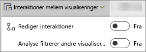
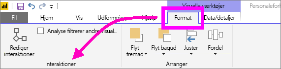
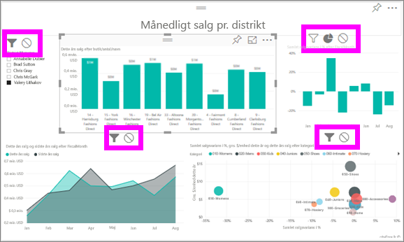

# Rediger, hvordan visualiseringer interagerer i en Power BI-rapport
Hvis du har redigeringsrettigheder til en rapport, kan du bruge **Visuelle interaktioner** til at ændre, hvor visualiseringer på en rapportside påvirker hinanden. 

Som standard kan visualiseringer på en rapportside bruges til tværgående filtrering og tværgående fremhævning af de andre visualiseringer på siden.
Hvis der for eksempel vælges en delstat på en kortvisualisering, fremhæves søjlediagrammet, og kurvediagrammet filtreres for kun at vise data, som gælder for denne ene delstat.
Se [Om filtrering og fremhævning](power-bi-reports-filters-and-highlighting.md). Og hvis du har visuelle effekter, der understøtter [detailudledning](consumer/end-user-drill.md) som standard, har det ingen indvirkning på andre visualiseringer på rapportsiden, at du foretager detailudledning i én visualisering. Men begge disse standardfunktionsmåder kan tilsidesættes, og interaktioner indstilles for den enkelte visualisering.

Denne artikel viser, hvordan du kan bruge **visuelle interaktioner** i Power BI-tjenestens [redigeringstilstand](service-interact-with-a-report-in-editing-view.md) og i Power BI Desktop. Hvis en rapport er blevet delt med dig, kan du ikke ændre indstillingerne for de visuelle interaktioner.

> [!NOTE]
> Begreberne *tværgående filter* og *tværgående fremhævning* bruges til at skelne mellem den funktionsmåde, der er beskrevet her, og hvad der sker, når du bruger ruden **Filtre** til at filtrere og fremhæve visualiseringer.  
> 
> 

<iframe width="560" height="315" src="https://www.youtube.com/embed/N_xYsCbyHPw?list=PL1N57mwBHtN0JFoKSR0n-tBkUJHeMP2cP" frameborder="0" allowfullscreen></iframe>

1. Vælg en visualisering for at aktivere den.  
2. Vis indstillingerne for **visuelle interaktioner**.
    - Vælg på rullelisten for menulinjen Rapport i Power BI-tjenesten.

       

    - Vælg **Format > Interaktioner** under Desktop.

        

3. Hvis du vil aktivere interaktionskontrolelementerne for visualisering, skal du vælge **Rediger interaktioner**. Power BI tilføjes ikoner for tværgående filter og tværgående fremhævning til alle de andre visualiseringer på rapportsiden.
   
    
3. Find ud af, hvilke indvirkning den valgte visualisering skal have på de andre.  Og gentag eventuelt for alle andre visualiseringer på rapportsiden.
   
   * Hvis den skal filtrere visualiseringen i tværgående retning, skal du vælge ikonet **Filter** .
   * Hvis den skal fremhæve visualiseringen i tværgående retning, skal du vælge ikonet **Fremhæv** .
   * Hvis den ikke skal have nogen indvirkning, kan du vælge ikonet **Ingen indvirkning** .

4. Hvis du vil aktivere kontrolelementer til detailudledning, skal du vælge **Boring filtrerer andre visuelle elementer**.  Når du analyserer ned (og op) i en visualisering, ændres de andre visualiseringer på rapportsiden for at afspejle det aktuelle valg af detailudledning. 

   

