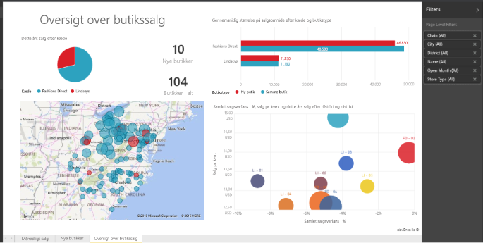

# Rapporter i Power BI
## Hvad er en Power BI-rapport?
En Power BI-***rapport*** er en visning med flere perspektiver af et datasæt med visualiseringer, som repræsenterer forskellige resultater og indsigt fra dette datasæt.  En rapport kan have en enkelt visualisering eller sider fulde af visualiseringer. Afhængigt af din jobfunktion kan du være én, der *opretter* rapporter, og/eller du kan være én, der *forbruger* eller bruger rapporter.

Denne rapport indeholder tre sider (eller faner), og vi ser i øjeblikket siden "Store Sales Overview". På denne side er der seks forskellige visualiseringer og en sidetitel. Visualiseringer kan være *fastgjort* til dashboards, og når denne fastgjorte visualisering bliver valgt, åbner den den rapport, den var fastgjort til.

Hvis du ikke har arbejdet med Power BI før, kan du få et godt overblik ved at læse [Grundlæggende begreber i Power BI](service-basic-concepts.md)

Rapporter er en funktion i Power BI-tjenesten og Power BI Desktop. Det er en næsten identisk oplevelse at arbejde med rapporter. Hvis du arbejder på mobilenheder, kan du dog ikke oprette rapporter, men du kan [få vist, dele og anmærke rapporter](mobile-reports-in-the-mobile-apps.md).

## Fordele ved rapporter
Rapporter er baseret på et enkelt datasæt. Visualiseringerne i en rapport repræsenterer en guldgrube af oplysninger. Og visualiseringerne er ikke statiske. Du kan tilføje og fjerne data, ændre visualiseringstyper og anvende filtre og udsnit, når du graver i dataene for at finde indsigt og lede efter svar. En rapport er som et dashboard, blot i endnu højere grad: Den tillader mere interaktivitet og tilpasningsmuligheder, og visualiseringerne opdateres, når de underliggende data ændres.

## Dashboards sammenlignet med rapporter
[Dashboards](service-dashboards.md) forveksles ofte med rapporter, da de også er lærreder med visualiseringer. Men der er nogle store forskelle.  

| **Egenskab** | **Dashboards** | **Rapporter** |
| --- | --- | --- |
| Sider |Én side |Én eller flere sider |
| Datakilder |Én eller flere rapporter og et eller flere datasæt pr. dashboard |Et enkelt datasæt pr. rapport |
| Tilgængelig i Power BI Desktop |Nej |Ja, der kan oprettes og vises rapporter i Desktop |
| Fastgørelse |Eksisterende visualiseringer (felter) kan kun fastgøres fra det aktuelle dashboard til dine andre dashboards |Visualiseringer kan fastgøres (som felter) til et hvilket som helst af dine dashboards. Hele rapportsider kan fastgøres til et hvilket som helst af dine dashboards. |
| Abonnement |Der kan ikke abonneres på et dashboard |Der kan abonneres på rapportsider |
| Filtrering |Der kan ikke filtreres eller laves udsnit |Der er mange forskellige måder at filtrere, fremhæve og lave udsnit på |
| Angivelse af beskeder |Der kan oprettes beskeder, som sendes via mail, når visse betingelser er opfyldt |Nej |
| Udvalgt |Ét dashboard kan angives som dit "udvalgte" dashboard |Der kan ikke oprettes en udvalgt rapport |
| Forespørgsler på et naturligt sprog |Tilgængelig via dashboard |Ikke tilgængelig via rapporter |
| Kan visualiseringstypen ændres? |Nej. Faktisk opdateres en fastgjort visualisering på dashboardet ikke, hvis en rapportejer ændrer visualiseringstypen i rapporten |Ja |
| Kan underliggende datasættabeller og felter ses? |Nej. Data kan eksporteres, men tabeller og felter på selve dashboardet kan ikke ses. |Ja. Datasættabeller, felter og værdier kan ses. |
| Oprettelse af visualiseringer |Begrænset til tilføjelse af knapper til dashboardet ved hjælp af "Tilføj felt" |Mange forskellige typer visualiseringer kan oprettes, brugerdefinerede visualiseringer kan tilføjes, visualiseringer kan redigeres m.m. ved hjælp af Redigeringstilladelser |
| Tilpasning |Der kan foretages handlinger for visualiseringerne (felterne), f.eks. flytte og arrangere, tilpasse størrelsen, tilføje links, omdøbe, slette og få vist hele skærmen. Men selve dataene og visualiseringerne er skrivebeskyttede. |I Læsevisning kan du publicere, integrere, filtrere, eksportere, downloade som .pbix, få vist relateret indhold, generere QR-koder og analysere i Excel m.m.  I Redigeringsvisning kan du foretage alle de ovennævnte handlinger og meget mere. |

## Rapportens ***oprettere*** og rapportens ***forbrugere***
Afhængigt af din rolle kan du være en person, der opretter rapporter til eget brug eller til at dele med kolleger. Du vil måske gerne vil vide mere om, hvordan du opretter og deler rapporter. Eller du kan være en person, der modtager rapporter fra andre. Du vil måske gerne vil vide mere om, hvordan du forstår og interagerer med rapporter.

Her er nogle emner opdelt efter rolle, som kan hjælpe dig med at komme i gang.

### Hvis du skal oprette og dele rapporter
* Start med en [præsentation af Power BI-tjenesten](service-basic-concepts.md), så du ved, hvor du kan finde rapporter og værktøjer til rapporten.
* Få en præsentation af [rapporteditor](service-the-report-editor-take-a-tour.md).
* Få mere at vide om, hvordan du [opretter en rapport fra et datasæt](service-report-create-new.md).
* [Få mere at vide om, hvordan du bruger filtre på visualiserings-, side- og rapportniveau](power-bi-how-to-report-filter.md)
* Opdag alle de forskellige måder, som du kan [dele en rapport med kollegaer](service-share-dashboards.md) på.

### Hvis du skal modtage og bruge rapporter
* Start med en [præsentation af Power BI-tjenesten](service-basic-concepts.md), så du ved, hvor du kan finde rapporter og værktøjer til rapporten.
* Få mere at vide om, hvordan du [åbner en rapport](service-report-open.md) og al den interaktion, der er tilgængelig i [Læsevisning](service-reading-view-and-editing-view.md).
* Bliv fortrolig med rapporter ved at se præsentationen af et af vores [eksempler](sample-tutorial-connect-to-the-samples.md).  
* Har du ikke brug for rapporten mere? Du kan [fjerne den](service-delete.md).
* Hvis du vil se, hvilke datasæt, rapporten bruger, og hvilke dashboards der har felter, der er fastgjort fra rapporten, [kan du få vist relateret indhold](service-related-content.md).

> [!TIP]
> Hvis du ikke kunne finde det, du ledte efter her, kan du bruge indholdsfortegnelsen til venstre til at gennemse alle emner om *rapport*.
> 
> 

## Næste trin
[Introduktion til Power BI](service-get-started.md) 

[Power BI – Grundlæggende begreber](service-basic-concepts.md)

Har du flere spørgsmål? [Prøv at spørge Power BI-community'et](http://community.powerbi.com/)

