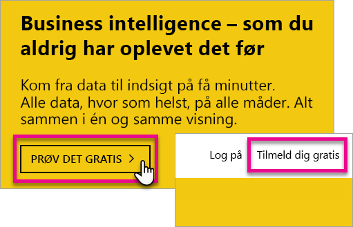
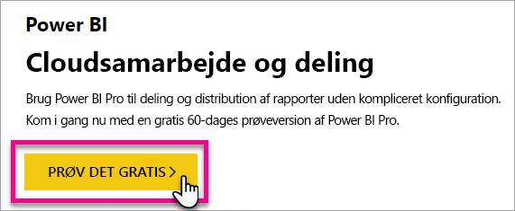
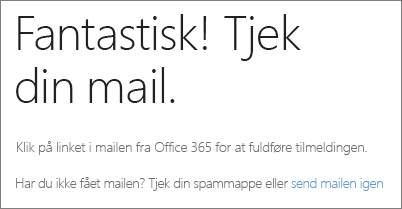
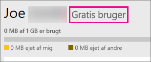
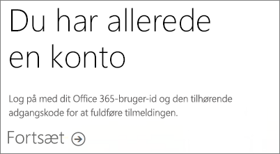
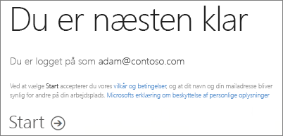
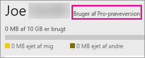

# Tilmelding til Power BI som enkeltperson
Få mere at vide om, hvordan du tilmelder dig Power BI og begynder at bruge det til personlige rapporter og visualiseringsopgaver, der passer til dine behov.

Power BI kan både være et personligt rapporterings- og visualiseringsværktøj samt fungere som basis for analyser og beslutningstagning til gruppeprojekter, afdelinger eller hele selskaber.

Denne artikel fremlægger dine muligheder for at tilmelde dig og begynde at bruge Power BI-tjenesten. Du kan finde oplysninger om forskellen mellem Power BI (gratis) og Power BI Pro under [Power BI (gratis) vs. Power BI Pro](service-free-vs-pro.md).

## Du har et par forskellige muligheder
Som enkeltperson har du flere muligheder for at tilmelde dig og begynde at bruge Power BI. Du kan vælge at tilmelde dig gratis, eller du kan købe et Power BI Pro-abonnement. Hvis du tilmelder dig en gratis konto, kan du vælge en gratis 60-dages prøveversion af Power BI Pro, når du befinder dig i tjenesten.

Hvis du ikke er en del af en eksisterende organisation, der bruger Office 365, kan du stadig tilmelde dig en gratis konto. Din it-administrator har også nogle forskellige muligheder for at købe Power BI Pro og tildele licenser. Du kan finde flere oplysninger om, hvilke muligheder der er tilgængelige for en IT-administrator, under [Køb af Power BI Pro](service-admin-purchasing-power-bi-pro.md).

> [!NOTE]
> Hvis du er en del af en organisation, kan individuel tilmelding være deaktiveret. Se [Individuel tilmelding er deaktiveret](#individual-sign-up-has-been-turned-off) for at få flere oplysninger, hvis du får en fejlmeddelelse, der viser, at funktionen er blevet deaktiveret.
>

## Hvad har du brug for for at tilmelde dig?

Hvis du vil tilmelde dig Power BI, skal du have en arbejdsmailadresse. En personlig mailadresse kan ikke bruges til at tilmelde sig Power BI.

### Hvilken mailadresse kan bruges til Power BI?
Power BI kræver, at du bruger en arbejds- eller skolemailadresse til at tilmelde dig. Du kan ikke tilmelde dig Power BI med en mailadresse, der leveres af forbrugermailtjenester eller udbydere af telekommunikation. Det omfatter outlook.com, hotmail.com, gmail.com og mange andre.

Hvis du forsøger at tilmelde dig med en personlig mailadresse, får du vist en meddelelse om, at du skal bruge en arbejds- eller skolemailadresse.

> [!NOTE]
> Du kan tilmelde dig Power BI med adresser af typen .gov eller .mil. Du kan finde flere oplysninger i [Tilmeld din US Government-organisation til Power BI-tjenesten](https://docs.microsoft.com/en-us/power-bi/service-govus-signup).
>

> [!NOTE]
> Når du har tilmeldt dig, kan du [invitere gæstebrugere](https://docs.microsoft.com/en-us/azure/active-directory/active-directory-b2b-what-is-azure-ad-b2b) til at se indhold i din Power BI-lejer med en hvilken som helst mailadresse, inklusive personlige konti.
>

## Hvilken skal du vælge?
Du kan afgøre, hvilken du har brug for ved at gennemgå det, der er inkluderet i hver licenstype. Gratisbrugere har adgang til de fleste af tjenesternes funktioner med undtagelse af delings- og samarbejdsfunktioner. Power BI Pro-brugere kan bruge alle funktioner i tjenesten, men det er ikke gratis. Hvis du ikke har behov for at dele indhold, kan gratisversionen være det bedste valg. Du kan få mere at vide på [siden Priser på Power BI ](https://powerbi.microsoft.com//pricing/).

Resten af denne artikel ser på, hvordan man tilmelder sig de forskellige versioner.

## Tilmelding til Power BI (gratis) som enkeltperson
Den hurtigste måde at tilmelde sig Power BI på er ved at tilmelde sig en Power BI-konto (gratis). Denne konto er gratis, og du kan derigennem bruge mange af de funktioner, der er tilgængelige i tjenesten.

> [!NOTE]
> Hvis du modtager en meddelelse om, at vi allerede kender dig, kan du prøve at gå til https://app.powerbi.com og logge på.
> 
> 

Hvis du vil tilmelde dig Power BI, kan du gøre følgende.

1. Gå til [powerbi.com](https://powerbi.microsoft.com).
2. Vælg **Start gratis** eller **Tilmeld gratis**.
   
    
3. Vælg **Prøv gratis >** under Power BI på siden Introduktion.
   
    
4. Angiv mailadressen, du tilmelder dig med, og vælg derefter **Tilmeld**. Sørg for, at din mailadresse er tilladt til tilmelding. Du kan finde flere oplysninger om, hvilken mailadresse, du kan bruge, under [Hvilken mailadresse kan bruges til Power BI](#what-email-address-can-be-used-with-power-bi).
   
    
5. Du får vist en meddelelse om, at du skal tjekke din mail.
   
    
6. Klik på linket i mailen for at bekræfte din mailadresse. Herefter sendes du tilbage til tilmeldingsproceduren. Du skal muligvis angive nogle flere oplysninger om dig selv.
7. Du sendes derefter til https://app.powerbi.com, hvor du kan begynde at bruge Power BI som gratis bruger.

### Sådan ser det ud i tjenesten
Når du befinder dig i tjenesten, kan du bekræfte, at du har en gratis konto, ved at gå til **tandhjulsikonet** og vælge **Administrer personligt lager**.

### Hvad sker der, hvis du allerede er en del af en eksisterende organisation?
Hvis din konto er en del af en eksisterende organisation, får du vist en meddelelse, hvor du bliver bedt om at logge på med denne konto. Vælg **Fortsæt**, og log på med dit Office 365-logon.

Du vil derefter se en meddelelse, der beder dig om at vælge **Start**.

## Power BI Pro i fuld drift i en 60-dages prøveperiode
Når du har tilmeldt dig din gratis konto, kan du også vælge at prøve Pro gratis i 60 dage. Du får adgang til alle Pro-funktionerne i hele prøveperioden. Power BI Pro har alle funktionerne fra den gratis version af Power BI samt yderligere funktioner til deling og samarbejde. Se [Priser på Power BI](https://powerbi.microsoft.com/pricing), hvis du vil have flere oplysninger. Log på Power BI for at få en 60-dages gratis prøveperiode på Power BI Pro, og prøv én af disse Power BI Pro-funktioner:

* [Opret et app-arbejdsområde](service-create-distribute-apps.md)
* [Del et dashboard](service-share-dashboards.md)

Når du prøver en af disse funktioner, bliver du bedt om at starte din gratis prøveperiode. Du kan også vælge den ved at gå til tandhjulsikonet og vælge **Administrer personligt lager**. Vælg derefter **Prøv Pro gratis** til højre.

Derefter kan du vælge **Start prøveperiode**.

>[!NOTE]
>Brugere, der benytter sig af denne Power BI Pro-prøveversion inde i produktet, vises ikke i Office 365-administrationsportalen som Power BI Pro-prøvebrugere (de vises som gratis Power BI-brugere). De vises dog som Power BI Pro-prøvebrugere på siden **Administrer lager** i Power BI.

>[!NOTE]
>Hvis du er it-administrator og ønsker at hente og installere Power BI-prøvelicenser til flere brugere i din organisation, uden at de enkelte brugere skal acceptere vilkårene, kan du tilmelde dig et [Power BI Pro-prøveabonnement](https://portal.office.com/Signup/MainSignup15.aspx?OfferId=d59682f3-3e3b-4686-9c00-7c7c1c736085&dl=POWER_BI_PRO). Du skal være global administrator eller faktureringsadministrator i Office 365, eller du skal oprette en ny lejer for at tilmelde dig en administratorprøveversion. Du kan få mere at vide under [Køb af Power BI Pro](service-admin-purchasing-power-bi-pro.md).
> 
> [!NOTE]
> Med tilgængeligheden af Power BI Premium og ændringerne i tilbuddet om det gratis Power BI 1. juni 2017, er du muligvis berettiget til en udvidet Pro-prøveversion. Du kan få mere at vide under [Aktivering af udvidet Pro-prøveversion](service-extended-pro-trial.md).
> 
> 

### Sådan ser det ud i tjenesten
Når du befinder dig i tjenesten, kan du bekræfte, at du har en Pro-prøvekonto, ved at gå til **tandhjulsikonet* og vælge **Administrer personligt lager**.

## Hvad skal du gøre, hvis du vil have den fulde Power BI Pro-version?
Der er ikke muligt at få en Power BI Pro-licens som enkeltperson. Du skal tale med din it-administrator om at købe og tildele din konto licensen. Du kan få mere at vide under [Køb af Power BI Pro](service-admin-purchasing-power-bi-pro.md).

## Fejlfinding
I mange tilfælde kan tilmelding til Power BI foretages ved at følge den enkle proces for tilmelding via selvbetjening, der beskrives ovenfor. Hvis du ikke kan fuldføre tilmelding via selvbetjening, kan det have flere årsager.  I nedenstående tabel opsummeres nogle af de mest almindelige årsager til, at du muligvis ikke kan fuldføre tilmeldingen og forslag til alternative løsninger på disse problemer.

| **Symptom/fejlmeddelelse** | **Årsag og løsning** |
| --- | --- |
| **Personlige mailadresser (f.eks. nancy@gmail.com)** Under tilmeldingen modtager du en meddelelse som følgende:    *Du har angivet en personlig mailadresse: Angiv din arbejdsmailadresse, så vi kan gemme dit firmas data på sikker vis.*    eller    *Det ligner en personlig mailadresse. Angiv din arbejdsmailadresse, så vi kan sætte dig i forbindelse med andre i dit firma. Og bare rolig. Vi deler ikke din adresse med nogen.* |Power BI understøtter ikke mailadresser, der leveres af forbrugermailtjenester eller udbydere af telekommunikation.    Prøv at fuldføre tilmeldingen igen ved at bruge en mailadresse, du har fået tildelt af din skole eller dit arbejde.    Hvis du stadig ikke kan tilmelde dig og er villig til at gennemføre en mere avanceret tilmeldingsproces, kan du [tilmelde dig et nyt Office 365-prøveabonnement og bruge denne mailadresse til tilmeldingen](service-admin-signing-up-for-power-bi-with-a-new-office-365-trial.md).    Inviter brugerkontoen som en [Azure B2B-gæst](https://docs.microsoft.com/en-us/azure/active-directory/active-directory-b2b-what-is-azure-ad-b2b). |
| **Selvbetjeningstilmelding deaktiveret** Under tilmeldingen modtager du en meddelelse som følgende:    *Vi kan ikke færdiggøre din tilmelding. Din it-afdeling har deaktiveret tilmelding til Microsoft Power BI. Kontakt it-afdelingen for at fuldføre tilmeldingen.*    eller    *Det ligner en personlig mailadresse. Angiv din arbejdsmailadresse, så vi kan sætte dig i forbindelse med andre i dit firma. Og bare rolig. Vi deler ikke din adresse med nogen.* |Din virksomheds it-administrator har deaktiveret selvbetjeningstilmelding for Power BI.    Kontakt it-administratoren, og bed vedkommende om at følge instruktionerne nedenfor for at gøre det muligt for eksisterende brugere at tilmelde sig Power BI og tillade nye brugere at deltage i din eksisterende lejer, så du kan fuldføre tilmeldingen.    Dette problem kan også opstå, hvis du har tilmeldt dig Office 365 via en partner. [Få mere at vide](service-admin-syndication-partner.md)    [Power BI i din organisation](https://support.office.com/en-ca/article/Power-BI-in-your-Organization-d7941332-8aec-4e5e-87e8-92073ce73dc5#BKMK_HowCanIAllowO365Tenant) |
| **Mailadressen er ikke et Office 365-id** Under tilmeldingen modtager du en meddelelse som følgende:    *Vi kan ikke finde dig på contoso.com.  Bruger du et andet id på arbejdet eller i skolen?   Prøv at logge på med det, og hvis det ikke virker, skal du kontakte din it-afdeling.* |Din organisation bruger id'er til at logge på Office 365 og andre Microsoft-tjenester, som er anderledes end din mailadresse.  Din mailadresse kan f.eks. være Nancy.Smith@contoso.com, men dit id er nancys@contoso.com.    For at fuldføre tilmeldingen skal du bruge det id, som din organisation har tildelt dig, til at logge på Office 365 eller andre Microsoft-tjenester.  Hvis du ikke ved, hvad det er, kan du kontakte din it-administrator.    Hvis du stadig ikke kan tilmelde dig og har mulighed for at gennemføre en mere avanceret tilmeldingsproces, kan du [tilmelde dig et nyt Office 365-prøveabonnement og bruge denne mailadresse til tilmeldingen](service-admin-signing-up-for-power-bi-with-a-new-office-365-trial.md). |

## Næste trin
[Power BI (gratis) i din virksomhed](service-admin-service-free-in-your-organization.md)  
[Køb af Power BI Pro](service-admin-purchasing-power-bi-pro.md)  
[Power BI-serviceaftale til individuelle brugere](https://powerbi.microsoft.com/terms-of-service/)  
[Power BI Premium – hvad er det?](service-premium.md)  
[Hvidbog til Power BI Premium](https://aka.ms/pbipremiumwhitepaper)  

Flere spørgsmål? [Prøv at spørge Power BI-community'et](http://community.powerbi.com/)

