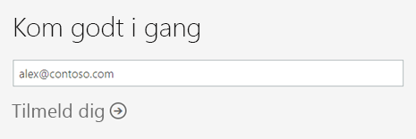
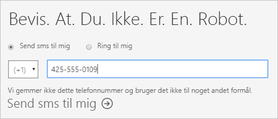
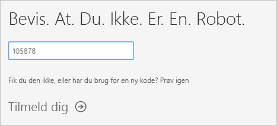
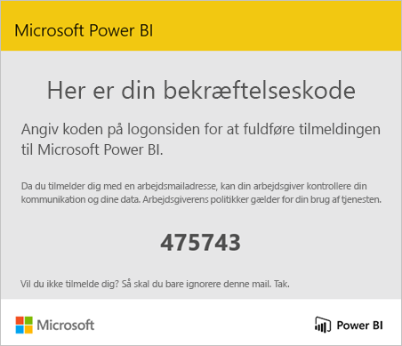
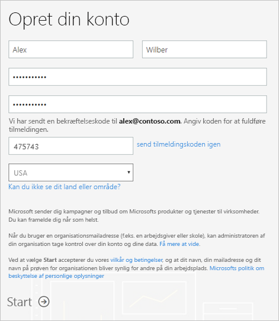
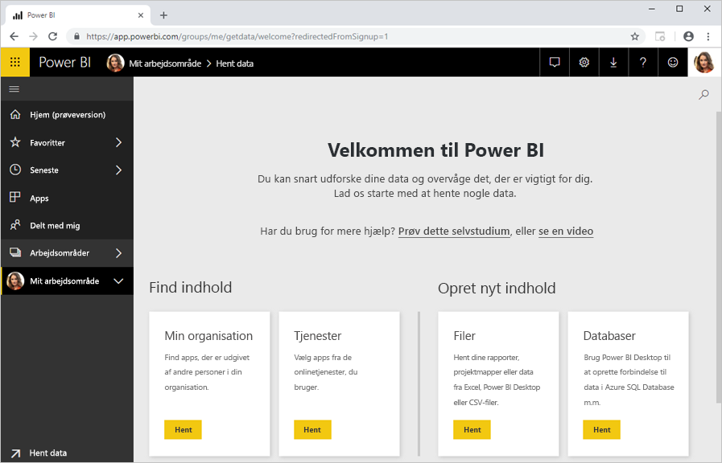

# Tilmelding til Power BI som enkeltperson

Power BI kan både være et personligt rapporterings- og visualiseringsværktøj samt fungere som basis for analyser og beslutningstagning til gruppeprojekter, afdelinger eller hele selskaber. I denne artikel forklares det, hvordan du kan tilmelde dig en prøveversion af Power BI som enkeltperson. Hvis du er Power BI-administrator, kan du se under [Power BI-licenser i din organisation](service-admin-licensing-organization.md).

## Understøttede mailadresser

Inden du starter tilmeldingsprocessen, er det vigtigt at forstå, hvilke typer af mailadresser du kan bruge i Power BI:

* Power BI kræver, at du bruger en arbejds- eller skolemailadresse til at tilmelde dig. Du kan ikke tilmelde dig Power BI med en mailadresse, der leveres af forbrugermailtjenester eller telekommunikationsudbydere. Det omfatter outlook.com, hotmail.com, gmail.com og mange andre.

* Når du har tilmeldt dig, kan du [invitere gæstebrugere](https://docs.microsoft.com/azure/active-directory/active-directory-b2b-what-is-azure-ad-b2b) til at se dit Power BI-indhold vha. en vilkårlig mailadresse, herunder personlige konti.

* Du kan tilmelde dig Power BI med .gov- eller .mil-adresser, men det kræver en anden proces. Du kan finde flere oplysninger under [Meld din US Government-organisation til Power BI-tjenesten](service-govus-signup.md).

## Tilmeld dig en prøveversion

Følg disse trin for at tilmelde dig en Power BI Pro-prøveversion. Se næste afsnit, [Udløb af prøveversion](#trial-expiration), for at forstå dine muligheder, når prøveversionen udløber.

1. Gå til [tilmeldingssiden](https://app.powerbi.com/signupredirect?pbi_source=web) i Power BI.

1. Angiv din mailadresse, og vælg derefter **Tilmeld dig**.

    

1. Hvis du får en meddelelse i stil med følgende, skal du vælge en valgmulighed for at modtage en bekræftelseskode og derefter fortsætte til næste trin i proceduren.

    

    Hvis du får en meddelelse i stil med følgende, skal du udføre trinnene for at logge på og bruge Power BI.

    

1. Angiv den modtagne kode, og vælg derefter **Tilmeld dig**.

    

1. Tjek din mail for en meddelelse i stil med følgende.

    

1. Angiv dine oplysninger og bekræftelseskoden fra mailen på det næste skærmbillede. Vælg et område, gennemse de politikker, der henvises til på dette skærmbillede, og vælg derefter **Start**.

    

1. Derefter føres du til https://app.powerbi.com, og du kan begynde at bruge Power BI.

    

## Udløb af prøveversion

Når din prøveversion af Power BI Pro udløber, ændres din licens til en Power BI (gratis)-licens. Når det sker, har du ikke længere adgang til funktioner, der kræver en Power BI Pro-licens. Du kan finde flere oplysninger under [Funktioner efter licenstype](service-features-license-type.md).

Hvis en Power BI (gratis)-licens er tilstrækkelig, kræves der ingen handling. Hvis du vil drage fordel af Power BI Pro-funktioner, skal du kontakte it-administratoren vedrørende køb af en Power BI Pro-licens.

## Fejlfinding af tilmeldingsprocessen

I de fleste tilfælde kan du tilmelde dig Power BI ved at følge den proces, der er beskrevet ovenfor. Når det er sagt, kan der være problemer, der kan forhindre dig i at tilmelde dig. Vi behandler disse problemer og løsninger i følgende tabel.

|                                                                                                                                                                                                                          **Symptom/fejlmeddelelse**                                                                                                                                                                                                                           |                                                                                                                                                                                                                                                                                                                                                **Årsag og løsning**                                                                                                                                                                                                                                                                                                                                                |
|--------------------------------------------------------------------------------------------------------------------------------------------------------------------------------------------------------------------------------------------------------------------------------------------------------------------------------------------------------------------------------------------------------------------------------------------------------------------------------|------------------------------------------------------------------------------------------------------------------------------------------------------------------------------------------------------------------------------------------------------------------------------------------------------------------------------------------------------------------------------------------------------------------------------------------------------------------------------------------------------------------------------------------------------------------------------------------------------------------------------------------------------------------------------------------------------------------------|
| <strong>Personlige mailadresser (f.eks. nancy@gmail.com)</strong> Under tilmeldingen modtager du en meddelelse som følgende:    *Du har angivet en personlig mailadresse: Angiv din arbejdsmailadresse, så vi kan gemme dit firmas data på sikker vis.*    eller    *Det ligner en personlig mailadresse. Angiv din arbejdsmailadresse, så vi kan sætte dig i forbindelse med andre i dit firma. Og bare rolig. Vi deler ikke din adresse med nogen.* |                          Power BI understøtter ikke mailadresser, der leveres af forbrugermailtjenester eller udbydere af telekommunikation.    Prøv at fuldføre tilmeldingen igen ved at bruge en mailadresse, du har fået tildelt af din skole eller dit arbejde.    Hvis du stadig ikke kan tilmelde dig og er villig til at gennemføre en mere avanceret tilmeldingsproces, kan du [tilmelde dig et nyt Office 365-prøveabonnement og bruge denne mailadresse til tilmeldingen](service-admin-signing-up-for-power-bi-with-a-new-office-365-trial.md).    Du kan også få en eksisterende bruger til at [invitere dig som gæst](service-admin-azure-ad-b2b.md).                           |
|            **Selvbetjeningstilmelding deaktiveret** Under tilmeldingen modtager du en meddelelse som følgende:    *Vi kan ikke færdiggøre din tilmelding. Din it-afdeling har deaktiveret tilmelding til Microsoft Power BI. Kontakt it-afdelingen for at fuldføre tilmeldingen.*    eller    *Det ligner en personlig mailadresse. Angiv din arbejdsmailadresse, så vi kan sætte dig i forbindelse med andre i dit firma. Og bare rolig. Vi deler ikke din adresse med nogen.*             |                             Din virksomheds it-administrator har deaktiveret selvbetjeningstilmelding for Power BI.    Hvis du vil gennemføre tilmeldingen, skal du kontakte it-administratoren og bede vedkommende om at [følge instruktionerne for at aktivere tilmelding](service-admin-licensing-organization.md#enable-or-disable-individual-user-sign-up-in-azure-active-directory).    Dette problem kan også opstå, hvis du har [tilmeldt dig Office 365 via en partner](service-admin-syndication-partner.md). |
|                                                                                          **Mailadressen er ikke et Office 365-id** Under tilmeldingen modtager du en meddelelse som følgende:    *Vi kan ikke finde dig på contoso.com.  Bruger du et andet id på arbejdet eller i skolen?   Prøv at logge på med det, og hvis det ikke virker, skal du kontakte din it-afdeling.*                                                                                           | Din organisation bruger id'er til at logge på Office 365 og andre Microsoft-tjenester, som er anderledes end din mailadresse.  Din mailadresse kan f.eks. være Nancy.Smith@contoso.com, men dit id er nancys@contoso.com.    For at fuldføre tilmeldingen skal du bruge det id, som din organisation har tildelt dig, til at logge på Office 365 eller andre Microsoft-tjenester.  Hvis du ikke ved, hvad det er, kan du kontakte din it-administrator.    Hvis du stadig ikke kan tilmelde dig og er villig til at gennemføre en mere avanceret tilmeldingsproces, kan du [tilmelde dig et nyt Office 365-prøveabonnement og bruge denne mailadresse til tilmeldingen](service-admin-signing-up-for-power-bi-with-a-new-office-365-trial.md). |
|  |  |

## Næste trin

[Køb Power BI Pro](service-admin-purchasing-power-bi-pro.md)  
[Power BI-serviceaftale til individuelle brugere](https://powerbi.microsoft.com/terms-of-service/)  

Har du flere spørgsmål? [Prøv at spørge Power BI-community'et](http://community.powerbi.com/)