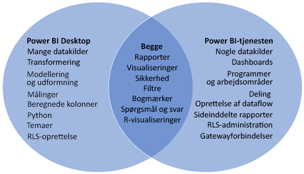
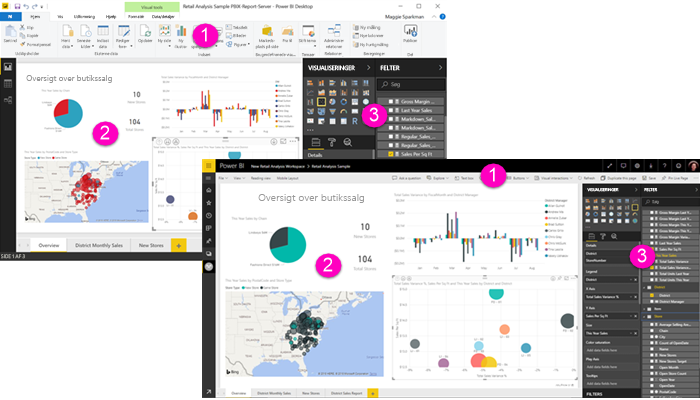

# Sammenligning af Power BI Desktop og Power BI-tjenesten

I et Venn-diagram, der sammenligner Power BI Desktop og Power BI-tjenesten, viser området i midten, hvordan de to overlapper hinanden. Nogle opgaver kan du foretage i enten Power BI Desktop eller tjenesten. Men på de to sider af Venn-diagrammet har både programmet og tjenesten unikke funktioner.  

**Power BI Desktop** er et komplet værktøj til dataanalyse og oprettelse af rapporter. Når du installerer det gratis program på din lokale computer, kan du oprette forbindelse til mange forskellige datakilder og kombinere dem (også kaldet modellering) i en datamodel. I [Introduktionsvejledning til Power BI Desktop](desktop-getting-started.md) gennemgås processen.

**Power BI-tjenesten** er en cloudbaseret onlinetjeneste til let redigering af rapporter og samarbejde mellem teams og virksomheder. Du kan også oprette forbindelse til datakilder i Power BI-tjenesten, men mulighederne for modellering er begrænsede. 

De fleste rapportdesignere, der arbejder på business intelligence-projekter, bruger **Power BI Desktop** til at oprette rapporter og bruger derefter **Power BI-tjenesten** til at dele deres rapporter med andre.

## Rapportredigering

I både programmet og tjenesten kan du oprette og redigere *rapporter*. En rapport kan have en eller flere sider med visualiseringer og samlinger af visualiseringer. Du kan tilføje bogmærker, knapper, filtre og detaljeadgang for at forbedre navigationen i dine rapporter.

Rapporteditorerne i Power BI Desktop og i tjenesten er ens. De består af tre sektioner:  

1. De øverste navigationslinjer, der ikke er de samme i Power BI Desktop og tjenesten    
2. Rapportcanvasset     
3. Ruderne **Felter**, **Visualiseringer** og **Filtre**

Denne video viser rapporteditoren i Power BI Desktop. 

<iframe width="560" height="315" src="https://www.youtube.com/embed/IkJda4O7oGs" frameborder="0" allowfullscreen></iframe>

## Samarbejde i Power BI-tjenesten

Når du har oprettet dine rapporter, kan du gemme dem i et *arbejdsområde* i **Power BI-tjenesten**, hvor du og dine kolleger kan samarbejde. Du kan bygge *dashboards* oven på disse rapporter. Derefter deler du disse dashboards og rapporter med brugere af rapporter i og uden for din organisation. Brugerne af rapporterne får dem vist i Power BI-tjenesten i [læsevisning](consumer/end-user-reading-view.md) ikke redigeringsvisning. De har ikke adgang til alle de funktioner, der er tilgængelig for oprettere af rapporten. 

## Næste trin

[Hvad er Power BI Desktop?](desktop-what-is-desktop.md)

[Opret en rapport](service-report-create-new.md) i Power BI-tjenesten

[De grundlæggende begreber for rapportdesignere](service-basic-concepts.md)

Har du flere spørgsmål? [Prøv at spørge Power BI-community'et](http://community.powerbi.com/)

