# Databeskeder i Power BI-tjenesten
Angiv beskeder, så du får besked, når dataene på dine dashboards ændres ud over de grænser, du har angivet. 

Du kan angive beskeder for felter, hvis du har en Power BI Pro-licens, eller hvis et dashboard er blevet delt med dig fra en [Premium-kapacitet](service-premium-what-is.md). Der kan kun angives beskeder på felter, der er fastgjort via rapportvisualiseringer, og kun på målere, KPI'er og kort. Beskeder kan angives på visualiseringer, der oprettes ud fra streamingdatasæt, der er fastgjort på et dashboard via en rapport, men de kan ikke angives på streamingfelter, der er oprettet direkte på dashboardet ved hjælp af **Tilføj felt** > **Brugerdefinerede streamingdata**. 

Det er kun dig, der kan se de angivne beskeder, selvom du deler dashboardet. Databeskeder er fuldt synkroniseret på tværs af platforme. Angiv og få vist databeskeder [i Power BI-mobilapps](consumer/mobile/mobile-set-data-alerts-in-the-mobile-apps.md) og i Power BI-tjenesten. De er ikke tilgængelige for Power BI Desktop. Beskeder kan også være [automatiseret og integreret med Microsoft Flow](https://flow.microsoft.com) - [Prøv det](service-flow-integration.md).

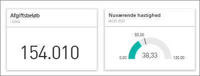

> [!WARNING]
> Datadrevne beskeder indeholder oplysninger om dine data. Hvis du få vist dine data i Power BI på en mobilenhed, og enheden bliver stjålet, anbefaler vi, at du bruger Power BI-tjenesten til at slå alle datadrevne regler for beskeder fra.
> 
> 

## Indstil databeskeder i Power BI-tjenesten
Se, hvordan Amanda føjer nogle beskeder til felterne på dashboardet. Følg derefter den trinvise vejledning under videoen for at prøve det selv.

<iframe width="560" height="315" src="https://www.youtube.com/embed/JbL2-HJ8clE" frameborder="0" allowfullscreen></iframe>

I dette eksempel bruges et kortfelt fra eksempeldashboardet Retail Analysis.

1. Start på et dashboard. Vælg på ellipsen på en dashboardmåler, et KPI eller et kortfelt.
   
   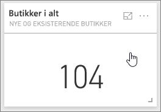
2. Vælg på klokkeikonet  for at tilføje en eller flere beskeder om **Butikker i alt**.
   
1. Når du starter, skal du vælge **+ Tilføj påmindelsesregel**, sikre, at skyderen er angivet til **Til**, og give beskeden en titel. Titler hjælper dig med let at genkende dine beskeder.
   
   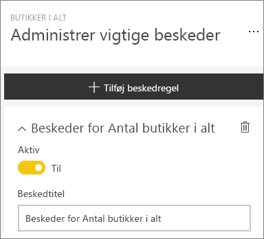
4. Rul ned, og angiv oplysninger om beskederne.  I dette eksempel opretter vi en besked, som skal sendes til os én gang om dagen, hvis antallet af samlede butikker går over 100. Beskederne vises i vores meddelelsescenter. Vi får også Power BI til at sende os en mail.
   
   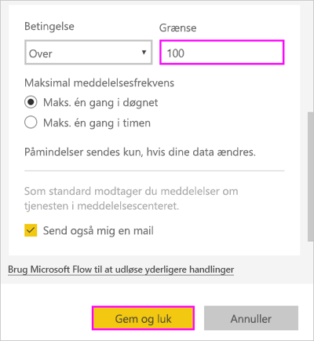
5. Vælg **Gem**.

## Modtagelse af beskeder
Når de sporede data når en af de angivne tærskelværdier, sker der flere ting. Først tjekker Power BI, om der er gået mere end én time eller mere end et døgn (afhænger af den valgte indstilling), siden den seneste besked blev sendt. Du får en besked, så længe dataene har overskredet grænsen.

Derefter sendes en besked til meddelelsescenteret og evt. en mail via Power BI. Hver enkelt besked indeholder et direkte link til dine data. Vælg linket for at se det relevante felt, hvor du kan udforske, dele og få mere at vide.  

1. Hvis du har indstillet beskeden til at sende en mail til dig, modtager du mail i din indbakke.
   
   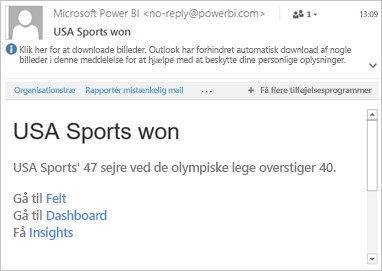
2. Power BI føjer en meddelelse til dit **meddelelsescenter** og føjer et ny beskedikon til det relevante felt.
   
   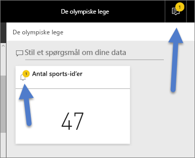
3. Åbn dit meddelelsescenter for at få vist oplysningerne for beskeder.
   
    
   
   > [!NOTE]
   > Beskeder fungerer kun i forbindelse med opdaterede data. Når data opdateres, kontrolleres det via Power BI, om der er angivet en besked for disse data. Hvis dataene har nået grænsen for en besked, udløses der en besked.
   > 
   > 

## Administration af beskeder
Der er mange måder at administrere dine beskeder på: Fra selve dashboardfeltet, fra menuen Indstillinger for Power BI og på et individuelt felt i [Power BI-mobilappen på iPhone](consumer/mobile/mobile-set-data-alerts-in-the-mobile-apps.md) eller i [Power BI-mobilappen til Windows 10](consumer/mobile/mobile-set-data-alerts-in-the-mobile-apps.md).

### Fra selve feltet
1. Hvis du vil ændre eller fjerne en besked fra et felt, skal du genåbne vinduet **Administrer beskeder** ved at vælge klokkeikonet for . Alle de beskeder, du har angivet for dette felt, vises.
   
    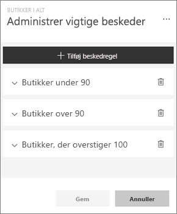.
2. Hvis du vil redigere en besked, skal du vælge pilen til venstre for beskednavnet.
   
    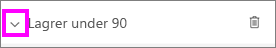.
3. Hvis du vil slette en besked, skal du vælge skraldespanden til højre for beskednavnet.
   
      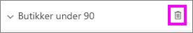

### I menuen Indstillinger for Power BI
1. Vælg tandhjulsikonet på menulinjen i Power BI.
   
    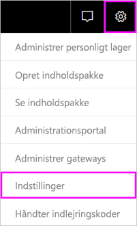.
2. Under **Indstillinger** skal du vælge **Beskeder**.
   
    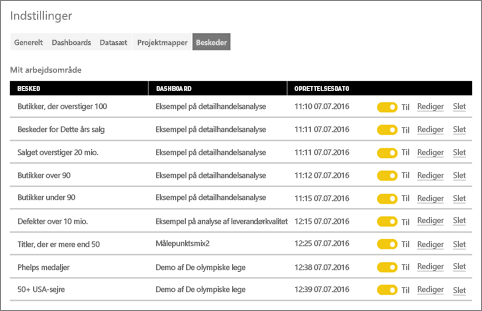
3. Her kan du slå beskeder til og fra, åbne vinduet **Administrer beskeder** for at ændre eller slette beskeden.

## Tip og fejlfinding
* Beskeder understøttes ikke i øjeblikket for Bing-felter eller kortfelter med målinger for dato/klokkeslæt.
* Beskeder fungerer kun i forbindelse med numeriske datatyper.
* Beskeder fungerer kun i forbindelse med opdaterede data. De fungerer ikke med statistiske data.
* Beskeder fungerer kun i forbindelse med streamingdatasæt, hvis du opretter en rapportvisualisering for KPI/kort/måler og derefter fastgør visualiseringen til dashboardet.

## Næste trin
[Opret et Microsoft Flow, der indeholder en databesked](service-flow-integration.md)    
[Angiv databeskeder på din mobilenhed](consumer/mobile/mobile-set-data-alerts-in-the-mobile-apps.md)    
[Hvad er Power BI?](power-bi-overview.md)    
Har du flere spørgsmål? [Prøv at spørge Power BI-community'et](http://community.powerbi.com/)

