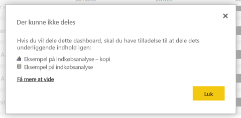

# Del Power BI-dashboards og -rapporter med kolleger og andre
*Deling* er velegnet til at give nogle få personer adgang til dine dashboards og rapporter. Med Power BI får du også [adskillige andre måder at samarbejde om og distribuere dashboards og rapporter på](service-how-to-collaborate-distribute-dashboards-reports.md).

Du skal bruge en [Power BI Pro-licens](service-features-license-type.md), uanset om du deler indhold i eller uden for din organisation. Dine modtagere skal også Power BI Pro-licenser, medmindre indholdet er i en [Premium-kapacitet](service-premium-what-is.md). 

Du kan dele dashboards og rapporter fra de fleste steder i Power BI-tjenesten: Favoritter, seneste, delt med mig (hvis ejeren tillader det), mit arbejdsområde eller andre arbejdsområder. Når du deler et dashboard eller en rapport, kan de personer, du deler med, få det/den vist og interagere med det/den, men ikke redigere det/den. De kan se de samme data som dig i dashboardet eller rapporten, medmindre [sikkerhed på rækkeniveau (RLS)](service-admin-rls.md) anvendes. De kolleger, du deler med, kan også dele med deres kolleger, hvis du giver dem lov til det. Personer uden for organisationen kan også få vist og interagere med dashboardet eller rapporten, men kan ikke dele den. 

Du kan også [dele et dashboard fra en vilkårlig Power BI-mobilapp](consumer/mobile/mobile-share-dashboard-from-the-mobile-apps.md). Du kan dog ikke dele dashboards fra Power BI Desktop.

## Video: Del et dashboard
Se Amanda dele sit dashboard med kollegaer i og uden for sin virksomhed. Følg derefter den trinvise vejledning under videoen for at prøve det selv.

<iframe width="560" height="315" src="https://www.youtube.com/embed/0tUwn8DHo3s?list=PL1N57mwBHtN0JFoKSR0n-tBkUJHeMP2cP" frameborder="0" allowfullscreen></iframe>

## Del et dashboard eller en rapport

1. Vælg **Del**  på en liste over dashboards eller rapporter eller i et åbent dashboard eller en åben rapport.

2. Angiv i det øverste felt de komplette mailadresser til enkeltpersoner, distributionsgrupper eller sikkerhedsgrupper. Du kan ikke dele med dynamiske distributionslister. 
   
   Du kan dele med brugere, hvis adresser er uden for din organisation, men du får vist en advarsel.
   
    
 
   >[!NOTE]
   >Tekstfeltet understøtter højst 100 brugere eller grupper. Hvis du vil dele med stort antal brugere, kan du overveje at oprette dashboardet i et arbejdsområde og [distribuere den som en app](service-create-distribute-apps.md).
   > 
   > 

3. Tilføj en meddelelse, hvis du vil. Det er valgfrit.
4. Hvis du vil tillade dine kollegaer dele dit indhold med andre, skal du kontrollere **Tillad, at modtagerne må dele dit dashboard (eller en rapport)** .
   
   Det kaldes *gendeling* at give andre tilladelse til at dele. Hvis du giver dem tilladelse, kan de dele igen fra Power BI-tjenesten og mobilapperne eller videresende mailinvitationen til andre i din organisation. Invitationen udløber efter én måned. Personer uden for din organisation kan ikke dele igen. Som ejer af indholdet kan du slå videredeling fra eller tilbagekalde videredeling individuelt. Se [Stop deling eller stop andres deling](#stop-sharing-or-stop-others-from-sharing).

5. Vælg **Del**.
   
     
   
   Powerbi sender en invitation via mail til enkeltpersoner, men ikke til grupper med et link til det delte indhold. Du kan se meddelelse om, at handlingen**blev udført**. 
   
   Når modtagere i din organisation klikker på linket, føjer Power BI dashboardet eller rapporten til siden med listen **Delt med mig**. De kan vælge dit navn for at få vist alt det indhold, du har delt med dem. 
   
   
   
   Når modtagere uden for din organisation klikker på linket, kan de se dashboardet eller rapporten, men ikke på den sædvanlige Power BI-portal. Du kan finde flere oplysninger i [dele et dashboard eller en rapport med personer uden for din organisation](#share-a-dashboard-or-report-with-people-outside-your-organization).

## Hvem har adgang til et dashboard eller en rapport, som du har delt?
Nogle gange skal du se de personer, du har delt med, og hvem de har delt den med:

1. Vælg **Del**  på listen over dashboards og rapporter eller på selve dashboardet eller i selve rapporten. 
2. I den **del dashboard** eller **dele rapporten** dialogboksen Vælg **adgang**.
   
    

    Personer uden for din organisation er anført som **Gæst**.

## Stop deling eller stop andres deling
Det er kun ejeren af dashboardet eller rapporten, der kan slå videredeling til og fra.

### Hvis du ikke har sendt invitationen til deling endnu
* Ryd den **Tillad, at modtagerne må dele dit dashboard (eller en rapport)** afkrydsningsfeltet nederst i invitationen, før du sender den.

### Hvis du allerede har delt dashboardet eller rapporten
1. Vælg **Del**  på listen over dashboards og rapporter eller på selve dashboardet eller i selve rapporten. 
2. I den **del dashboard** eller **dele rapporten** dialogboksen Vælg **adgang**.
   
    
3. Vælg ellipsen ( **...** ) ud for **Læs og del igen**, og vælg:
   
   
   
   * **Læs** for at forhindre vedkommende i at dele med andre.
   * **Fjern adgang** for at forhindre vedkommende i overhovedet at se det delte indhold.

4. I den **fjerne adgangen** dialogboks skal du beslutte, om du også vil fjerne adgangen til relateret indhold, f.eks rapporter og datasæt. Hvis du fjerner elementer med et advarselsikon , det er bedst til også at fjerne relateret indhold, fordi den ikke vises korrekt.

    

## Del et dashboard eller en rapport med personer uden for din organisation
Når du deler med personer uden for din organisation, modtager de en mail med et link til det delte dashboard eller rapport, som de skal logge på Power BI til at se. Hvis de ikke har en Power BI Pro-licens, kan de tilmelde sig en, når de klikker på linket.

Når de logger på, kan de se det delte dashboard eller rapport i sit eget browservindue og ikke på deres normale Power BI-portal. Hvis du vil senere adgang til dette dashboard eller rapport, skal de bogmærke linket.

De kan ikke redigere indhold i dette dashboard eller rapporten. Men de kan interagere med diagrammerne og ændre filtre eller udsnit, kan ikke de gemme deres ændringer. 

Det er kun dine direkte modtagere, der kan se det delte dashboard eller den delte rapport. Hvis du f.eks. har sendt mailen til Vicki@contoso.com, kan kun Vicki se dashboardet. Ingen kan andre se dashboardet, også hvis de har linket. Vicki skal bruge den samme mailadresse til at få adgang til den. Hvis hun tilmelder sig med en anden mailadresse, kan hun ikke har adgang til dashboardet.

Personer uden for din organisation kan ikke se nogen data, hvis rolle - eller sikkerhed på rækkeniveau er implementeret på den lokale Analysis Services-tabelmodeller.

Hvis du sender et link fra en Power BI-mobilapp til personer uden for din organisation, åbnes at klikke på linket dashboardet i en browser, ikke i Power BI-mobilappen.

Hvis du [Tillad eksterne gæstebrugere til at redigere og administrere indhold i organisationen](service-admin-portal.md#export-and-sharing-settings), som standard kun forbrug oplevelse gælder ikke for dem. [Få mere at vide](service-admin-azure-ad-b2b.md).

## Begrænsninger og overvejelser
Ting, du skal være opmærksom på angående deling af dashboards og rapporter:

* Generelt kan se du og dine kolleger se de samme data på dashboardet eller i rapporten. Hvis du derfor har tilladelse til at se flere data, end de har, vil de kunne se alle dine data på dashboardet eller i rapporten. Men hvis [sikkerhed på rækkeniveau (RLS)](service-admin-rls.md) er anvendt på datasættet, der er underliggende for et dashboard eller en rapport, bruges legitimationsoplysningerne for hver person til at afgøre, hvilke data vedkommende kan få adgang til.
* Alle, du deler dashboardet med kan se det og interagere med de relaterede rapporter i [læsevisning](consumer/end-user-reading-view.md#reading-view). De kan ikke oprette rapporter eller gemme ændringer af eksisterende rapporter.
* Selvom ingen kan se eller downloade datasættet, kan de få adgang til datasættet direkte ved hjælp af funktionen analysér i Excel. En administrator kan begrænse muligheden for at anvende analysér i Excel for alle i en gruppe. Begrænsningen er dog for alle i den pågældende gruppe for hvert arbejdsområde, gruppen tilhører.
* Alle kan manuelt [opdatere dataene](refresh-data.md).
* Hvis du bruger Office 365 til mail, kan du dele med medlemmer af en distributionsgruppe ved at angive den mailadresse, der er knyttet til distributionsgruppen.
* Kollegaer, der deler dit maildomæne, og kollegaer, hvis domæner er anderledes, men registreret i den samme lejer, kan dele dashboardet med andre. F.eks, hvis den domæner contoso.com og contoso2.com er registreret i den samme lejer, og din mailadresse er konrads@contoso.com, kan både ravali@contoso.com og gustav@contoso2.com kan dele, så længe du har givet dem tilladelse til at dele.
* Hvis dine kolleger allerede har adgang til et bestemt dashboard eller en rapport, kan du sende et direkte link ved at kopiere URL-adressen, når du er på dashboardet eller rapporten. Eksempel: `https://powerbi.com/dashboards/g12466b5-a452-4e55-8634-xxxxxxxxxxxx`
* På samme måde, hvis dine kolleger allerede har adgang til et bestemt dashboard, kan du [sende et direkte link til den underliggende rapport](service-share-reports.md). 
* Du kan dele med, højst, 100 brugere eller grupper i en enkelt delingsaktivitet. Du kan imidlertid give mere end 500 brugere adgang til et element. Kan du gøre ved enten dele flere gange ved at angive brugerne, individuelt eller dele med en brugergruppe, der indeholder alle brugerne.

## Fejlfinding af deling

### Mine dashboardmodtagere ser et låseikon i et felt eller en meddelelse med "Tilladelse påkrævet"

De personer, du deler med, kan få vist et låst felt i et dashboard eller meddelelsen "Tilladelse påkrævet", når de forsøger at få vist en rapport.

Hvis det er tilfældet, skal du give dem tilladelse til det underliggende datasæt:

1. Gå til fanen **Datasæt** på listen over indhold.

1. Vælg ellipsen ( **...** ) ud for datasættet, vælg derefter **Administrer tilladelser**.

    

1. Vælg **Tilføj bruger**.

    

1. Angiv de komplette mailadresser til enkeltpersoner, distributionsgrupper eller sikkerhedsgrupper. Du kan ikke dele med dynamiske distributionslister.

    

1. Vælg **Tilføj**

### Jeg kan ikke dele et dashboard eller en rapport

Hvis du vil dele et dashboard eller en rapport, du skal have tilladelse til at dele det underliggende indhold; Det vil sige, relaterede alle rapporter og datasæt. Hvis du får vist en fejlmeddelelse om, at du ikke kan dele, bede rapportens forfatter om at give dele dig tilladelsen til disse rapporter og datasæt.

## Næste trin
* Har du feedback? Kom med dine forslag på [webstedet for Power BI-community'et](https://community.powerbi.com/).
* [Hvordan kan jeg samarbejde på og dele dashboards og rapporter?](service-how-to-collaborate-distribute-dashboards-reports.md)
* [Del en filtreret Power BI-rapport](service-share-reports.md).
* Har du spørgsmål? [Prøv Power BI-community'et](http://community.powerbi.com/).

