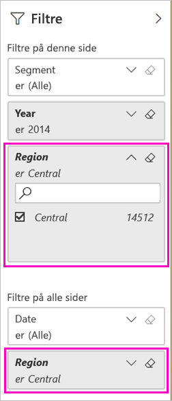

# To måder at dele en filtreret Power BI-rapport på
*Deling* er velegnet til at give nogle få personer adgang til dine dashboards og rapporter. Hvad nu hvis du vil dele en filtreret version af en rapport? Måske en rapport, der kun viser data for en bestemt by eller sælger eller et bestemt år. Prøv at filtrere en rapport og dele den, eller opret en brugerdefineret URL-adresse. Rapporten filtreres, når modtagerne åbner den. De kan fjerne filteret ved at ændre URL-adressen. 

Med Power BI får du [andre måder at samarbejde om og distribuere dine rapporter på](service-how-to-collaborate-distribute-dashboards-reports.md). Til deling skal du og dine modtagere bruge en [Power BI Pro-licens](service-features-license-type.md), eller indholdet skal være i en [Premium-kapacitet](service-premium-what-is.md). 

## To måder til filtrering af en rapport

For begge filtreringsteknikker bruger vi appen med skabeloneksemplet Marketing & Sales. Vil du prøve det? Du kan også installere [appen med skabeloneksemplet Marketing & Sales](https://appsource.microsoft.com/product/power-bi/microsoft-retail-analysis-sample.salesandmarketingsample?tab=Overview).

### Angiv et filter

Åbn en rapport i [redigeringsvisning](consumer/end-user-reading-view.md), og anvend et filter.

I dette eksempel filtrerer vi siden YTD Category i skabeloneksemplet Marketing & Sales for kun at få vist de værdier, hvor **Region** er lig med **Central**. 
 

Gem rapporten.

### Opret et filter i URL-adressen

Når du føjer filteret i slutningen af URL-adressen til rapportsiden, er funktionsmåden lidt anderledes. Den filtrerede side ser ud på samme måde. Power BI føjer dog filteret til hele rapporten og fjerner de andre værdier fra filterruden.  

Tilføj følgende i slutningen af rapportsidens URL-adresse:
   
    ?filter=*tablename*/*fieldname* eq *value*
   
Feltet skal være af typen number, datetime eller string. Værdierne *tablename* eller *fieldname* må ikke indeholde mellemrum.
   
I vores eksempel er navnet på tabellen **Geo**, navnet på feltet er **Region**, og den værdi, vi vil filtrere på, er **Central**:
   
    ?filter=Geo/Region eq 'Central'

Din browser tilføjer specialtegn for at repræsentere skråstreger, mellemrum og apostrofer, så du ender med:
   
    app.powerbi.com/groups/xxxx/reports/xxxx/ReportSection4d00c3887644123e310e?filter=Geo~2FRegion%20eq%20'Central'

Gem rapporten.

Se artiklen [Filtrer en rapport ved hjælp af parametre for forespørgselsstrengen i URL-adressen](service-url-filters.md) for at få flere oplysninger.

## Del den filtrerede rapport

1. Når du [deler rapporten](service-share-dashboards.md), skal du fjerne markeringen i afkrydsningsfeltet **Send meddelelse via mail til modtagere**.

    

4. Send linket med det filter, du oprettede tidligere.

## Næste trin
* [Måder at dele dit arbejde på i Power BI](service-how-to-collaborate-distribute-dashboards-reports.md)
* [Del et dashboard](service-share-dashboards.md)
* Har du flere spørgsmål? [Prøv at spørge Power BI-community'et](https://community.powerbi.com/).
* Har du feedback? Indsend dine forslag på [webstedet for Power BI-community'et](https://community.powerbi.com/).

