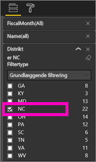
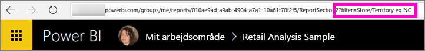
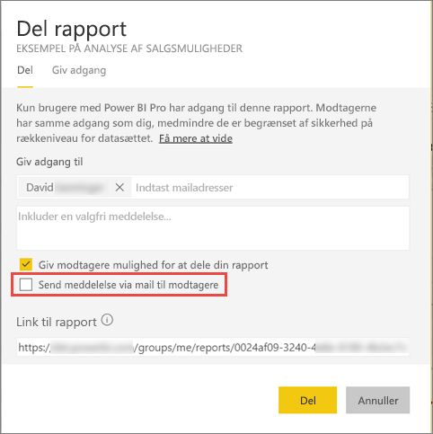

# Del en filtreret Power BI-rapport med dine kolleger
*Deling* er velegnet til at give nogle få personer adgang til dine dashboards og rapporter. Med Power BI får du [adskillige andre måder at samarbejde om og distribuere dine rapporter på](service-how-to-collaborate-distribute-dashboards-reports.md).

Til deling skal du og dine modtagere bruge en [Power BI Pro-licens](service-free-vs-pro.md), eller indholdet skal være i en [Premium-kapacitet](service-premium.md). Forslag? Power BI-teamet tager meget gerne mod din feedback, så gå til [webstedet for Power BI-community'et](https://community.powerbi.com/).

Du kan dele en rapport med kolleger inden for det samme maildomæne som dig fra de fleste steder i Power BI-tjenesten: Favoritter, Seneste, Delt med mig (hvis ejeren tillader det), Mit arbejdsområde eller andre arbejdsområder. Når du deler en rapport, kan de personer, du deler den med, få den vist og interagere med den, men ikke redigere den. De kan se de samme data, som du kan se i rapporterne, medmindre der er anvendt [sikkerhed på rækkeniveau (RLS)](service-admin-rls.md). 

## Filtrer og del en rapport
Hvad nu hvis du vil dele en filtreret version af en rapport? Måske en rapport, der kun viser data for en bestemt by eller sælger eller et bestemt år. Du kan gøre dette ved at oprette en brugerdefineret URL-adresse.

1. Åbn rapporten i [Redigeringsvisning](consumer/end-user-reading-view.md), anvend filteret, og gem rapporten.
   
   I dette eksempel filtrerer vi [Eksempel på detailanalyse](sample-tutorial-connect-to-the-samples.md) for kun at vise værdier, hvor **Territory** (Område) er lig med **NC**.
   
   
2. Tilføj følgende i slutningen af rapportsidens URL-adresse:
   
   ?filter=*tabelnavn*/*feltnavn* eq *værdi*
   
    Feltet skal være af typen **streng**, og hverken *tabelnavn* eller *feltnavn* må indeholde mellemrum.
   
   I vores eksempel er navnet på tabellen **Store** (Butik), navnet på feltet er **Territory** (Område), og den værdi, vi vil filtrere på, er **NC**:
   
    ?filter=Store/Territory eq 'NC'
   
   
   
   Din browser tilføjer specialtegn for at repræsentere skråstreger, mellemrum og apostrofer, så du ender med:
   
   app.powerbi.com/groups/me/reports/010ae9ad-a9ab-4904-a7a1-xxxxxxxxxxxx/ReportSection2?filter=Store%252FTerritory%20eq%20%27NC%27

3. [Del rapporten](service-share-dashboards.md), men fjern markeringen i afkrydsningsfeltet **Send mail til modtagere**. 

    

4. Send linket med det filter, du oprettede tidligere.

## Næste trin
* Har du feedback? Kom med dine forslag på [webstedet for Power BI-community'et](https://community.powerbi.com/).
* [Hvordan kan jeg samarbejde på og dele dashboards og rapporter?](service-how-to-collaborate-distribute-dashboards-reports.md)
* [Del et dashboard](service-share-dashboards.md)
* Har du flere spørgsmål? [Prøv at spørge Power BI-community'et](http://community.powerbi.com/).

