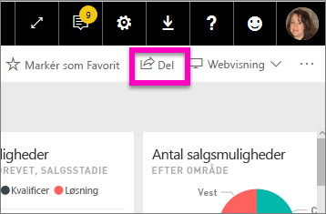
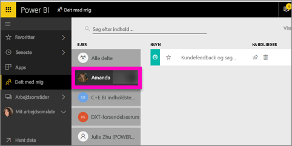

# Vis de Power BI-dashboards, der er blevet delt med mig
## Delt med mig

Når en kollega deler et dashboard med dig, føjes dets navn din **Delt med mig**-liste. Dashboard'et er kun tilgængeligt fra **Delt med mig** og er ikke tilgængeligt fra et arbejdsområde eller fra **Apps**.

Se Amanda forklare **Delt med mig**-indholdslisten og vise dig, hvordan du navigerer og filtrerer listen. Følg derefter en trinvis vejledning under videoen for at prøve det selv. For at du kan få vist dashboards, der deles med dig, skal du have en Power BI Pro-licens. Læs [Hvad er Power BI Premium?](service-premium.md) for at få flere oplysninger.

<iframe width="560" height="315" src="https://www.youtube.com/embed/G26dr2PsEpk" frameborder="0" allowfullscreen></iframe>

Du får mange muligheder for at interagere med dashboard'et og den underliggende rapport, afhængigt af de tilladelser, ejeren giver dig. Disse omfatter at kunne oprette kopier af dashboard'et, åbne rapporten [i Læsevisning](service-reading-view-and-editing-view.md) og dele videre med andre kollegaer.

## Handlinger, der er tilgængelige fra **Delt med mig**-skærmen
* Vælg stjerneikonet for at [gøre et dashboard til favorit](service-dashboard-favorite.md).
* [Fjern et dashboard](service-delete.md) 
* Nogle dashboards kan deles igen  
* Hvis dine lister over dashboards bliver lange, kan du desuden [bruge søgefeltet og sortering for at finde det, du har brug for](service-navigation-search-filter-sort.md).
  
  > [!NOTE]
  > Vælg knappen klassifikation for at få oplysninger om EGRC-klassificeringer eller [besøg Dashboard-dataklassificering ](service-data-classification.md).
  > 
  > 
* Vælg navnet på et dashboard for at åbne og udforske det. Når du har åbnet det delte dashboard, kan du bruge Spørgsmål og svar til at stille spørgsmål om de underliggende data eller vælge et felt til at åbne og interagere med rapporten i Læsevisning.

## Filtrer delte dashboards efter ejer
Indholdet i **Delt med mig**-skærmen kan filtreres yderligere efter indholdsejer. Hvis jeg f.eks. vælger **Amanda**, får jeg kun vist det dashboard, som Amanda har delt med mig.

## Næste trin
[Power BI – Grundlæggende begreber](service-basic-concepts.md)  
[Power BI Premium – hvad er det?](service-premium.md)  

Har du flere spørgsmål? [Prøv at spørge Power BI-community'et](http://community.powerbi.com/)

